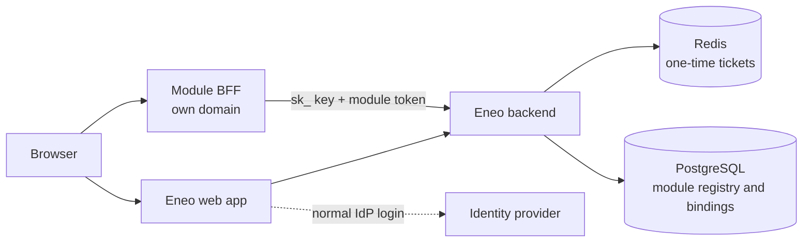
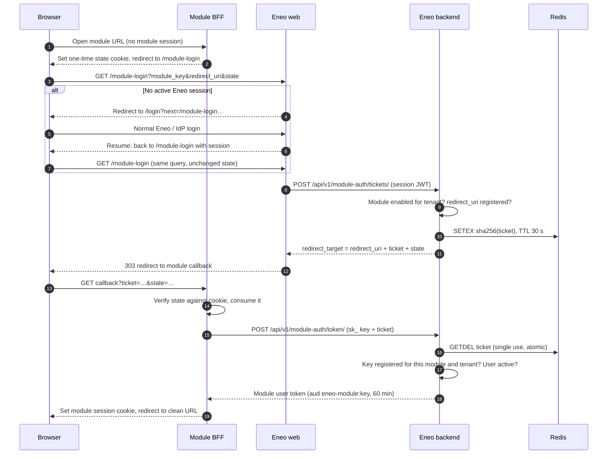
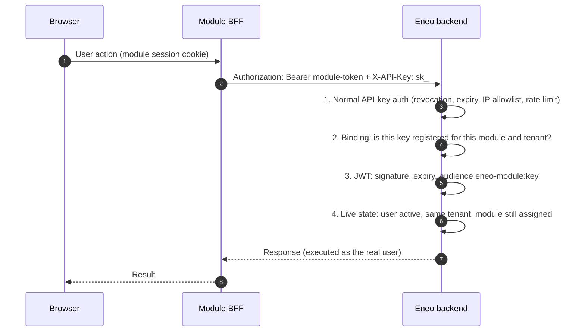
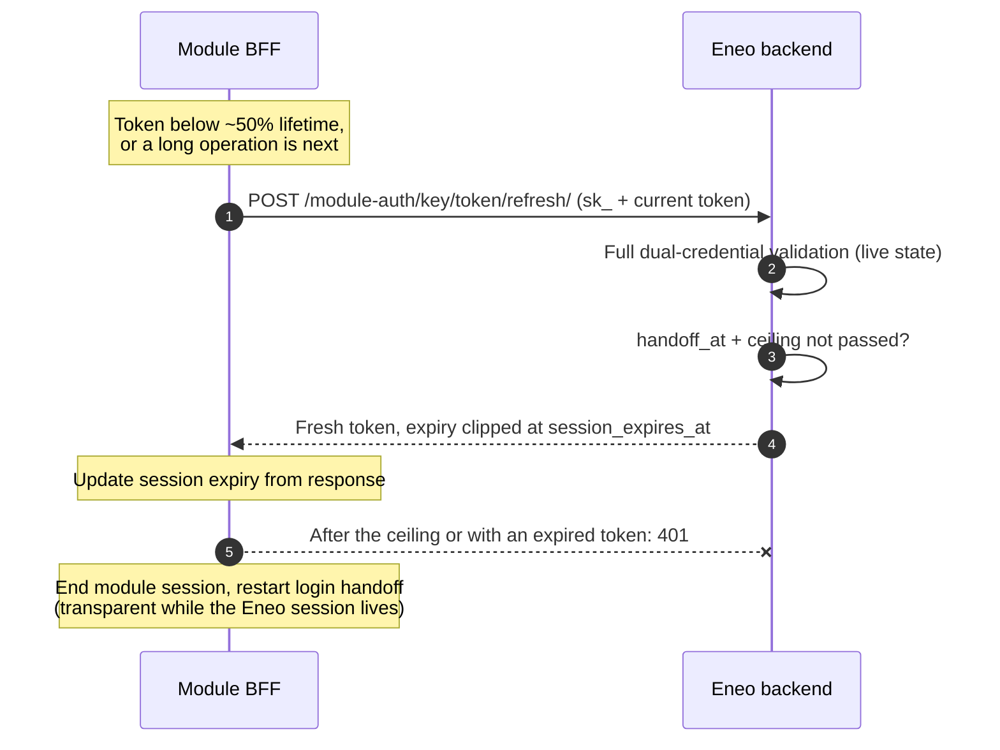
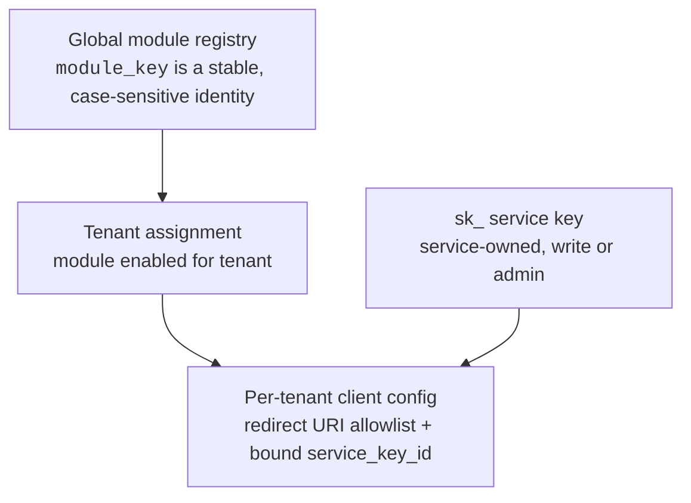

# Module Authentication

Modules are optional web applications that run next to an Eneo installation
on their own domains — for example Tal till text (speech-to-text). A module
never talks to the identity provider and never stores user passwords. Instead,
Eneo's **module auth broker** hands a logged-in Eneo user over to the module
through a one-time ticket, and the module then acts with short-lived,
module-scoped credentials.

import { Callout } from "nextra/components";

<Callout type="info">
  Looking for the step-by-step deployment commands? Use the [operator
  guide](https://github.com/eneo-ai/eneo/blob/develop/docs/deployment/MODULES.md).
  This page is the engineering reference for how the handoff works, what each
  credential is for, and how lifetimes are designed.
</Callout>

## Why a broker

- **One login.** Eneo stays the installation's only OIDC client. Modules do not
  register their own IdP clients, so IdP configuration, MFA policy and session
  rules live in exactly one place.
- **No shared secrets in the browser.** The browser only ever carries a
  one-time ticket during the redirect. The module's API credential (an `sk_`
  service key) stays in the module's server environment.
- **Central kill switch.** Disabling the user, the tenant, the service key or
  the tenant-module assignment takes effect on the module's next backend
  request, because every request re-validates live state.

## Actors and trust boundaries

| Component | Owns |
| --- | --- |
| Eneo backend | Module registry (`module_key`), tenant assignment, redirect URI allowlist, service-key binding, ticket issuance and exchange, user/tenant authorization, audit log |
| Eneo web app | The `/module-login` entry point, session gate, resumable login (`next`) |
| Module BFF | Its own browser session and CSRF `state`, the callback handler, immediate server-side ticket exchange, storage of its `sk_` key |
| Redis | One-time tickets (stored as SHA-256 digests, short TTL, consumed with `GETDEL`) |

## The four credentials

The flow deliberately uses four different credentials with very different
lifetimes. None of them can substitute for another.

| Credential | Held by | Lifetime | Purpose |
| --- | --- | --- | --- |
| Eneo session JWT (`aud` = Eneo) | Browser cookie on the Eneo domain | Deployment-configured (`JWT_EXPIRY_TIME`) | The user's normal Eneo login; authorizes ticket issuance |
| Login ticket | Redirect URL only, then gone | **30 s**, single use (`MODULE_AUTH_TICKET_TTL_SECONDS`) | One-time handoff from the Eneo session to the module |
| Module user token (`aud` = `eneo-module:<module_key>`) | Module server session, never the browser | **60 min**, refreshable up to a fixed **8 h** session ceiling (`MODULE_AUTH_TOKEN_EXPIRY_MINUTES`, `MODULE_AUTH_MAX_SESSION_HOURS`) | Proves *which user* the module acts for |
| `sk_` service key | Module server environment | Until rotated/expired/revoked | Proves *which module deployment* is calling |

Audience scoping isolates the tokens in both directions: a module user token
is rejected by every normal Eneo API route (wrong audience), and a normal Eneo
session JWT is rejected by module-facing routes. A token minted for one module
cannot be replayed against another module's routes.

## Login handoff, step by step

The module starts the flow by generating an unpredictable one-time `state`
value, binding it to the browser in a cookie, and sending the top-level
browser to Eneo's `/module-login` route.

Key properties of this flow:

- **The ticket travels only inside the redirect URL** and is stored in Redis
  as a digest, so neither access logs on the Eneo side nor a Redis snapshot
  can be replayed as tickets.
- **`state` is echo-only.** Eneo never stores or interprets it; it is returned
  unmodified on the callback. The module must verify it against the browser
  session that initiated the login and accept each value exactly once. This is
  the module's login-CSRF protection — an attacker-initiated handoff lands on
  the callback without a matching state cookie and is rejected.
- **`redirect_uri` is exact-match.** It must be registered in the tenant's
  client config for the module; URIs are normalized, HTTPS-only (HTTP is
  allowed for `localhost` development) and cannot contain query strings,
  fragments or wildcards.
- **A failed exchange does not consume the ticket.** If the wrong service key
  attempts the exchange, the ticket survives (within its 30-second TTL) for
  the legitimate module. Consumption happens atomically with `GETDEL` only
  after every check has passed.
- **The login is resumable.** If the user has no Eneo session, the whole
  query — including the opaque module `state` — is preserved through the
  normal login as a validated, local-only `next` destination and the handoff
  restarts transparently afterwards.

## Resource requests: two credentials on every call

The module session alone never authorizes anything. Every module-facing
backend route requires **both** credentials on **every** request and
re-validates live state:

Because step 4 reads current state on every request, disabling a user, a
tenant, a service key or a tenant-module assignment takes effect on the next
request — there is no cached module authorization to wait out. Token refresh
runs exactly the same checks, so a disabled identity cannot renew either. The
one exception is the stateless module user token itself: an Eneo browser
logout does not revoke an already minted token; its residual lifetime is
bounded by the short token TTL and, across refreshes, by the absolute session
ceiling.

Which users may enter a module is decided by tenant assignment: any active
user in a tenant with the module enabled can complete the handoff. Per-user,
per-resource authorization is the job of the resource routes, which execute as
the real user.

## Lifetimes, refresh and long-running work

Three settings control the broker's lifetimes:

| Setting | Default | What it bounds |
| --- | --- | --- |
| `MODULE_AUTH_TICKET_TTL_SECONDS` | 30 | Redirect gap between Eneo issuing the ticket and the module exchanging it |
| `MODULE_AUTH_TOKEN_EXPIRY_MINUTES` | 60 | One module user token — the sliding window a refresh renews |
| `MODULE_AUTH_MAX_SESSION_HOURS` | 8 | The whole module session, measured from the original ticket exchange |

The ticket TTL only needs to cover an HTTP redirect plus one server-side
call, because a ticket is always issued *after* the Eneo session exists —
the slow part of a first login (the IdP round-trip) happens before issuance.

The token follows a **sliding window under a fixed ceiling**. Every token
carries the timestamp of the original handoff. A module renews its token with
`POST /api/v1/module-auth/{module_key}/token/refresh/`, authenticated exactly
like a resource call: the bound `sk_` key plus the current, still-valid
Bearer token. The response is a fresh token whose expiry is clipped at
`session_expires_at` — the handoff time plus the ceiling, returned unchanged
by both the exchange and every refresh.

Why this shape:

- **Refresh cannot outlive a kill switch.** Every refresh re-runs the same
  live-state checks as a resource call, so disabling the user, tenant, key or
  assignment also stops renewal immediately. The module token never leaves
  the module server, so refresh exposes nothing new to the browser.
- **The ceiling re-anchors access in the central login.** Refresh alone could
  otherwise keep a module session alive indefinitely without any Eneo
  session. The ceiling forces a periodic return through `/module-login`,
  which stays a quick redirect while the user's Eneo session is alive.
- **An expired token never refreshes.** Renewal after expiry is always a new
  handoff. This keeps the contract crisp and pushes modules to refresh
  proactively rather than react to failures.

What this means for module implementations:

- **Refresh proactively.** Renew below roughly half the remaining token
  lifetime, and always immediately before a long operation such as an upload.
  A refreshed token guarantees the whole token window is available.
- **Expiry is checked when a request starts.** A single long request that
  begins while the token is valid is not aborted mid-flight. What fails is
  the *next* request — which proactive refresh prevents.
- **Prefer one long request over many small ones for uploads.** A single
  upload request is validated once at the start; a chunked protocol is
  validated per chunk and can lose access between chunks.
- **Watch `expires_in` near the ceiling.** A refresh close to
  `session_expires_at` returns a clipped, short `expires_in`. Treat that as
  the signal to complete or persist pending work; when the ceiling passes,
  persist state first, then re-run the handoff — a top-level redirect
  discards page state.
- **Track lifetimes from responses.** Update the module session expiry from
  each exchange and refresh response; the module session cookie must never
  outlive the token it wraps.

### Tuning

All three settings are deployment-wide backend environment variables. The
token TTL should stay short — refresh makes a long base TTL unnecessary, and
the TTL is exactly the window in which a stateless token survives an Eneo
logout. Size the ceiling to the longest legitimate *working session*, not the
longest request; the 8-hour default covers a workday. If modules with very
different session needs appear, a per-module ceiling in the client config is
the intended evolution path rather than a deployment-wide increase.

## Failure modes

| What happens | Cause | Result |
| --- | --- | --- |
| `/module-login` shows *invalid request* | Missing/duplicate/unknown query parameters, or a malformed `redirect_uri` | Fix the module's login URL: exactly one `module_key`, `redirect_uri` and `state` |
| `/module-login` shows *module unavailable* | Module not registered, not enabled for the user's tenant, or client config incomplete (no redirect URIs / no service key) | Operator completes registration and client config |
| `/module-login` redirects to login | No or expired Eneo session (backend answered 401) | Normal login, then the handoff resumes automatically |
| Ticket exchange fails with 401 | Ticket expired (>30 s), already used, or unknown | Module restarts the handoff; the user usually just sees a redirect |
| Ticket exchange fails with 403 | Wrong service key: not the registered key (or its direct rotation successor), wrong tenant, wrong type/ownership/permission | Operator re-binds `service_key_id` in the client config; the ticket itself is *not* consumed |
| Token refresh fails with 401 | Token already expired, or the session ceiling (`session_expires_at`) has passed | Module ends its session and restarts the login handoff — a quick redirect while the Eneo session is alive |
| Resource call fails after login worked | Token expired, user/tenant deactivated, module unassigned, or key revoked since login | Refresh proactively (token expiry) or operator action (state changes are immediate by design) |

## Registration and binding model

Module identity and per-tenant configuration are separate concepts:

- `module_key` (the module's unique `name`) is the public machine identity
  used in every API call. It is intentionally immutable — a new key is a new
  module identity.
- The **client config** lives on the internal organization-module assignment. Only the bound
  `service_key_id` (or its direct rotation successor) may exchange that
  tenant's tickets. Binding validation rejects keys that could never work:
  the key must be service-owned, of type `sk_`, and hold write or admin
  permission. The key's *resource scope* is deliberately not restricted —
  least privilege comes from scoping the key narrowly (typically to a
  dedicated space), while the right to exchange tickets comes from the exact
  binding.
- **Uninstalling a module deletes its client config.** Reinstalling
  later requires re-binding the redirect URIs and service key.
- **Unbinding without uninstalling:** a `PUT` with `"service_key_id": null`
  severs ticket exchange while the installation and its callbacks stay in
  place — the incident-response step between a working installation and a
  full uninstall.
- Key rotation is downtime-free at depth one: the rotated successor is
  accepted until the operator updates the binding. Rotating twice without
  updating the binding breaks the chain.

## What to set up

The short version of the [operator
guide](https://github.com/eneo-ai/eneo/blob/develop/docs/deployment/MODULES.md):

1. **Mint a dedicated `sk_` service key** in Administration → API keys:
   service-owned,
   `write` permission, narrowest workable scope, an expiry date and a rate
   limit. The secret goes into the module's server environment only.
2. **Install it in Administration → Modules** with the stable module key, the
   exact callback URLs and the service key. The key must be a URL-safe slug
   (letters and digits plus `.`, `_` or `-`). One atomic, idempotent save
   registers, enables and completely configures the module for the signed-in
   administrator's organization; no tenant ID or environment key is used.
3. **Deploy the module** with `MODULE_KEY`, the Eneo URL, the service key and
   its own session secret; then run the login smoke test end to end.

Automation uses the equivalent session-authenticated contract:
`GET /api/v1/admin/modules/`,
`PUT /api/v1/admin/modules/{module_key}/` and
`DELETE /api/v1/admin/modules/{module_key}/`.

Every step of the lifecycle is audited: ticket issuance, ticket exchange,
configuration changes and organization assignment changes all produce audit events
(see [Audit Logging](/docs/audit-logging)).

## Known limitations

- **One tenant binding per module deployment.** The exchange requires the
  service key of the ticket's tenant, and a module deployment holds one key.
  Serving several tenants from one module deployment requires one deployment
  (or at least one key + callback pair) per tenant today.
- **Refresh requires an unexpired token.** A module that lets its token lapse
  cannot renew server-side; it must send the browser through a new login
  handoff. Long unattended work beyond the session ceiling is out of scope by
  design — the ceiling is what re-anchors module access in the central login.
- **Logout latency.** A stateless module token survives Eneo logout until it
  expires, and refresh (which does not involve the browser) can renew it up
  to the session ceiling. Everything the token can reach still re-validates
  live user and tenant state per request, so deactivating the user closes
  access — including renewal — immediately.
- **User identity is bound to the account, not the email.** The module token
  still carries the email as `sub` for display, but the broker resolves the
  principal from immutable `user_id` and `tenant_id` claims minted at the
  ticket exchange and preserved across refresh. If the account is deleted, its
  tokens stop authenticating — even when the same email is later re-assigned
  to a replacement account.
