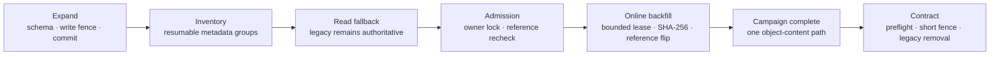
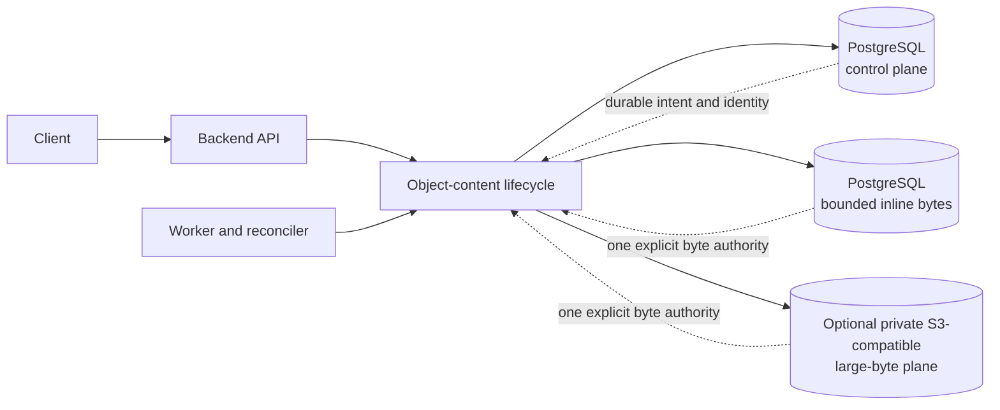
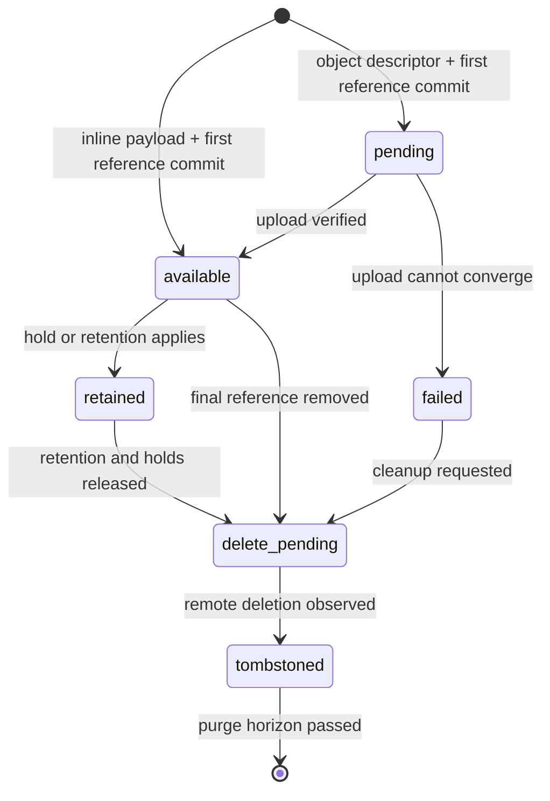
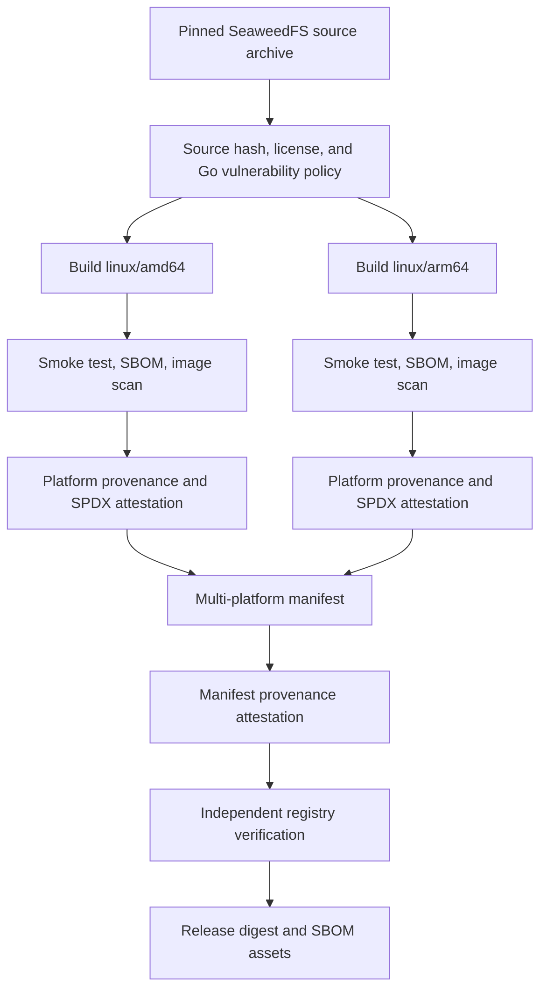

# Object Content Architecture

Eneo has one durable-content control plane and two explicit byte backends.
PostgreSQL always owns identity, integrity, authorization, and lifecycle. A
content record stores its bounded payload either in PostgreSQL or in one
private S3-compatible endpoint.

import { Callout } from "nextra/components";

<Callout type="info">
  Looking for a quick decision or deployment steps? Start with [Choose Content
  Storage](/guides/object-content-storage). This page is the deeper engineering
  reference.
</Callout>

## Current adoption

File and Icon use this contract for exact originals and named derivatives. New
knowledge file and audio uploads use it for the exact original while searchable
text and vectors remain in PostgreSQL. New content is stored inline by default,
so Eneo still needs no S3-compatible service.

Legacy File and Icon adoption uses an expand, online backfill, and later contract
sequence. Two consecutive Alembic revisions own the expand phase. The first
creates the ledger, makes legacy columns nullable, installs the payload-write
fence, and commits. The second inventories stored-size estimates in resumable,
idempotent groups without copying or hashing payload bytes. It never inherits
the schema revision's exclusive table locks. New code reads a verified
object-content reference when present and otherwise reads the frozen legacy
source. A scheduled worker first finalizes a bounded admission set: it locks
owners, accepts still-available references, cancels deleted owners, and marks
only source-bearing rows ready. The capacity decision is frozen after admission,
then the worker adopts each ready variant in bounded, resumable
PostgreSQL-inline transactions. The later contract applies the fail-closed
completion and live-reference recheck described in
[Finish adoption](/guides/object-content-storage#finish-adoption-and-reclaim-disk)
before it removes the legacy schema.

The current online adapter targets PostgreSQL inline. It starts automatically
for estimates up to the configured safety threshold and waits for capacity
acknowledgement above it. If policy selects object storage before the campaign
starts, it waits for a compatible adapter rather than redirecting the copy.
This is intentional: Alembic owns schema and metadata, while application workers
own byte-proportional work, network retries, leases, progress, and recovery.

Administrators with the Storage permission use **Admin > Storage** to choose
where eligible new content is written and to queue bounded moves of existing
content. Eneo verifies each destination before switching the content record to
that copy. Changing the write target or configuring an endpoint never moves
existing content automatically. Searchable knowledge generations and Flow
artifacts remain outside this shared byte lifecycle.

File and Icon visibility is derived from publication: a visible product row and
its reference always point to already-available, verified bytes. A failed or
interrupted object-store write before publication leaves no product row visible.

## Ownership boundary

| PostgreSQL control plane                              | Chosen byte backend                                   |
| ----------------------------------------------------- | ----------------------------------------------------- |
| Content identity and lifecycle state                  | `postgres_inline`: bounded one-to-one BYTEA payload   |
| Authorization references, holds, and retention        | `object_store`: opaque object in one private endpoint |
| Canonical SHA-256, exact size, and media type         | Backend-specific transport and deletion state         |
| Durable intent, audit facts, and reconciliation state | Bytes only; never authorization or product policy     |

The chosen backend is immutable for that record. Eneo never silently retries an
inline write in object storage, or copies a failed object-store write into
PostgreSQL. Object keys contain neither filenames nor organization identifiers,
and ordinary APIs expose neither backend infrastructure nor provider details.

## Write, read, and delete invariants

Every write computes a canonical full-byte SHA-256 over the bounded input. An
inline write verifies the digest and size, then commits the payload, immediately
available control row, and exactly one first owner reference atomically. An
object-store write commits `pending` intent, an opaque descriptor, and exactly
one first reference before remote I/O begins.

Inline bytes have a documented deployment ceiling and are verified against the
control row before a full or single-range response. Object-store uploads compute
the same canonical digest while streaming. S3 ETags, CRCs, and multipart
composite checksums help with transport, but never replace it. Object-store
full reads verify and spool the whole object. Range reads fetch and verify only
the persisted upload chunks that cover the requested bytes before responding.
This keeps seeks bounded to the requested interval plus at most two chunk
edges. A range proves its covering chunks; a full read still checks the
canonical full-object digest and can detect corruption elsewhere.

Deletion starts with irreversible PostgreSQL intent. Holds and retention block
hard deletion. A tombstone becomes purgeable only after its database-owned
purge time exists and has passed. Missing purge time means retain, not delete.

## Why uploads pass through Eneo

File and Icon uploads currently pass through the authenticated backend. Eneo
prepares the product variants, enforces business and operator bounds, captures
the bytes in a memory-bounded spool, calculates the canonical digest and
per-chunk verification digests, and reserves opaque keys before remote storage
I/O. The
adapter uploads and reads the object back to recompute its SHA-256. Only a short
database transaction after that verification publishes product metadata,
available content, and concrete references together.

This ordering prevents a partial or unverified remote object from becoming a
visible File or Icon. It also gives reconciliation a durable reservation from
which to clean up a remote object when a process or response fails between
upload and publication.

Browser-direct object-store upload is possible only with another public
protocol: scoped signed multipart sessions, ownership binding, completion and
abort state, digest proof or backend readback, expiry, orphan cleanup, and
ambiguous-result reconciliation. It may reduce backend network traffic, but it
does not remove verification or incomplete-upload recovery. Temporary disk also
serves as a memory bound for multipart parsing and asynchronous knowledge jobs,
so direct File/Icon upload would not eliminate all staging.

## Product usage fence

File deletion has a product-level fence before the object-content lifecycle
starts. A bounded File-owned query counts four concrete relations:

- chat questions;
- Assistant attachments;
- App attachments;
- App-run inputs.

The advisory preview uses a recursive read to include generated derivatives.
The authoritative delete path locks the root and descendants
parent-before-child, repeats the same grouped query, and returns a typed `409
file_in_use` response when any relation remains. PostgreSQL 13 does not lock
the underlying File rows through an outer `FOR UPDATE` on a recursive CTE, so
the delete path deliberately locks base rows one level at a time. Reverse
`file_id` indexes keep each relation lookup proportional to matching uses.

This fence covers user-initiated File deletion. User and organization
offboarding intentionally retain their existing database-owned cascades.
Object-content holds and minimum retention protect bytes after the final
product reference disappears; they are not duplicated as File-identity rules.

## Crash recovery and reconciliation

Legacy File/Icon adoption commits one item at a time. Its durable ledger and
expiring lease make a worker crash resumable; a PostgreSQL advisory transaction
lock prevents replicas from overlapping batches. The database trigger keeps the
legacy payload immutable. Before campaign admission, bounded set-based queries
lock owners and references and durably separate rows that are already complete
from rows that may require copied bytes. The capacity gate sums only that stable
ready set. A delete trigger cancels owner rows even while the campaign is waiting.
During adoption, the per-item transaction rechecks the owner and reference before
it creates the inline payload and reference atomically. A deleted owner is
cancelled, not recreated. If a reference exists but its content is unavailable,
the same transaction creates a verified replacement, switches the reference,
and lets the normal lifecycle decrement the failed content's reference count and
schedule cleanup when no references remain. An invalid source, integrity
failure, or oversized payload fails its item immediately;
interrupted attempts retry until their configured limit. Failed items halt the
campaign with a stored reason and require a higher operator resume revision
after correction. The campaign then requeues older failures through the normal
row-bounded worker batches and stores its cursor in PostgreSQL. A worker restart
continues from that cursor. An item that fails again waits for the next higher
revision instead of looping within the current recovery attempt.

Inline creation has no database/object-store crash gap: payload and intent share
one transaction. For eligible new File and Icon object-store writes, Eneo
uploads and HEAD verifies captured bytes under a bounded PostgreSQL reservation
before one short transaction publishes product metadata, already-available
content rows, and concrete references. A pre-publication crash therefore leaves
no invisible product row; repeated inventory and the existing grace period own
the row-less remote residue. The current worker schedules that queue-neutral
reconciler with ARQ, but lifecycle code does not depend on ARQ.

Local lifecycle, retention, reference audit, and inline deletion reconciliation
continue even when no endpoint is configured or a configured endpoint is
temporarily unavailable.

The reconciler trusts an inventory only after every page returns a complete,
advancing cursor. An invalid or non-advancing page fails the run before Eneo
marks unseen rows missing. A complete scan can mark absent available content as
failed; retained content stays retained while health reports missing bytes.

Unknown remote objects become orphan candidates. Eneo waits through repeated
complete inventories and the configured grace period before deletion. This
protects bytes that are newer than a restored PostgreSQL snapshot.

## Database and bucket binding

PostgreSQL and the bucket share one random deployment binding. On first start,
PostgreSQL grants one process a bounded claim. That process records creation
intent, creates a non-overwriting marker in the bucket, and confirms the pair
in PostgreSQL. Other API and worker processes wait, then verify the confirmed
pair.

When object storage is configured, startup, readiness, and remote reconciliation
verify this binding before mutating objects. Eneo does not adopt a reachable
empty or foreign bucket. A missing or mismatched marker yields
`configuration_required`, which forces an operator to restore the matching
database and byte-store pair instead of silently accepting data loss. Inline
mode does not create or require a bucket binding.

Each connection has a stable deployment ID that namespaces opaque object keys.
Connections created in **Admin > Storage** generate and persist it
automatically. Legacy environment-managed connections use
`OBJECT_CONTENT_DEPLOYMENT_ID`; operators generate that value once and preserve
it through upgrades and restores. It is not a feature toggle, credential, or
migration mechanism.

## Optional provider-independent contract

The default reference deployment needs no S3-compatible service. When enabled,
the application has one S3-compatible adapter. Bundled SeaweedFS, external
MinIO, and other endpoints use the same path. There is no provider registry or
Amazon-specific product branch.

The supported contract includes:

- SigV4 authentication with path or virtual-host addressing;
- conditional, non-overwriting marker creation with `If-None-Match: *`;
- paginated object and multipart inventories;
- single-part and multipart writes;
- `HEAD`, streaming `GET`, and one byte range;
- multipart completion, abort, and ordered part listing;
- deletion with observable not-found convergence.

Native range support remains an endpoint conformance requirement. Eneo fetches
and verifies only the persisted upload chunks that cover a requested range
before responding. Content migrated as one whole-object chunk retains its
full-verification cost for range reads.

## Why the reference deployment uses SeaweedFS

Some installations need a private S3-compatible byte plane that can run beside
the backend and worker without adding a public service. The optional Compose
profile uses SeaweedFS for that reference role. It does not become an
application dependency: an operator may stay inline-only or use any endpoint
that passes the same contract.

The bundled service is intentionally single-node. Organizations that require
multi-node availability should operate an external service with their standard
redundancy, encryption, capacity, and disaster-recovery controls.

## Image build and publication

Eneo builds the reference image from a pinned SeaweedFS source archive rather
than republishing an upstream container image. The build uses pinned builder
and distroless runtime image digests, compiles a static binary, and runs as a
non-root user.

The build workflow performs these checks before publication:

1. It verifies the pinned source archive and the expected upstream commit.
2. It checks the Go module graph, licenses, and source vulnerability policy.
3. It builds and smoke-tests separate `linux/amd64` and `linux/arm64` images.
4. It scans the image, generates CycloneDX 1.6 and SPDX SBOMs, and blocks the
   configured vulnerability policy failures.
5. It signs platform provenance and SPDX SBOM attestations with Eneo's GitHub
   Actions identity.
6. It creates the multi-platform manifest, signs its provenance, and verifies
   the registry attestations independently before publishing evidence.

The release workflow resolves immutable image digests, verifies SeaweedFS
manifest provenance plus both platform SBOM attestations, and attaches
`IMAGE-DIGESTS.txt`, CycloneDX, SPDX, readable package tables, and checksums to
the GitHub Release.

These attestations prove which source and workflow Eneo used. They do not claim
that SeaweedFS upstream signed Eneo's image or the pinned source commit. See
[Release SBOMs](/docs/release-sboms) for exact filenames and verification
commands.

## Operational consequences

- Inline-only backups contain control and bytes in PostgreSQL.
- Legacy File/Icon adoption remains online and resumable, but inline adoption
  needs additional PostgreSQL capacity for the second payload copy plus WAL and
  safety headroom.
- Removing legacy columns later does not by itself return PostgreSQL table
  storage to the filesystem; physical reclamation is separate maintenance.
- The later contract migration must fail closed until legacy adoption is
  complete, then lock and recheck every surviving File/Icon reference as
  `available` in the same transaction that drops legacy columns. Operators
  choose when to close that recovery window.
- Physical reclamation stays outside Alembic and startup because `pg_repack` or
  `VACUUM FULL` has deployment-specific lock, time, and free-space costs.
- If object-store rows exist, PostgreSQL and the object store must share one
  backup and restore point.
- The stable deployment ID and internal marker must survive restoration.
- A transient optional-endpoint outage degrades its capability while liveness,
  core readiness, and inline work continue.
- Eneo never falls back between backends or to a filesystem.
- Endpoint capacity, PostgreSQL state, reconciliation lag, temporary spool
  space, and multipart cleanup all need monitoring.
- Changing provider is a verified content migration, not an endpoint edit
  performed while writers run.

The [Object Content Storage guide](/guides/object-content-storage) turns these
constraints into deployment and recovery steps.
