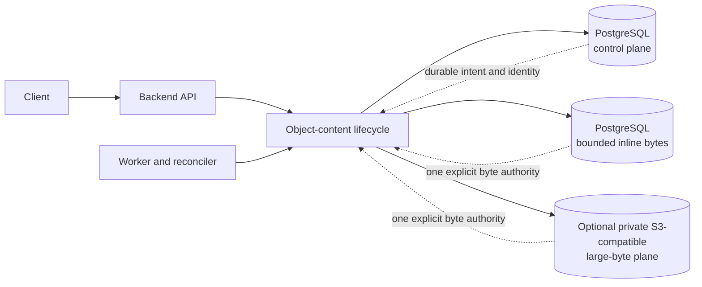
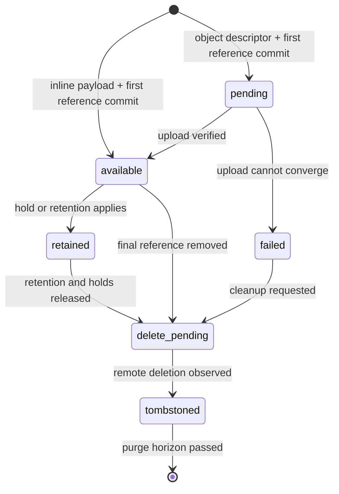
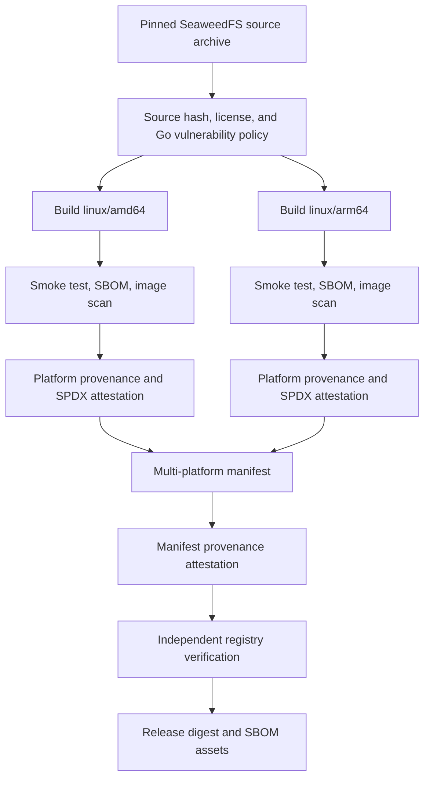

# Object Content Architecture

Eneo has one durable-content control plane and two explicit byte backends.
PostgreSQL always owns identity, integrity, authorization, and lifecycle. A
content record stores its bounded payload either in PostgreSQL or in one
private S3-compatible endpoint.

import { Callout } from "nextra/components";

<Callout type="info">
  Looking for a quick decision or deployment steps? Start with [Choose Content
  Storage](/guides/object-content-storage). This page is the deeper engineering
  reference.
</Callout>

## Current adoption

File and Icon are the first product owners using this contract. New content is
stored inline by default, so Eneo still needs no S3-compatible service. Their
exact originals and named derivatives use typed references; a bounded upgrade
migration copies and verifies legacy bytes before removing duplicate columns.

InfoBlob knowledge generations, administrator-controlled placement/migration,
and Flow artifacts remain separate slices. Configuring an endpoint alone never
moves content.

## Ownership boundary

| PostgreSQL control plane                              | Chosen byte backend                                   |
| ----------------------------------------------------- | ----------------------------------------------------- |
| Content identity and lifecycle state                  | `postgres_inline`: bounded one-to-one BYTEA payload   |
| Authorization references, holds, and retention        | `object_store`: opaque object in one private endpoint |
| Canonical SHA-256, exact size, and media type         | Backend-specific transport and deletion state         |
| Durable intent, audit facts, and reconciliation state | Bytes only; never authorization or product policy     |

The chosen backend is immutable for that record. Eneo never silently retries an
inline write in object storage, or copies a failed object-store write into
PostgreSQL. Object keys contain neither filenames nor organization identifiers,
and ordinary APIs expose neither backend infrastructure nor provider details.

## Write, read, and delete invariants

Every write computes a canonical full-byte SHA-256 over the bounded input. An
inline write verifies the digest and size, then commits the payload, immediately
available control row, and exactly one first owner reference atomically. An
object-store write commits `pending` intent, an opaque descriptor, and exactly
one first reference before remote I/O begins.

Inline bytes have a documented deployment ceiling and are verified against the
control row before a full or single-range response. Object-store uploads compute
the same canonical digest while streaming. S3 ETags, CRCs, and multipart
composite checksums help with transport, but never replace it. Object-store
reads verify and spool the full object before serving full or range bytes;
memory use stays bounded and larger objects spill to temporary disk.

Deletion starts with irreversible PostgreSQL intent. Holds and retention block
hard deletion. A tombstone becomes purgeable only after its database-owned
purge time exists and has passed. Missing purge time means retain, not delete.

### Product usage fence

File deletion has a product-level fence before the object-content lifecycle
starts. A bounded File-owned query counts four concrete relations:

- chat questions;
- Assistant attachments;
- App attachments;
- App-run inputs.

The advisory preview uses a recursive read to include generated derivatives.
The authoritative delete path locks the root and descendants
parent-before-child, repeats the same grouped query, and returns a typed `409
file_in_use` response when any relation remains. PostgreSQL 13 does not lock
the underlying File rows through an outer `FOR UPDATE` on a recursive CTE, so
the delete path deliberately locks base rows one level at a time. Reverse
`file_id` indexes keep each relation lookup proportional to matching uses.

This fence covers user-initiated File deletion. User and organization
offboarding intentionally retain their existing database-owned cascades.
Object-content holds and minimum retention protect bytes after the final
product reference disappears; they are not duplicated as File-identity rules.

## Crash recovery and reconciliation

Inline creation has no database/object-store crash gap: payload and intent share
one transaction. Network and process failures can interrupt object-store work
after its intent commits. Bounded leases, idempotent retries, multipart abort
records, and a queue-neutral reconciler close that gap. The current worker
schedules the reconciler with ARQ, but lifecycle code does not depend on ARQ.

Local lifecycle, retention, reference audit, and inline deletion reconciliation
continue even when no endpoint is configured or a configured endpoint is
temporarily unavailable.

The reconciler trusts an inventory only after every page returns a complete,
advancing cursor. An invalid or non-advancing page fails the run before Eneo
marks unseen rows missing. A complete scan can mark absent available content as
failed; retained content stays retained while health reports missing bytes.

Unknown remote objects become orphan candidates. Eneo waits through repeated
complete inventories and the configured grace period before deletion. This
protects bytes that are newer than a restored PostgreSQL snapshot.

## Database and bucket binding

PostgreSQL and the bucket share one random deployment binding. On first start,
PostgreSQL grants one process a bounded claim. That process records creation
intent, creates a non-overwriting marker in the bucket, and confirms the pair
in PostgreSQL. Other API and worker processes wait, then verify the confirmed
pair.

When object storage is configured, startup, readiness, and remote reconciliation
verify this binding before mutating objects. Eneo does not adopt a reachable
empty or foreign bucket. A missing or mismatched marker yields
`configuration_required`, which forces an operator to restore the matching
database and byte-store pair instead of silently accepting data loss. Inline
mode does not create or require a bucket binding.

`OBJECT_CONTENT_DEPLOYMENT_ID` adds a stable namespace to opaque object keys.
Operators generate it once and preserve it through upgrades and restores. It is
not a feature toggle, credential, or migration mechanism.

## Optional provider-independent contract

The default reference deployment needs no S3-compatible service. When enabled,
the application has one S3-compatible adapter. Bundled SeaweedFS, external
MinIO, and other endpoints use the same path. There is no provider registry or
Amazon-specific product branch.

The supported contract includes:

- SigV4 authentication with path or virtual-host addressing;
- paginated object and multipart inventories;
- single-part and multipart writes;
- `HEAD`, streaming `GET`, and one byte range;
- multipart completion, abort, and ordered part listing;
- deletion with observable not-found convergence.

Native range support remains an endpoint conformance requirement even though
Eneo verifies a full read before serving a range.

## Why the reference deployment uses SeaweedFS

Some installations need a private S3-compatible byte plane that can run beside
the backend and worker without adding a public service. The optional Compose
profile uses SeaweedFS for that reference role. It does not become an
application dependency: an operator may stay inline-only or use any endpoint
that passes the same contract.

The bundled service is intentionally single-node. Organizations that require
multi-node availability should operate an external service with their standard
redundancy, encryption, capacity, and disaster-recovery controls.

## Image build and publication

Eneo builds the reference image from a pinned SeaweedFS source archive rather
than republishing an upstream container image. The build uses pinned builder
and distroless runtime image digests, compiles a static binary, and runs as a
non-root user.

The build workflow performs these checks before publication:

1. It verifies the pinned source archive and the expected upstream commit.
2. It checks the Go module graph, licenses, and source vulnerability policy.
3. It builds and smoke-tests separate `linux/amd64` and `linux/arm64` images.
4. It scans the image, generates CycloneDX 1.6 and SPDX SBOMs, and blocks the
   configured vulnerability policy failures.
5. It signs platform provenance and SPDX SBOM attestations with Eneo's GitHub
   Actions identity.
6. It creates the multi-platform manifest, signs its provenance, and verifies
   the registry attestations independently before publishing evidence.

The release workflow resolves immutable image digests, verifies SeaweedFS
manifest provenance plus both platform SBOM attestations, and attaches
`IMAGE-DIGESTS.txt`, CycloneDX, SPDX, readable package tables, and checksums to
the GitHub Release.

These attestations prove which source and workflow Eneo used. They do not claim
that SeaweedFS upstream signed Eneo's image or the pinned source commit. See
[Release SBOMs](/docs/release-sboms) for exact filenames and verification
commands.

## Operational consequences

- Inline-only backups contain control and bytes in PostgreSQL.
- If object-store rows exist, PostgreSQL and the object store must share one
  backup and restore point.
- The stable deployment ID and internal marker must survive restoration.
- A transient optional-endpoint outage degrades its capability while liveness,
  core readiness, and inline work continue.
- Eneo never falls back between backends or to a filesystem.
- Endpoint capacity, PostgreSQL state, reconciliation lag, temporary spool
  space, and multipart cleanup all need monitoring.
- Changing provider is a verified content migration, not an endpoint edit
  performed while writers run.

The [Object Content Storage guide](/guides/object-content-storage) turns these
constraints into deployment and recovery steps.
