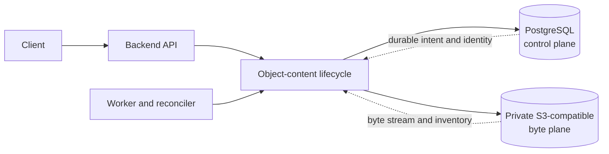
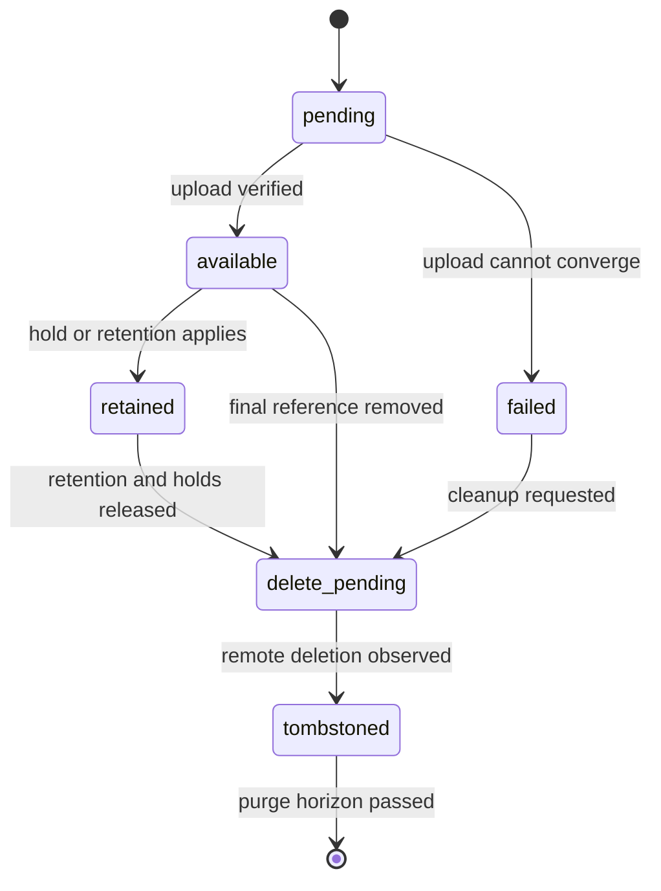
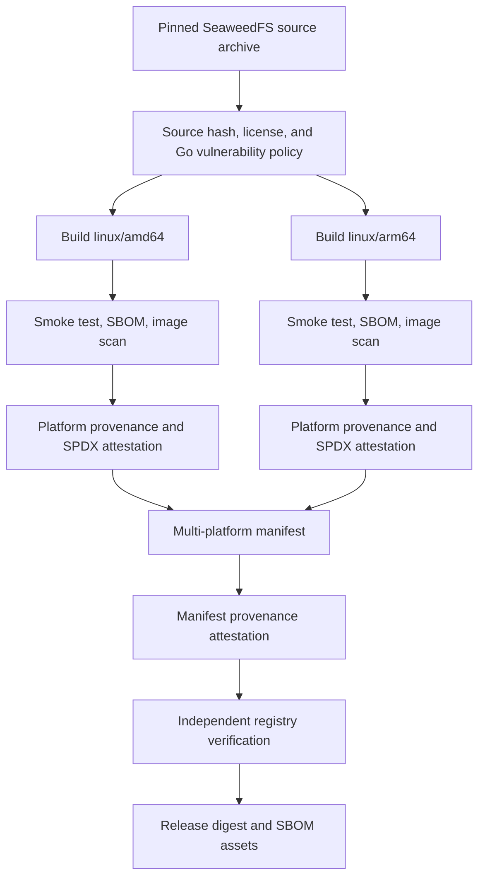

# Object Content Architecture

Eneo separates durable content identity from durable bytes. PostgreSQL is the
control plane. A private S3-compatible bucket is the byte plane. This boundary
keeps authorization and lifecycle decisions in typed application data while
allowing operators to choose a compatible storage service.

import { Callout } from "nextra/components";

<Callout type="info">
  Looking for deployment steps? Start with the [Object Content Storage
  guide](/guides/object-content-storage).
</Callout>

## Ownership boundary

| PostgreSQL control plane                              | S3-compatible byte plane                           |
| ----------------------------------------------------- | -------------------------------------------------- |
| Content identity and lifecycle state                  | Original and derived byte streams                  |
| Authorization references, holds, and retention        | Opaque objects addressed by deployment-scoped keys |
| Canonical SHA-256, exact size, and media type         | S3 protocol checksums and ETags                    |
| Durable intent, audit facts, and reconciliation state | Multipart state and deletion visibility            |

The bucket never decides who may read content or when Eneo may delete it.
Object keys contain neither filenames nor organization identifiers, and
ordinary APIs return neither endpoint, bucket, key, nor provider details.

## Write, read, and delete invariants

Eneo records durable PostgreSQL intent before remote object-store work. Uploads
compute the canonical full-byte SHA-256 while streaming. S3 ETags, CRCs, and
multipart composite checksums help with transport, but they never replace that
digest.

Eneo verifies the full object against the PostgreSQL digest before returning
bytes. A range response also verifies and spools the full object before slicing
the requested interval. Memory use stays bounded; larger objects use temporary
disk. Operators must therefore size temporary storage for the largest allowed
object multiplied by measured concurrent reads and uploads.

Deletion starts with irreversible PostgreSQL intent. Holds and retention block
hard deletion. A tombstone becomes purgeable only after its database-owned
purge time exists and has passed. Missing purge time means retain, not delete.

## Crash recovery and reconciliation

Network and process failures can interrupt the gap between a committed intent
and remote work. Bounded leases, idempotent retries, multipart abort records,
and a queue-neutral reconciler close that gap. The current worker schedules the
reconciler with ARQ, but the lifecycle code does not depend on ARQ.

The reconciler trusts an inventory only after every page returns a complete,
advancing cursor. An invalid or non-advancing page fails the run before Eneo
marks unseen rows missing. A complete scan can mark absent available content as
failed; retained content stays retained while health reports missing bytes.

Unknown remote objects become orphan candidates. Eneo waits through repeated
complete inventories and the configured grace period before deletion. This
protects bytes that are newer than a restored PostgreSQL snapshot.

## Database and bucket binding

PostgreSQL and the bucket share one random deployment binding. On first start,
PostgreSQL grants one process a bounded claim. That process records creation
intent, creates a non-overwriting marker in the bucket, and confirms the pair
in PostgreSQL. Other API and worker processes wait, then verify the confirmed
pair.

Startup, readiness, and reconciliation all verify this binding before mutating
content. Eneo does not adopt a reachable empty or foreign bucket. A missing or
mismatched marker yields `configuration_required`, which forces an operator to
restore the matching database and byte-store pair instead of silently accepting
data loss.

`OBJECT_CONTENT_DEPLOYMENT_ID` adds a stable namespace to opaque object keys.
Operators generate it once and preserve it through upgrades and restores. It is
not a feature toggle, credential, or migration mechanism.

## Provider-independent contract

The application has one S3-compatible adapter. The bundled SeaweedFS service,
external MinIO, and other endpoints use the same path. There is no provider
registry or Amazon-specific product branch.

The supported contract includes:

- SigV4 authentication with path or virtual-host addressing;
- paginated object and multipart inventories;
- single-part and multipart writes;
- `HEAD`, streaming `GET`, and one byte range;
- multipart completion, abort, and ordered part listing;
- deletion with observable not-found convergence.

Native range support remains an endpoint conformance requirement even though
Eneo verifies a full read before serving a range.

## Why the reference deployment uses SeaweedFS

The Docker Compose stack needs a private S3-compatible byte plane that can run
beside the backend and worker without adding a public service. SeaweedFS fits
that reference role and supports the required protocol subset. It does not
become an application dependency: an operator can replace it with any endpoint
that passes the same contract.

The bundled service is intentionally single-node. Organizations that require
multi-node availability should operate an external service with their standard
redundancy, encryption, capacity, and disaster-recovery controls.

## Image build and publication

Eneo builds the reference image from a pinned SeaweedFS source archive rather
than republishing an upstream container image. The build uses pinned builder
and distroless runtime image digests, compiles a static binary, and runs as a
non-root user.

The build workflow performs these checks before publication:

1. It verifies the pinned source archive and the expected upstream commit.
2. It checks the Go module graph, licenses, and source vulnerability policy.
3. It builds and smoke-tests separate `linux/amd64` and `linux/arm64` images.
4. It scans the image, generates CycloneDX 1.6 and SPDX SBOMs, and blocks the
   configured vulnerability policy failures.
5. It signs platform provenance and SPDX SBOM attestations with Eneo's GitHub
   Actions identity.
6. It creates the multi-platform manifest, signs its provenance, and verifies
   the registry attestations independently before publishing evidence.

The release workflow resolves immutable image digests, verifies SeaweedFS
manifest provenance plus both platform SBOM attestations, and attaches
`IMAGE-DIGESTS.txt`, CycloneDX, SPDX, readable package tables, and checksums to
the GitHub Release.

These attestations prove which source and workflow Eneo used. They do not claim
that SeaweedFS upstream signed Eneo's image or the pinned source commit. See
[Release SBOMs](/docs/release-sboms) for exact filenames and verification
commands.

## Operational consequences

- PostgreSQL and the object store must share one backup and restore point.
- The stable deployment ID and internal marker must survive restoration.
- Readiness can fail while liveness stays healthy; Eneo never falls back to a
  filesystem or PostgreSQL byte column.
- Endpoint capacity, PostgreSQL state, reconciliation lag, temporary spool
  space, and multipart cleanup all need monitoring.
- Changing provider is a verified content migration, not an endpoint edit
  performed while writers run.

The [Object Content Storage guide](/guides/object-content-storage) turns these
constraints into deployment and recovery steps.
