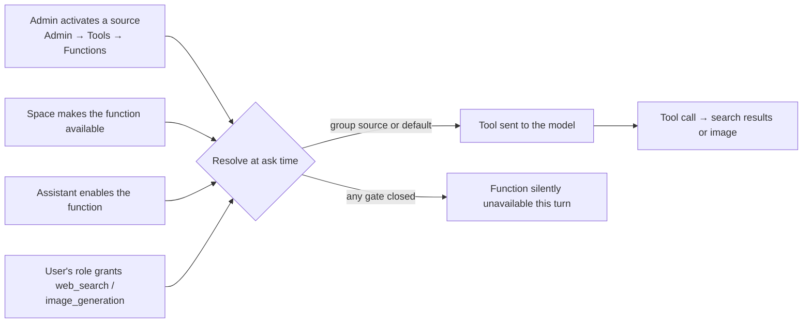

# Web Search & Image Generation

Web search and image generation are **functions** (Swedish: *Funktioner*) that
an assistant switches on, not servers it connects to. An administrator decides
which search engine and which image generator the organisation uses; spaces,
assistants and roles decide where and by whom the function may be used. This
guide covers the administrator setup under **Admin → Tools → Functions**, how
each function works at runtime, and what users see in the chat.

import { Callout } from 'nextra/components'

<Callout type="info">
  Functions ride on the same Model Context Protocol (MCP) plumbing as ordinary
  tool servers. For general tool servers, catalog approval and identity
  forwarding, see [MCP Servers](/guides/mcp-servers). For the engineering view
  of Eneo's built-in loopback servers, see [Built-in Tool
  Servers](/docs/builtin-tool-servers).
</Callout>

## Overview

| Function | What it does | Where the work runs |
|----------|--------------|---------------------|
| **Web search** | Lets the assistant search the web and cite live pages | An external MCP search server (for example Tavily or Exa behind an MCP endpoint) |
| **Image generation** | Lets the assistant create images from a description, and edit or vary images | Either a catalog **image model** called by Eneo itself, or an external MCP image server |

The key ideas:

- **Saved intent is a purpose, not a server.** A space or assistant stores
  `web_search` or `image_generation`. Which server serves that purpose is
  resolved at ask time, so switching, disabling or deleting a provider never
  breaks a saved configuration. A replacement restores availability.
- **One default per function, any number of group sources.** The tenant has at
  most one active default source per function. Additional sources can serve
  selected user groups and take precedence for their members.
- **Three gates, all required.** The space must make the function available,
  the assistant must enable it, and the user's role must hold the matching
  permission. If any gate is closed the tool is silently not offered to the
  model for that turn.



---

## Administrator setup

Open **Admin → Tools** (`/admin/tools`). Two tabs are shown:

- **MCP servers** lists general tool servers. Select **Show function servers**
  (*Visa funktionsservrar*) to also list external servers that serve a
  function. The former `/admin/mcp-servers` URL redirects here.
- **Functions** (*Funktioner*) lists one card per function with its current
  sources, their configuration status and the activation action. Group
  sources appear beneath the tenant default.

### Adding a web search source

Web search always runs on an external MCP server. Eneo governs which engine
and which tools are exposed; search behaviour, ranking and rate limits belong
to the engine.

1. On the **Functions** tab, choose **Configure web search** (or add an MCP
   server and set its **Function** to **Web search** instead of **General
   tools**).
2. Enter the server URL and authentication as for any MCP server. Enable
   **Forward user identity** only if the search engine is trusted with the
   signed-in user's name, email, role and organisation on every query.
3. Save. The source is stored **inactive**. Review and approve the discovered
   tools, then **activate** it.

A search source with no enabled, approved tool cannot be activated.

### Adding an image generation source

Choose between **Image model** (*Bildmodell*) and **External MCP server**.

**Image model (built-in).** Eneo calls a catalog image model itself; no
external MCP server is needed.

1. Add the image model under **Admin → Models → Image models**, or from the
   function wizard via **Add image model**. Pick the model provider and enter
   the model name the provider serves, for example `gpt-image-1` on OpenAI or
   Azure OpenAI, `imagen-4.0-generate-001` on Gemini, or whatever name a vLLM
   or other OpenAI-compatible endpoint exposes on its `/v1/images/generations`
   route. Default size and quality, cost per image and the security
   classification live on the model, like on any other catalog model.
2. On the **Functions** tab, select the model under **Image generation** and
   choose **Save and activate**. Saving and activation happen in one
   transaction; a saved model that later becomes invalid stays visible with
   its blocking reason.

**External MCP server.** Same steps as for web search, with **Function** set
to **Image generation**. Any MCP tool that returns an `image` content block
produces a generated image in the chat.

<Callout type="info">
  To move from an external server to a built-in model (or the reverse), add the
  replacement as a separate source and activate it. The activation action names
  the default it will replace; the previous default is deactivated in the same
  step.
</Callout>

### Audiences and priority

| Audience | Behaviour |
|----------|-----------|
| **All users (default server)** | The tenant default. At most one active per function. |
| **Selected user groups** | Serves members of the chosen groups. Any number may be active alongside the default. When a user matches several, the lowest **priority** number wins, then the name. |

An active default cannot be narrowed to user groups in place. Deactivate it
first, or activate another default. User groups are managed under
**Access → User groups**.

### Activation checks

Activation is the only step that changes which source serves users. Before
switching the default, Eneo rechecks:

- the source belongs to this tenant;
- for a built-in source, the image model is enabled, current, and its model
  provider is active;
- at least one tool is enabled and approved;
- the connection validates (external sources).

A failed check or transaction leaves the previous default active. Stored
readiness describes configuration; it is **not** a claim of live health for an
external server.

---

## Permissions, spaces and assistants

### Role permissions

Two role permissions gate use: **Web search** (`web_search`) and **Image
generation** (`image_generation`), edited under **Admin → Roles**. Without the
permission the tools are never attached for that user, even where an assistant
offers the function. Configuring a function on a space or assistant is not
gated by these permissions.

### Spaces

A space makes a function available to the assistants inside it. If the
organisation uses security classifications, the function is only available
when an active source meets the space's classification. For a built-in image
source, the image model's classification is used; for an external source, the
server's own. The space settings explain why a function cannot be enabled
("No active search engine meets the space's security classification").

### Assistants and governance policies

Each assistant enables the functions it should use. Governance policies can
enforce a function set and choose whether a function is on or off by default
in new chats. Turning a function **off** always works; turning one **on**
requires an eligible source and the space rules above. Temporary unavailability
never blocks unrelated edits.

Service API keys can use web search but not image generation: a generated
image is stored as a file owned by a user, and a service key has no user.

---

## What users see in the chat

- The tools popover in the chat input lists each enabled function with an
  on/off toggle. Opting out is stored per purpose, so it survives a provider
  switch on the admin side. Governance defaults seed the toggles for new
  chats.
- Unavailable functions show why: no active source, the space's classification
  is not met, or the role lacks the permission.
- Tool activity is shown inline. External search and image tools appear under
  their own tool names; the built-in image tool shows "Generating image"
  (*Genererar bild*) and, when it edits reference images, "Editing image"
  (*Redigerar bild*).
- Generated images appear in the answer. They are deleted with the
  conversation.

---

## How web search works

1. The assistant receives the search server's approved, enabled tools together
   with any general tool servers. Search tools are ordinary MCP tools; the
   model decides when to call them.
2. Eneo proxies the call to the search server. If identity forwarding is on,
   the `X-Eneo-*` headers described in [MCP Servers](/guides/mcp-servers#forwarding-user-identity)
   are sent.
3. The result text is returned to the model under the same output budget as
   other tools (`MCP_TOOL_OUTPUT_MAX_CHARS`, default 32 768 characters). MCP
   resource blocks the server returns alongside the text (for example the
   pages behind a hit) are captured as references and shown with the answer
   when the model cites them.
4. Searches are replayed to the model on later turns like any other tool call,
   so follow-up questions can build on earlier results.

Eneo has no built-in search engine. Search quality, freshness, region and
safe-search settings are the engine's; check its documentation.

---

## How image generation works

### Built-in image model

```mermaid
sequenceDiagram
  participant M as Completion model
  participant P as MCP proxy
  participant L as Loopback server<br/>/internal-mcp/image_generation
  participant I as Image model provider
  M->>P: generate_image(prompt, size?, quality?, reference_images?)
  P->>L: Call with per-completion token naming the source row
  L->>L: Load source row and image model; resolve credentials
  alt reference_images given
    L->>I: images.edit(prompt, image bytes)
  else
    L->>I: images.generate(prompt)
  end
  I-->>L: image (base64 or URL)
  L-->>P: MCP image block + usage metadata
  P-->>M: placeholder text; image persisted as a generated file
```

- The built-in source is an ordinary MCP server row whose endpoint is Eneo's
  own loopback server and which references the image model by foreign key. It
  carries no credentials of its own: on every request the ask path mints a
  short-lived token naming the row, and the tool uses the credentials stored on
  the model's provider.
- Every provider is reached through the same OpenAI Images API shaped call via
  LiteLLM, so a self-hosted GPU endpoint and a hosted API take the identical
  path.
- The tool accepts `size` (`1024x1024`, `1536x1024`, `1024x1536`) and
  `quality` (`low`, `medium`, `high`). When the model omits them, the image
  model's defaults apply; a default of **auto** sends nothing so the provider
  decides. Parameters a provider rejects as unsupported are dropped and the
  call retried, so a model that has no `quality` setting still works.
- Image generation has its own tool-call timeout,
  `IMAGE_GENERATION_TIMEOUT_SECONDS` (default 240), because image calls
  routinely outlast a general tool call.
- Token usage reported by the provider is attached to the tool result under
  OpenTelemetry GenAI names (`gen_ai.usage.*`, `gen_ai.request.model`).
- Disabling the image model makes the function unavailable until it is
  re-enabled or the source is pointed at another model; deleting the model is
  refused while a source runs on it.

The backend must be able to reach its own loopback URL, `INTERNAL_MCP_BASE_URL`
(the same requirement as the built-in knowledge and files servers).

### Reference images: variations and follow-up edits

Users can attach an image and ask for a variation or an edit, and a follow-up
turn ("make it bluer", "same scene at night") can hand the image the assistant
just generated back to the image tool. The mechanism is the same for the
built-in model and for external image servers: **signed file reference URLs**.

- Every attached image and every generated image gets a short-lived signed
  reference URL in the prompt, tagged `"kind": "image"` next to the existing
  document entries. The bytes are never in the prompt; images are still passed
  as vision input where the completion model supports it, and the URL is an
  extra handle for tools.
- The system prompt tells the model that image entries go to image tools,
  never to the built-in `read_file` tool.
- The built-in `generate_image` tool takes an optional `reference_images`
  list of those URLs. With references it calls the provider's image **edit**
  API with the file bytes; the prompt then describes the change or variation.
  The URL is verified locally (signature, file and tenant), and the bytes come
  from Eneo's content store; nothing is fetched over HTTP.
- On later turns, each tool call that produced images is replayed with a fresh
  `Reference url for Image N` line per image. The URLs themselves are never
  persisted.
- Image attachments are offered in the chat whenever image generation is
  available, even if the completion model has no vision support.

Limits and failure behaviour:

| Situation | Behaviour |
|-----------|-----------|
| Model has no edit support (for example a generation-only model) | The tool returns an error the model can recover from: it generates from the description instead, or tells the user the image cannot be edited with the organisation's model. Never a silent plain generation. |
| Provider rejects the edit request (format, size) | Same recoverable error. |
| More than `MCP_TOOL_IMAGE_MAX_COUNT` references, or a reference larger than `MCP_TOOL_IMAGE_MAX_BYTES` | Rejected with a message to the model. The caps are the same ones that bound images arriving from tool results. |
| Reference is not an image, or the link has expired | Rejected; the model is told to ask for a fresh attachment only when the link is invalid. |

<Callout type="warning">
  **Known limitation.** An image generated earlier in the *same* turn cannot be
  edited in that turn, because the file is persisted after the tool result
  reaches the model. Follow-up edits work from the next turn on.
</Callout>

### External image servers

An external image server receives the same `"kind": "image"` reference URLs
and fetches the bytes through Eneo's signed download endpoint. That requires
`FILE_REFERENCE_BASE_URL` to point at the Eneo backend's `/api/v1` on a host
the external server can reach. On a developer machine
`host.docker.internal` is typically not reachable from a remote server, and the
call fails as expected. When a call carrying a reference URL fails, the model is
told the URL is valid, so it reports that the tool cannot reach the file
rather than asking the user to re-upload it.

### Generated image limits

Before an `image` content block is persisted, the proxy applies these guards
regardless of which server produced it:

| Setting | Default | Effect |
|---------|---------|--------|
| `MCP_TOOL_IMAGE_MAX_BYTES` | 10485760 | Decoded size cap per image; larger images are dropped with a notice to the model. |
| `MCP_TOOL_IMAGE_MAX_COUNT` | 4 | Images admitted per tool result; the rest are dropped with one notice. |
| `MCP_TOOL_OUTPUT_MAX_CHARS` | 32768 | Text budget per tool result. Images do not count against it. |

Only `image/png`, `image/jpeg`, `image/webp` and `image/gif` are accepted. The
model sees a short placeholder instead of the bytes. Only the latest turn's
generated images are replayed to the model as vision input on follow-ups; older
ones are described by the placeholder and, from this release, by their
reference URL.

---

## Ask-time resolution

For each function an assistant enables, the source is attached to a turn only
when all of these hold:

1. the user's role grants the permission;
2. a source serves the user: a group source covering one of their groups, else
   the tenant default;
3. the source has at least one enabled, approved tool;
4. for a built-in source, its image model is enabled, not deprecated or
   deleted, and its model provider is active;
5. the source's security classification (the image model's, for a built-in
   source) meets the space's classification;
6. the completion model supports tool calling.

Otherwise the function is silently unavailable for that turn. The conversation
request carries purpose-based opt-outs (`disabled_capabilities`); ordinary
server opt-outs stay in `disabled_mcp_server_ids`.

---

## Configuration reference

| Setting | Default | Purpose |
|---------|---------|---------|
| `INTERNAL_MCP_BASE_URL` | `http://localhost:8123` | URL the backend uses to reach its own loopback servers, including image generation. |
| `FILE_REFERENCE_BASE_URL` | unset (falls back to `PUBLIC_ORIGIN`) | Base URL for signed file reference links handed to tools. Set it when external tool servers reach the backend on another host than the browser does. |
| `IMAGE_GENERATION_TIMEOUT_SECONDS` | 240 | Tool-call budget for the built-in image source. |
| `MCP_TOOL_IMAGE_MAX_BYTES` | 10485760 | Per-image size cap for tool results and reference inputs. |
| `MCP_TOOL_IMAGE_MAX_COUNT` | 4 | Images per tool result, and reference images per edit call. |
| `MCP_TOOL_OUTPUT_MAX_CHARS` | 32768 | Text budget per tool result. |

---

## Troubleshooting

### The function toggle is missing in the chat

- Check the user's role has the **Web search** or **Image generation**
  permission.
- Check the assistant enables the function and the space makes it available.
- If the space is classified, check an active source meets that
  classification.

### "No active source" although one is configured

- External sources are saved inactive. Approve the discovered tools, then
  activate.
- A built-in source needs an enabled, current image model on an active
  provider. The Functions tab shows the blocking reason on the card.

### Image generation times out

- Raise `IMAGE_GENERATION_TIMEOUT_SECONDS`; high-quality or large sizes take
  longer on most providers.
- Check the backend can reach `INTERNAL_MCP_BASE_URL`.

### Edits fall back to a new image, or the model says the image cannot be edited

The configured image model has no edit endpoint, or the provider rejected the
request. Use a model with edit support (for example `gpt-image-1`) for
variations and follow-up edits.

### An external image server cannot read attached images

Set `FILE_REFERENCE_BASE_URL` to a URL the external server can reach. The
signed link is the file; asking the user to re-upload changes nothing.
