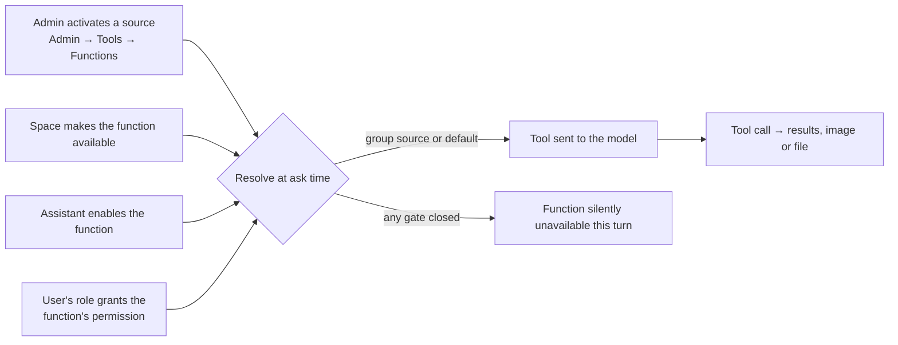
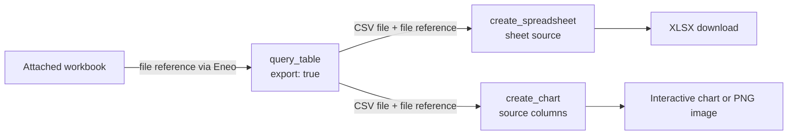

# Functions

Web search, image generation, ask a file, create files and charts are **functions**
(Swedish: *Funktioner*) that an
assistant switches on, not servers it connects to. An administrator decides
which source serves each function for the organisation; spaces, assistants and
roles decide where and by whom the function may be used. This guide covers the
administrator setup under **Admin → Tools → Functions**, how each function
works at runtime, and what users see in the chat.

import { Callout } from 'nextra/components'

<Callout type="info">
  Functions ride on the same Model Context Protocol (MCP) plumbing as ordinary
  tool servers. For general tool servers, catalog approval and identity
  forwarding, see [MCP Servers](/guides/mcp-servers). For the engineering view
  of Eneo's built-in loopback servers, see [Built-in Tool
  Servers](/docs/builtin-tool-servers). For the relationship between Skills,
  Functions, tools and views, see
  [Architecture](/docs/architecture#skills-functions-tools-and-views).
</Callout>

## Overview

| Function | What it does | Where the work runs |
| ------------------------------- | ----------------------------------------------------------------------------------------------------------------------------------------------------------------------------- | --------------------------------------------------------------------------------------- |
| **Web search** | Lets the assistant search the web and cite live pages | An external MCP search server (for example Tavily or Exa behind an MCP endpoint) |
| **Image generation** | Lets the assistant create images from a description, and edit or vary images | Either a catalog **image model** called by Eneo itself, or an external MCP image server |
| **Ask a file** (*Fråga fil*) | Lets the assistant answer questions about attached files: today it inspects, queries, joins and checks CSV and Excel files and exports full results; more formats will follow | The provider **built into Eneo** (the bundled tool runtime), or an external MCP server |
| **Create a file** (_Skapa fil_) | Lets the assistant draft and revise Markdown documents in Eneo, export Word (DOCX) and PDF, fill templates, and create Excel (XLSX) workbooks                                 | The provider **built into Eneo**, or an external MCP server                             |
| **Charts** (_Diagram_)          | Lets the assistant compare values and show trends with interactive bar, line, pie and scatter charts, or export PNG images when requested                                     | The provider **built into Eneo**, or an external MCP server                             |

The key ideas:

- **Saved intent is a purpose, not a server.** A space or assistant stores
  a purpose such as `web_search` or `file_analysis`. Which server serves that purpose is
  resolved at ask time, so switching, disabling or deleting a provider never
  breaks a saved configuration. A replacement restores availability.
- **One default per function, any number of group sources.** The tenant has at
  most one active default source per function. Additional sources can serve
  selected user groups and take precedence for their members.
- **Three gates, all required.** The space must make the function available,
  the assistant must enable it, and the user's role must hold the matching
  permission. If any gate is closed the tool is silently not offered to the
  model for that turn.

```mermaid
flowchart LR
  A[Admin activates a source<br/>Admin → Tools → Functions] --> R
  S[Space makes the function available] --> R
  T[Assistant enables the function] --> R
  P[User's role grants the<br/>function's permission] --> R
  R{Resolve at ask time} -->|group source or default| M[Tool sent to the model]
  R -->|any gate closed| N[Function silently unavailable this turn]
  M --> C[Tool call → results, image or file]
```

---

## Built-in tool availability

The standard deployment includes the isolated tool service. You still choose
which functions to turn on and which spaces and assistants may use them.
Existing external sources are kept. **Admin > Tools** shows service status and
actionable diagnostics, including when its providers are already registered.
Different application and tool-service versions produce a warning while calls
remain allowed. Ask your operator to deploy the matching release bundle.

## Tools, files and views

Tools do the work, files preserve the results, and Eneo's native views or MCP
Apps provide the interface. These parts can be used together in one conversation:

| Part                          | Responsibility                                                       | Example                                           |
| ----------------------------- | -------------------------------------------------------------------- | ------------------------------------------------- |
| **Bundled tool runtime**      | Runs queries, calculations and file generation in isolated processes | Analyse an Excel file or generate a report        |
| **MCP App**                   | An interactive view attached to a tool result                        | Filter, sort, copy and page through query results |
| **Native document workspace** | Displays drafts, revisions, version navigation and exports           | Revise a report and download it as Word           |
| **Native file preview**       | Displays an attachment or generated file using Eneo's own renderer   | Read a PDF or inspect an XLSX workbook            |

The native document workspace and file previews work without MCP Apps being
enabled. Interactive tool views additionally require the
[MCP Apps deployment settings](/guides/mcp-servers#interactive-tool-views).
The bundled chart tool supplies an interactive chart app, and returns a PNG
when an image is requested or app views are unavailable. Other MCP servers can
supply their own app views.

Use **Files and views** (*Filer och vyer*) above the conversation to open the
side panel. Its overview groups interactive views, files created in the chat
and uploads. A table or chart is listed by the title the assistant gave it,
with the kind of view beneath. Select an item to open it, or use a file's
download action. While
the panel is open, use its title to switch between items, or the back arrow
beside the title to return to the overview. Close the panel to
return to the full conversation; **Files and views** remains available to reopen
it. On narrow screens, the panel opens over the conversation. Chart views scroll
when their contents exceed the available space, including when the data table
is shown. Use the chart's range slider to zoom.

### From a spreadsheet to a report

With **Ask a file** and **Create a file** available to the assistant:

1. Attach a spreadsheet and ask, **"Show orders from last month, sorted by amount."**
2. Browse the result table, filter or copy rows, and expand it when more room is useful.
3. Ask, **"Write a short report explaining the main findings."** The assistant's
   document appears in the native workspace beside the conversation.
4. Select a paragraph, quote it into the next message, and ask, **"Make this
   paragraph shorter and easier to understand."**
5. Review the new version and use **Export** to download it as Word or PDF.

The tool descriptions guide this choice of display. Users do not need to name
MCP tools, ask for an app or know which file format Eneo uses internally.

---

## Administrator setup

Open **Admin → Tools** (`/admin/tools`). Two tabs are shown:

- **MCP servers** lists general tool servers. Select **Show function servers**
  (*Visa funktionsservrar*) to also list external servers that serve a
  function. The former `/admin/mcp-servers` URL redirects here.
- **Functions** (*Funktioner*) lists one card per function with its current
  sources, their configuration status and the activation action. Group
  sources appear beneath the tenant default.

### Adding a web search source

Web search always runs on an external MCP server. Eneo governs which engine
and which tools are exposed; search behaviour, ranking and rate limits belong
to the engine.

1. On the **Functions** tab, choose **Set up web search** (or add an MCP
   server and set its **Function** to **Web search** instead of **General
   tools**).
2. Enter the server URL and authentication as for any MCP server. Enable
   **Forward user identity** only if the search engine is trusted with the
   signed-in user's name, email, role and organisation on every query.
3. Save. The source is stored **inactive**. Review and approve the discovered
   tools, then **activate** it.

A search source with no enabled, approved tool cannot be activated.

### Adding an image generation source

Choose between **Image model** (*Bildmodell*) and **External MCP server**.

**Image model (built-in).** Eneo calls a catalog image model itself; no
external MCP server is needed.

1. Add the image model under **Admin → Models → Image models**, or from the
   function wizard via **Add image model**. Pick the model provider and enter
   the model name the provider serves, for example `gpt-image-1` on OpenAI or
   Azure OpenAI, `imagen-4.0-generate-001` on Gemini, or whatever name a vLLM
   or other OpenAI-compatible endpoint exposes on its `/v1/images/generations`
   route. Default size and quality, cost per image and the security
   classification live on the model, like on any other catalog model.
2. On the **Functions** tab, select the model under **Image generation** and
   choose **Save and activate**. Saving and activation happen in one
   transaction; a saved model that later becomes invalid stays visible with
   its blocking reason.

**External MCP server.** Same steps as for web search, with **Function** set
to **Image generation**. Any MCP tool that returns an `image` content block
produces a generated image in the chat.

A generated image is a file in the conversation like a chart export, so with
**Create a file** available the assistant can place it in a Markdown, Word or
PDF document on request, in the same turn or a later one.

<Callout type="info">
  To move from an external server to a built-in model (or the reverse), add the
  replacement as a separate source and activate it. The activation action names
  the default it will replace; the previous default is deactivated in the same
  step.
</Callout>

### Using the bundled tool runtime

Ask a file, create files and charts can be served by the provider **built into Eneo**,
the bundled tool runtime: an isolated container included in the standard Eneo
deployment. It is not part of the backend process and holds no Eneo
credentials; see `docs/deployment/TOOL_RUNTIME.md` in the repository for how an
operator configures or omits it. When it runs:

1. On the **Functions** tab, a function without a source shows **Built into
   Eneo** (*Inbyggd i Eneo*) with a **Turn on** (*Slå på*) button. When the
   function already has sources, **Add source** offers *Built into Eneo* next
   to *External MCP server*. If the deployment has no runtime, the card says
   **Not enabled in this deployment** and links the operator guide.
2. Eneo tests the connection and discovers the tools. **Turn on** makes the
   source the default; added from the menu while another default is active,
   it is saved inactive, ready to be activated as a replacement.

The runtime also offers **Compute** (exact JavaScript calculations), added
from the **MCP servers** tab through **Add MCP Server** under _Built into Eneo_.
It is enabled per space like any other general MCP server.

For **Charts**, enable the function in the space and assistant settings and
grant the **Charts** role permission. On an existing installation, roles are
not granted this new permission automatically. Existing general chart servers
remain unchanged; an administrator can add the function's provider separately
and retire the old server when the function is configured.

A bundled source is an ordinary source in other respects: audiences,
permissions and classification apply unchanged, and an external MCP server can
replace it at any time. Its tools and views are Eneo's own code, so they follow
the deployed runtime without a sync or an approval. Its address and credential
come from the deployment, so they cannot be edited in the connection form.

### Audiences and priority

| Audience | Behaviour |
|----------|-----------|
| **All users (default server)** | The tenant default. At most one active per function. |
| **Selected user groups** | Serves members of the chosen groups. Any number may be active alongside the default. When a user matches several, the lowest **priority** number wins, then the name. |

An active default cannot be narrowed to user groups in place. Deactivate it
first, or activate another default. User groups are managed under
**Access → User groups**.

### Activation checks

Activation is the only step that changes which source serves users. Before
switching the default, Eneo rechecks:

- the source belongs to this tenant;
- for a built-in image model source, the image model is enabled, current, and
  its model provider is active;
- at least one tool is enabled and approved;
- the connection validates (external sources).

A failed check or transaction leaves the previous default active. Stored
readiness describes configuration; it is **not** a claim of live health for an
external server.

---

## Permissions, spaces and assistants

### Role permissions

Each function has a role permission of the same name, edited under **Admin →
Roles**: **Web search** (`web_search`), **Image generation**
(`image_generation`), **Ask a file** (`file_analysis`), **Create a file**
(`file_creation`) and **Charts** (`charts`). New predefined User, AI Configurator
and Owner roles include all five. Existing roles need the new **Charts**
permission added by an administrator; custom roles only have the permissions
an administrator adds. Without the
permission the tools are never attached for that user, even where an assistant
offers the function. Configuring a function on a space or assistant is not
gated by these permissions.

### Spaces

A space makes a function available to the assistants inside it. If the
organisation uses security classifications, the function is only available
when an active source meets the space's classification. For a built-in image
source, the image model's classification is used; for an external source, the
server's own. The space settings explain why a function cannot be enabled
("No active search engine meets the space's security classification").

### Assistants and governance policies

Each assistant enables the functions it should use. Governance policies can
enforce a function set and choose whether a function is on or off by default
in new chats. Turning a function **off** always works; turning one **on**
requires an eligible source and the space rules above. Temporary unavailability
never blocks unrelated edits.

Service API keys can use web search but no other function: generated images
and files are stored as files owned by a user, a service key has no user, and
ask a file is not granted to service keys.

---

## What users see in the chat

- The tools popover in the chat input lists each enabled function with an
  on/off toggle. Opting out is stored per purpose, so it survives a provider
  switch on the admin side. Governance defaults seed the toggles for new
  chats.
- Unavailable functions show why: no active source, the space's classification
  is not met, or the role lacks the permission.
- Tool activity is shown inline. External search and image tools appear under
  their own tool names; the built-in image tool shows "Generating image"
  (*Genererar bild*) and, when it edits reference images, "Editing image"
  (*Redigerar bild*).
- Generated images appear in the answer. Generated documents, spreadsheets
  and CSV exports open in the side panel from the tool step that created
  them, and are listed under **Files and views**. A download card appears
  under the answer only where no step or panel shows the file. All generated
  files survive a reload, follow the conversation's access rules and are
  deleted with the conversation.

---

## How web search works

1. The assistant receives the search server's approved, enabled tools together
   with any general tool servers. Search tools are ordinary MCP tools; the
   model decides when to call them.
2. Eneo proxies the call to the search server. If identity forwarding is on,
   the `X-Eneo-*` headers described in [MCP Servers](/guides/mcp-servers#forwarding-user-identity)
   are sent.
3. The result text is returned to the model under the same output budget as
   other tools (`MCP_TOOL_OUTPUT_MAX_CHARS`, default 32 768 characters). MCP
   resource blocks the server returns alongside the text (for example the
   pages behind a hit) are captured as references and shown with the answer
   when the model cites them.
4. Searches are replayed to the model on later turns like any other tool call,
   so follow-up questions can build on earlier results.

Eneo has no built-in search engine. Search quality, freshness, region and
safe-search settings are the engine's; check its documentation.

---

## How image generation works

### Built-in image model

```mermaid
sequenceDiagram
  participant M as Completion model
  participant P as MCP proxy
  participant L as Loopback server<br/>/internal-mcp/image_generation
  participant I as Image model provider
  M->>P: generate_image(prompt, size?, quality?, reference_images?)
  P->>L: Call with per-completion token naming the source row
  L->>L: Load source row and image model; resolve credentials
  alt reference_images given
    L->>I: images.edit(prompt, image bytes)
  else
    L->>I: images.generate(prompt)
  end
  I-->>L: image (base64 or URL)
  L-->>P: MCP image block + usage metadata
  P-->>M: placeholder text; image persisted as a generated file
```

- The built-in source is an ordinary MCP server row whose endpoint is Eneo's
  own loopback server and which references the image model by foreign key. It
  carries no credentials of its own: on every request the ask path mints a
  short-lived token naming the row, and the tool uses the credentials stored on
  the model's provider.
- Every provider is reached through the same OpenAI Images API shaped call via
  LiteLLM, so a self-hosted GPU endpoint and a hosted API take the identical
  path.
- The tool accepts `size` (`1024x1024`, `1536x1024`, `1024x1536`) and
  `quality` (`low`, `medium`, `high`). When the model omits them, the image
  model's defaults apply; a default of **auto** sends nothing so the provider
  decides. Parameters a provider rejects as unsupported are dropped and the
  call retried, so a model that has no `quality` setting still works.
- Image generation has its own tool-call timeout,
  `IMAGE_GENERATION_TIMEOUT_SECONDS` (default 240), because image calls
  routinely outlast a general tool call.
- Token usage reported by the provider is attached to the tool result under
  OpenTelemetry GenAI names (`gen_ai.usage.*`, `gen_ai.request.model`).
- Disabling the image model makes the function unavailable until it is
  re-enabled or the source is pointed at another model; deleting the model is
  refused while a source runs on it.

The backend must be able to reach its own loopback URL, `INTERNAL_MCP_BASE_URL`
(the same requirement as the built-in knowledge and files servers).

### Reference images: variations and follow-up edits

Users can attach an image and ask for a variation or an edit, and a follow-up
turn ("make it bluer", "same scene at night") can hand the image the assistant
just generated back to the image tool. The mechanism is the same for the
built-in model and for external image servers: **stable file references**, resolved
by Eneo to authorized URLs before tools run.

- Every attached image and every generated image gets a stable `file_ref`
  (`eneo-file:…`) in the prompt, tagged `"kind": "image"` next to document
  entries. The reference contains no signed URL or token. Images are still
  passed as vision input where the completion model supports it.
- The system prompt tells the model that image entries go to image tools,
  never to the built-in `read_file` tool.
- The built-in `generate_image` tool takes an optional `reference_images`
  list. The model supplies file references in that list; Eneo resolves them to
  signed URLs before dispatch. With references it calls the provider's image **edit**
  API with the file bytes; the prompt then describes the change or variation.
  The URL is verified locally (signature, file and tenant), and the bytes come
  from Eneo's content store; nothing is fetched over HTTP.
- On later turns, each tool call that produced images is replayed with a
  `File reference for Image N` line per image. The same file retains its handle;
  authorization and signed URLs remain request-local.
- Image attachments are offered in the chat whenever image generation is
  available, even if the completion model has no vision support.

Limits and failure behaviour:

| Situation | Behaviour |
|-----------|-----------|
| Model has no edit support (for example a generation-only model) | The tool returns an error the model can recover from: it generates from the description instead, or tells the user the image cannot be edited with the organisation's model. Never a silent plain generation. |
| Provider rejects the edit request (format, size) | Same recoverable error. |
| More than `MCP_TOOL_IMAGE_MAX_COUNT` references, or a reference larger than `MCP_TOOL_IMAGE_MAX_BYTES` | Rejected with a message to the model. The caps are the same ones that bound images arriving from tool results. |
| Reference is not an image, or the link has expired | Rejected; the model is told to ask for a fresh attachment only when the link is invalid. |

<Callout type="info">
  In a streaming chat, a generated image gets its file reference in the same
  turn, so the model can edit it straight away. Over the non-streaming API the
  file is persisted after the model finishes, and the reference arrives on the
  next turn.
</Callout>

### External image servers

An external image server receives ordinary signed URLs after Eneo resolves the
model's file references, and fetches bytes through Eneo's signed download endpoint.
Providers do not need to understand Eneo's handles or change their MCP inputs. That requires
`FILE_REFERENCE_BASE_URL` to point at the Eneo backend's `/api/v1` on a host
the external server can reach. On a developer machine
`host.docker.internal` is typically not reachable from a remote server, and the
call fails as expected. When a call carrying a reference URL fails, the model is
told the URL is valid, so it reports that the tool cannot reach the file
rather than asking the user to re-upload it.

### Generated image limits

Before an `image` content block is persisted, the proxy applies these guards
regardless of which server produced it (limits for documents and spreadsheets
are under [Generated files](#generated-files)):

| Setting | Default | Effect |
|---------|---------|--------|
| `MCP_TOOL_IMAGE_MAX_BYTES` | 10485760 | Decoded size cap per image; larger images are dropped with a notice to the model. |
| `MCP_TOOL_IMAGE_MAX_COUNT` | 4 | Images admitted per tool result; the rest are dropped with one notice. |
| `MCP_TOOL_OUTPUT_MAX_CHARS` | 32768 | Text budget per tool result. Images do not count against it. |

Only `image/png`, `image/jpeg`, `image/webp` and `image/gif` are accepted. The
model sees a short placeholder instead of the bytes. Only the latest turn's
generated images are replayed to the model as vision input on follow-ups; older
ones are described by the placeholder and, from this release, by their
file reference.

---

## How ask a file works

The model receives the attachment's stable file reference (the same one
described under [Reference images](#reference-images-variations-and-follow-up-edits))
and passes it in the tool's URL input. Eneo resolves it to the current authorized
signed link before dispatch. With the provider built into Eneo
(CSV and Excel today):

- `inspect_table` returns sheet names, column types and value profiles and a
  few sample rows; `query_table` runs one read-only SQL `SELECT` over the full
  table, joining other attachments when asked; `assert_table` checks
  data-quality rules.
- The runtime downloads the file through its signed link on **every** call, so
  Eneo checks access each time, and accepts links only at the origin Eneo tells
  it (`FILE_REFERENCE_BASE_URL`). Parsed sheets are cached for 30 minutes per
  user; the cache never replaces the access check.
- Queries run in a fresh, locked-down DuckDB in a sandbox process: no file or
  network access, no extensions, a single `SELECT`, and limits of 500 returned
  rows, 10 seconds and 256 MB. Results report truncation and how many rows
  could not be parsed.
- `query_table` with `export` also returns the complete result (up to 200 000
  rows) as a CSV file, shown to the user as a download.

The source forwards the user's identity, which the bundled runtime uses only
to keep each user's parsed files apart.

### Browsing query results

When MCP Apps are enabled, a multi-row query result selected for display appears
as an interactive table under the answer. The assistant uses `display: "none"`
for intermediate calculations and data prepared for charts or other tools,
unless you also ask for the table. `display: "table"` keeps the browsing view
(the default for older calls); both settings return the same data to the assistant. Ordinary requests such as "Show me the rows in this
file" or "Summarise sales by region" are enough. The assistant inspects the
file, queries the full dataset and leaves export off for in-chat browsing.

When you are at the bottom of the chat, the view follows tables and charts as
they appear or resize, including after the answer finishes. Scrolling up keeps
your reading position; use the down-arrow button to return to the latest reply.

The table supports sorting, filtering, copying and loading additional rows.
Its text filter searches the rows already loaded; ask the assistant to filter
the dataset when the condition must apply to every row.
Paging and sorting a longer result can call the same query tool again through
Eneo, using only the files the originating call was allowed to use. A file
preview shows the file itself; this app shows the result of the query.
The app is headed by the title the assistant gave the table. The kind of view
beneath it follows the UI language: **Table results** in English and
**Tabellresultat** in Swedish.

Select text in a table or chart view and choose **Quote in chat** (*Citera i
chatten*) to ask about it: the selection appears as a quote above the message
box and is sent with your next question. Remove the quote to ask without it.
Views from other MCP servers can offer the same.

The assistant is told when the table is displayed, so its reply can explain
the findings without repeating the rows. The first page is not the whole
dataset: totals and other full-dataset conclusions require the appropriate
query. A single-row result, query plan or exported result does not show this
table. Without app support, the tool still returns data for an ordinary answer.

Ask for a downloadable CSV or Excel file when you want a file. Export is also
used when a chart or spreadsheet tool needs a query result as its source;
large results then travel as file references rather than copied rows.

---

## How create files works

- `create_document` creates a Markdown document by default, displayed in
  Eneo's native workspace. It can also render headings, lists, tables, quotes,
  code, links and page breaks to Word or PDF. `create_spreadsheet` builds XLSX with
  named sheets, a bold frozen header row and typed cells; text always stays
  text, so a value starting with `=` is never a formula.
- `edit_document` replaces named passages of a Markdown document created
  earlier and leaves the rest unchanged. `fill_template` fills the
  `{{placeholders}}` of a Word, text or Markdown template and returns it in the
  template's own format.
- A spreadsheet sheet can be given inline or as a **source file**: the signed
  link of a CSV or XLSX, such as a query export. Large data then never passes
  through the model.
- The file travels back inside the tool result as a standard MCP embedded
  resource. The bundled runtime keeps no copy and serves no download links.

### Images in Word and PDF reports

Ask for a report based on your analysis and charts. The assistant is instructed
to include the relevant charts with captions and page-appropriate sizing by
default; users do not need to specify export or embedding mechanics. It can reuse existing
PNG or JPEG images from the conversation, including images generated by external
providers. Interactive charts remain interactive in chat; the document contains
static images. When a new chart image is needed only for a report, the bundled
chart tool uses `display: "none"` to keep that export out of the chat.

For `create_document`, declare each image under `images`, passing its `file_ref`
in `url`, with `filename` and a unique `id`. Place `` on
its own line in `content`. Optional `caption` text appears below the image;
`width_percent` controls 25–100% of the available page width. Images retain their
aspect ratio and are reduced to fit the page. Word templates and revisions keep
embedded image relationships and use the template's page dimensions.

This works in every format. A Markdown document stays Markdown when an image is
added: it keeps the image as a line naming the file by its handle
(``), with no bytes and no credentials in the text.
The panel beside the conversation shows the file there to a reader who may open it,
and exporting the document as Word or PDF embeds it. Each document
accepts up to eight PNG/JPEG images, 10 MiB each and 32 MiB combined, with a limit
of 16 megapixels per image. Images pass through the existing signed-file access
checks and render from declared local inputs in the sandbox. Remote image URLs
inside Markdown are never fetched. Include the images again when revising a
report's body; its template headers and footers are preserved.

### Excel calculation limits

Ask a file reads saved Excel formula results; it does not recalculate formulas.
Inspection reports formula cells and missing saved results for each affected sheet.
Queries, checks and exports repeat these limitations for all participating files,
including joins. The table view also displays the limitation.

A saved result may be outdated; Eneo cannot establish its freshness. Missing
results are treated as empty values, so totals cover only available saved values.
Recalculate and save the workbook in Excel to obtain missing results. Sheets
containing only formulas without saved values remain visible in inspection, but
cannot be queried until they contain usable values.

Create a file produces new table workbooks with basic formatting. Rebuilding an
uploaded workbook does not preserve its formulas or arbitrary original layout.

### Native document workspace

Bundled analysis steps describe the operation using the existing tool call:
reading sheets and columns, calculating summaries (with simple grouping columns
when available), counting rows, retrieving rows, or checking data quality. No
additional model request is made. Complex queries use a general activity label.

Analysis steps identify their input by filename and distinguish attached files
from generated files. Exported query results have a separate output label.
Expanded steps retain execution order, including failed attempts; a later output
link does not by itself mean a failed query was retried successfully. Intermediate
analysis exports remain downloadable without automatically opening the file panel.

Models receive credential-free `file_ref` identifiers (`eneo-file:…`) for accessible
conversation attachments and generated files, including on history replay.
They pass these identifiers unchanged in a tool's URL inputs. Eneo resolves
nested references immediately before execution using the current request's
authorized file map. A handle is not permission: an unknown or unavailable handle
fails before the tool runs, and the original download still checks file and tenant
access. Interactive apps can reuse handles only for files their originating call
used and their conversation or assistant still holds. External providers receive
normal signed URLs and retain their existing schemas; Eneo adapts only the
model-facing URL inputs. Legacy stored URL references remain supported, and tokens
are masked in diagnostics even on malformed paths.

The file panel opens automatically beside the conversation when file creation
starts, using the document title as soon as it is available. Markdown, Word and
PDF text appears progressively as the assistant writes
it. Excel drafts show incoming sheets and rows (up to 100 draft rows per sheet);
sheets copied from source files show a preparation status until the finished
workbook arrives. The draft is not the final layout. Once saved, the same panel
displays the finished file. The draft stays visible while the saved file downloads.
If creation retries, the previous draft stays visible with a notice until replacement
content arrives. Interrupted calls are marked as failed, not as created.
On a narrow screen, file previews open over the conversation when the user
opens them. Closing a draft during an answer stops it from reopening itself
for that answer.

If a document is already open when another is written, it stays readable with a
preparation status. The panel switches only once the new file and its preview are
ready. If loading or rendering fails, the previous document stays open and you can
retry. Closing the panel or opening another file cancels the pending preview swap.

**Files and views** sits at the top right of the message pane while the side
panel is closed. Its overview lists **Views**, **Created in chat** and
**Uploads** separately and is available even when the conversation contains
only uploads. While the panel is open, the same list is reached from the panel
title or the back arrow. Repeated attachments appear once;
generated document revisions remain grouped under their latest version.
Inline filename links and file rows open the sidebar preview. Use the explicit
**Download** button to save a copy. In a read-only transcript without a preview
panel, filename links download instead.

The workspace supports selecting and quoting text into the next message,
viewing earlier and later versions, returning to the latest version, and
expanding the document to use the available width. Supported file previews
include Markdown, Word, PDF, Excel, CSV, TSV and text. PDF uses the browser's
viewer, so Eneo's selection-to-quote action is not available inside it.

### Ask about spreadsheet cells or selected rows

In an Excel, CSV or TSV preview, click a cell or toggle row numbers, then choose
**Ask about selection** (**Fråga om markeringen** in Swedish). Selecting alone
never sends a message. Click another row number to add it; click a selected row
again to remove it. Hold Shift to add a range from the last selected row.
The toolbar shows how many rows are selected.

The composer receives a removable reference with the filename, sheet and location.
Cell references include a short labelled excerpt. Row selections carry the exact
source coordinates instead of copying cell values into the message. Type a
question such as “Compare these rows” alongside the reference.

For row selections, **Ask a file** applies the source-row filter before DuckDB
runs a comparison, total, sort or export. The original file remains unchanged.
Blank worksheet rows and duplicate values do not shift the selected coordinates.
CSV/TSV coordinates count nonblank records, including records containing quoted
line breaks. The first row is the header. Unsupported or invalid selections fail
rather than silently including other rows. Excel formula limitations still apply.
The assistant is instructed to query the selection before answering; a provider
must support the `source_rows` input for this workflow.

Clicking a reference reopens the immutable original file and highlights the
selected locations, including from conversation history. A newer document version
or an upload with the same name does not replace that reference. If the file or
locations are unavailable in the limited preview, Eneo says so.

Use the arrow keys to move between cells and row-number buttons, Enter or Space
to select, Shift+Up/Down on row numbers to extend a range, and Escape to clear.
Text selection and copying remain available. On narrow screens the preview closes
after quoting so the composer is accessible. This applies to Eneo's native file
preview; interactive tables provided by MCP apps retain their own controls.
One message can reference one row selection from one file and sheet. Selecting
across sheets and editing cells directly are not supported.

Editing is currently **assistant-driven**: request changes through chat. Direct
typing into a rich-text document is not implemented.

### Changing a created file

Ask for the change in the same conversation: "Shorten section 2" or "Add a
column for 2027". For a targeted change to a Markdown document,
`edit_document` replaces the specified passage and preserves the rest. When
the new version is displayed, the changed passage is highlighted when it can
be located.
The tool refuses an edit it cannot place safely.

Each revision creates a new file and keeps the previous versions. The document
list groups revisions, and the panel lets you browse their history. Other
revisions can provide the full revised content; a revised Word document can
reuse its earlier layout and template. Exact passage editing currently applies
to Markdown documents.

### Exporting a document

For a saved Markdown document, **Export** offers Markdown, Word and PDF.
Markdown downloads the original. Word and PDF export the selected version's
saved text through the assistant's **Create a file** provider; the model does
not rewrite the document for export.

Exported Word/PDF bytes are downloaded without being stored as another
conversation version. If the Word or PDF file should also remain in the
conversation for later tool use, ask the assistant to create it there.
Without an available file-creation provider, Markdown can still be downloaded,
but Word/PDF export is unavailable. Export attempts are audited.

Native Word and PDF export availability is checked separately for the selected
document whenever the export menu opens. A provider may support one format,
both or neither. Unsupported formats explain why they are unavailable; a failed
availability check can be retried. Markdown download remains available.

Providers can still supply file-creation tools without supporting Eneo's native
export contract. Changing providers does not remove saved documents. Each export
rechecks current access and compatibility, so an administrator's change between
opening the menu and exporting takes effect immediately.

### Sharing the panel with apps

The document workspace, file previews and expanded MCP Apps share one panel.
Opening a file returns the expanded app inline. Expanding an app covers the
open file, which is shown again when the app returns inline. The app keeps its
frame, filters and loaded rows when moving between inline and expanded display.

Document versions are saved files. An app's current filter and paging state
are live browser state; preserving them during expansion does not make them
saved document versions or guarantee restoration after a page reload.

### Word templates

A Word document can be created from a template: the organisation's letterhead,
a *tjänsteskrivelse* layout, a report shell. Nothing is configured for it in
the assistant; the template is an ordinary attachment:

- **Ad hoc:** the user attaches the `.docx` in the chat and asks for the
  document "using the attached template".
- **Per assistant:** an administrator attaches the `.docx` to the assistant
  (**Bilagor**) and tells the assistant in its instructions to use it for
  documents, for example "Create reports with the template *Rapportmall.docx*".
  Attachments are handed to the assistant as files it opens when needed, so a
  template does not load into every answer.

The model passes the template's file reference to `create_document`, which
renders the content into it. The template keeps its styles, headers, footers,
numbering and page setup. A paragraph in the template that reads
`{{content}}` marks where the content goes; without one, the template's body
is replaced and only its page furniture remains. Rendering content into a
template applies to Word output only and needs a plain `.docx` (macro-enabled
files are refused). A template that only has `{{placeholders}}` to fill in goes
through `fill_template`, which also accepts `.txt` and `.md` templates. The
result goes through the same checks as any created document.

### Generated files

Eneo admits a file from a tool result only when the producing source serves a
function that delivers that type:

| Function | Accepted types |
| ------------- | ------------------------------------- |
| Create a file | Markdown, plain text, DOCX, PDF, XLSX |
| Ask a file | CSV (query exports) |

The same file from any other server stays an ordinary result, and file bytes
never reach the model. Before saving, Eneo checks the bytes against the
declared type: Office files must be well-formed and bounded, with no macros,
embedded objects or externally loaded content; PDFs must be complete, with no
scripts, launch actions or embedded files; CSV must be UTF-8 text. A file that
fails is skipped, the answer continues and the reason is logged.

| Setting | Default | Effect |
|---------|---------|--------|
| `MCP_TOOL_FILE_MAX_BYTES` | 20971520 | Size cap per generated file; larger files are dropped with a notice to the model. |
| `MCP_TOOL_FILE_MAX_COUNT` | 4 | Generated files admitted per tool result. |

Saved files keep their exact original and extracted text, so later turns and
the model receives stable file references for them like for any attachment.
Tools receive the authorized URLs resolved by Eneo.

---

## Chaining tools

A file one tool produces can feed the next tool in the same answer, without
the data passing through the model:

```mermaid
flowchart LR
  A[Attached workbook] -->|file reference via Eneo| Q[query_table<br/>export: true]
  Q -->|CSV file + file reference| S[create_spreadsheet<br/>sheet source]
  Q -->|CSV file + file reference| C[create_chart<br/>source columns]
  S --> D1[XLSX download]
  C --> D2[Interactive chart or PNG image]
```

When a tool produces a file, Eneo saves it and hands the model its stable file
reference together with the tool result. Eneo resolves that reference before
calling the next tool, which downloads through the signed link with the usual
access check. The providers share
nothing but Eneo-owned files and links, so any of them can be an external
server that follows the same conventions. In a streaming chat this happens
within one answer; over the non-streaming API the reference arrives on the next
turn.

---

## Ask-time resolution

For each function an assistant enables, the source is attached to a turn only
when all of these hold:

1. the user's role grants the permission;
2. a source serves the user: a group source covering one of their groups, else
   the tenant default;
3. the source has at least one enabled, approved tool;
4. for a built-in image model source, its image model is enabled, not
   deprecated or deleted, and its model provider is active;
5. the source's security classification (the image model's, for a built-in
   image model source) meets the space's classification;
6. the completion model supports tool calling.

Otherwise the function is silently unavailable for that turn. The conversation
request carries purpose-based opt-outs (`disabled_capabilities`); ordinary
server opt-outs stay in `disabled_mcp_server_ids`.

---

## Configuration reference

| Setting | Default | Purpose |
|---------|---------|---------|
| `INTERNAL_MCP_BASE_URL` | `http://localhost:8123` | URL the backend uses to reach its own loopback servers, including image generation. |
| `FILE_REFERENCE_BASE_URL` | unset (falls back to `PUBLIC_ORIGIN`) | Base URL for signed file reference links handed to tools. Set it when external tool servers reach the backend on another host than the browser does. |
| `IMAGE_GENERATION_TIMEOUT_SECONDS` | 240 | Tool-call budget for the built-in image source. |
| `MCP_TOOL_IMAGE_MAX_BYTES` | 10485760 | Per-image size cap for tool results and reference inputs. |
| `MCP_TOOL_IMAGE_MAX_COUNT` | 4 | Images per tool result, and reference images per edit call. |
| `MCP_TOOL_OUTPUT_MAX_CHARS` | 32768 | Text budget per tool result. |
| `MCP_TOOL_FILE_MAX_BYTES` | 20971520 | Size cap per generated document, spreadsheet or CSV export. |
| `MCP_TOOL_FILE_MAX_COUNT` | 4 | Generated files per tool result. |
| `TOOL_RUNTIME_URL` | unset | Address of the bundled tool runtime. Set by the standard Compose stack; enables the **Built into Eneo** offers under Functions and MCP servers. |
| `TOOL_RUNTIME_TOKEN` | unset | Shared bearer for the bundled runtime; never stored in the database. |

---

## Troubleshooting

### The function toggle is missing in the chat

- Check the user's role has the function's permission (for example **Web
  search** or **Ask a file**).
- Check the assistant enables the function and the space makes it available.
- If the space is classified, check an active source meets that
  classification.

### "No active source" although one is configured

- External sources are saved inactive. Approve the discovered tools, then
  activate.
- A **Built into Eneo** source added while another default is active is saved
  inactive too. Activate it to make it the default.
- A built-in image model source needs an enabled, current image model on an
  active provider. The Functions tab shows the blocking reason on the card.

### Image generation times out

- Raise `IMAGE_GENERATION_TIMEOUT_SECONDS`; high-quality or large sizes take
  longer on most providers.
- Check the backend can reach `INTERNAL_MCP_BASE_URL`.

### Edits fall back to a new image, or the model says the image cannot be edited

The configured image model has no edit endpoint, or the provider rejected the
request. Use a model with edit support (for example `gpt-image-1`) for
variations and follow-up edits.

### An external image server cannot read attached images

Set `FILE_REFERENCE_BASE_URL` to a URL the external server can reach. The
signed link is the file; asking the user to re-upload changes nothing.

### "Built into Eneo" says it is not enabled in this deployment

The deployment has no bundled tool runtime configured (`TOOL_RUNTIME_URL` and
`TOOL_RUNTIME_TOKEN`); the card links the operator guide. Once a function has
its **Built into Eneo** source, the offer disappears: each is added once per
organisation.

### Ask a file cannot read an attachment

- The runtime fetches files from `FILE_REFERENCE_BASE_URL` (or `PUBLIC_ORIGIN`
  when unset); that address must be reachable from the runtime.
- A link copied from an earlier turn has its token removed; Eneo replays tool
  calls with fresh links, and the tool tells the model to use the current
  reference rather than asking the user to upload the file again.

### A created document does not appear in the chat

The file failed Eneo's checks (wrong type for the function, active content, or
over `MCP_TOOL_FILE_MAX_BYTES`). The backend log names the reason. Only
sources serving create files, or ask a file for CSV exports, can deliver
files.

## Interactive charts

Enable **Charts** (_Diagram_) under **Functions**. For analysis of an attached
spreadsheet, also enable **Ask a file**. Users can then ask, for example:

- **"Compare budget and actual by department in this spreadsheet."**
- **"Show how monthly costs changed over the year."**
- **"Show the relationship between population and total spending."**

The assistant selects `create_chart` from its description; users do not need
to name a tool or request an interactive view. Small datasets can be supplied
directly. Larger query results can pass from **Ask a file** as a CSV source
without copying all the values through the model. Each chart supports at most
eight series, whether supplied directly or through `source.value_columns`.
For larger comparisons, the assistant should split the requested series into
clearly titled charts of at most eight each, retaining every requested series
and the same category axis. For example, ten departments can be split into two
charts of five. A source file allows more rows without passing them through
the model; it does not increase the number of series per chart.

The bundled chart view uses Apache ECharts with the official MCP Apps SDK:

- Hover over the chart to inspect values; toggle legend buttons to show or
  hide series (or slices for a pie chart).
- Zoom the x axis using the range slider on bar, line and scatter
  charts, and choose **Reset zoom** to restore the full range.
- Choose **Table** (*Tabell*) for an accessible table of the chart's values.
- Choose **Larger view** to open it beside the conversation. Zoom, series
  selection and the data table stay in place during layout and theme changes.
  The plot keeps a readable height when the table is open; scroll the panel to
  reach the remaining content.

Controls follow Eneo's Swedish or English language setting and the chart
follows its theme. This is a result view; it does not edit the source file or
create a native document. Ask a follow-up question to produce a revised chart.
Reloading the conversation recreates the chart with its initial state.

Ask **"Give me this chart as a PNG image for a report"** for a static image.
`format: png` and `include_svg: true` use the image path; the default `auto`
uses an interactive view when available and otherwise falls back to PNG.
Interactive results are limited to 200 KiB of chart data and the configured
point limit. The tool asks for aggregation, filtering or PNG output when the
interactive data limit is exceeded; it does not silently drop points.

The bundled view contains its renderer and requests no network access or
browser permissions. It accepts a validated chart specification, not arbitrary
JavaScript, HTML or ECharts options. File references are resolved in the tool
runtime; the chart view receives the resulting values.
