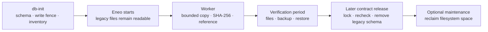

# Upgrade Legacy File and Icon Storage

import { Callout, Steps, Tabs } from "nextra/components";

## TL;DR

This is a **one-time adoption** of File and Icon bytes written by older Eneo
releases.

<Callout type="info">
  **Normal availability:** `db-init` keeps the API closed while Eneo expands the
  schema, installs the legacy write fence, and inventories row metadata. After
  it succeeds, Eneo starts normally. The maintenance worker then copies and
  verifies bounded batches while old files remain readable.
</Callout>

New uploads use object content as soon as the new release starts. They do not
wait for the legacy adoption or write bytes back to the old columns.

The default capacity path depends on the **combined logical size of affected
legacy payloads**, not the size of the whole database or the largest file:

- **At or below 5 GiB:** no action. The online worker starts automatically.
- **Above 5 GiB:** check disk and WAL headroom, set the reported capacity
  acknowledgement, and recreate the worker.

During the verification period, affected payloads exist in both layouts. For
example, 10 GiB of existing legacy payload becomes roughly 20.4 GiB in total:
the original 10 GiB already on disk plus about 10.4 GiB for the new verified
copy. The host therefore needs about 10.4 GiB of **additional** database space,
not another 20.4 GiB, plus temporary WAL growth and its normal free-space floor.

PostgreSQL inline remains a complete byte backend, so this adoption is required
even when the deployment does not use S3-compatible storage. Run large
deployments at a quiet time and verify representative files and a current
restore before closing the recovery window. Do not delete the old columns when
the worker finishes; a later contract release owns their removal. PostgreSQL
does not return that filesystem space automatically. Run a planned `pg_repack`
or `VACUUM FULL` after the contract release only when the host needs it back.

This release adopts legacy payloads into PostgreSQL inline. If object storage is
selected before the campaign starts, the worker waits rather than silently
changing the destination; follow [Run and monitor](#run-and-monitor).

## What this changes

Older releases stored File and Icon payloads and related rules across product
rows, separate code paths, and environment settings. Changes to integrity,
size limits for file, image, and audio uploads, cleanup, or storage placement
therefore had to be coordinated in several places.

Current code gives each concern one owner. File and Icon keep the product
meaning and usage. Object content owns durable bytes, SHA-256 integrity, exact
size, lifecycle, and physical location. **Admin > Storage** owns the shared
upload limits and placement choice, so administrators can change them without
editing scattered environment settings and restarting Eneo.

The upgrade adopts the old rows once so Eneo does not have to maintain two file
models indefinitely. It also lets optional S3-compatible storage use the same
verified content model instead of adding another File- or Icon-specific path.
S3 is not required: PostgreSQL inline is a complete placement for bytes managed
by that model.



## Before you upgrade

Use a quiet evening or maintenance window when the reported legacy payload is
large. The online phase is deliberately throttled, but it still adds database
I/O, WAL, and backup volume. Small installations can run during normal hours if
a production-size test shows acceptable latency.

<Callout type="warning">
  A test or development database that started or completed the former unreleased
  `202607231700` migration or an earlier form of `202607231745` must restore its
  pre-upgrade backup before using this migration chain. The inventory commits
  groups independently, and a rerun keeps existing rows. Alembic records
  revision IDs, not later code changes behind those IDs. Do not stamp past them.
</Callout>

<Steps>
### Test the complete path

Restore a recent production backup in a test environment. Run the same release,
Compose files, and storage policy that production will use. Confirm old File and
Icon downloads before and after adoption. External PostgreSQL databases must
report `UTF8` from `SHOW server_encoding;`; the worker halts before converting
legacy text when that invariant is not met.

### Choose the rollback point

Drain old jobs, stop every old backend and worker, then take the pre-upgrade
recovery point. Inline-only deployments need PostgreSQL. If any authoritative
content is in object storage, take a matching PostgreSQL and object-store backup
and label them as one restore point.

Follow the exact stop and deployment commands in [Deploy Eneo: Updating
Eneo](/guides/deployment#updating-eneo).

### Choose the capacity path

Keep the standard 5 GiB threshold unless the deployment requires approval before
**every** inline copy. A smaller ready set starts automatically; a larger set
finishes admission and waits without making old files unavailable.

For the stricter path, set this in `env_backend.env` before starting the new
worker:

```dotenv
FILE_ICON_BACKFILL_AUTO_INLINE_MAX_BYTES=0
```

This is optional, not a normal upgrade requirement. In both paths, the worker
logs `waiting_for_capacity` with the exact acknowledgement when a decision is
required.

### Deploy without old writers

Run the schema upgrade with the old backend and worker stopped. Start only the
new release after `db-init` succeeds. Do not use a rolling deployment across the
legacy write fence.

</Steps>

## Plan disk and duration

### Disk: use the affected bytes, not total database size

Use these values:

- `L`: the worker's exact logical bytes still requiring an inline copy.
- `D`: expected physical database growth for that copy.
- `W_now`: WAL currently stored on the same volume.
- `W_peak`: highest simultaneous WAL use expected during the run.
- `M`: the free-space floor the operator wants to preserve for normal service.

The capacity check is:

```text
free space now >= D + max(W_peak - W_now, 0) + M
```

This does not count the whole database, WAL already occupying the volume, or
WAL generated and recycled over time. Keep backup and replica capacity separate
when they use another volume or host.

Put simply, the affected file bytes are roughly doubled until the later
contract release: existing `L` plus new `D`. Capacity planning asks how much
**additional** free space the new copy and simultaneous WAL growth need; it does
not count the already allocated `L` a second time.

<Callout type="info">
  **Measured planning evidence:** with random 640 KiB payloads, the 1 GiB and 10
  GiB tests used about `1.043 x L` and `1.041 x L` of new database allocation.
  For a similar payload profile, `D = 1.05 x L` is therefore a useful first
  estimate. The 10 GiB test also generated about 11 GiB of WAL over the complete
  run, but did not measure a 25 GiB simultaneous peak or prove that 25 GiB must
  be free. Many small payloads or different PostgreSQL storage settings can
  change the database overhead, so confirm `D` on a restored copy when the
  margin is tight.
</Callout>

There is no safe fixed multiplier for the complete calculation when WAL
retention is unknown or unbounded. On a production-equivalent restored copy,
record database size, `pg_wal` size, and free disk before the first copy and at
their peaks. Reproduce production slots, archiving, volumes, and representative
traffic before setting the acknowledgement.

Check current local WAL and replication-slot retention in `psql`:

```sql
SELECT current_setting('max_wal_size') AS max_wal_size,
       pg_size_pretty(
           coalesce((SELECT sum(size) FROM pg_ls_waldir()), 0)::bigint
       ) AS current_pg_wal_size;

SELECT slot_name,
       active,
       pg_size_pretty(
           pg_wal_lsn_diff(pg_current_wal_lsn(), restart_lsn)::bigint
       ) AS retained_wal
FROM pg_replication_slots
WHERE restart_lsn IS NOT NULL
ORDER BY slot_name;

SELECT failed_count,
       last_failed_time,
       last_archived_time,
       stats_reset
FROM pg_stat_archiver;
```

`max_wal_size` is a soft checkpoint target, not a WAL cap. The archiver counters
are cumulative since `stats_reset`; compare the latest failed and successful
times to see whether archiving recovered. A large or growing slot, an unresolved
archive failure, or an unknown WAL volume must be resolved or included in the
capacity plan. `pg_ls_waldir()` normally requires superuser or `pg_monitor`
privileges. These queries do not measure an external archive or replica volume.

Use this query after seeing `waiting_for_capacity`. It reports `L` and the
benchmark-derived `1.05 x L` estimate for `D`. Run it on demand, not as a
frequent monitor:

```sql
WITH capacity AS (
    SELECT count(*) FILTER (WHERE state = 'pending') AS pending_items,
           count(*) FILTER (WHERE state = 'ready') AS ready_items,
           coalesce(sum(payload_size_estimate)
               FILTER (WHERE state = 'ready'), 0)::bigint
               AS ready_payload_bytes
    FROM file_icon_backfill_items
)
SELECT pending_items,
       ready_items,
       ready_payload_bytes,
       pg_size_pretty(ready_payload_bytes) AS ready_payload_size,
       ceil(ready_payload_bytes::numeric * 1.05)::bigint
           AS benchmark_profile_db_growth_bytes,
       pg_size_pretty(
           ceil(ready_payload_bytes::numeric * 1.05)::bigint
       ) AS benchmark_profile_db_growth_size
FROM capacity;
```

Wait until `pending_items` is zero before treating `ready_payload_bytes` as a
stable cross-check. Copy the required byte count from the worker's
`waiting_for_capacity` warning and set
`FILE_ICON_BACKFILL_INLINE_CAPACITY_ACK` to at least that value, then recreate
the worker. The warning remains authoritative during recovery because
replacement copies can increase the cumulative requirement beyond the current
ready set. The acknowledgement records an operator decision; it does not detect
or reserve disk.

```dotenv
FILE_ICON_BACKFILL_INLINE_CAPACITY_ACK=<reported_required_bytes>
```

The worker reads this value at process startup. Recreate only the maintenance
worker, using the same Compose files and profile as the deployment. The reference
service is named `worker`; split deployments may use another service name.

<Tabs
  items={["PostgreSQL inline or external endpoint", "Bundled object store"]}
>
  <Tabs.Tab>

```bash
docker compose up -d --force-recreate --no-deps worker
```

  </Tabs.Tab>
  <Tabs.Tab>

```bash
docker compose \
  --profile object-content \
  -f docker-compose.yml \
  -f docker-compose.object-content.yml \
  up -d --force-recreate --no-deps worker
```

  </Tabs.Tab>
</Tabs>

Completed batches and campaign state are stored in PostgreSQL. Recreating the
worker resumes them; it does not restart the adoption. A platform that can only
redeploy the whole stack may do so, but the API has a short interruption. Do not
rerun `db-init` only to apply this acknowledgement.

If a campaign is already `active`, this query excludes leased and completed
bytes and no longer represents its original capacity requirement. Use the
[detailed remaining-work query](https://github.com/eneo-ai/eneo/blob/develop/docs/deployment/OBJECT_CONTENT.md#upgrade-and-rollback)
and current free disk to monitor active work.

### Time: measure offline inventory and estimate online adoption

There are two different clocks:

- `db-init` performs schema work and installation-wide metadata-only inventory
  in separately committed variant groups. The API stays closed during this
  phase. It no longer copies or hashes every payload, but its duration still
  depends on row count and database performance. Measure it on the restored
  production copy.
- The worker first admits up to 200 ledger rows, then adopts at most 200 rows or
  128 MiB per scheduled run. It normally runs once per minute.

A useful default estimate is:

```text
admission runs = ceil(items / 200)
copy runs      = max(ceil(payload MiB / 128), ceil(items / 200))
scheduled runs = admission runs + copy runs - 1
```

- **1 GiB in about 1,600 items:** about 15 scheduled runs.
- **5 GiB in about 8,000 similarly sized items:** about 1 hour 19 minutes.
- **10 GiB in 16,384 measured items:** 163 scheduled runs, about 2 hours 42
  minutes.

The last admission run can perform the first copy, which accounts for the minus
one. These are scheduling examples, not minimum or maximum times, and exclude
`db-init`. Many small items hit the row bound; large items hit the byte bound.
The worker runs at startup and then once per minute. Slow storage, retries,
checkpoints, and foreground load can add time.

Do not add CPU or RAM only because of these examples. First confirm ordinary
headroom and monitor database I/O, WAL, free disk, CPU, worker memory, and API
latency on the restored production copy. PostgreSQL checks the exact logical
size before doing the more expensive SHA-256 and copy, so an oversized item is
rejected without hashing its payload. Accepted inline bytes are copied inside
PostgreSQL; the Python worker does not load them. Memory is therefore bounded by
one item rather than the complete legacy set. Extra CPU or faster storage helps
only when a batch cannot finish comfortably before the next scheduled run or
when foreground work is already resource-constrained.

Do not increase the batch defaults only to shorten the window. First test a
production-size restore with representative traffic and measure API p95/p99,
database CPU and I/O, WAL/checkpoints, free disk, and batch duration.

<Callout type="info">
  As a reference, PostgreSQL 13 copied and verified a 10 GiB test set in about
  310 seconds of active work. The normal cadence projects to about 2 hours 42
  minutes. Worker memory peaked near 141 MiB, no PostgreSQL temporary files were
  written, and the final payload check found no mismatch. This validates the
  bounded design; use a restored copy to forecast another server.
</Callout>

The main throughput lever is cadence, not parallel PostgreSQL workers. Keep the
defaults unless a restored-production canary shows that higher bounds preserve
API latency, memory, I/O, WAL, and checkpoint behavior. Do not disable planner
features globally to speed up this one-time job.

### Record a release-candidate result

Use a restored production backup and record enough evidence to forecast the
live deployment:

- **Inventory:** legacy item count and stable logical payload bytes.
- **Duration:** `db-init`, admission, and adoption time.
- **Database host:** free disk before, lowest free disk, database growth, and WAL
  retention.
- **Runtime load:** database CPU and I/O, worker memory, API latency, and error
  rate.
- **File behavior:** representative old downloads and a new upload plus download.
- **Completion:** campaign state, failed items, and final ledger counts.
- **Recovery:** result of restoring the current backup.

A fast workstation or local SSD is useful for finding defects, but it is not a
duration forecast for another PostgreSQL host. Compare the restored test with
the target host's storage, WAL, replica, and backup configuration.

## Run and monitor

The application can serve frozen legacy content while the worker runs, waits,
or is paused. New uploads use the selected object-content target immediately;
they do not write back to legacy columns.

<Steps>
### Read the worker status

```bash
docker compose logs --since=30m worker \
  | grep "File/Icon legacy backfill"
```

Use the same Compose files and profile as the deployment. The reference service
is named `worker`; split deployments may call it the maintenance worker.

`waiting_for_capacity` means the application is available while the worker waits
for the exact acknowledgement. `waiting_for_object_store` means this release
cannot adopt legacy bytes directly to the selected remote target.

### Check ledger progress

Run this SQL in `psql` on demand. It reads ledger metadata, not payload bytes:

```sql
SELECT count(*) FILTER (WHERE state = 'pending') AS pending_items,
       count(*) FILTER (WHERE state = 'ready') AS ready_items,
       count(*) FILTER (WHERE state = 'leased') AS leased_items,
       count(*) FILTER (WHERE state = 'failed') AS failed_items,
       count(*) FILTER (WHERE state = 'done') AS done_items,
       count(*) FILTER (WHERE state = 'cancelled') AS cancelled_items,
       round(
           100.0 * count(*) FILTER (
               WHERE state IN ('done', 'cancelled')
           ) / nullif(count(*), 0),
           1
       ) AS finished_percent,
       pg_size_pretty(
           coalesce(sum(payload_size_estimate) FILTER (
               WHERE state NOT IN ('done', 'cancelled')
           ), 0)::bigint
       ) AS estimated_remaining_size
FROM file_icon_backfill_items;
```

During admission, `pending` decreases and `ready` increases. During adoption,
`ready` decreases and `done` increases. A persistent `failed` state needs
operator action.

### Check the campaign decision

```sql
SELECT target_kind,
       state,
       halt_reason,
       capacity_admitted_bytes,
       resume_revision
FROM file_icon_backfill_campaign;
```

No campaign row while the worker waits for capacity or object storage is normal;
those pre-campaign states are reported in the worker log.

- **`active`:** admission or adoption is progressing. Monitor disk, WAL, I/O,
  errors, and API latency.
- **`halted`:** an item or destination needs operator action. Fix the logged cause
  before resuming.
- **`complete`:** every item is adopted or safely cancelled because its owner was
  deleted.

</Steps>

For `waiting_for_object_store`, either wait for a compatible release or select
**PostgreSQL inline** in **Admin > Storage**. Selecting inline also changes the
target for eligible new uploads and may lead to the capacity decision above.
Keep inline selected until the campaign is `complete`; changing the target
earlier halts the campaign. Then reselect object storage and queue verified
moves for content that should be remote.

Treat `campaign.state = 'complete'` together with no `pending`, `ready`,
`leased`, or `failed` item as completion evidence. The worker may emit no new
backfill log after completion, so an empty grep result is not proof of failure.

For full remaining-count and failed-item queries, use the [detailed deployment
runbook](https://github.com/eneo-ai/eneo/blob/develop/docs/deployment/OBJECT_CONTENT.md#upgrade-and-rollback).

## Pause, low disk, or rollback

### Pause or respond to low disk

Stop the worker first:

Use the same Compose files and profile as the deployment:

```bash
docker compose stop worker
```

An in-flight bounded item may finish. Committed items stay committed, leases
expire safely, and old content remains readable. Stopping this worker also
pauses other background jobs.

If free disk continues to fall because users are creating new content, stop or
block new writes as well. Add capacity or restore the current release's matching
backup before resuming. Do not delete ledger rows, legacy columns, object
content, or the database write fence to make space.

### Roll back the release

The supported rollback is a coordinated restore, not Alembic downgrade:

1. Stop traffic, backend, workers, and the optional object store.
2. Restore the pre-upgrade PostgreSQL backup and, when used, its matching object
   store snapshot.
3. Start the matching old images with the old configuration.

This discards writes accepted after that recovery point. Once the new release
has accepted writes, prefer forward recovery unless that data loss is accepted.
Do not use `alembic stamp`, remove the trigger, or start an old writer against
the expanded schema.

## Verify and clean up

Worker completion opens a verification period; it does not delete the old
bytes. This preserves a recovery source while operators test real files and a
current restore.

1. Confirm campaign state `complete` and no `pending`, `ready`, `leased`, or
   `failed` ledger rows.
2. Download representative old text, PDF/image, audio/transcription, and Icon
   content through normal product workflows.
3. Create and restore-test a current backup. Use a paired PostgreSQL/object-store
   restore when any authoritative content is remote.
4. Keep the pre-upgrade recovery point until the restore succeeds and your
   retention policy permits removal.
5. Install the later contract release during a planned window. Its migration
   must lock and recheck every surviving File/Icon reference as `available` in
   the same transaction that drops legacy columns. Ledger completion alone is
   not enough.
6. Reclaim filesystem space only if measurements justify it.

Dropping legacy columns is metadata-only in PostgreSQL. It does not rewrite the
existing rows, and ordinary `VACUUM` does not perform that rewrite or shrink the
table files. Choose one tested physical rewrite after the contract release:

- [`pg_repack`](https://github.com/reorg/pg_repack/blob/master/doc/pg_repack.rst)
  minimizes blocking but needs the extension, a short final lock, and temporary
  free disk of roughly twice the target tables and indexes.
- `VACUUM (FULL, ANALYZE) files;` and
  `VACUUM (FULL, ANALYZE) icons;` are simpler but exclusively lock and rewrite
  each table. Stop APIs and workers for that maintenance window.

Physical reclamation stays manual because acceptable downtime and available
working disk differ by installation. Eneo must not hide a long table rewrite in
`db-init` or application startup.

## FAQ

### Why is this required when we do not use S3?

The target can be PostgreSQL inline. The migration is about one durable content
identity, integrity, owner-reference, and cleanup model, not about S3. Keeping
the old File/Icon columns as a permanent second model would preserve the
technical debt that caused the difficult upgrade.

### Is this one-time work?

Yes. It adopts payloads written by older releases. New uploads already use
object content and do not enter the legacy columns. A later explicit move from
PostgreSQL to object storage is a different, verified storage operation.

### Why is the automatic threshold 5 GiB, and can we change it?

The threshold limits how much unacknowledged PostgreSQL growth a deployment can
start. It is not a free-space detector or a claim that 10 GiB requires 25 GiB
free. The benchmark measured about 10.4 GiB of persistent growth for 10 GiB of
payload; its 11 GiB of generated WAL was written over time and was not a measured
simultaneous disk peak.

The default remains 5 GiB because Eneo cannot know whether the database volume
also retains WAL for replication or archiving. Raising the default to 10 GiB
would let that copy start without an operator checking the deployment. The wait
above 5 GiB is therefore a capacity acknowledgement, not an error or a storage
limit.

For a set above 5 GiB, keep the automatic threshold unchanged and set the exact
`FILE_ICON_BACKFILL_INLINE_CAPACITY_ACK` after checking the host. Set the
automatic threshold to zero only when every non-empty copy must wait for an
operator. Keep other tuning in the [detailed deployment
runbook](https://github.com/eneo-ai/eneo/blob/develop/docs/deployment/OBJECT_CONTENT.md#upgrade-and-rollback).

### Does the application stay available?

After the coordinated schema and inventory phase, yes. Existing content falls
back to the frozen legacy bytes until its verified reference exists. Large
deployments should still start the work at a quiet time because online does not
mean free of I/O or WAL load.

### Can we pause and continue tomorrow?

Yes. Stop the worker. Completed batches remain committed and the same release
resumes from durable ledger and lease state. Other background jobs pause too.

### What happens if disk runs low?

Stop the worker, stop new writes if necessary, and add capacity or restore the
coordinated backup. Do not delete old or new payload rows manually. For future
upgrades on tight disks, set the automatic threshold to zero and approve the
stable estimate before copying.

### Why are old bytes not deleted immediately?

They are the recovery source during verification. The later contract release
performs the final locked live-reference check before it removes the columns.
Filesystem space is reclaimed separately because a table rewrite has its own
lock, time, and temporary-disk requirements.

## Related guides

- [Deploy Eneo](/guides/deployment)
- [Choose Content Storage](/guides/object-content-storage)
- [Object Content Architecture](/docs/object-content-architecture)
- [Detailed deployment runbook](https://github.com/eneo-ai/eneo/blob/develop/docs/deployment/OBJECT_CONTENT.md#upgrade-and-rollback)
