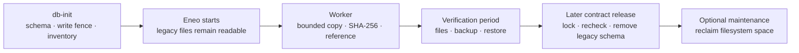

# Upgrade Legacy File and Icon Storage

import { Callout, Steps } from "nextra/components";

## TL;DR

- This is a **one-time adoption** of File and Icon bytes written by older Eneo
  releases. New uploads already use the object-content model.
- Older releases split byte storage, integrity, limits, and cleanup across File
  and Icon code and environment settings. The adoption brings existing data
  under one object-content owner. PostgreSQL remains a complete byte backend;
  S3-compatible storage is optional.
- `db-init` expands the schema and inventories rows. The worker then asks
  PostgreSQL to hash and copy one frozen payload at a time inside the database;
  it does not stream the payload through Python. Eneo can stay available while
  this runs. Inline work starts automatically up to a stable 5 GiB estimate;
  larger sets wait for an explicit capacity decision. This release does not
  adopt legacy bytes directly to object storage, so adoption waits if that
  target is selected.
- Plan free database-host disk from the reported legacy payload estimate. As a
  conservative starting point, use **2.5 times that estimate** when retained WAL
  is unknown.
- Run the upgrade at a quiet time for large installations. At the default
  one-minute cadence, representative examples take about 16 minutes for 1 GiB
  and 2 hours 45 minutes for 10 GiB. These are planning examples, not minimum
  and maximum times.
- Do not delete the old columns after the worker finishes. Keep them through a
  verification period and a tested restore. A later contract release removes
  them after a fail-closed reference check; physical disk reclamation is a
  separate operator job.

## What this changes

Older releases stored File and Icon payloads and related rules across product
rows, separate code paths, and environment settings. Changes to integrity,
size limits for file, image, and audio uploads, cleanup, or storage placement
therefore had to be coordinated in several places.

Current code gives each concern one owner. File and Icon keep the product
meaning and usage. Object content owns durable bytes, SHA-256 integrity, exact
size, lifecycle, and physical location. **Admin > Storage** owns the shared
upload limits and placement choice, so administrators can change them without
editing scattered environment settings and restarting Eneo.

The upgrade adopts the old rows once so Eneo does not have to maintain two file
models indefinitely. It also lets optional S3-compatible storage use the same
verified content model instead of adding another File- or Icon-specific path.
S3 is not required: PostgreSQL inline is a complete placement for bytes managed
by that model.



## Before you upgrade

Use a quiet evening or maintenance window when the reported legacy payload is
large. The online phase is deliberately throttled, but it still adds database
I/O, WAL, and backup volume. Small installations can run during normal hours if
a production-size test shows acceptable latency.

<Callout type="warning">
  A test or development database that already completed the former unreleased
  `202607231700` migration must restore its pre-upgrade backup before using this
  migration chain. Alembic cannot distinguish two implementations with the same
  revision ID. Do not stamp past it.
</Callout>

<Steps>
### Test the complete path

Restore a recent production backup in a test environment. Run the same release,
Compose files, and storage policy that production will use. Confirm old File and
Icon downloads before and after adoption. External PostgreSQL databases must
report `UTF8` from `SHOW server_encoding;`; the worker halts before converting
legacy text when that invariant is not met.

### Choose the rollback point

Drain old jobs, stop every old backend and worker, then take the pre-upgrade
recovery point. Inline-only deployments need PostgreSQL. If any authoritative
content is in object storage, take a matching PostgreSQL and object-store backup
and label them as one restore point.

Follow the exact stop and deployment commands in [Deploy Eneo: Updating
Eneo](/guides/deployment#updating-eneo).

### Check disk before the worker starts

The 5 GiB automatic threshold is not a free-space detector. An inline set at or
below the threshold starts automatically after admission. A larger set waits
for explicit acknowledgement. To inspect the final estimate before **any**
copy, set this in `env_backend.env` before starting the new worker:

```dotenv
FILE_ICON_BACKFILL_AUTO_INLINE_MAX_BYTES=0
```

The worker will classify the inventory, then log `waiting_for_capacity` without
making old files unavailable. Use its warning and the query below to get the
stable payload estimate before acknowledging any copy.

### Deploy without old writers

Run the schema upgrade with the old backend and worker stopped. Start only the
new release after `db-init` succeeds. Do not use a rolling deployment across the
legacy write fence.

</Steps>

## Plan disk and duration

### Disk: use the affected bytes, not total database size

Let `L` be the worker's final estimate of legacy File/Icon payloads that still
need adoption.

| Capacity                             | Simple planning rule                                                                  |
| ------------------------------------ | ------------------------------------------------------------------------------------- |
| New persistent PostgreSQL allocation | About `L` for the verified inline copy                                                |
| Free database-host disk              | Start with at least `L + peak retained WAL + safety margin`                           |
| When retained WAL is unknown         | Use `2.5 × L` free as a conservative starting point, then validate on a restored copy |
| Backup or replica storage            | Plan separately when it uses another volume or host                                   |

Example: a 200 GB database with 10 GB of affected legacy payload does **not**
need another 200 GB. Expect about 10 GB of new persistent payload allocation.
If WAL retention is unknown, start planning from roughly 25 GB free on the
database host. A replication slot, WAL archive, or backup written to the same
disk can require more.

Use this query for the capacity decision only after setting the automatic
threshold to zero and seeing `waiting_for_capacity` in the worker log. Run it on
demand, not as a frequent monitor:

```sql
SELECT count(*) FILTER (WHERE state = 'pending') AS pending_items,
       count(*) FILTER (WHERE state = 'ready') AS ready_items,
       pg_size_pretty(
           coalesce(sum(payload_size_estimate)
               FILTER (WHERE state = 'ready'), 0)::bigint
       ) AS ready_payload_estimate,
       coalesce(sum(payload_size_estimate)
           FILTER (WHERE state = 'ready'), 0)::bigint
           AS ready_payload_bytes
FROM file_icon_backfill_items;
```

Wait until `pending_items` is zero before treating `ready_payload_bytes` as the
stable capacity decision. Then set
`FILE_ICON_BACKFILL_INLINE_CAPACITY_ACK=<ready_payload_bytes>` and recreate the
worker. The acknowledgement records an operator decision; it does not reserve
disk.

If a campaign is already `active`, this query excludes leased and completed
bytes and no longer represents its original capacity requirement. Use the
[detailed remaining-work query](https://github.com/eneo-ai/eneo/blob/develop/docs/deployment/OBJECT_CONTENT.md#upgrade-and-rollback)
and current free disk to monitor active work.

### Time: measure offline inventory and estimate online adoption

There are two different clocks:

- `db-init` performs schema work and installation-wide metadata-only inventory
  in separately committed variant groups. The API stays closed during this
  phase. It no longer copies or hashes every payload, but its duration still
  depends on row count and database performance. Measure it on the restored
  production copy.
- The worker first admits up to 200 ledger rows, then adopts at most 200 rows or
  128 MiB per scheduled run. It normally runs once per minute.

A useful default estimate is:

```text
minutes ≈ ceil(items / 200)
        + max(ceil(payload MiB / 128), ceil(items / 200))
```

| Example legacy set                           | Approximate online worker time |
| -------------------------------------------- | ------------------------------ |
| 1 GiB in about 1,600 items                   | About 16 minutes               |
| 5 GiB in about 8,000 similarly sized items   | About 1 hour 20 minutes        |
| 10 GiB in about 16,000 similarly sized items | About 2 hours 45 minutes       |

These are scheduling examples, not minimum or maximum times, and exclude
`db-init`. Many small items hit the row bound; large items hit the byte bound.
The one-minute cadence deliberately leaves room for normal traffic, while slow
storage, retries, checkpoints, and foreground load can add time.

Do not add CPU or RAM only because of these examples. First confirm ordinary
headroom and monitor database I/O, WAL, free disk, CPU, worker memory, and API
latency on the restored production copy. PostgreSQL checks the exact logical
size before doing the more expensive SHA-256 and copy, so an oversized item is
rejected without hashing its payload. Accepted inline bytes are copied inside
PostgreSQL; the Python worker does not load them. Memory is therefore bounded by
one item rather than the complete legacy set. Extra CPU or faster storage helps
only when a batch cannot finish comfortably before the next scheduled run or
when foreground work is already resource-constrained.

Do not increase the batch defaults only to shorten the window. First test a
production-size restore with representative traffic and measure API p95/p99,
database CPU and I/O, WAL/checkpoints, free disk, and batch duration.

<Callout type="info">
  As a reference, PostgreSQL 13 copied and verified a 10 GiB test set in about
  331 seconds of active work. The normal cadence stretched that to about 2 hours
  42 minutes. Worker memory stayed near 140 MiB, no PostgreSQL temporary files
  were written, and the final payload check found no mismatch. This validates
  the bounded design; use a restored copy to forecast another server.
</Callout>

The main throughput lever is cadence, not parallel PostgreSQL workers. Keep the
defaults unless a restored-production canary shows that higher bounds preserve
API latency, memory, I/O, WAL, and checkpoint behavior. Do not disable planner
features globally to speed up this one-time job.

## Run and monitor

The application can serve frozen legacy content while the worker runs, waits,
or is paused. New uploads use the selected object-content target immediately;
they do not write back to legacy columns.

```bash
docker compose logs --since=30m worker \
  | grep "File/Icon legacy backfill"
```

| State                      | Meaning and next action                                                                     |
| -------------------------- | ------------------------------------------------------------------------------------------- |
| `active`                   | Admission or adoption is progressing. Monitor disk, WAL, I/O, errors, and API latency.      |
| `waiting_for_capacity`     | Eneo is available. Check the estimate and disk, then acknowledge or add capacity.           |
| `waiting_for_object_store` | This release cannot adopt legacy bytes directly to object storage. Follow the choice below. |
| `halted`                   | An item or destination needs operator action. Fix the logged cause before resuming.         |
| `complete`                 | Every item is adopted or safely cancelled because its owner was deleted.                    |

For `waiting_for_object_store`, either wait for a compatible release or select
**PostgreSQL inline** in **Admin > Storage**. Selecting inline also changes the
target for eligible new uploads and may lead to the capacity decision above.
Keep inline selected until the campaign is `complete`; changing the target
earlier halts the campaign. Then reselect object storage and queue verified
moves for content that should be remote.

After a campaign starts, inspect its durable state with:

```sql
SELECT target_kind, state, halt_reason, resume_revision, resume_cursor_id
FROM file_icon_backfill_campaign;
```

For full remaining-count and failed-item queries, use the [detailed deployment
runbook](https://github.com/eneo-ai/eneo/blob/develop/docs/deployment/OBJECT_CONTENT.md#upgrade-and-rollback).

## Pause, low disk, or rollback

### Pause or respond to low disk

Stop the worker first:

```bash
docker compose stop worker
```

An in-flight bounded item may finish. Committed items stay committed, leases
expire safely, and old content remains readable. Stopping this worker also
pauses other background jobs.

If free disk continues to fall because users are creating new content, stop or
block new writes as well. Add capacity or restore the current release's matching
backup before resuming. Do not delete ledger rows, legacy columns, object
content, or the database write fence to make space.

### Roll back the release

The supported rollback is a coordinated restore, not Alembic downgrade:

1. Stop traffic, backend, workers, and the optional object store.
2. Restore the pre-upgrade PostgreSQL backup and, when used, its matching object
   store snapshot.
3. Start the matching old images with the old configuration.

This discards writes accepted after that recovery point. Once the new release
has accepted writes, prefer forward recovery unless that data loss is accepted.
Do not use `alembic stamp`, remove the trigger, or start an old writer against
the expanded schema.

## Verify and clean up

Worker completion opens a verification period; it does not delete the old
bytes. This preserves a recovery source while operators test real files and a
current restore.

1. Confirm campaign state `complete` and no `pending`, `ready`, `leased`, or
   `failed` ledger rows.
2. Download representative old text, PDF/image, audio/transcription, and Icon
   content through normal product workflows.
3. Create and restore-test a current backup. Use a paired PostgreSQL/object-store
   restore when any authoritative content is remote.
4. Keep the pre-upgrade recovery point until the restore succeeds and your
   retention policy permits removal.
5. Install the later contract release during a planned window. Its migration
   must lock and recheck every surviving File/Icon reference as `available` in
   the same transaction that drops legacy columns. Ledger completion alone is
   not enough.
6. Reclaim filesystem space only if measurements justify it.

Dropping legacy columns is metadata-only in PostgreSQL. Ordinary `VACUUM` makes
space reusable inside the database but normally does not shrink the table files.
Choose one tested physical rewrite after the contract release:

- [`pg_repack`](https://github.com/reorg/pg_repack/blob/master/doc/pg_repack.rst)
  minimizes blocking but needs the extension, a short final lock, and temporary
  free disk of roughly twice the target tables and indexes.
- `VACUUM (FULL, ANALYZE) files;` and
  `VACUUM (FULL, ANALYZE) icons;` are simpler but exclusively lock and rewrite
  each table. Stop APIs and workers for that maintenance window.

Physical reclamation stays manual because acceptable downtime and available
working disk differ by installation. Eneo must not hide a long table rewrite in
`db-init` or application startup.

## FAQ

### Why is this required when we do not use S3?

The target can be PostgreSQL inline. The migration is about one durable content
identity, integrity, owner-reference, and cleanup model, not about S3. Keeping
the old File/Icon columns as a permanent second model would preserve the
technical debt that caused the difficult upgrade.

### Is this one-time work?

Yes. It adopts payloads written by older releases. New uploads already use
object content and do not enter the legacy columns. A later explicit move from
PostgreSQL to object storage is a different, verified storage operation.

### Does the application stay available?

After the coordinated schema and inventory phase, yes. Existing content falls
back to the frozen legacy bytes until its verified reference exists. Large
deployments should still start the work at a quiet time because online does not
mean free of I/O or WAL load.

### Can we pause and continue tomorrow?

Yes. Stop the worker. Completed batches remain committed and the same release
resumes from durable ledger and lease state. Other background jobs pause too.

### What happens if disk runs low?

Stop the worker, stop new writes if necessary, and add capacity or restore the
coordinated backup. Do not delete old or new payload rows manually. For future
upgrades on tight disks, set the automatic threshold to zero and approve the
stable estimate before copying.

### Why are old bytes not deleted immediately?

They are the recovery source during verification. The later contract release
performs the final locked live-reference check before it removes the columns.
Filesystem space is reclaimed separately because a table rewrite has its own
lock, time, and temporary-disk requirements.

## Related guides

- [Deploy Eneo](/guides/deployment)
- [Choose Content Storage](/guides/object-content-storage)
- [Object Content Architecture](/docs/object-content-architecture)
- [Detailed deployment runbook](https://github.com/eneo-ai/eneo/blob/develop/docs/deployment/OBJECT_CONTENT.md#upgrade-and-rollback)
