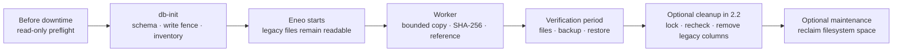

# Upgrade Legacy File and Icon Storage

import { Callout, Steps, Tabs } from "nextra/components";

## TL;DR

Older Eneo versions kept uploaded files and icons directly in database
columns. Eneo 2.2 moves them into the shared content store, which checks every
file's integrity and can later use S3-compatible storage if you want it.
**Every installation that has files or icons from an older version needs this
one-time migration, including installations that only use PostgreSQL.** S3 is
not required.

What happens, in order:

1. **Before the maintenance window.** Run the read-only
   [preflight](#run-preflight-before-downtime) with the new image. It tells you
   how much data will be copied. Use the [disk-planning
   section](#disk-use-the-affected-bytes-not-total-database-size) to reserve
   space for the copied content, database overhead, WAL, and normal operation,
   and rehearse the whole upgrade on a restored backup.
2. **In the maintenance window.** Stop Eneo, take a backup, deploy 2.2, and let
   `db-init` finish before opening the API. Use the commands in
   [Deploy Eneo](/guides/deployment#updating-eneo).
3. **After the start.** Eneo serves old files from the old columns while a
   background worker copies them into the content store. Up to 5 GiB starts by
   itself; a larger set waits until you [confirm the disk
   capacity](#read-migration-status).
4. **Watch and verify.** Follow [status](#read-migration-status), disk, and WAL.
   When the status says `complete`, open a few old files and restore-test a
   fresh backup.
5. **Optional: clean up.** Run the [cleanup command](#verify-and-clean-up) to
   remove the old columns, then reclaim disk with a table rewrite if it is
   worth it. Eneo 2.2 runs fine with the old columns in place; you choose when.

## What this changes

Older releases stored File and Icon payloads and related rules across product
rows, separate code paths, and environment settings. Changes to integrity,
size limits for file, image, and audio uploads, cleanup, or storage placement
therefore had to be coordinated in several places.

Current code gives each concern one owner. File and Icon keep the product
meaning and usage. Object content owns durable bytes, SHA-256 integrity, exact
size, lifecycle, and physical location. **Admin > File storage** owns the shared
upload limits and placement choice, so administrators can change them without
editing scattered environment settings and restarting Eneo.

The upgrade adopts the old rows once so Eneo does not have to maintain two file
models indefinitely. It also lets optional S3-compatible storage use the same
verified content model instead of adding another File- or Icon-specific path.
S3 is not required: PostgreSQL inline is a complete placement for bytes managed
by that model.



## Before you upgrade

Use a quiet evening or maintenance window when the reported legacy payload is
large. The online phase is deliberately throttled, but it still adds database
I/O, WAL, and backup volume. Small installations can run during normal hours if
a production-size test shows acceptable latency.

<Callout type="warning">
  A test or development database that started or completed the former unreleased
  `202607231700` migration or an earlier form of `202607231745` must restore its
  pre-upgrade backup before using this migration chain. The inventory commits
  groups independently, and a rerun keeps existing rows. Alembic records
  revision IDs, not later code changes behind those IDs. Do not stamp past them.
</Callout>

<Steps>
### Run preflight before downtime

Point the Compose `worker` service at the intended new release image and keep
the current database settings. Use the same Compose files and profile as the
deployment. Pull the image, then run only the preflight command while the old
services are still available:

```bash
docker compose pull worker
docker compose run --rm --no-deps -T --entrypoint python worker \
  -m eneo.object_content.file_icon_migration preflight --timeout-seconds 60 \
  > file-icon-preflight.json
```

The entrypoint override runs the inspection without starting a worker, running
`db-init`, or starting its dependencies. An existing worker from the old release
does not contain this command, so use `run` with the new image before the upgrade.
After deployment, `exec worker` can run it in the current worker container.

Preflight checks the installed revision, required schema shape and UTF8 encoding,
then counts legacy File and Icon variants using their logical byte lengths.
It reports the largest remaining item, items over
`OBJECT_CONTENT_INLINE_MAXIMUM_BYTES`, and counts in fixed size bands: empty,
up to 1 MiB, over 1–16 MiB, over 16–200 MiB, and over 200 MiB. Available content
references are excluded from the remaining estimate; failed references are not.
No payloads are fetched or hashed, and no capacity is approved or data changed.

The command writes one JSON result to stdout with `format_version: 1`. Check its
exit code as well as the report:

| Exit code | `outcome` | Required action |
| --- | --- | --- |
| `0` | `ready` | Metadata checks passed. Plan disk/WAL headroom and test the upgrade before proceeding. |
| `2` | `blocked` | Resolve the reported `blockers`: unsupported schema/encoding, oversized items, an incompatible storage target, or a halted campaign. |
| `3` | `incomplete` | The inspection did not finish or configuration is invalid. Check connectivity, read permissions and locks; increase `--timeout-seconds` for an intentionally longer scan. |

Resolve oversized items before adoption. Raising the inline ceiling also raises
the possible database memory demand; test capacity and use matching backend and
worker settings. Direct legacy-to-S3 adoption is unsupported. Keep PostgreSQL
inline selected through completion, then use verified moves if needed.

`capacity.remaining_logical_bytes` is the remaining copy estimate.
`campaign_admitted_logical_bytes`, when present, is cumulative exposure already
accepted by an existing campaign; it can include completed or replacement copies.
Do not add it to the remaining estimate as a new requirement. Physical database
growth, generated WAL, retained WAL and host free bytes are separate fields with
`null` values because this scan cannot determine them. Use the
[disk planning procedure](#disk-use-the-affected-bytes-not-total-database-size)
to measure them and preserve operating headroom.

Before the write fence, normal traffic can change these facts. The report is an
estimate from one read-only snapshot, not a reservation or an upgrade guarantee.
Recheck [migration status after admission](#read-migration-status) for the
worker's actual capacity decision. This is an on-demand scan of source-row
metadata, with a total deadline and a two-second lock timeout; it still consumes
database I/O. Do not poll it frequently. Matching schema and revision IDs cannot
prove which earlier unreleased migration code was applied; the restore warning
above still applies.

### Test the complete path

Restore a recent production backup in a test environment. Run the same release,
Compose files, and storage policy that production will use. Confirm old File and
Icon downloads before and after adoption. External PostgreSQL databases must
report `UTF8` from `SHOW server_encoding;`; the worker halts before converting
legacy text when that invariant is not met.

### Choose the rollback point

Drain old jobs, stop every old backend and worker, then take the pre-upgrade
recovery point. Inline-only deployments need PostgreSQL. If any authoritative
content is in object storage, take a matching PostgreSQL and object-store backup
and label them as one restore point.

Follow the exact stop and deployment commands in [Deploy Eneo: Updating
Eneo](/guides/deployment#updating-eneo).

### Choose the capacity path

Keep the standard 5 GiB threshold unless the deployment requires approval before
**every** inline copy. A smaller ready set starts automatically; a larger set
finishes admission and waits without making old files unavailable.

For the stricter path, set this in `env_backend.env` before starting the new
worker:

```dotenv
FILE_ICON_BACKFILL_AUTO_INLINE_MAX_BYTES=0
```

This is optional, not a normal upgrade requirement. In both paths, the worker
logs `waiting_for_capacity` with the exact acknowledgement when a decision is
required.

### Deploy without old writers

Run the schema upgrade with the old backend and worker stopped. Start only the
new release after `db-init` succeeds. Do not use a rolling deployment across the
legacy write fence.

</Steps>

## Plan disk and duration

### Disk: use the affected bytes, not total database size

Use these values:

- `L`: the worker's exact logical bytes still requiring an inline copy.
- `D`: expected physical database growth for that copy.
- `W_now`: WAL currently stored on the same volume.
- `W_peak`: highest simultaneous WAL use expected during the run.
- `M`: the free-space floor the operator wants to preserve for normal service.

The capacity check is:

```text
free space now >= D + max(W_peak - W_now, 0) + M
```

This does not count the whole database, WAL already occupying the volume, or
WAL generated and recycled over time. Keep backup and replica capacity separate
when they use another volume or host.

Put simply, the affected file bytes are roughly doubled until the later
cleanup and table rewrite: existing `L` plus new `D`. Capacity planning asks how much
**additional** free space the new copy and simultaneous WAL growth need; it does
not count the already allocated `L` a second time.

<Callout type="info">
  **Measured planning evidence:** with random 640 KiB payloads, the 1 GiB and 10
  GiB tests used about `1.043 x L` and `1.041 x L` of new database allocation.
  For a similar payload profile, `D = 1.05 x L` is therefore a useful first
  estimate. The 10 GiB test also generated about 11 GiB of WAL over the complete
  run, but did not measure a 25 GiB simultaneous peak or prove that 25 GiB must
  be free. Many small payloads or different PostgreSQL storage settings can
  change the database overhead, so confirm `D` on a restored copy when the
  margin is tight.
</Callout>

There is no safe fixed multiplier for the complete calculation when WAL
retention is unknown or unbounded. On a production-equivalent restored copy,
record database size, `pg_wal` size, and free disk before the first copy and at
their peaks. Reproduce production slots, archiving, volumes, and representative
traffic before setting the acknowledgement.

Check current local WAL and replication-slot retention in `psql`:

```sql
SELECT current_setting('max_wal_size') AS max_wal_size,
       pg_size_pretty(
           coalesce((SELECT sum(size) FROM pg_ls_waldir()), 0)::bigint
       ) AS current_pg_wal_size;

SELECT slot_name,
       active,
       pg_size_pretty(
           pg_wal_lsn_diff(pg_current_wal_lsn(), restart_lsn)::bigint
       ) AS retained_wal
FROM pg_replication_slots
WHERE restart_lsn IS NOT NULL
ORDER BY slot_name;

SELECT failed_count,
       last_failed_time,
       last_archived_time,
       stats_reset
FROM pg_stat_archiver;
```

`max_wal_size` is a soft checkpoint target, not a WAL cap. The archiver counters
are cumulative since `stats_reset`; compare the latest failed and successful
times to see whether archiving recovered. A large or growing slot, an unresolved
archive failure, or an unknown WAL volume must be resolved or included in the
capacity plan. `pg_ls_waldir()` normally requires superuser or `pg_monitor`
privileges. These queries do not measure an external archive or replica volume.

Use this query after seeing `waiting_for_capacity`. It reports `L` and the
benchmark-derived `1.05 x L` estimate for `D`. Run it on demand, not as a
frequent monitor:

```sql
WITH capacity AS (
    SELECT count(*) FILTER (WHERE state = 'pending') AS pending_items,
           count(*) FILTER (WHERE state = 'ready') AS ready_items,
           coalesce(sum(payload_size_estimate)
               FILTER (WHERE state = 'ready'), 0)::bigint
               AS ready_payload_bytes
    FROM file_icon_backfill_items
)
SELECT pending_items,
       ready_items,
       ready_payload_bytes,
       pg_size_pretty(ready_payload_bytes) AS ready_payload_size,
       ceil(ready_payload_bytes::numeric * 1.05)::bigint
           AS benchmark_profile_db_growth_bytes,
       pg_size_pretty(
           ceil(ready_payload_bytes::numeric * 1.05)::bigint
       ) AS benchmark_profile_db_growth_size
FROM capacity;
```

Wait until `pending_items` is zero before treating `ready_payload_bytes` as a
stable cross-check. Copy the required byte count from the worker's
`waiting_for_capacity` warning and set
`FILE_ICON_BACKFILL_INLINE_CAPACITY_ACK` to at least that value, then recreate
the worker. The warning remains authoritative during recovery because
replacement copies can increase the cumulative requirement beyond the current
ready set. The acknowledgement records an operator decision; it does not detect
or reserve disk.

```dotenv
FILE_ICON_BACKFILL_INLINE_CAPACITY_ACK=<reported_required_bytes>
```

The worker reads this value at process startup. Recreate only the maintenance
worker, using the same Compose files and profile as the deployment. The reference
service is named `worker`; split deployments may use another service name.

<Tabs
  items={["PostgreSQL inline or external endpoint", "Bundled object store"]}
>
  <Tabs.Tab>

```bash
docker compose up -d --force-recreate --no-deps worker
```

  </Tabs.Tab>
  <Tabs.Tab>

```bash
docker compose \
  --profile object-content \
  -f docker-compose.yml \
  -f docker-compose.object-content.yml \
  up -d --force-recreate --no-deps worker
```

  </Tabs.Tab>
</Tabs>

Completed batches and campaign state are stored in PostgreSQL. Recreating the
worker resumes them; it does not restart the adoption. A platform that can only
redeploy the whole stack may do so, but the API has a short interruption. Do not
rerun `db-init` only to apply this acknowledgement.

If a campaign is already `active`, this query excludes leased and completed
bytes and no longer represents its original capacity requirement. Use the
[detailed remaining-work query](https://github.com/eneo-ai/eneo/blob/develop/docs/deployment/OBJECT_CONTENT.md#upgrade-and-rollback)
and current free disk to monitor active work.

### Time: measure offline inventory and estimate online adoption

There are two different clocks:

- `db-init` performs schema work and installation-wide metadata-only inventory
  in separately committed variant groups. The API stays closed during this
  phase. It no longer copies or hashes every payload, but its duration still
  depends on row count and database performance. Measure it on the restored
  production copy.
- The worker first admits up to 200 ledger rows, then adopts at most 200 rows or
  128 MiB per scheduled run. It normally runs once per minute.

A useful default estimate is:

```text
admission runs = ceil(items / 200)
copy runs      = max(ceil(payload MiB / 128), ceil(items / 200))
scheduled runs = admission runs + copy runs - 1
```

- **About 1 GiB in 1,639 measured items:** 17 scheduled runs, about 16 minutes.
- **5 GiB in about 8,000 similarly sized items:** about 1 hour 19 minutes.
- **10 GiB in 16,384 measured items:** 163 scheduled runs, about 2 hours 42
  minutes.

The last admission run can perform the first copy, which accounts for the minus
one. These are scheduling examples, not minimum or maximum times, and exclude
`db-init`. Many small items hit the row bound; large items hit the byte bound.
The worker runs at startup and then once per minute. Slow storage, retries,
checkpoints, and foreground load can add time.

Do not add CPU or RAM only because of these examples. First confirm ordinary
headroom and monitor database I/O, WAL, free disk, CPU, worker memory, and API
latency on the restored production copy. PostgreSQL checks the exact logical
size before doing the more expensive SHA-256 and copy, so an oversized item is
rejected without hashing its payload. Accepted inline bytes are copied inside
PostgreSQL; the Python worker does not load them. Memory is therefore bounded by
one item rather than the complete legacy set. Extra CPU or faster storage helps
only when a batch cannot finish comfortably before the next scheduled run or
when foreground work is already resource-constrained.

Do not increase the batch defaults only to shorten the window. First test a
production-size restore with representative traffic and measure API p95/p99,
database CPU and I/O, WAL/checkpoints, free disk, and batch duration.

<Callout type="info">
  As a reference, PostgreSQL 13 copied and verified a 10 GiB test set in about
  310 seconds of active work. The normal cadence projects to about 2 hours 42
  minutes. Worker memory peaked near 141 MiB, no PostgreSQL temporary files were
  written, and the final payload check found no mismatch. This validates the
  bounded design; use a restored copy to forecast another server.
</Callout>

A fresh PostgreSQL 13 check on 7 September 2026 copied about 1 GiB across 1,639
items in **36.5 seconds of active work** at the default batch bounds. The 17
runs project to about **16 minutes** at the normal cadence. Worker peak memory
was 140 MiB, generated WAL was 1.08 GiB, additional database allocation was
1.04 GiB, and all payload digests matched. These are separate measurements:
generated WAL is not the peak amount retained on disk at once.

An additional small test exercised authenticated uploads, legacy downloads,
and new-original downloads through the production API routes while adoption
ran. All 19 foreground rounds and the final byte checks passed. It used an
in-process HTTP client, 20 legacy items totaling less than 1 MiB, and ten copy
batches; it proves those request paths remain correct during adoption, not
production latency under load. The resource benchmark's concurrent probe was
only a metadata SQL query (p95 4.6 ms), not an HTTP request.

The [recorded workload and results](https://github.com/eneo-ai/eneo/blob/develop/docs/deployment/benchmarks/file-icon-migration-pg13-20260907.json)
include the pinned PostgreSQL image and source hashes. Both tests used a shared
development machine. Neither measures the offline `db-init` phase, ingestion or
model-provider load, replicas, backup retention, or a production-size restore.
Use the following checklist to qualify those parts for the organization.

The main throughput lever is cadence, not parallel PostgreSQL workers. Keep the
defaults unless a restored-production canary shows that higher bounds preserve
API latency, memory, I/O, WAL, and checkpoint behavior. Do not disable planner
features globally to speed up this one-time job.

### Record a release-candidate result

Use a restored production backup and record enough evidence to forecast the
live deployment:

- **Inventory:** legacy item count and stable logical payload bytes.
- **Duration:** `db-init`, admission, and adoption time.
- **Database host:** free disk before, lowest free disk, database growth, and WAL
  retention.
- **Runtime load:** database CPU and I/O, worker memory, API latency, and error
  rate.
- **File behavior:** representative old downloads and a new upload plus download.
- **Completion:** campaign state, failed items, and final ledger counts.
- **Recovery:** result of restoring the current backup.

A fast workstation or local SSD is useful for finding defects, but it is not a
duration forecast for another PostgreSQL host. Compare the restored test with
the target host's storage, WAL, replica, and backup configuration.

## Run and monitor

The application can serve frozen legacy content while the worker runs, waits,
or is paused. New uploads use the selected object-content target immediately;
they do not write back to legacy columns.

<Steps>
### Read migration status

```bash
docker compose exec worker python -m eneo.object_content.file_icon_migration status
```

Use the same Compose files and profile as the deployment. The reference service
is named `worker`; split deployments may call it the maintenance worker. Run the
command there so it reads the same database and capacity settings as that worker.
The command returns a read-only snapshot and never starts migration work.

| Status field | What to do |
| --- | --- |
| `state: preparing` | Let the worker finalize metadata. Required bytes remain unknown until this finishes. |
| `state: waiting_for_capacity` | Reserve PostgreSQL and WAL headroom, then set `FILE_ICON_BACKFILL_INLINE_CAPACITY_ACK` in `env_backend.env` to at least `capacity_required_bytes` and recreate the worker with `docker compose up -d --force-recreate worker`. |
| `state: waiting_for_object_store` | Select PostgreSQL inline for this migration, as described below. |
| `state: active` | Monitor disk, WAL, errors, and API latency while batches finish. |
| `state: halted` | Read `detail` and fix the cause. Clearing pause alone does not recover a halted campaign. |
| `state: complete` | Perform the verification and backup checks below. |
| `paused: true` | No new migration work will be claimed. Use `resume` when ready; the underlying `state` and `detail` remain visible. |

Before a campaign starts, this command may sum ledger metadata to report
capacity. Run it on demand rather than polling it frequently. It does not read
payload bytes. After a campaign starts, `capacity_admitted_bytes` reports its
accepted cumulative exposure; `capacity_required_bytes` is null.

For recent worker activity:

```bash
docker compose logs --since=30m worker \
  | grep "File/Icon legacy backfill"
```

`waiting_for_capacity` means the application is available while the worker waits
for the exact acknowledgement. `waiting_for_object_store` means this release
cannot adopt legacy bytes directly to the selected remote target.

### Check ledger progress

Run this SQL in `psql` on demand. It reads ledger metadata, not payload bytes:

```sql
SELECT count(*) FILTER (WHERE state = 'pending') AS pending_items,
       count(*) FILTER (WHERE state = 'ready') AS ready_items,
       count(*) FILTER (WHERE state = 'leased') AS leased_items,
       count(*) FILTER (WHERE state = 'failed') AS failed_items,
       count(*) FILTER (WHERE state = 'done') AS done_items,
       count(*) FILTER (WHERE state = 'cancelled') AS cancelled_items,
       round(
           100.0 * count(*) FILTER (
               WHERE state IN ('done', 'cancelled')
           ) / nullif(count(*), 0),
           1
       ) AS finished_percent,
       pg_size_pretty(
           coalesce(sum(payload_size_estimate) FILTER (
               WHERE state NOT IN ('done', 'cancelled')
           ), 0)::bigint
       ) AS estimated_remaining_size
FROM file_icon_backfill_items;
```

During admission, `pending` decreases and `ready` increases. During adoption,
`ready` decreases and `done` increases. A persistent `failed` state needs
operator action.

### Check the campaign decision

```sql
SELECT target_kind,
       state,
       halt_reason,
       capacity_admitted_bytes,
       resume_revision
FROM file_icon_backfill_campaign;
```

No campaign row while the worker prepares admission or waits for capacity or
object storage is normal; the status command and worker log explain those states.

- **`active`:** admission or adoption is progressing. Monitor disk, WAL, I/O,
  errors, and API latency.
- **`halted`:** an item or destination needs operator action. Fix the logged cause
  before resuming.
- **`complete`:** every item is adopted or safely cancelled because its owner was
  deleted.

</Steps>

For `waiting_for_object_store`, select **PostgreSQL inline** in **Admin > File storage**.
Selecting inline also changes the
target for eligible new uploads and may lead to the capacity decision above.
Keep inline selected until the campaign is `complete`; changing the target
earlier halts the campaign. Then reselect object storage and queue verified
moves for content that should be remote.

Treat `campaign.state = 'complete'` together with no `pending`, `ready`,
`leased`, or `failed` item as completion evidence. The worker may emit no new
backfill log after completion, so an empty grep result is not proof of failure.

For full remaining-count and failed-item queries, use the [detailed deployment
runbook](https://github.com/eneo-ai/eneo/blob/develop/docs/deployment/OBJECT_CONTENT.md#upgrade-and-rollback).

## Pause, low disk, or rollback

### Pause or respond to low disk

Pause new migration work using the same Compose files and profile as the deployment:

```bash
docker compose exec worker python -m eneo.object_content.file_icon_migration pause
```

A bounded batch already claimed may finish. The pause persists across worker
restarts; committed items stay committed and old content remains readable. Other
background jobs and ordinary storage moves keep their existing controls.

To allow new migration claims again:

```bash
docker compose exec worker python -m eneo.object_content.file_icon_migration resume
```

This clears only pause. Capacity acknowledgement and recovery from a halt still
apply. For a halted campaign, fix the reported cause, restore its original storage
target if changed, and set `FILE_ICON_BACKFILL_RESUME_REVISION` strictly above
`campaign_resume_revision` before recreating the worker. See the
[recovery runbook](https://github.com/eneo-ai/eneo/blob/develop/docs/deployment/OBJECT_CONTENT.md#upgrade-and-rollback)
for replacement-copy capacity requirements.

If the worker itself must stop immediately, use `docker compose stop worker`;
that also stops its other background jobs. The migration pause is intended to
stop new batches, so allow headroom for a batch already in progress.

If free disk continues to fall because users are creating new content, stop or
block new writes as well. Add capacity or restore the current release's matching
backup before resuming. Do not delete ledger rows, legacy columns, object
content, or the database write fence to make space.

### Roll back the release

The supported rollback is a coordinated restore, not Alembic downgrade:

1. Stop traffic, backend, workers, and the optional object store.
2. Restore the pre-upgrade PostgreSQL backup and, when used, its matching object
   store snapshot.
3. Start the matching old images with the old configuration.

This discards writes accepted after that recovery point. Once the new release
has accepted writes, prefer forward recovery unless that data loss is accepted.
Do not use `alembic stamp`, remove the trigger, or start an old writer against
the expanded schema.

## Verify and clean up

When the worker reports `complete`, Eneo keeps the old columns. They are your
safety net while you check that the migrated content works. Nothing is deleted
until you run the cleanup command yourself.

### Verify the migration

1. Confirm completion. `status` must show `state: complete` and `paused: false`,
   and the [ledger query](#check-ledger-progress) must show zero `pending`,
   `ready`, `leased`, and `failed` items.
2. Open and download a few old files of each kind through the product: a text
   document, a PDF or image, an audio file with its transcription, and an icon.
3. Take a fresh backup and restore it in a test environment. If any content is
   stored in S3-compatible storage, back up the database and the bucket together
   and restore them together.

Keep the pre-upgrade backup until that restore succeeds and your retention
rules allow removing it.

### Decide whether to clean up

Cleanup removes the eight old payload columns from the `files` and `icons`
tables. Run it when the verification above is done and you want the disk space
back or want to close the fallback path. It is optional in 2.2, and it is
permanent: after cleanup, the only way back to the old bytes is your backup.

Before you later upgrade past 2.2, read that version's release notes. They say
whether cleanup must be done first.

### Run the cleanup

Cleanup hashes every remaining old file and its PostgreSQL-inline copy, so it
takes at least as long as reading all of those bytes from PostgreSQL. Do not
estimate it from the adoption run: measure it on the restored copy from the
verification step and plan a maintenance window of that length. For content
stored in S3-compatible storage, cleanup checks the verification data recorded
in the database; it does not read the objects. Verify that the object store is
reachable and that the paired backup exists before you stop Eneo. Eneo must be
stopped for the whole window.

<Steps>
### Stop Eneo

Keep the database running. Stop every backend and worker replica; in split
deployments that includes the maintenance worker. Use the same Compose files,
profile, and settings as the deployment.

```bash
docker compose stop backend worker
```

### Run the command from the same 2.2 image

```bash
docker compose run --rm --no-deps -T --entrypoint python worker \
  -m eneo.object_content.file_icon_migration cleanup
```

### Read the result

A successful run prints:

```json
{
  "legacy_cleaned": true,
  "changed": true,
  "detail": "Legacy columns removed"
}
```

Running it again is harmless and prints `"changed": false`. If a check fails,
the command changes nothing and prints why:

```json
{
  "outcome": "blocked",
  "detail": "File/Icon cleanup refused: adoption has unfinished or leased items. Legacy storage is preserved. ..."
}
```

| Exit code | Meaning | What to do |
| --- | --- | --- |
| `0` | Cleanup finished, or was already done. | Start Eneo and verify. |
| `2` | A prerequisite failed. Nothing was changed. | Fix the reported condition, for example finish adoption or restore the backup, then run it again. |
| `3` | The database could not be reached, the credentials or settings are invalid, or a lock could not be taken within five seconds. | Check that every backend and worker is stopped and the database is up. Then run `status` (see below): if it reports `legacy_cleaned: true`, the cleanup had already committed; otherwise run cleanup again. |

Exit `2` means nothing was changed. Exit `3`, an interrupted command, or missing
output means the outcome is unknown until you check it: in the rare case that the
connection drops while PostgreSQL confirms the commit, the cleanup is complete
even though no result was printed. `status` settles it, and running cleanup
again is always safe:

```bash
docker compose run --rm --no-deps -T --entrypoint python worker \
  -m eneo.object_content.file_icon_migration status
```

Never drop the columns by hand in `psql`.

### Start Eneo and check

```bash
docker compose start backend worker
```

`status` now shows `legacy_cleaned: true`. Download an old file and upload a new
one. `preflight` reports schema state `cleaned`.
</Steps>

<Callout type="info">
**How cleanup protects your data.** The command does all of its work in one
database transaction. It locks the affected tables, refuses if adoption is
paused or unfinished, and compares the size and SHA-256 of every remaining old
file with its PostgreSQL-inline copy; for remote copies it checks the recorded
verification data. Only if every file matches does it remove the columns and
record the cleanup. If any check fails, or the command is
interrupted before that point, the database is left exactly as it was. The one
case where a printed failure and the real outcome can differ is a connection
lost after PostgreSQL has already committed, which is why `status` is the
final word.
</Callout>

### After cleanup

- Eneo reads all content from the content store. The migration commands,
  settings, and ledger stay in 2.2, so `status` keeps working.
- A file that fails an integrity check later can no longer be repaired from the
  old columns. Recover it forward, or restore the pre-cleanup backup, which
  discards everything written after that backup.
- An Alembic downgrade refuses to run after cleanup; the coordinated backup is
  the only way back.

### Reclaim disk space (optional)

Dropping columns does not shrink the table files on disk. The old payload
bytes stay inside the existing rows until the table is rewritten, and a normal
`VACUUM` does not give that space back to the filesystem. First measure whether
a rewrite is worth it:

```sql
SELECT pg_size_pretty(pg_total_relation_size('files')) AS files_total,
       pg_size_pretty(pg_total_relation_size('icons')) AS icons_total;
```

If it is, choose one tested method:

- [`pg_repack`](https://github.com/reorg/pg_repack/blob/master/doc/pg_repack.rst)
  keeps the table readable and writable during most of the rewrite. It still
  needs an exclusive lock at the start and at the end, and by default it cancels
  queries that hold up those locks and eventually terminates their connections.
  Run it with `--no-kill-backend` and a tested `--wait-timeout` if Eneo must stay
  up, or stop Eneo for the run. It needs the extension on the server and the
  client, and temporary free disk of roughly twice the size of the target tables
  and their indexes.
- `VACUUM (FULL, ANALYZE) files;` and `VACUUM (FULL, ANALYZE) icons;` are
  simpler but lock each table completely while it is rewritten and need
  temporary disk for the copy. Stop Eneo for that window, and run the two
  statements one at a time, outside a transaction.

Eneo never runs this rewrite for you, because the acceptable downtime and the
available working disk differ from one installation to the next.

## FAQ

### Do we have to run cleanup?

No. Eneo 2.2 works with the old columns in place. Cleanup gives the disk space
back (after a table rewrite) and removes the fallback read path. Run it when
you are confident in the migrated content and have a tested backup. Check the
release notes before upgrading past 2.2.

### Can Eneo keep running during cleanup?

No. Every backend and worker must be stopped. The command takes exclusive locks
on the affected tables, so a running replica would either block it or keep an
outdated view of the schema until restarted.

### What if cleanup says "blocked"?

Nothing was changed. The message names the condition: adoption not finished,
an item still leased or failed, admission paused, or an old file whose migrated
copy does not match. Fix that condition, for example by finishing adoption or
restoring the coordinated backup, and run the command again.

### Why is this required when we do not use S3?

The target can be PostgreSQL inline. The migration is about one durable content
identity, integrity, owner-reference, and cleanup model, not about S3. Keeping
the old File/Icon columns as a permanent second model would preserve the
technical debt that caused the difficult upgrade.

### Is this one-time work?

Yes. It adopts payloads written by older releases. New uploads already use
object content and do not enter the legacy columns. A later explicit move from
PostgreSQL to object storage is a different, verified storage operation.

### Why is the automatic threshold 5 GiB, and can we change it?

The threshold limits how much unacknowledged PostgreSQL growth a deployment can
start. It is not a free-space detector or a claim that 10 GiB requires 25 GiB
free. The benchmark measured about 10.4 GiB of persistent growth for 10 GiB of
payload; its 11 GiB of generated WAL was written over time and was not a measured
simultaneous disk peak.

The default remains 5 GiB because Eneo cannot know whether the database volume
also retains WAL for replication or archiving. Raising the default to 10 GiB
would let that copy start without an operator checking the deployment. The wait
above 5 GiB is therefore a capacity acknowledgement, not an error or a storage
limit.

For a set above 5 GiB, keep the automatic threshold unchanged and set the exact
`FILE_ICON_BACKFILL_INLINE_CAPACITY_ACK` after checking the host. Set the
automatic threshold to zero only when every non-empty copy must wait for an
operator. Keep other tuning in the [detailed deployment
runbook](https://github.com/eneo-ai/eneo/blob/develop/docs/deployment/OBJECT_CONTENT.md#upgrade-and-rollback).

### Does the application stay available?

The application is designed to serve requests after the coordinated schema and
inventory phase. Existing content falls
back to the frozen legacy bytes until its verified reference exists. Large
deployments should still start the work at a quiet time because online does not
mean free of I/O or WAL load. The small concurrent API check above passed; test
representative traffic on a restored production copy before promising the same
latency for an installation.

### Can we pause and continue tomorrow?

Yes. Use the migration `pause` command, then `resume` when ready. Completed
batches remain committed, and the pause survives worker restarts. A batch already
claimed may finish; other background jobs continue.

### What happens if disk runs low?

Pause migration claims, stop the worker or new writes if necessary, and add capacity or restore the
coordinated backup. Do not delete old or new payload rows manually. For future
upgrades on tight disks, set the automatic threshold to zero and approve the
stable estimate before copying.

### Why are old bytes not deleted immediately?

They are your recovery source while you verify the migrated content. The
cleanup command removes them only after it has checked every remaining file
against its migrated copy. The disk space comes back separately, because
rewriting a table has its own lock, time, and temporary-disk cost.

## Related guides

- [Deploy Eneo](/guides/deployment)
- [Choose Content Storage](/guides/object-content-storage)
- [Object Content Architecture](/docs/object-content-architecture)
- [Detailed deployment runbook](https://github.com/eneo-ai/eneo/blob/develop/docs/deployment/OBJECT_CONTENT.md#upgrade-and-rollback)
