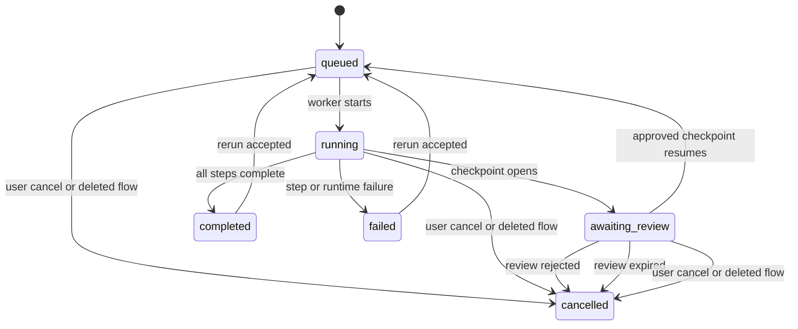

import { Callout } from "nextra/components";

# Integrating Flows

This page is the authoritative guide for building an application on the Eneo Flows runtime API. It covers the whole runtime surface in the order a client calls it: discover a published flow, upload input files, create and start a run, poll it, handle a human review checkpoint, cancel or retry, and download outputs.

You are in the integration step of the consumer journey, where the published design becomes runtime calls and user-facing states.

It is written to be complete on its own. Everything a client needs is stated explicitly: exact paths including trailing slashes, exact header names, exact request bodies, exact status values, and the error codes to branch on. Where a value is deployment-configurable, the page says so and names the endpoint that reports the effective value.

Flows themselves are authored by people in the Eneo Builder. This page never asks you to create or edit a flow; it assumes someone has already published one.

Use the reference for the full field catalog: [Flow Runtime API Reference](/guides/flows-api-guide). Use the [Flow error reference](/guides/flows/reference/errors) for the complete code catalog.

## Before you start

Use your Eneo deployment origin as the base URL. Eneo does not publish a shared hosted origin; every installation has its own, and it is given to you out of band. The live contract for the deployment you target is served by that same origin at `/openapi.json`, with interactive documentation at `/docs`.

Paths in this guide are written under `/api/v1/`, which is the prefix the reference configuration ships. It is an operator setting (`API_PREFIX`), not a constant, so read the prefix once from the paths in that deployment's `/openapi.json`, build your base URL from it, and treat every path below as relative to that base.

Authenticate every request with exactly one credential:

```text
Authorization: Bearer <user-access-token>
```

or:

```text
X-API-Key: <service-key>
```

Keep service keys in server-side code; a browser frontend should use a user access token or call through your own backend. Do not put a service key in the bearer-token header. See [Authentication & OIDC](/guides/authentication) for token setup.

### Rules that break clients when you miss them

These are the parts of the contract that are easy to get subtly wrong. Read them before you write the client.

1. **Trailing slashes are load-bearing.** Every Flow runtime path ends with `/`, with one exception: `GET .../runs/{run_id}/evidence/export` has none. Requesting `/api/v1/flows/{id}/runs` without the slash returns `307 Temporary Redirect` to the slashed path. Some HTTP clients drop the request body or the authentication header when they follow a redirect, so send the exact path.
2. **One credential per request.** `Authorization: Bearer` for a user token, `X-API-Key` for an API key. Never put an API key in the bearer header.
3. **The active-checkpoint endpoint returns `200` with a body of literal `null`** when no checkpoint is open. It is not a `404` and not `{}`. Check for `null` before dereferencing.
4. **Reject requires a `reason`.** `POST .../reject/` takes `expected_checkpoint_revision` and a non-empty `reason` of 1 to 1024 characters. Sending only the revision returns `400 flow_review_reject_reason_required`.
5. **`Idempotency-Key` is required on resume and optional everywhere else.** `POST .../review-checkpoints/{checkpoint_id}/resume/` rejects a request without it (`400 flow_review_idempotency_key_required`). `POST /runs/` accepts it and it is strongly recommended. Edit, approve, and reject do not accept it at all; they use `expected_checkpoint_revision` for concurrency instead. Both accepted keys must be 1 to 255 characters after trimming, or the request returns `400 flow_run_invalid_idempotency_key`. That bound is enforced as a typed error rather than as a JSON Schema `maxLength`, so a validator generated from the OpenAPI document will not catch it for you.
6. **Approve does not resume.** Approving records the decision; the run stays at `awaiting_review` until you call resume.
7. **Edit replaces the whole payload.** `current_payload_json` is a full replacement, not a JSON Patch. Start from the payload the checkpoint returned, change only `text` and, when the step's `output_type` is `json`, `structured`, and resend every other key unchanged. Rebuilding the object from scratch drops runtime-owned keys and returns `400 typed_io_validation_failed`. When the payload carries `text_overflow` the `text` is a frozen preview that must be resent exactly as received; `structured` on that same checkpoint can still be edited.
8. **`GET .../steps/` returns a bare JSON array**, not a pagination envelope. `GET /flows/` and `GET .../runs/` do return envelopes with `items` and `has_more`.
9. **The upload's declared type must be right, and so must its bytes.** The multipart field is named `upload_file`, and that part's own `Content-Type` must be one of the step's `accepted_mimetypes` from the run contract. The server also sniffs the content and rejects a mismatch. Either failure returns `415`, and the response lists every accepted type.
10. **Artifact downloads are two calls.** Ask for a signed URL, then `GET` that URL **without** an authentication header; the tenant is bound into the signature.
11. **Cancel is a no-op on a terminal run.** `POST .../cancel/` on a run that already finished returns `200` with the run unchanged and still `completed` or `failed`. Read `status` from the response instead of assuming it is now `cancelled`. On a live run the status flips before the response returns, but the worker stops asynchronously: a completion-model call in flight is aborted within seconds, while a transcription or outbound HTTP call runs to completion and is honored only at the next step boundary.
12. **An out-of-scope resource returns `403`, not `404`.** Scope is checked before the resource is looked up, so a flow in another space is indistinguishable from one that does not exist. Both give `403 insufficient_scope` with `context.auth_layer: "api_key_scope"`.
13. **`eneo_error_code` is not an identifier.** It is a legacy numeric category derived from the exception class, so unrelated failures share a value and it cannot tell two of them apart. The string `code` is the only field to branch on.

## The run state machine

A run has exactly six statuses. `queued` and `running` are active work, `awaiting_review` means a human review checkpoint is open and nothing advances until it is approved and resumed, and `completed`, `failed`, and `cancelled` are terminal.

<div className="flow-docs-mermaid-figure">



</div>

_Run status transitions. `completed` and `failed` are terminal for the original execution but can re-enter `queued` through an explicit step rerun; `cancelled` cannot._

Do not hardcode this table: `GET /api/v1/flows/runs/status-capabilities/` returns the same matrix as JSON, so a client can drive its UI from the live contract.

| Status            | Active | Keep polling | Terminal | Can cancel | Awaiting review | Can redispatch | Can rerun a step |
| ----------------- | ------ | ------------ | -------- | ---------- | --------------- | -------------- | ---------------- |
| `queued`          | yes    | yes          | no       | yes        | no              | yes            | no               |
| `running`         | yes    | yes          | no       | yes        | no              | no             | no               |
| `awaiting_review` | no     | yes          | no       | yes        | yes             | no             | no               |
| `completed`       | no     | no           | yes      | no         | no              | no             | yes              |
| `failed`          | no     | no           | yes      | no         | no              | no             | yes              |
| `cancelled`       | no     | no           | yes      | no         | no              | no             | no               |

The full state map, including review-checkpoint and rerun-operation states, is on [The run lifecycle](/docs/flows-for-developers/run-lifecycle).

### How to wait for a run

Polling is the only mechanism a caller controls for observing run status, because there is no client-registered subscription, server-sent events stream, or WebSocket. A flow author can design a terminal step that delivers its result over outbound HTTP, and that does signal successful completion to whatever receiver they configured, but it is not something the caller registers and it does not report failure or review states. A workable cadence:

- poll `GET /api/v1/flows/{id}/runs/{run_id}/` every **2 seconds** for the first 30 seconds, then every **5 seconds**, then every **15 seconds** after two minutes
- stop as soon as `should_poll` is false for the current status, meaning the run is `completed`, `failed`, or `cancelled`
- keep polling while the status is `awaiting_review`; a reviewer may act at any time, and the checkpoint can also expire
- cap the total wait with your own deadline. Long audio transcription is minutes, not seconds

### Choose a published Flow

The worked example starts with a known Flow id. If your app needs discovery, call `GET /api/v1/flows/?space_id={space_id}&limit=50&offset=0`. A service key sees only published Flows in its scoped space. `count` is the number of items in the current page, not the total; increase `offset` while `has_more` is true. After choosing an id, `GET /api/v1/flows/{id}/published/` returns the runtime-safe projection and canonical runtime paths. Do not use the draft `GET /api/v1/flows/{id}/` view from a service-key runtime app.

## Sequence overview

Use this table to choose the right runtime journey before you read the detailed endpoint facts below.

| Journey                             | Use it when                                                                                                               | Key endpoint                                                                                                     |
| ----------------------------------- | ------------------------------------------------------------------------------------------------------------------------- | ---------------------------------------------------------------------------------------------------------------- |
| Quickstart                          | Discover the contract, create a run with idempotency, poll status, then read the final result.                            | `GET /api/v1/flows/{id}/run-contract/` (`get_flow_run_contract`)                                                 |
| Files                               | Upload files before run creation and bind returned ids to the step that consumes them.                                    | `GET /api/v1/flows/{id}/run-contract/` (`get_flow_run_contract`)                                                 |
| Evidence and provider usage         | Inspect run evidence, page every provider-call lifecycle row, and export a verified evidence bundle.                      | `GET /api/v1/flows/{id}/runs/{run_id}/evidence/` (`get_flow_run_evidence`)                                       |
| Human-in-the-loop pause and resume  | Runs pause only at review-marked steps and resume through review checkpoint endpoints.                                    | `GET /api/v1/flows/{id}/runs/{run_id}/review-checkpoints/active/` (`get_active_flow_run_review_checkpoint`)      |
| Sending files mid-run               | Eneo Flows does not accept arbitrary file injection while a run is executing.                                             | `PATCH /api/v1/flows/{id}/runs/{run_id}/review-checkpoints/{checkpoint_id}/` (`edit_flow_run_review_checkpoint`) |
| Results                             | Drive the UI from the typed final result, step details, artifact links, and status capabilities.                          | `GET /api/v1/flows/{id}/runs/{run_id}/` (`get_flow_run`)                                                         |
| Reruns                              | Reruns invalidate downstream work and preserve lineage so clients can explain what changed.                               | `POST /api/v1/flows/{id}/runs/{run_id}/steps/{step_id}/rerun/` (`rerun_flow_run_step`)                           |
| Robustness                          | Use idempotency, version pins, cancellation, redispatch, polling backoff, and status capabilities for retry-safe clients. | `POST /api/v1/flows/{id}/runs/` (`create_flow_run`)                                                              |
| Failures                            | Branch on typed `FlowApiErrorCode` values and show the user the specific recovery action.                                 | `GET /api/v1/flows/{id}/runs/{run_id}/` (`get_flow_run`)                                                         |
| Service keys and tenancy guarantees | Service keys can drive published runtime paths inside their scope and cannot inspect another principal's runs.            | `POST /api/v1/flows/{id}/runs/` (`create_flow_run`)                                                              |

## Worked end-to-end example

This example follows an audio-to-report run from contract discovery to final artifact download.

Each response below is a public example for that hop. Use it to understand shape and order; your ids and timestamps will differ.

Endpoint order:

| Hop                         | Endpoint                                                                       | Method  | Success        | Operation                               |
| --------------------------- | ------------------------------------------------------------------------------ | ------- | -------------- | --------------------------------------- |
| Discover contract           | `/api/v1/flows/{id}/run-contract/`                                             | `GET`   | `200 OK`       | `get_flow_run_contract`                 |
| Upload runtime file         | `/api/v1/flows/{id}/steps/{step_id}/runtime-files/`                            | `POST`  | `201 Created`  | `upload_flow_runtime_file`              |
| Create run                  | `/api/v1/flows/{id}/runs/`                                                     | `POST`  | `201 Created`  | `create_flow_run`                       |
| Poll run                    | `/api/v1/flows/{id}/runs/{run_id}/`                                            | `GET`   | `200 OK`       | `get_flow_run`                          |
| Find active review          | `/api/v1/flows/{id}/runs/{run_id}/review-checkpoints/active/`                  | `GET`   | `200 OK`       | `get_active_flow_run_review_checkpoint` |
| Edit review payload         | `/api/v1/flows/{id}/runs/{run_id}/review-checkpoints/{checkpoint_id}/`         | `PATCH` | `200 OK`       | `edit_flow_run_review_checkpoint`       |
| Approve review              | `/api/v1/flows/{id}/runs/{run_id}/review-checkpoints/{checkpoint_id}/approve/` | `POST`  | `200 OK`       | `approve_flow_run_review_checkpoint`    |
| Resume run                  | `/api/v1/flows/{id}/runs/{run_id}/review-checkpoints/{checkpoint_id}/resume/`  | `POST`  | `202 Accepted` | `resume_flow_run_review_checkpoint`     |
| Read final run result       | `/api/v1/flows/{id}/runs/{run_id}/`                                            | `GET`   | `200 OK`       | `get_flow_run`                          |
| List and filter step output | `/api/v1/flows/{id}/runs/{run_id}/steps/`                                      | `GET`   | `200 OK`       | `list_flow_run_steps`                   |
| Fetch final artifact        | `/api/v1/flows/{id}/runs/{run_id}/artifacts/{file_id}/signed-url/`             | `POST`  | `200 OK`       | `generate_flow_run_artifact_signed_url` |

### 1. Discover contract

Request the published run contract before you show upload or form controls.

Request:

```text
GET /api/v1/flows/{id}/run-contract/
```

The response tells your app which inputs, review steps, and final output to expect.

Response:

```json
{
  "flow_id": "00000000-0000-0000-0000-000000000001",
  "published_flow_version": 3,
  "final_output": {
    "step_id": "00000000-0000-0000-0000-000000000104",
    "step_order": 3,
    "label": "Create Word report",
    "output_type": "docx",
    "output_mode": "pass_through",
    "delivery": "artifact",
    "output_contract": null
  },
  "form_fields": [
    {
      "name": "employee_name",
      "type": "text",
      "label": "Employee name",
      "required": true
    }
  ],
  "steps_requiring_input": [
    {
      "step_id": "00000000-0000-0000-0000-000000000101",
      "step_order": 1,
      "label": "Upload audio",
      "description": "Provide the recorded review conversation.",
      "required": true,
      "input_format": "audio",
      "max_files": 1,
      "max_file_size_bytes": 52428800,
      "accepted_mimetypes": ["audio/wav", "audio/mpeg"]
    }
  ],
  "runtime_upload_policy": {
    "min_timeout_seconds": 120,
    "seconds_per_mebibyte": 8,
    "max_timeout_seconds": 600,
    "idle_timeout_seconds": 120
  },
  "steps_requiring_review": [
    {
      "step_id": "00000000-0000-0000-0000-000000000103",
      "step_order": 2,
      "label": "Review transcription",
      "review_mode": "edit",
      "output_type": "json",
      "expires_after_seconds": 1209600,
      "output_contract": {
        "type": "object",
        "properties": {
          "transcription": {
            "type": "string"
          }
        }
      }
    }
  ],
  "aggregate_max_files": 1,
  "template_readiness": [
    {
      "step_id": "00000000-0000-0000-0000-000000000102",
      "template_asset_id": null,
      "template_file_id": null,
      "template_name": null,
      "checksum": null,
      "published_flow_version": 3,
      "status": "unavailable",
      "can_edit": false,
      "can_download": false,
      "message_code": null
    }
  ]
}
```

### 2. Upload runtime file

Upload the audio file to the step that consumes audio input. Set the multipart file part's `Content-Type` to one of that step's `accepted_mimetypes` from the run contract.

Request:

```text
POST /api/v1/flows/{id}/steps/{step_id}/runtime-files/
Content-Type: multipart/form-data

upload_file=@review-audio.mp3;type=audio/mpeg
```

The response returns the file id that will be bound to the step input.

Response:

```json
{
  "id": "00000000-0000-0000-0000-000000000701",
  "name": "review-audio.mp3",
  "mimetype": "audio/mpeg",
  "size": 1843200,
  "created_at": "2026-03-17T10:04:00Z",
  "updated_at": "2026-03-17T10:04:00Z"
}
```

### 3. Create run

Create the run with the version pin and the uploaded file bound to the audio step.

Request:

```text
POST /api/v1/flows/{id}/runs/
```

Headers:

```text
Idempotency-Key: audio-report-alex-example-2026-03-17
```

Body:

```json
{
  "expected_flow_version": 3,
  "input_payload_json": {
    "employee_name": "Alex Example"
  },
  "step_inputs": {
    "00000000-0000-0000-0000-000000000101": {
      "file_ids": ["00000000-0000-0000-0000-000000000701"]
    }
  }
}
```

The response gives your app the run id to poll.

Response:

```json
{
  "id": "00000000-0000-0000-0000-000000000301",
  "flow_id": "00000000-0000-0000-0000-000000000001",
  "flow_version": 3,
  "principal_type": null,
  "tenant_id": "00000000-0000-0000-0000-000000000010",
  "trace_id": "00000000-0000-0000-0000-000000000302",
  "revision": 1,
  "status": "queued",
  "dispatch_pending_since": "2026-03-17T10:05:00Z",
  "dispatch_attempt_count": 0,
  "dispatch_last_attempt_at": null,
  "dispatch_last_error": null,
  "dispatch_next_attempt_at": "2026-03-17T10:05:00Z",
  "dispatched_at": null,
  "dispatch_exhausted_at": null,
  "cancelled_at": null,
  "started_at": null,
  "finished_at": null,
  "input_payload_json": {
    "employee_name": "Alex Example"
  },
  "result": null,
  "result_files": [],
  "token_usage": null,
  "error": null,
  "job_id": "00000000-0000-0000-0000-000000000401",
  "created_at": "2026-03-17T10:05:00Z",
  "updated_at": "2026-03-17T10:05:00Z"
}
```

### 4. Poll run

Poll the run until it is terminal or reaches `awaiting_review`.

Request:

```text
GET /api/v1/flows/{id}/runs/{run_id}/
```

The run reports review state and secret-free outbound delivery progress.

Response:

```json
{
  "id": "00000000-0000-0000-0000-000000000301",
  "flow_id": "00000000-0000-0000-0000-000000000001",
  "flow_version": 3,
  "principal_type": null,
  "tenant_id": "00000000-0000-0000-0000-000000000010",
  "trace_id": "00000000-0000-0000-0000-000000000302",
  "revision": 2,
  "status": "awaiting_review",
  "dispatch_pending_since": "2026-03-17T10:05:00Z",
  "dispatch_attempt_count": 1,
  "dispatch_last_attempt_at": "2026-03-17T10:05:01Z",
  "dispatch_last_error": null,
  "dispatch_next_attempt_at": null,
  "dispatched_at": "2026-03-17T10:05:01Z",
  "dispatch_exhausted_at": null,
  "cancelled_at": null,
  "started_at": "2026-03-17T10:05:02Z",
  "finished_at": null,
  "input_payload_json": {
    "employee_name": "Alex Example"
  },
  "result": null,
  "result_files": [],
  "token_usage": null,
  "error": null,
  "job_id": "00000000-0000-0000-0000-000000000401",
  "created_at": "2026-03-17T10:05:00Z",
  "updated_at": "2026-03-17T10:05:30Z",
  "webhook_deliveries": []
}
```

### 5. Find active review

Fetch the active checkpoint before showing the review screen. This endpoint always answers `200 OK`, and the body is the literal JSON `null` when no checkpoint is open, so check for that before reading any field.

Request:

```text
GET /api/v1/flows/{id}/runs/{run_id}/review-checkpoints/active/
```

`review_mode` decides which controls to render: `edit` allows the full edit, approve, reject, resume path, while `view` allows approve, reject, and resume only. DOCX and PDF artifact steps can only ever use `view`.

Response:

```json
{
  "id": "00000000-0000-0000-0000-000000000901",
  "tenant_id": "00000000-0000-0000-0000-000000000010",
  "flow_id": "00000000-0000-0000-0000-000000000001",
  "flow_run_id": "00000000-0000-0000-0000-000000000301",
  "step_id": "00000000-0000-0000-0000-000000000103",
  "step_order": 2,
  "attempt_no": 1,
  "state": "awaiting_review",
  "revision": 1,
  "schema_version": 1,
  "original_payload_json": {
    "text": "Hello and welcome to the annual review...",
    "structured": {
      "transcription": "Hello and welcome to the annual review..."
    }
  },
  "current_payload_json": {
    "text": "Hello and welcome to the annual review...",
    "structured": {
      "transcription": "Hello and welcome to the annual review..."
    }
  },
  "step_label": "Review transcription",
  "review_mode": "edit",
  "output_type": "json",
  "output_contract": {
    "type": "object",
    "properties": {
      "transcription": {
        "type": "string"
      }
    }
  },
  "next_step_ids": ["00000000-0000-0000-0000-000000000104"],
  "requester_user_id": "00000000-0000-0000-0000-000000000030",
  "requester_service_principal": null,
  "requester_principal_type": "user",
  "decided_by_user_id": null,
  "decided_by_service_principal": null,
  "decided_by_principal_type": null,
  "edited_at": null,
  "approved_at": null,
  "rejected_at": null,
  "resumed_at": null,
  "cancelled_at": null,
  "expires_at": "2026-03-31T10:05:30Z",
  "expired_at": null,
  "created_at": "2026-03-17T10:05:30Z",
  "updated_at": "2026-03-17T10:05:30Z"
}
```

### 6. Edit review payload

Submit the full corrected payload with the revision the reviewer saw.

Request:

```text
PATCH /api/v1/flows/{id}/runs/{run_id}/review-checkpoints/{checkpoint_id}/
```

Body:

```json
{
  "expected_checkpoint_revision": 1,
  "current_payload_json": {
    "text": "Corrected transcription for the annual review.",
    "structured": {
      "transcription": "Corrected transcription for the annual review."
    }
  }
}
```

The response returns the edited checkpoint and the next revision.

Response:

```json
{
  "id": "00000000-0000-0000-0000-000000000901",
  "tenant_id": "00000000-0000-0000-0000-000000000010",
  "flow_id": "00000000-0000-0000-0000-000000000001",
  "flow_run_id": "00000000-0000-0000-0000-000000000301",
  "step_id": "00000000-0000-0000-0000-000000000103",
  "step_order": 2,
  "attempt_no": 1,
  "state": "edited",
  "revision": 2,
  "schema_version": 1,
  "original_payload_json": {
    "text": "Hello and welcome to the annual review...",
    "structured": {
      "transcription": "Hello and welcome to the annual review..."
    }
  },
  "current_payload_json": {
    "text": "Corrected transcription for the annual review.",
    "structured": {
      "transcription": "Corrected transcription for the annual review."
    }
  },
  "step_label": "Review transcription",
  "review_mode": "edit",
  "output_type": "json",
  "output_contract": {
    "type": "object",
    "properties": {
      "transcription": {
        "type": "string"
      }
    }
  },
  "next_step_ids": ["00000000-0000-0000-0000-000000000104"],
  "requester_user_id": "00000000-0000-0000-0000-000000000030",
  "requester_service_principal": null,
  "requester_principal_type": "user",
  "decided_by_user_id": "00000000-0000-0000-0000-000000000030",
  "decided_by_service_principal": null,
  "decided_by_principal_type": "user",
  "edited_at": "2026-03-17T10:06:30Z",
  "approved_at": null,
  "rejected_at": null,
  "resumed_at": null,
  "cancelled_at": null,
  "expires_at": "2026-03-31T10:05:30Z",
  "expired_at": null,
  "created_at": "2026-03-17T10:05:30Z",
  "updated_at": "2026-03-17T10:05:30Z"
}
```

### 7. Approve review

Approve the edited checkpoint with the latest revision. Approve carries no payload, and it does not restart the run; hop 8 does. To reject instead, post the same revision plus a required `reason` of 1 to 1024 characters, which cancels the run.

Request:

```text
POST /api/v1/flows/{id}/runs/{run_id}/review-checkpoints/{checkpoint_id}/approve/
```

Body:

```json
{
  "expected_checkpoint_revision": 2
}
```

The response records the approval and gives the revision used for resume.

Response:

```json
{
  "id": "00000000-0000-0000-0000-000000000901",
  "tenant_id": "00000000-0000-0000-0000-000000000010",
  "flow_id": "00000000-0000-0000-0000-000000000001",
  "flow_run_id": "00000000-0000-0000-0000-000000000301",
  "step_id": "00000000-0000-0000-0000-000000000103",
  "step_order": 2,
  "attempt_no": 1,
  "state": "approved",
  "revision": 3,
  "schema_version": 1,
  "original_payload_json": {
    "text": "Hello and welcome to the annual review...",
    "structured": {
      "transcription": "Hello and welcome to the annual review..."
    }
  },
  "current_payload_json": {
    "text": "Corrected transcription for the annual review.",
    "structured": {
      "transcription": "Corrected transcription for the annual review."
    }
  },
  "step_label": "Review transcription",
  "review_mode": "edit",
  "output_type": "json",
  "output_contract": {
    "type": "object",
    "properties": {
      "transcription": {
        "type": "string"
      }
    }
  },
  "next_step_ids": ["00000000-0000-0000-0000-000000000104"],
  "requester_user_id": "00000000-0000-0000-0000-000000000030",
  "requester_service_principal": null,
  "requester_principal_type": "user",
  "decided_by_user_id": "00000000-0000-0000-0000-000000000030",
  "decided_by_service_principal": null,
  "decided_by_principal_type": "user",
  "edited_at": "2026-03-17T10:06:30Z",
  "approved_at": "2026-03-17T10:07:30Z",
  "rejected_at": null,
  "resumed_at": null,
  "cancelled_at": null,
  "expires_at": "2026-03-31T10:05:30Z",
  "expired_at": null,
  "created_at": "2026-03-17T10:05:30Z",
  "updated_at": "2026-03-17T10:05:30Z"
}
```

### 8. Resume run

Resume the run after approval so the worker can continue. `Idempotency-Key` is required here and nowhere else; send the same value on every retry of this one resume, because a different key against an already-resumed checkpoint returns `400 flow_review_already_resumed`.

Request:

```text
POST /api/v1/flows/{id}/runs/{run_id}/review-checkpoints/{checkpoint_id}/resume/
```

Headers:

```text
Idempotency-Key: review-resume-00000000-0000-0000-0000-000000000901
```

Body:

```json
{
  "expected_checkpoint_revision": 3
}
```

The response is `202 Accepted` and returns the resumed checkpoint and the requeued run; the later steps have not run yet, so go back to polling.

Response:

```json
{
  "checkpoint": {
    "id": "00000000-0000-0000-0000-000000000901",
    "tenant_id": "00000000-0000-0000-0000-000000000010",
    "flow_id": "00000000-0000-0000-0000-000000000001",
    "flow_run_id": "00000000-0000-0000-0000-000000000301",
    "step_id": "00000000-0000-0000-0000-000000000103",
    "step_order": 2,
    "attempt_no": 1,
    "state": "resumed",
    "revision": 4,
    "schema_version": 1,
    "original_payload_json": {
      "text": "Hello and welcome to the annual review...",
      "structured": {
        "transcription": "Hello and welcome to the annual review..."
      }
    },
    "current_payload_json": {
      "text": "Corrected transcription for the annual review.",
      "structured": {
        "transcription": "Corrected transcription for the annual review."
      }
    },
    "step_label": "Review transcription",
    "review_mode": "edit",
    "output_type": "json",
    "output_contract": {
      "type": "object",
      "properties": {
        "transcription": {
          "type": "string"
        }
      }
    },
    "next_step_ids": ["00000000-0000-0000-0000-000000000104"],
    "requester_user_id": "00000000-0000-0000-0000-000000000030",
    "requester_service_principal": null,
    "requester_principal_type": "user",
    "decided_by_user_id": "00000000-0000-0000-0000-000000000030",
    "decided_by_service_principal": null,
    "decided_by_principal_type": "user",
    "edited_at": "2026-03-17T10:06:30Z",
    "approved_at": "2026-03-17T10:07:30Z",
    "rejected_at": null,
    "resumed_at": "2026-03-17T10:08:00Z",
    "cancelled_at": null,
    "expires_at": "2026-03-31T10:05:30Z",
    "expired_at": null,
    "created_at": "2026-03-17T10:05:30Z",
    "updated_at": "2026-03-17T10:05:30Z"
  },
  "run": {
    "id": "00000000-0000-0000-0000-000000000301",
    "flow_id": "00000000-0000-0000-0000-000000000001",
    "flow_version": 3,
    "principal_type": null,
    "tenant_id": "00000000-0000-0000-0000-000000000010",
    "trace_id": "00000000-0000-0000-0000-000000000302",
    "revision": 2,
    "status": "queued",
    "dispatch_pending_since": "2026-03-17T10:05:00Z",
    "dispatch_attempt_count": 0,
    "dispatch_last_attempt_at": null,
    "dispatch_last_error": null,
    "dispatch_next_attempt_at": "2026-03-17T10:05:00Z",
    "dispatched_at": null,
    "dispatch_exhausted_at": null,
    "cancelled_at": null,
    "started_at": null,
    "finished_at": null,
    "input_payload_json": {
      "employee_name": "Alex Example"
    },
    "result": null,
    "result_files": [],
    "token_usage": null,
    "error": null,
    "job_id": "00000000-0000-0000-0000-000000000401",
    "created_at": "2026-03-17T10:05:00Z",
    "updated_at": "2026-03-17T10:05:00Z"
  }
}
```

### 9. Read final run result

Poll the resumed run until it completes, then branch on the closed `result.kind` discriminator.

Request:

```text
GET /api/v1/flows/{id}/runs/{run_id}/
```

This artifact result contains only current-attempt file metadata; use its file id for the authorized signed-URL request.

Response:

```json
{
  "id": "00000000-0000-0000-0000-000000000301",
  "flow_id": "00000000-0000-0000-0000-000000000001",
  "flow_version": 3,
  "principal_type": null,
  "tenant_id": "00000000-0000-0000-0000-000000000010",
  "trace_id": "00000000-0000-0000-0000-000000000302",
  "revision": 3,
  "status": "completed",
  "dispatch_pending_since": null,
  "dispatch_attempt_count": 0,
  "dispatch_last_attempt_at": null,
  "dispatch_last_error": null,
  "dispatch_next_attempt_at": null,
  "dispatched_at": "2026-03-17T10:05:01Z",
  "dispatch_exhausted_at": null,
  "cancelled_at": null,
  "started_at": "2026-03-17T10:05:02Z",
  "finished_at": "2026-03-17T10:06:15Z",
  "input_payload_json": {
    "employee_name": "Alex Example"
  },
  "result": {
    "kind": "artifact",
    "files": [
      {
        "flow_run_id": "00000000-0000-0000-0000-000000000301",
        "flow_id": "00000000-0000-0000-0000-000000000001",
        "tenant_id": "00000000-0000-0000-0000-000000000010",
        "step_result_id": "00000000-0000-0000-0000-000000000504",
        "step_id": "00000000-0000-0000-0000-000000000104",
        "step_order": 3,
        "attempt_no": 1,
        "file_id": "00000000-0000-0000-0000-000000000702",
        "ordinal": 0,
        "source": "generated_output",
        "name": "annual-review-report.docx",
        "checksum": "sha256:annual-review-report",
        "size": 24576,
        "mimetype": "application/vnd.openxmlformats-officedocument.wordprocessingml.document",
        "file_type": "document",
        "availability": "available"
      }
    ]
  },
  "result_files": [
    {
      "flow_run_id": "00000000-0000-0000-0000-000000000301",
      "flow_id": "00000000-0000-0000-0000-000000000001",
      "tenant_id": "00000000-0000-0000-0000-000000000010",
      "step_result_id": "00000000-0000-0000-0000-000000000504",
      "step_id": "00000000-0000-0000-0000-000000000104",
      "step_order": 3,
      "attempt_no": 1,
      "file_id": "00000000-0000-0000-0000-000000000702",
      "ordinal": 0,
      "source": "generated_output",
      "name": "annual-review-report.docx",
      "checksum": "sha256:annual-review-report",
      "size": 24576,
      "mimetype": "application/vnd.openxmlformats-officedocument.wordprocessingml.document",
      "file_type": "document",
      "availability": "available"
    }
  ],
  "token_usage": null,
  "error": null,
  "job_id": "00000000-0000-0000-0000-000000000401",
  "created_at": "2026-03-17T10:05:00Z",
  "updated_at": "2026-03-17T10:06:15Z"
}
```

### 10. List and filter step output

There is no single-step GET for run steps. Call the list endpoint and filter the list by `step_id` for the final DOCX step.

Request:

```text
GET /api/v1/flows/{id}/runs/{run_id}/steps/
```

The full response normally contains every step; this example shows the final artifact-producing step after filtering.

Response:

```json
[
  {
    "id": "00000000-0000-0000-0000-000000000504",
    "flow_run_id": "00000000-0000-0000-0000-000000000301",
    "flow_id": "00000000-0000-0000-0000-000000000001",
    "tenant_id": "00000000-0000-0000-0000-000000000010",
    "step_id": "00000000-0000-0000-0000-000000000104",
    "step_order": 3,
    "assistant_id": "00000000-0000-0000-0000-000000000201",
    "status": "completed",
    "input_payload_json": {
      "source_step_ids": ["00000000-0000-0000-0000-000000000103"]
    },
    "runtime_input_file_ids": [],
    "output_payload_json": null,
    "result_files": [
      {
        "flow_run_id": "00000000-0000-0000-0000-000000000301",
        "flow_id": "00000000-0000-0000-0000-000000000001",
        "tenant_id": "00000000-0000-0000-0000-000000000010",
        "step_result_id": "00000000-0000-0000-0000-000000000504",
        "step_id": "00000000-0000-0000-0000-000000000104",
        "step_order": 3,
        "attempt_no": 1,
        "file_id": "00000000-0000-0000-0000-000000000702",
        "ordinal": 0,
        "source": "generated_output",
        "name": "annual-review-report.docx",
        "checksum": "sha256:annual-review-report",
        "size": 24576,
        "mimetype": "application/vnd.openxmlformats-officedocument.wordprocessingml.document",
        "file_type": "document",
        "availability": "available"
      }
    ],
    "current_attempt_no": 1,
    "num_tokens_input": 0,
    "num_tokens_output": 0,
    "error_code": null,
    "error_message": null,
    "diagnostics": [],
    "started_at": "2026-03-17T10:05:05Z",
    "finished_at": "2026-03-17T10:05:30Z",
    "created_at": "2026-03-17T10:05:05Z",
    "updated_at": "2026-03-17T10:05:30Z"
  }
]
```

### 11. Fetch final artifact

Request a short-lived signed URL for the artifact file id from the final step result.

Request:

```text
POST /api/v1/flows/{id}/runs/{run_id}/artifacts/{file_id}/signed-url/
```

Body:

```json
{
  "expires_in": 3600,
  "content_disposition": "attachment"
}
```

The response contains the download URL and an epoch-integer `expires_at` value.

Response:

```json
{
  "url": "https://api.example.com/api/v1/files/00000000-0000-0000-0000-000000000702/download/?token=signed-token",
  "expires_at": 1773742500
}
```

## Endpoint sequences

Start with the smallest complete run path. It proves the contract, idempotency, polling, and step-result loop.

### Quickstart

Discover the contract, create a run with idempotency, poll status, then read the final result.

1. Call `runtime_paths.run_contract` to get required inputs, review steps, final output, and `published_flow_version`.
2. Call `runtime_paths.create_run` with `expected_flow_version` and an `Idempotency-Key`; the response returns a run id.
3. Call `runtime_paths.get_run_template` until the run is terminal or `awaiting_review`.
4. Call `runtime_paths.list_steps_template` to get per-step status, output, result files, and error codes.

Endpoint facts:

| Endpoint                                  | Method | Success       | Operation               |
| ----------------------------------------- | ------ | ------------- | ----------------------- |
| `/api/v1/flows/{id}/run-contract/`        | `GET`  | `200 OK`      | `get_flow_run_contract` |
| `/api/v1/flows/{id}/runs/`                | `POST` | `201 Created` | `create_flow_run`       |
| `/api/v1/flows/{id}/runs/{run_id}/`       | `GET`  | `200 OK`      | `get_flow_run`          |
| `/api/v1/flows/{id}/runs/{run_id}/steps/` | `GET`  | `200 OK`      | `list_flow_run_steps`   |

Contract coverage: These endpoints are contract-tested.

Common errors in this sequence: `flow_not_published`, `flow_run_idempotency_conflict`, `flow_run_stale_version`.

Use the [Flow error reference](/guides/flows/reference/errors) for the complete code catalog and recovery actions.

When the contract names file inputs, handle uploads before you create the run.

### Files

Upload files before run creation and bind returned ids to the step that consumes them.

1. Call `runtime_paths.run_contract` to find `steps_requiring_input` and accepted file rules.
2. Call `runtime_paths.upload_step_runtime_file_template` for each file; the response returns runtime file ids.
3. Send `step_inputs[step_id].file_ids` in `runtime_paths.create_run`.
4. Call `runtime_paths.delete_runtime_file_template` only for abandoned uploads that are not attached to a run.

Endpoint facts:

| Endpoint                                            | Method   | Success          | Operation                  |
| --------------------------------------------------- | -------- | ---------------- | -------------------------- |
| `/api/v1/flows/{id}/run-contract/`                  | `GET`    | `200 OK`         | `get_flow_run_contract`    |
| `/api/v1/flows/{id}/steps/{step_id}/runtime-files/` | `POST`   | `201 Created`    | `upload_flow_runtime_file` |
| `/api/v1/flows/{id}/runtime-files/{file_id}/`       | `DELETE` | `204 No Content` | `delete_flow_runtime_file` |
| `/api/v1/flows/{id}/runs/`                          | `POST`   | `201 Created`    | `create_flow_run`          |

Contract coverage: These endpoints are contract-tested.

Common errors in this sequence: `flow_run_required_step_input_missing`, `flow_run_step_input_max_files_exceeded`, `flow_run_step_input_file_too_large`, `flow_run_step_input_mimetype_rejected`, `flow_runtime_file_attached`.

Use the [Flow error reference](/guides/flows/reference/errors) for the complete code catalog and recovery actions.

When a product needs explainability or cost visibility, read the evidence view and page provider calls without losing lifecycle state.

### Evidence and provider usage

Inspect run evidence, page every provider-call lifecycle row, and export a verified evidence bundle.

1. Call `runtime_paths.evidence_template` for the redacted run trace and its first bounded `provider_calls` page.
2. Call `runtime_paths.provider_calls_template` with `after_event_id` until `has_more` is false when the UI needs every provider call.
3. Treat `outcome_unknown` as possible remote work or spend; never infer a safe retry from missing terminal evidence.
4. Call `runtime_paths.export_evidence_template` for a hashed support or compliance bundle; use paginated provider-call evidence when the synchronous export limit is exceeded.

Endpoint facts:

| Endpoint                                           | Method | Success  | Operation                      |
| -------------------------------------------------- | ------ | -------- | ------------------------------ |
| `/api/v1/flows/{id}/runs/{run_id}/evidence/`       | `GET`  | `200 OK` | `get_flow_run_evidence`        |
| `/api/v1/flows/{id}/runs/{run_id}/provider-calls/` | `GET`  | `200 OK` | `list_flow_run_provider_calls` |
| `/api/v1/flows/{id}/runs/{run_id}/evidence/export` | `GET`  | `200 OK` | `export_flow_run_evidence`     |

Contract coverage: These endpoints are contract-tested.

Common errors in this sequence: `flow_provider_call_evidence_persistence_failed`, `flow_evidence_export_too_large`.

Use the [Flow error reference](/guides/flows/reference/errors) for the complete code catalog and recovery actions.

After inputs are bound, plan how the UI behaves when a review-marked step pauses the run.

### Human-in-the-loop pause and resume

Runs pause only at review-marked steps and resume through review checkpoint endpoints.

1. Call `runtime_paths.run_contract` before run creation and inspect `steps_requiring_review`.
2. Poll `runtime_paths.get_run_template`; when status is `awaiting_review`, show the review UI.
3. Call `review_checkpoints.active_template` to get the open checkpoint and revision.
4. Read checkpoint `schema_version`; treat an unsupported version as non-editable and refresh or upgrade the client.
5. For edit review, send the full payload with canonical string `text`; keep it within the ordinary inline UTF-8 limit and validate `structured` against `output_contract`.
6. Preserve runtime-owned payload keys unchanged. Never create or change `text_overflow`; an existing value is accepted only while its generated-output file belongs to the same run, step, and attempt.
7. Offer edit review only for editable text or structured outputs. PDF and DOCX artifact steps support view review, not edit review.
8. Call `edit_template`, `approve_template`, or `reject_template`; the response returns the updated checkpoint.
9. Call `resume_template` after approval so the worker continues the run.

Endpoint facts:

| Endpoint                                                                       | Method  | Success        | Operation                               |
| ------------------------------------------------------------------------------ | ------- | -------------- | --------------------------------------- |
| `/api/v1/flows/{id}/runs/{run_id}/review-checkpoints/active/`                  | `GET`   | `200 OK`       | `get_active_flow_run_review_checkpoint` |
| `/api/v1/flows/{id}/runs/{run_id}/review-checkpoints/{checkpoint_id}/`         | `PATCH` | `200 OK`       | `edit_flow_run_review_checkpoint`       |
| `/api/v1/flows/{id}/runs/{run_id}/review-checkpoints/{checkpoint_id}/approve/` | `POST`  | `200 OK`       | `approve_flow_run_review_checkpoint`    |
| `/api/v1/flows/{id}/runs/{run_id}/review-checkpoints/{checkpoint_id}/reject/`  | `POST`  | `200 OK`       | `reject_flow_run_review_checkpoint`     |
| `/api/v1/flows/{id}/runs/{run_id}/review-checkpoints/{checkpoint_id}/resume/`  | `POST`  | `202 Accepted` | `resume_flow_run_review_checkpoint`     |
| `/api/v1/flows/{id}/runs/{run_id}/`                                            | `GET`   | `200 OK`       | `get_flow_run`                          |

Contract coverage: These endpoints are contract-tested.

Common errors in this sequence: `flow_review_stale_revision`, `flow_review_expired`, `flow_review_not_active`, `flow_review_idempotency_key_required`, `flow_review_reject_reason_required`.

Use the [Flow error reference](/guides/flows/reference/errors) for the complete code catalog and recovery actions.

If a user asks for files during execution, route the product design through review or rerun instead of inventing an unsupported upload path.

### Sending files mid-run

Eneo Flows does not accept arbitrary file injection while a run is executing.

1. If the flow needs new files, design a review-marked step before the file-consuming step.
2. At the checkpoint, edit the reviewed output or reject/cancel the run based on your product rules.
3. For different runtime files, create a rerun with explicit step input overrides after the original step has completed.

Endpoint facts:

| Endpoint                                                               | Method  | Success        | Operation                         |
| ---------------------------------------------------------------------- | ------- | -------------- | --------------------------------- |
| `/api/v1/flows/{id}/runs/{run_id}/review-checkpoints/{checkpoint_id}/` | `PATCH` | `200 OK`       | `edit_flow_run_review_checkpoint` |
| `/api/v1/flows/{id}/runs/{run_id}/steps/{step_id}/rerun/`              | `POST`  | `202 Accepted` | `rerun_flow_run_step`             |

Contract coverage: These endpoints are contract-tested.

Common errors in this sequence: `flow_review_not_active`, `flow_run_rerun_step_inputs_invalid`.

Use the [Flow error reference](/guides/flows/reference/errors) for the complete code catalog and recovery actions.

Once review is resolved, drive the result screen from the run's typed final result and open step details only when needed.

### Results

Drive the UI from the typed final result, step details, artifact links, and status capabilities.

1. Call `runtime_paths.get_run_template` and switch exhaustively on `result.kind` after the run completes; `result` is null before a successful terminal result exists.
2. Treat `structured.value` as authored data governed by that run's `flow_version` and `structured.output_contract`; do not infer another envelope inside it.
3. For `artifact`, use the file id from `result.files`, then call `runtime_paths.artifact_signed_url_template` to get a short-lived download URL.
4. Use `inline_text` as complete exact text. A `file_backed_text` preview is only a bounded prefix. Download `file` through `runtime_paths.artifact_signed_url_template` only when its availability is `available`; when it is `content_purged`, the complete text is unavailable and the artifact request returns `410`.
5. Treat `outbound_http.delivery_status: delivered` as a receipt, not as a copy of destination configuration or payload data.
6. Call `runtime_paths.list_steps_template` only when the UI needs intermediate results, diagnostics, or step progress.
7. `output_payload_json.text` is complete only when `output_payload_json.text_overflow` is absent; when present, `text` is a bounded preview and its single `generated_file_ids` entry identifies the current-attempt `generated_output` item in `result_files`.
8. Download that file only when `availability` is `available`; `content_purged` leaves the preview incomplete and the artifact endpoint returns `410`. Final-result consumers should prefer the run-level `result`.
9. Call `/api/v1/flows/runs/status-capabilities/` to get status meaning instead of hardcoding transitions.

Endpoint facts:

| Endpoint                                                           | Method | Success  | Operation                               |
| ------------------------------------------------------------------ | ------ | -------- | --------------------------------------- |
| `/api/v1/flows/{id}/runs/{run_id}/`                                | `GET`  | `200 OK` | `get_flow_run`                          |
| `/api/v1/flows/{id}/runs/{run_id}/steps/`                          | `GET`  | `200 OK` | `list_flow_run_steps`                   |
| `/api/v1/flows/{id}/runs/{run_id}/artifacts/{file_id}/signed-url/` | `POST` | `200 OK` | `generate_flow_run_artifact_signed_url` |
| `/api/v1/flows/runs/status-capabilities/`                          | `GET`  | `200 OK` | `get_flow_run_status_capabilities`      |

Contract coverage: These endpoints are contract-tested.

Common errors in this sequence: `flow_run_artifact_not_found`, `flow_run_artifact_content_unavailable`, `flow_run_access_denied`.

Use the [Flow error reference](/guides/flows/reference/errors) for the complete code catalog and recovery actions.

When a user needs to correct completed work, use reruns so lineage and invalidation stay visible.

### Reruns

Reruns invalidate downstream work and preserve lineage so clients can explain what changed.

1. Call `runtime_paths.rerun_step_template` for a completed step to get accepted rerun operation state.
2. Send explicit file overrides when replacing inputs; send an explicit empty override when the step should run without files.
3. Use review checkpoint edits for corrected outputs before approval; rerun inputs are not direct post-run output edits.
4. Poll `runtime_paths.get_run_template` and `list_steps_template`; downstream steps show the new lineage.

Endpoint facts:

| Endpoint                                                  | Method | Success        | Operation             |
| --------------------------------------------------------- | ------ | -------------- | --------------------- |
| `/api/v1/flows/{id}/runs/{run_id}/steps/{step_id}/rerun/` | `POST` | `202 Accepted` | `rerun_flow_run_step` |
| `/api/v1/flows/{id}/runs/{run_id}/`                       | `GET`  | `200 OK`       | `get_flow_run`        |
| `/api/v1/flows/{id}/runs/{run_id}/steps/`                 | `GET`  | `200 OK`       | `list_flow_run_steps` |

Contract coverage: These endpoints are contract-tested.

Common errors in this sequence: `flow_run_rerun_stale_revision`, `flow_run_rerun_invalid_transition`, `flow_run_rerun_step_not_found`, `flow_run_rerun_step_inputs_invalid`.

Use the [Flow error reference](/guides/flows/reference/errors) for the complete code catalog and recovery actions.

After the happy path works, add retries and polling rules so the integration behaves well under load.

### Robustness

Use idempotency, version pins, cancellation, redispatch, polling backoff, and status capabilities for retry-safe clients.

1. Reuse the same `Idempotency-Key` only for the same create-run payload.
2. Send `expected_flow_version` from the run contract so edited published versions do not surprise clients.
3. If a Flow is republished while a run is being created, `flow_run_stale_version` tells you to refetch the run contract and resubmit the intended run.
4. Call `runtime_paths.cancel_run_template` when the user intentionally abandons a non-terminal run.
5. Call `runtime_paths.redispatch_run_template` only for stale queued recovery. For accepted or outcome-unknown exhaustion, send the observed `dispatch_exhausted_at` as `expected_dispatch_exhausted_at` to rearm that epoch. A zero `redispatched_count` means no broker acceptance was confirmed; poll the returned run.
6. Back off polling when `status_capabilities.should_poll` is false.
7. Use run and step polling as the source of truth for status changes.
8. Before submitting a batch, call `/api/v1/flows/runs/capacity/` and read `available_slots` for your tenant, instead of discovering the ceiling as a `flow_run_concurrency_limit_reached` rejection partway through. It is a snapshot, not a reservation, so `create_run` stays the authority.

Endpoint facts:

| Endpoint                                       | Method | Success       | Operation               |
| ---------------------------------------------- | ------ | ------------- | ----------------------- |
| `/api/v1/flows/{id}/runs/`                     | `POST` | `201 Created` | `create_flow_run`       |
| `/api/v1/flows/{id}/runs/{run_id}/cancel/`     | `POST` | `200 OK`      | `cancel_flow_run`       |
| `/api/v1/flows/{id}/runs/{run_id}/redispatch/` | `POST` | `200 OK`      | `redispatch_flow_run`   |
| `/api/v1/flows/{id}/runs/{run_id}/`            | `GET`  | `200 OK`      | `get_flow_run`          |
| `/api/v1/flows/runs/capacity/`                 | `GET`  | `200 OK`      | `get_flow_run_capacity` |

Contract coverage: These endpoints are contract-tested.

Common errors in this sequence: `flow_run_idempotency_conflict`, `flow_run_concurrency_limit_reached`, `flow_run_user_cancelled`, `flow_worker_stalled`.

Use the [Flow error reference](/guides/flows/reference/errors) for the complete code catalog and recovery actions.

When a run or step fails, branch on typed codes and show the user the next action.

### Failures

Branch on typed `FlowApiErrorCode` values and show the user the specific recovery action.

1. Call `runtime_paths.get_run_template` and read the run-level `error.code` when terminal failure happens.
2. Call `runtime_paths.list_steps_template` and read the failed step and nullable step `error_code`.
3. Map known codes to localized copy; degrade unknown codes to a generic support path.

Endpoint facts:

| Endpoint                                  | Method | Success  | Operation             |
| ----------------------------------------- | ------ | -------- | --------------------- |
| `/api/v1/flows/{id}/runs/{run_id}/`       | `GET`  | `200 OK` | `get_flow_run`        |
| `/api/v1/flows/{id}/runs/{run_id}/steps/` | `GET`  | `200 OK` | `list_flow_run_steps` |

Contract coverage: These endpoints are contract-tested.

Common errors in this sequence: `flow_task_failure`, `flow_step_execution_failed`, `typed_io_validation_failed`, `typed_io_output_parse_failed`.

Use the [Flow error reference](/guides/flows/reference/errors) for the complete code catalog and recovery actions.

For backend integrations, finish by checking service-key scope and tenant isolation.

### Service keys and tenancy guarantees

Service keys can drive published runtime paths inside their scope and cannot inspect another principal's runs.

1. Use a key scoped to the flow's space.
2. Create runs through published runtime paths, not draft authoring paths.
3. List runs with `runtime_paths.list_runs`; service keys see only their own runs.
4. Request evidence only when the key has the explicit evidence permission.

Endpoint facts:

| Endpoint                                     | Method | Success       | Operation               |
| -------------------------------------------- | ------ | ------------- | ----------------------- |
| `/api/v1/flows/{id}/runs/`                   | `POST` | `201 Created` | `create_flow_run`       |
| `/api/v1/flows/{id}/runs/`                   | `GET`  | `200 OK`      | `list_flow_runs`        |
| `/api/v1/flows/{id}/runs/{run_id}/evidence/` | `GET`  | `200 OK`      | `get_flow_run_evidence` |

Contract coverage: These endpoints are contract-tested.

Common errors in this sequence: `flow_run_access_denied`, `flow_run_evidence_forbidden`, `flow_service_key_admin_required`.

Use the [Flow error reference](/guides/flows/reference/errors) for the complete code catalog and recovery actions.

## A complete minimal client

The two listings below are the same journey twice: once as copy-pasteable `curl`, once as a self-contained TypeScript module. Both cover discovery, upload, create, poll, review, resume, and download. Neither needs a library.

### curl

```bash
# API is the deployment origin plus its API prefix. The prefix is an operator
# setting, so read it from the paths in that deployment's /openapi.json.
API="https://eneo.example.se/api/v1"
KEY="sk_live_example"
FLOW="00000000-0000-0000-0000-000000000001"

# 1. Discover what the published flow expects.
curl -s -H "X-API-Key: $KEY" "$API/flows/$FLOW/run-contract/"
# -> published_flow_version, form_fields, steps_requiring_input[] (step_id,
#    accepted_mimetypes, max_files, max_file_size_bytes), steps_requiring_review[]

STEP="00000000-0000-0000-0000-000000000101"   # steps_requiring_input[0].step_id

# 2. Upload the audio. The part name is upload_file and its Content-Type must be
#    one of that step's accepted_mimetypes.
FILE_ID=$(curl -s -H "X-API-Key: $KEY" \
  -F "upload_file=@meeting.mp3;type=audio/mpeg" \
  "$API/flows/$FLOW/steps/$STEP/runtime-files/" | jq -r .id)

# 3. Create the run. Creating it also starts it; there is no separate start call.
RUN_ID=$(curl -s -H "X-API-Key: $KEY" -H "Content-Type: application/json" \
  -H "Idempotency-Key: meeting-2026-03-17-001" \
  -d "{\"expected_flow_version\":3,\"input_payload_json\":{},\"step_inputs\":{\"$STEP\":{\"file_ids\":[\"$FILE_ID\"]}}}" \
  "$API/flows/$FLOW/runs/" | jq -r .id)

# 4. Poll until terminal or awaiting_review.
curl -s -H "X-API-Key: $KEY" "$API/flows/$FLOW/runs/$RUN_ID/" | jq .status

# 5. When status is awaiting_review, read the open checkpoint. A 200 body of
#    literal null means nothing is open, so branch before using any field.
CP=$(curl -s -H "X-API-Key: $KEY" \
  "$API/flows/$FLOW/runs/$RUN_ID/review-checkpoints/active/")
if [ "$CP" = "null" ]; then
  echo "no checkpoint open yet; keep polling"
  exit 0
fi
CP_ID=$(jq -r .id <<<"$CP"); REV=$(jq -r .revision <<<"$CP")

# 6. Correct the transcript. The edit is a full replacement, so start from the
#    payload the checkpoint returned and change only text. Every other key is
#    runtime-owned and must come back unchanged.
#    When the payload carries text_overflow the text lives in a result file and
#    the payload holds a frozen preview, so text cannot be changed. Only
#    structured is still editable on such a checkpoint.
if jq -e '.current_payload_json | has("text_overflow")' <<<"$CP" >/dev/null; then
  echo "overflow-backed transcript: text is frozen, edit structured instead"
  exit 0
fi
BODY=$(jq -n \
  --argjson revision "$REV" \
  --argjson payload "$(jq -c .current_payload_json <<<"$CP")" \
  --arg text "Corrected transcript." \
  '{expected_checkpoint_revision: $revision,
    current_payload_json: ($payload + {text: $text})}')
REV=$(curl -s -X PATCH -H "X-API-Key: $KEY" -H "Content-Type: application/json" \
  -d "$BODY" \
  "$API/flows/$FLOW/runs/$RUN_ID/review-checkpoints/$CP_ID/" | jq -r .revision)

# 7. Approve. Approve carries no payload and does not resume the run.
REV=$(curl -s -X POST -H "X-API-Key: $KEY" -H "Content-Type: application/json" \
  -d "{\"expected_checkpoint_revision\":$REV}" \
  "$API/flows/$FLOW/runs/$RUN_ID/review-checkpoints/$CP_ID/approve/" | jq -r .revision)

# 8. Resume. Idempotency-Key is required here. Reuse the same key on every retry.
curl -s -X POST -H "X-API-Key: $KEY" -H "Content-Type: application/json" \
  -H "Idempotency-Key: resume-$CP_ID" \
  -d "{\"expected_checkpoint_revision\":$REV}" \
  "$API/flows/$FLOW/runs/$RUN_ID/review-checkpoints/$CP_ID/resume/"
# -> 202 Accepted; keep polling the run

# 9. When the run is completed, download the artifact. Two calls: sign, then GET.
FID=$(curl -s -H "X-API-Key: $KEY" "$API/flows/$FLOW/runs/$RUN_ID/" \
  | jq -r '.result.files[0].file_id')
URL=$(curl -s -X POST -H "X-API-Key: $KEY" -H "Content-Type: application/json" \
  -d '{"expires_in":3600,"content_disposition":"attachment"}' \
  "$API/flows/$FLOW/runs/$RUN_ID/artifacts/$FID/signed-url/" | jq -r .url)
curl -s -o protocol.docx "$URL"     # no auth header on the signed URL

# Optional: stop a run the user abandoned.
curl -s -X POST -H "X-API-Key: $KEY" "$API/flows/$FLOW/runs/$RUN_ID/cancel/"

```

### TypeScript

```ts
/** Minimal Eneo Flows runtime client. No dependencies. */
export type RunStatus =
  | "queued"
  | "running"
  | "awaiting_review"
  | "completed"
  | "failed"
  | "cancelled";

export type ReviewCheckpointState =
  | "awaiting_review"
  | "edited"
  | "approved"
  | "rejected"
  | "resumed"
  | "cancelled"
  | "expired";

export type OutputType = "text" | "json" | "pdf" | "docx";
export type FileAvailability = "available" | "content_purged";

export interface ResultFile {
  file_id: string;
  step_id: string;
  step_order: number;
  name: string;
  size: number;
  mimetype: string | null;
  file_type: "text" | "image" | "audio" | "document";
  source: "generated_output" | "declared_artifact";
  availability: FileAvailability;
}

/** Discriminated by `kind`; the union is closed. Field names come from the schemas. */
export type RunResult =
  | { kind: "inline_text"; text: string }
  | { kind: "file_backed_text"; file: ResultFile; preview: string }
  | { kind: "structured"; value: unknown; output_contract: unknown | null }
  | { kind: "artifact"; files: ResultFile[] }
  | { kind: "outbound_http"; delivery_status: "delivered" };

export interface FlowRun {
  id: string;
  flow_id: string;
  flow_version: number;
  revision: number;
  status: RunStatus;
  result: RunResult | null;
  result_files: ResultFile[];
  error: { code: string; message: string } | null;
  started_at: string | null;
  finished_at: string | null;
  /** Present on GET (FlowRunDetailPublic); empty unless the flow posts outbound. */
  webhook_deliveries?: unknown[];
}

/**
 * Only `text` and `structured` may be edited. Every other key is runtime-owned
 * and must be sent back unchanged, which is why the index signature is here:
 * the payload is not a closed shape a client may rebuild from scratch.
 */
export interface ReviewPayload {
  text: string;
  structured?: unknown;
  /** Present when the text was too large to inline. Its presence freezes `text`. */
  text_overflow?: unknown;
  [runtimeOwned: string]: unknown;
}

export interface ReviewCheckpoint {
  id: string;
  step_id: string;
  step_order: number;
  state: ReviewCheckpointState;
  revision: number;
  schema_version: number;
  review_mode: "view" | "edit";
  output_type: OutputType;
  output_contract: unknown | null;
  current_payload_json: ReviewPayload;
  expires_at: string;
}

/** The JSON body of every 4xx and 5xx response. Branch on `code`, never `message`. */
export interface EneoErrorBody {
  message: string;
  code: string;
  eneo_error_code?: number;
  context?: Record<string, unknown> | null;
  request_id?: string | null;
}

export class EneoApiError extends Error {
  constructor(
    readonly status: number,
    readonly body: EneoErrorBody,
  ) {
    super(body.message);
  }
  get code(): string {
    return this.body.code;
  }
}

export class EneoFlows {
  /**
   * @param apiBase the deployment origin plus its API prefix, with no trailing
   *   slash, for example `https://eneo.example.se/api/v1`. The prefix is an
   *   operator setting, so read it from the paths in that deployment's
   *   `/openapi.json` instead of hardcoding one.
   */
  constructor(
    private readonly apiBase: string,
    private readonly apiKey: string,
  ) {}

  private async call<T>(
    method: string,
    path: string,
    init: { body?: unknown; form?: FormData; idempotencyKey?: string } = {},
  ): Promise<T> {
    const headers: Record<string, string> = { "X-API-Key": this.apiKey };
    if (init.idempotencyKey) headers["Idempotency-Key"] = init.idempotencyKey;
    let body: BodyInit | undefined;
    if (init.form) {
      body = init.form; // never set Content-Type by hand for multipart
    } else if (init.body !== undefined) {
      headers["Content-Type"] = "application/json";
      body = JSON.stringify(init.body);
    }
    // Trailing slashes are load-bearing: without them the API answers 307.
    const res = await fetch(`${this.apiBase}${path}`, { method, headers, body });
    const text = await res.text();
    const parsed: unknown = text ? JSON.parse(text) : null;
    if (!res.ok) {
      throw new EneoApiError(
        res.status,
        (parsed ?? { message: res.statusText, code: "unknown" }) as EneoErrorBody,
      );
    }
    return parsed as T;
  }

  /** Take the exact shape from FlowRunContractPublic in the deployment's /openapi.json. */
  runContract(flowId: string): Promise<unknown> {
    return this.call("GET", `/flows/${flowId}/run-contract/`);
  }

  /** The part name is `upload_file`; its Content-Type must match the step contract. */
  upload(flowId: string, stepId: string, file: File): Promise<{ id: string }> {
    const form = new FormData();
    form.append("upload_file", file, file.name);
    return this.call("POST", `/flows/${flowId}/steps/${stepId}/runtime-files/`, { form });
  }

  /** Creating a run also starts it. There is no separate start call. */
  createRun(
    flowId: string,
    payload: {
      expected_flow_version: number;
      input_payload_json?: Record<string, unknown> | null;
      step_inputs?: Record<string, { file_ids: string[] }>;
    },
    idempotencyKey: string,
  ): Promise<FlowRun> {
    return this.call("POST", `/flows/${flowId}/runs/`, { body: payload, idempotencyKey });
  }

  getRun(flowId: string, runId: string): Promise<FlowRun> {
    return this.call("GET", `/flows/${flowId}/runs/${runId}/`);
  }

  /** Returns a bare array, not a pagination envelope. */
  listSteps(flowId: string, runId: string): Promise<unknown[]> {
    return this.call("GET", `/flows/${flowId}/runs/${runId}/steps/`);
  }

  /** Answers 200 with a literal null body when no checkpoint is open. */
  activeCheckpoint(flowId: string, runId: string): Promise<ReviewCheckpoint | null> {
    return this.call("GET", `/flows/${flowId}/runs/${runId}/review-checkpoints/active/`);
  }

  /**
   * The edit is a full replacement, so it takes the checkpoint the server
   * returned and merges the reviewer's changes onto its payload. Rebuilding the
   * payload from scratch drops runtime-owned keys and fails validation with
   * `typed_io_validation_failed`.
   */
  editCheckpoint(
    flowId: string,
    runId: string,
    checkpoint: ReviewCheckpoint,
    changes: { text?: string; structured?: unknown },
  ): Promise<ReviewCheckpoint> {
    const current = checkpoint.current_payload_json;
    const changesText = changes.text !== undefined && changes.text !== current.text;
    if (changesText && current.text_overflow !== undefined) {
      // The text lives in a result file and the payload only carries a frozen
      // preview of it. `structured` on the same checkpoint is still editable.
      throw new Error("overflow-backed text cannot be changed; edit structured instead");
    }
    return this.call(
      "PATCH",
      `/flows/${flowId}/runs/${runId}/review-checkpoints/${checkpoint.id}/`,
      {
        body: {
          expected_checkpoint_revision: checkpoint.revision,
          current_payload_json: { ...current, ...changes },
        },
      },
    );
  }

  approveCheckpoint(
    flowId: string,
    runId: string,
    checkpointId: string,
    expectedRevision: number,
  ): Promise<ReviewCheckpoint> {
    return this.call(
      "POST",
      `/flows/${flowId}/runs/${runId}/review-checkpoints/${checkpointId}/approve/`,
      { body: { expected_checkpoint_revision: expectedRevision } },
    );
  }

  /** `reason` is required, 1 to 1024 characters. Rejecting cancels the run. */
  rejectCheckpoint(
    flowId: string,
    runId: string,
    checkpointId: string,
    expectedRevision: number,
    reason: string,
  ): Promise<ReviewCheckpoint> {
    return this.call(
      "POST",
      `/flows/${flowId}/runs/${runId}/review-checkpoints/${checkpointId}/reject/`,
      { body: { expected_checkpoint_revision: expectedRevision, reason } },
    );
  }

  /**
   * Approve does not resume; this does. `Idempotency-Key` is required, and the
   * SAME key must be reused for every retry of this one logical resume.
   */
  resumeCheckpoint(
    flowId: string,
    runId: string,
    checkpointId: string,
    expectedRevision: number,
    idempotencyKey: string,
  ): Promise<{ checkpoint: ReviewCheckpoint; run: FlowRun }> {
    return this.call(
      "POST",
      `/flows/${flowId}/runs/${runId}/review-checkpoints/${checkpointId}/resume/`,
      { body: { expected_checkpoint_revision: expectedRevision }, idempotencyKey },
    );
  }

  /** Cancelling an already-terminal run is a 200 no-op, not an error. */
  cancelRun(flowId: string, runId: string): Promise<FlowRun> {
    return this.call("POST", `/flows/${flowId}/runs/${runId}/cancel/`);
  }

  /** Then GET the returned url with NO authentication header. */
  async artifactUrl(
    flowId: string,
    runId: string,
    fileId: string,
    expiresIn = 3600,
  ): Promise<string> {
    const res = await this.call<{ url: string; expires_at: number }>(
      "POST",
      `/flows/${flowId}/runs/${runId}/artifacts/${fileId}/signed-url/`,
      { body: { expires_in: expiresIn, content_disposition: "attachment" } },
    );
    return res.url;
  }

  /** Poll with a widening interval until the run stops needing attention. */
  async waitForRun(
    flowId: string,
    runId: string,
    opts: { deadlineMs?: number; onUpdate?: (run: FlowRun) => void } = {},
  ): Promise<FlowRun> {
    const deadline = Date.now() + (opts.deadlineMs ?? 30 * 60_000);
    const interval = (elapsed: number) =>
      elapsed < 30_000 ? 2_000 : elapsed < 120_000 ? 5_000 : 15_000;
    const start = Date.now();
    for (;;) {
      const run = await this.getRun(flowId, runId);
      opts.onUpdate?.(run);
      if (run.status === "completed" || run.status === "failed" || run.status === "cancelled") {
        return run;
      }
      if (run.status === "awaiting_review") return run; // hand control to the reviewer
      if (Date.now() > deadline) throw new Error(`run ${runId} still ${run.status} at deadline`);
      await new Promise((resolve) => setTimeout(resolve, interval(Date.now() - start)));
    }
  }
}
```

## Reading outputs by type

A finished run exposes its output in two places, and which one you use depends on the shape the flow was designed to produce.

`run.result` is the typed final result and is the value to render. It is a closed discriminated union on `kind`:

| `result.kind`      | What it means                                                          | How to consume it                                                                                                                                                             |
| ------------------ | ---------------------------------------------------------------------- | ----------------------------------------------------------------------------------------------------------------------------------------------------------------------------- |
| `inline_text`      | Plain text small enough to be returned in the response                 | Read `text` directly                                                                                                                                                          |
| `file_backed_text` | Plain text too large to inline; it was written to a file instead       | `preview` is a bounded prefix, never the whole text. Check `file.availability`, then download `file` through the signed-URL endpoint                                          |
| `structured`       | JSON matching the final step's output contract                         | Read `value`. `output_contract` is the schema that value satisfies, interpreted with the run's pinned `flow_version`                                                          |
| `artifact`         | One or more generated files, typically DOCX or PDF                     | For each entry in `files`, check `availability`, then request a signed URL and `GET` it with no auth header                                                                   |
| `outbound_http`    | The flow posted the result to a destination the flow author configured | Nothing to download. `delivery_status` is always `delivered`, because the result only exists once delivery succeeded; use `webhook_deliveries` on the run for attempt history |

`result.kind` is predictable before the run starts: the run contract's `final_output.output_type` (`text`, `json`, `pdf`, `docx`) and `final_output.delivery` tell you which branch to build the UI for.

`GET .../runs/{run_id}/steps/` is the per-step view and is where intermediate output lives. Two things about it repeatedly surprise integrators:

- A transcription step's text arrives in that step's `output_payload_json.text`, not in the run's `input_payload_json`. When the audio was long the transcription model chunked it, and the text carries per-chunk headers such as `### 0:00 - 0:50`. Strip them if you display raw transcript.
- More than one step can emit a `structured` payload, because an early source-reader step often emits one too. Take the **last** structured step output before the rendering step, ordered by `step_order`, not the first.

There is no fifth output type for other files. Any generated file that is not the typed final result still appears in `run.result_files` and in the owning step's `result_files`, with its own `mimetype` and a `file_type` of `text`, `image`, `audio`, or `document`. Download it through the same signed-URL endpoint.

Every downloadable file carries `availability`. When retention has purged the bytes it reads `content_purged`, the metadata row remains, and requesting a signed URL for it returns `410` with code `flow_run_artifact_content_unavailable`.

## Limits, timings, and quotas

Read effective per-flow values from `GET /api/v1/flows/{id}/run-contract/`. The numbers below are the platform behavior behind those values, so a client knows what it is looking at and what it can never exceed.

### Uploads

| What                        | Value                                                                                                                                                                                                                   |
| --------------------------- | ----------------------------------------------------------------------------------------------------------------------------------------------------------------------------------------------------------------------- |
| Effective per-file size     | `steps_requiring_input[].max_file_size_bytes` in the run contract. It resolves to the smallest of the tenant admin limit, the deployment's storage ceiling, and a hard platform maximum of 2 GiB                        |
| Effective files per step    | `steps_requiring_input[].max_files`. The platform caps audio at 100 files and other types at 1000, and the default audio allowance is 10 per run                                                                        |
| Accepted types              | `steps_requiring_input[].accepted_mimetypes`. The step's own list wins if the flow author narrowed it                                                                                                                   |
| Audio and video types today | `audio/wav`, `audio/mpeg`, `audio/mp3`, `audio/mp4`, `audio/x-m4a`, `audio/ogg`, `audio/webm`, `video/mp4`, `video/webm`. Always read the contract rather than hardcoding this list                                     |
| Upload timeout budget       | `runtime_upload_policy` in the run contract: minimum 120 s, 8 s per MiB, maximum 600 s, idle timeout 120 s                                                                                                              |
| Oversize handling           | The size is checked after the request body has been received, so an oversized upload still spends the full transfer before returning `413`. Compare the file against `max_file_size_bytes` client-side before you start |
| Audio duration              | No cap. Long audio is split into five-minute segments automatically                                                                                                                                                     |

The deployment ceiling is the value that surprises teams: a deployment that keeps file bytes inside PostgreSQL can cap audio far below the tenant policy. The run contract always reports the resolved number, so trust it over any figure written down elsewhere.

### Text and payload sizes

A single limit governs both: **1 MiB of UTF-8 bytes**, deployment-configurable through the `FLOW_MAX_INLINE_TEXT_BYTES` environment variable and not exposed as a tenant setting.

- A step's text output above it is written to a file, and the run result arrives as `file_backed_text` instead of `inline_text`.
- `input_payload_json` above it is rejected at run creation with `flow_run_input_payload_too_large`.
- A review edit whose `text` is above it is rejected with `typed_io_validation_failed`, and the response's `context.max_inline_text_bytes` reports the limit in force.
- A transcript above it fails the step with `typed_io_transcript_too_large` rather than overflowing to a file.

### Review checkpoints

| What                   | Value                                                                                                                                                                            |
| ---------------------- | -------------------------------------------------------------------------------------------------------------------------------------------------------------------------------- |
| Deadline               | `steps_requiring_review[].expires_after_seconds` in the run contract, and `expires_at` on the checkpoint                                                                         |
| Allowed range          | 60 seconds to 90 days, default 14 days. It is set per step when the flow is authored, and no runtime endpoint changes it                                                         |
| What expiry does       | A background reconciler runs every 60 seconds and, for a checkpoint still open past `expires_at`, marks it `expired` and cancels the run with `error.code` `flow_review_expired` |
| Timing you can promise | The run flips to `cancelled` within roughly a minute of the deadline, not at the instant it passes                                                                               |
| Late approval          | Resume still works after `expires_at` if the approval was persisted before it. An already-expired checkpoint returns `400 flow_review_expired`                                   |

### Retries and recovery

- **The runtime does not retry a failed provider call.** A model or transcription failure fails the step directly. The one exception is a single reissue when a provider rejects an unsupported response format, and it shares the original step deadline.
- **Dispatch to the worker is retried up to 5 times**, with fixed delays of 30, 120, 300, and 900 seconds. A sweep looks for stale queued runs every 30 seconds. `dispatch_attempt_count`, `dispatch_next_attempt_at`, and `dispatch_exhausted_at` on the run report where that budget stands.
- **`redispatch` is for a stale queued run only**, and needs the observed `dispatch_exhausted_at` echoed back as `expected_dispatch_exhausted_at`. A `redispatched_count` of `0` means nothing was eligible.
- **`rerun` is for a completed or failed run**, re-executes one completed step, invalidates everything downstream, and requires a `reason`.
- Never auto-retry a step whose provider work may have started. A rerun repeats every provider call in that step, including calls that already succeeded, and spends again.

### Concurrency and rate

- A tenant may have a limited number of active runs at once; the deployment default is 4. `GET /api/v1/flows/runs/capacity/` reports `active_runs`, `max_concurrent_runs`, and `available_slots` for the caller's tenant. It is a snapshot, not a reservation.
- Exceeding it returns `429` with `Retry-After: 60` and code `flow_run_concurrency_limit_reached`.
- API keys are separately rate-limited per hour by scope. No endpoint reports remaining quota, so treat a `429` without `flow_run_concurrency_limit_reached` as a request-rate rejection and back off.

### Retention

Run history retention is a tenant setting and is off by default, so runs and their files persist until an administrator configures a window. Once a window is configured, expiry deletes the run and step history outright; artifact bytes purged earlier leave metadata behind with `availability: "content_purged"`. Because create-run idempotency replay is tied to the retained run row, the practical replay window is the run's retention window.

Abandoned uploads that were never attached to a run are not swept automatically. Delete them yourself with `DELETE /api/v1/flows/{id}/runtime-files/{file_id}/`; a file already bound to a run returns `409 flow_runtime_file_attached`.

Once retention has removed a run row, its create-run `Idempotency-Key` no longer matches anything, so replaying that key creates a new run instead of returning the old one. Keep the run id, not the key, as your durable handle.

## What this API does not offer

These are product limits, not documentation gaps. Design around them rather than looking for an endpoint that does not exist.

- **No client-registered run-status subscription.** No webhook you can register, no server-sent events, no WebSocket. Polling is the contract for a client. A flow author can separately configure a terminal step to POST its result to a destination, but that is designed into the flow, not requested by the caller.
- **No resumable or chunked upload.** A runtime file is one `multipart/form-data` request. A failed upload restarts from the beginning, which is why the run contract publishes an upload timeout budget scaled to file size.
- **No global machine-readable catalogue of accepted media types.** The accepted list is per flow and per step, and `GET /api/v1/flows/{id}/run-contract/` is the only authoritative source. Do not hardcode one.
- **No rate-limit introspection.** Nothing reports an API key's remaining hourly quota; you discover exhaustion from a `429`.
- **No stable format for transcription chunk markers.** The per-chunk headers a long transcript carries are a rendering detail of the transcription step, not a contract. Strip them defensively rather than parsing them.
- **No mid-run file injection.** A review checkpoint edit changes only `text` and `structured`; it cannot attach a file. The one way to rebind uploaded files after a run starts is a step rerun with explicit `step_inputs` overrides.
- **CORS is deployment configuration, not an API contract.** A browser app calling Eneo directly depends on the operator's allowed origins; a server-side proxy avoids the question entirely, and is the right place to keep a service key anyway.

<Callout type="warning">

**Not supported: Arbitrary mid-run pause.**

Runs pause only at steps configured for human review.

Closest supported alternative: Design a review-marked step where your app needs human input, or rerun a completed step with explicit overrides.

</Callout>

<Callout type="warning">

**Not supported: Run-status webhooks.**

Eneo Flows does not expose a run-status webhook subscription surface today.

Closest supported alternative: Poll the run and step endpoints and use status capabilities to decide when polling should stop.

</Callout>

Next: [Designing Flows](/guides/flows/designing-flows).
