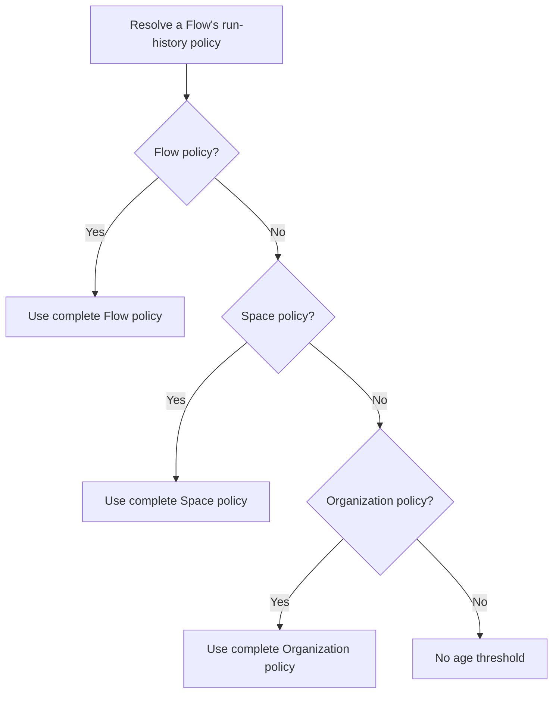

import { Callout } from "nextra/components";

# Flow run-history retention

This page explains how an Organization administrator controls retention eligibility for Flow runs, steps, and their run-owned history. It covers the policy hierarchy, the two safe modes, and the read-only review queue.

<Callout type="warning">

**Saving a Flow run-history policy does not delete data.**

This release has no automatic Flow run-history deletion mode and no administrator purge action in this settings surface. Policies classify history for a later explicit workflow; the review queue is read-only.

</Callout>

## The policy in one minute

- A policy is complete: it always contains both `mode` and `days`.
- A Space or Flow can inherit its complete parent policy or replace the complete pair.
- Resolution order is Flow, then Space, then Organization.
- The most specific configured policy wins even when it keeps data longer than its parent.
- No configured policy means no age threshold.
- Only Organization administrators can read or change these settings.
- Operational retention can be changed after a Flow is published.



## Why a Flow can keep history longer than its parent

The Organization value is a default, not a hard maximum or minimum. This supports real enterprise exceptions without weakening the default for every other workflow.

| Scope                       | Policy                                 | Which Flows use it                      |
| --------------------------- | -------------------------------------- | --------------------------------------- |
| Organization                | Manual purge eligibility after 30 days | Flows without a Space or Flow policy    |
| Legal Space                 | Review before purge after 60 days      | Flows in Legal without their own policy |
| Litigation hold intake Flow | Manual purge eligibility after 90 days | This Flow only                          |

The litigation Flow uses 90 days. Other Flows in Legal use 60 days. Flows in other Spaces use 30 days. The administrator does not need to raise the Organization default to 90 days.

## Choose a mode

| UI label                 | API value         | When the threshold passes                                                   | What does not happen                                               |
| ------------------------ | ----------------- | --------------------------------------------------------------------------- | ------------------------------------------------------------------ |
| Manual purge eligibility | `preserve`        | The history becomes eligible for a separately requested administrator purge | No automatic deletion and no review-queue entry                    |
| Review before purge      | `review_required` | The history appears in the read-only review queue                           | No approval, purge, or deletion merely from appearing in the queue |

Use **Review before purge** when the data owner, records manager, or security role must verify scope before a future deletion. Use **Manual purge eligibility** when an explicit administrator purge is sufficient without a separate approval step.

The threshold is measured from `finished_at`. If a terminal run has no finish time, it is measured from `created_at`.

## Configure it in the admin UI

Open **Admin → Flow settings → Retention and preservation**.

The selectors use an Organization-wide administrative catalog. They include non-personal Spaces and active Flows even when the administrator is not a member of the target Space; ordinary Space and Flow authoring lists remain membership-scoped.

1. Set or leave unset the Organization default.
2. Select a Space only when it needs an exception.
3. Select an individual Flow only when it needs a more specific exception.
4. Check the effective badge. It shows the resolved number of days, mode, and source level.
5. Save each scope separately. The saved audit event identifies that scope and the old and new policy.

A child set to **Inherit the complete parent policy** stores no local policy. If the parent later changes, the child follows both its new mode and its new number of days.

## Review queue

The Organization queue lists terminal runs whose effective `review_required` threshold has passed. It returns only operational context:

- run, Flow, and Space identifiers;
- current Flow and Space names;
- terminal status;
- retention anchor and eligibility timestamp;
- effective complete policy and its source level.

It deliberately omits run inputs, outputs, evidence, and file content. Pagination is bounded to at most 200 rows per request. Reading a queue page is side-effect free.

<Callout type="info">

The queue is preparation for a later approval and purge workflow. There is intentionally no Approve or Delete button in this release.

</Callout>

## API contract

The reference prefix is `/api/v1`. A deployment can configure another API prefix, so use its `/openapi.json` as the live source of truth.

### Policy endpoints

| Scope        | Read                                                        | Replace or clear                                            |
| ------------ | ----------------------------------------------------------- | ----------------------------------------------------------- |
| Organization | `GET /settings/flow-run-retention-policy`                   | `PUT /settings/flow-run-retention-policy`                   |
| Space        | `GET /settings/flow-run-retention-policy/spaces/{space_id}` | `PUT /settings/flow-run-retention-policy/spaces/{space_id}` |
| Flow         | `GET /settings/flow-run-retention-policy/flows/{flow_id}`   | `PUT /settings/flow-run-retention-policy/flows/{flow_id}`   |

### Administrative target discovery

The settings UI does not weaken the ordinary membership-scoped Space and Flow APIs. Organization administrators use metadata-only, tenant-scoped target endpoints:

| Target | Endpoint                                                                  |
| ------ | ------------------------------------------------------------------------- |
| Spaces | `GET /settings/flow-run-retention-policy/targets/spaces`                  |
| Flows  | `GET /settings/flow-run-retention-policy/targets/spaces/{space_id}/flows` |

Both responses are bounded to 200 rows per page and return identifiers and current names, not Flow definitions or run content.
The admin UI loads the first page and offers explicit **Load more** actions for
large Organizations instead of downloading every Space and Flow into the
browser when the settings page opens. Personal Spaces are outside this catalog,
including direct Flow-target requests for a personal Space identifier.

Replace a local policy:

```json
{
  "policy": {
    "mode": "review_required",
    "days": 60
  }
}
```

Clear a Space or Flow override and inherit:

```json
{
  "policy": null
}
```

Partial policies are rejected. `days` accepts whole numbers from 1 through 2555. An unrecognized mode, including an automatic-deletion value, is rejected.

Every policy response separates three facts:

- `local_policy`: the complete policy stored at the requested level, or `null`;
- `inherited_policy`: the nearest complete parent policy, or `null`;
- `effective`: the resolved result, including its source and all contributors.

### Review-queue endpoints

| Scope        | Endpoint                                                                 |
| ------------ | ------------------------------------------------------------------------ |
| Organization | `GET /settings/flow-run-retention-policy/review-queue`                   |
| Space        | `GET /settings/flow-run-retention-policy/spaces/{space_id}/review-queue` |
| Flow         | `GET /settings/flow-run-retention-policy/flows/{flow_id}/review-queue`   |

The optional `limit` is 1 through 200 and defaults to 50. When `has_more` is
`true`, pass the opaque `next_cursor` value back as the `cursor` query parameter
to fetch the next page. Do not decode, edit, or construct cursor values in a
client. Omitting `cursor` starts again from the first page. The server pages by
the indexed retention anchor and run identifier; `eligible_since` remains the
administrator-facing date shown for each result.

## Audit and authorization

Every policy write requires the Organization administrator role. Space and Flow lookups remain scoped to the caller's Organization. A successful policy change writes the required audit action `flow_run_retention_policy_changed` in the same transaction as the policy update.

The audit metadata records the scope, scope identifier, old and new local policy, and resulting effective policy and source. It does not copy Flow run content into the audit log. Saving the same value again is a no-op and does not create a misleading change event.

## What this policy does not govern

Flow run-history policy is separate from:

- never-attached runtime uploads;
- debug evidence eligibility;
- conversation and App history;
- Flow AI Builder conversation sessions;
- audit-log retention;
- backups, legal holds, external exports, and object-storage lifecycle rules.

Some of those data classes have automatic cleanup when their own policy is configured. See [Data retention and deletion](/guides/data-retention) before making a production claim about the whole workflow.

Next: [Data retention and deletion](/guides/data-retention).
