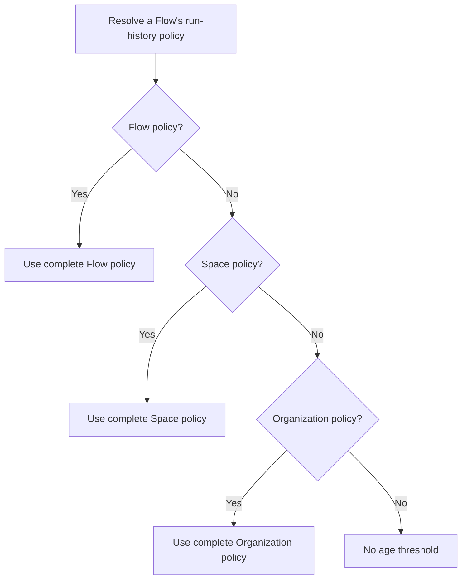

import { Callout } from "nextra/components";

# Flow run-history retention

This page explains how retention eligibility for Flow runs, steps, and their run-owned history is set, reviewed, purged and put on legal hold. It covers the policy hierarchy, the two safe modes, the read-only review queue, legal holds, and who may do what.

<Callout type="warning">

**Saving a Flow run-history policy does not delete data.**

There is no automatic Flow run-history deletion mode. History is deleted only by the explicit purge (an API call that needs `retention_manage`), and the purge skips every run under a legal hold. The admin UI has no purge button; the review queue is read-only.

</Callout>

## The policy in one minute

- A policy is complete: it always contains both `mode` and `days`.
- A Space or Flow can inherit its complete parent policy or replace the complete pair.
- Resolution order is Flow, then Space, then Organization.
- The most specific configured policy wins even when it keeps data longer than its parent.
- No configured policy means no age threshold.
- Reading the rules, Flow targets and holds needs `retention_manage` or `retention_holds`; changing rules, reading the review queue and purging need `retention_manage`; placing, reviewing and releasing holds need `retention_holds` (see [Who may change or stop retention](#who-may-change-or-stop-retention)).
- Operational retention can be changed after a Flow is published.


```mermaid
flowchart TD
  A[Resolve a Flow's run-history policy] --> B{Flow policy?}
  B -->|Yes| C[Use complete Flow policy]
  B -->|No| D{Space policy?}
  D -->|Yes| E[Use complete Space policy]
  D -->|No| F{Organization policy?}
  F -->|Yes| G[Use complete Organization policy]
  F -->|No| H[No age threshold]
```

## Why a Flow can keep history longer than its parent

The Organization value is a default, not a hard maximum or minimum. This supports real enterprise exceptions without weakening the default for every other workflow.

| Scope                       | Policy                                 | Which Flows use it                      |
| --------------------------- | -------------------------------------- | --------------------------------------- |
| Organization                | Manual purge eligibility after 30 days | Flows without a Space or Flow policy    |
| Legal Space                 | Review before purge after 60 days      | Flows in Legal without their own policy |
| Litigation hold intake Flow | Manual purge eligibility after 90 days | This Flow only                          |

The litigation Flow uses 90 days. Other Flows in Legal use 60 days. Flows in other Spaces use 30 days. The administrator does not need to raise the Organization default to 90 days.

## Choose a mode

| UI label                 | API value         | When the threshold passes                                              | What does not happen                                               |
| ------------------------ | ----------------- | ---------------------------------------------------------------------- | ------------------------------------------------------------------ |
| Manual purge eligibility | `preserve`        | The history becomes eligible for a separately requested explicit purge | No automatic deletion and no review-queue entry                    |
| Review before purge      | `review_required` | The history appears in the read-only review queue                      | No approval, purge, or deletion merely from appearing in the queue |

Use **Review before purge** when the data owner, records manager, or security role must verify scope before a future deletion. Use **Manual purge eligibility** when an explicit purge by someone with `retention_manage` is sufficient without a separate approval step.

The threshold is measured from `finished_at`. If a terminal run has no finish time, it is measured from `created_at`.

## Configure it in the admin UI

Open **Admin → Flow settings → Retention and preservation**.

The selectors use an Organization-wide administrative catalog. They include non-personal Spaces and active Flows even when the person is not a member of the target Space; ordinary Space and Flow authoring lists remain membership-scoped.

A deleted Flow that still has run history stays in the Flow selector with a **Deleted** badge. Deleting a Flow retires it: it can no longer run, but its runs, results, reviews and evidence stay readable with each reader's current permissions and follow the Flow's retention rule. Runs that were still queued, running or waiting for review are cancelled by a maintenance sweep that runs every minute by default, so they become finished history too. Its Flow policy, review queue and purge keep working. A deleted Flow without runs is not listed.

1. Set or leave unset the Organization default.
2. Select a Space only when it needs an exception.
3. Select an individual Flow only when it needs a more specific exception.
4. Check the effective badge. It shows the resolved number of days, mode, and source level.
5. Save each scope separately. The saved audit event identifies that scope and the old and new policy.

A child set to **Inherit the complete parent policy** stores no local policy. If the parent later changes, the child follows both its new mode and its new number of days.

## Review queue

The Organization queue lists terminal runs whose effective `review_required` threshold has passed. It returns only operational context:

- run, Flow, and Space identifiers;
- current Flow and Space names;
- terminal status;
- retention anchor and eligibility timestamp;
- effective complete policy and its source level.

It deliberately omits run inputs, outputs, evidence, and file content. Pagination is bounded to at most 200 rows per request. Reading a queue page is side-effect free.

<Callout type="info">

The queue is preparation for a later approval and purge workflow. There is intentionally no Approve or Delete button in this release.

</Callout>

## API contract

The reference prefix is `/api/v1`. A deployment can configure another API prefix, so use its `/openapi.json` as the live source of truth.

### Policy endpoints

| Scope        | Read                                                        | Replace or clear                                            |
| ------------ | ----------------------------------------------------------- | ----------------------------------------------------------- |
| Organization | `GET /settings/flow-run-retention-policy`                   | `PUT /settings/flow-run-retention-policy`                   |
| Space        | `GET /settings/flow-run-retention-policy/spaces/{space_id}` | `PUT /settings/flow-run-retention-policy/spaces/{space_id}` |
| Flow         | `GET /settings/flow-run-retention-policy/flows/{flow_id}`   | `PUT /settings/flow-run-retention-policy/flows/{flow_id}`   |

### Administrative target discovery

The settings UI does not weaken the ordinary membership-scoped Space and Flow APIs. People with a retention permission use metadata-only, tenant-scoped target endpoints:

| Target | Endpoint                                                                  |
| ------ | ------------------------------------------------------------------------- |
| Spaces | `GET /settings/flow-run-retention-policy/targets/spaces`                  |
| Flows  | `GET /settings/flow-run-retention-policy/targets/spaces/{space_id}/flows` |

Both responses are bounded to 200 rows per page and return identifiers and current names, not Flow definitions or run content. Each Flow row also carries `retired`, which is `true` for a deleted Flow listed because it still has run history.
The admin UI loads the first page and offers explicit **Load more** actions for
large Organizations instead of downloading every Space and Flow into the
browser when the settings page opens. Personal Spaces are outside this catalog,
including direct Flow-target requests for a personal Space identifier.

Replace a local policy:

```json
{
  "policy": {
    "mode": "review_required",
    "days": 60
  }
}
```

Clear a Space or Flow override and inherit:

```json
{
  "policy": null
}
```

Partial policies are rejected. `days` accepts whole numbers from 1 through 2555. An unrecognized mode, including an automatic-deletion value, is rejected.

Every policy response separates three facts:

- `local_policy`: the complete policy stored at the requested level, or `null`;
- `inherited_policy`: the nearest complete parent policy, or `null`;
- `effective`: the resolved result, including its source and all contributors.

### Review-queue endpoints

| Scope        | Endpoint                                                                 |
| ------------ | ------------------------------------------------------------------------ |
| Organization | `GET /settings/flow-run-retention-policy/review-queue`                   |
| Space        | `GET /settings/flow-run-retention-policy/spaces/{space_id}/review-queue` |
| Flow         | `GET /settings/flow-run-retention-policy/flows/{flow_id}/review-queue`   |

The optional `limit` is 1 through 200 and defaults to 50. When `has_more` is
`true`, pass the opaque `next_cursor` value back as the `cursor` query parameter
to fetch the next page. Do not decode, edit, or construct cursor values in a
client. Omitting `cursor` starts again from the first page. The server pages by
the indexed retention anchor and run identifier; `eligible_since` remains the
administrator-facing date shown for each result.

## Legal holds

A legal hold ("rättslig spärr"), for example while a disclosure request is
pending, keeps the run history it covers. It overrides every Organization, Space
and Flow policy until the hold is released or its end date passes: the explicit
purge skips held runs, the debug-evidence redaction skips them, and a Space that
contains an active hold cannot be deleted (`space_contains_legal_hold`, 409).
Deleting the whole Organization still deletes everything. `preserve` is a
policy, not a hold. Every stop is a recorded decision: who placed it, why, when,
when it is reviewed and until when.

- **Flow hold:** covers every run of the Flow, including runs created after the
  hold. A deleted Flow that still has history can be held.
- **Run hold:** covers only the named runs (1-100 per request, one hold each).
- **Overlap:** a run stays held while any active hold covers it. Releasing one
  hold ends only that hold's coverage.
- **Reason:** required to place, to move the review date and to release
  (1-512 characters).
- **Review date:** required. It must be in the future and at most
  the review limit ahead (default 365 days; see below). Passing it does **not** end the hold: the hold stays active, is
  marked **review overdue**, and Flow runtime health reports
  `GALLRING_HOLD_REVIEW_OVERDUE` until someone moves the review date later (with
  a reason) or releases the hold.
- **End date:** optional. The hold stops by itself when it passes; nothing has
  to run for that. An ended or released hold stays listed as part of the record.

In **Admin > Flow settings > Retention**, the **Legal holds** section lists the
active holds, or all holds including released and ended ones, with who placed
each, the reason, when, the review date, the end date and who released it and
why. Choose a Flow under the exceptions, select **Place hold**, choose the whole
Flow or specific run IDs, and give a reason, a review date and an optional end
date. **Review** moves the review date later; **Release** asks for a reason and
explains what becomes deletable again. The Flow selector marks Flows with an
active hold. A purge preview counts held runs as `legal_hold`, apart from runs
with another blocker.

The review limit (`GET`/`PUT /settings/flow-run-retention-policy/hold-review-limit`,
1-2555 days or `null` for the default) is changed by `retention_manage` and read by
either permission; the holds list also returns it as `review_limit_days`. A
change writes `flow_run_retention_policy_changed` with the old and new value.

| Method | Path                                                     | Result                                                  |
| ------ | -------------------------------------------------------- | ------------------------------------------------------- |
| GET    | `/settings/flow-retention-holds`                         | Active holds (`status=all` includes released and ended) |
| POST   | `/settings/flow-retention-holds`                         | `201` with the created holds                            |
| POST   | `/settings/flow-retention-holds/{hold_id}/extend-review` | `200` with the hold and its later review date           |
| POST   | `/settings/flow-retention-holds/{hold_id}/release`       | `200` with the released hold                            |

Typed refusals: `flow_retention_hold_run_not_in_flow` (400, a named run is not a
run of the Flow), `flow_retention_hold_end_not_in_future` (400),
`flow_retention_hold_review_out_of_range` (400, review date not in the future or
too far ahead), `flow_retention_hold_review_not_later` (400),
`flow_retention_hold_not_active` (409, extending a released or ended hold),
`flow_retention_hold_already_released` (409), and `flow_retention_lock_busy`
(409, another deletion or retention change held the retention lock for more than
5 seconds; nothing changed, retry). Placing, moving the review and releasing
write the required audit actions `flow_retention_hold_placed`,
`flow_retention_hold_review_extended` and `flow_retention_hold_released` in the
same transaction, with the reason, the dates and who acted.

### Hold history

The audit log is the lasting history of every hold: the place, review and
release events (with who, why and the dates) stay under the audit retention.
Hold rows stay listed (with **All, including ended**) while their Flow and
Space exist. A Space cannot be deleted while it contains an active hold; after
its holds are released, deleting the Space also removes their released hold
rows, and the audit events remain.

Holds, policy changes and deletions are serialized: a purge waits for a hold or
policy change that is being saved, and a hold or policy change waits for an
open purge batch. A purge also rechecks holds right before it deletes.

## Who may change or stop retention

Two role permissions, granted per role, separate the duties:

| Permission         | Label                    | Allows                                                                      |
| ------------------ | ------------------------ | --------------------------------------------------------------------------- |
| `retention_manage` | Retention – manage rules | Organization, Space and Flow rules, the review queue and the explicit purge |
| `retention_holds`  | Retention – legal holds  | Placing, reviewing and releasing legal holds                                |

Either permission can read the shared views (Flow targets, effective rules,
holds). One person may hold both. Neither is implied by `admin`: when this
version is installed, every role that has `admin` receives both, and the
predefined Owner role lists both, so existing administrators keep control. An
organization can then create a role such as "Arkivansvarig" with only these.
Only signed-in people decide: a request made with any API key is refused
(`retention_person_required`, 403) whatever its permissions; a missing
permission is refused with `retention_permission_required` (403).

A role with `retention_manage` or `retention_holds` but without `admin` opens
**Admin > Flow settings** and sees only the retention tab: rules with
`retention_manage`, legal holds with `retention_holds`. The other admin pages
and Flow settings tabs stay closed to it. The server checks every request again.

**Operator note (rolling deploy):** the upgrade adds `retention_manage` and
`retention_holds` to every role that has `admin`. Servers still on the previous
release do not know these values and reject those roles until the rollout
completes. Deploy this release with a short stop of the old servers.

## Audit and authorization

Every policy write requires `retention_manage` (see above). Space and Flow lookups remain scoped to the caller's Organization. A successful policy change writes the required audit action `flow_run_retention_policy_changed` in the same transaction as the policy update.

The audit metadata records the scope, scope identifier, old and new local policy, and resulting effective policy and source. It does not copy Flow run content into the audit log. Saving the same value again is a no-op and does not create a misleading change event.

## What this policy does not govern

Flow run-history policy is separate from:

- never-attached runtime uploads (deleted by the nightly Flow gallring job after the Organization window);
- debug evidence eligibility;
- conversation and App history;
- Flow AI Builder conversation sessions;
- audit-log retention;
- backups, external exports, and object-storage lifecycle rules.

Some of those data classes have automatic cleanup when their own policy is configured. See [Data retention and deletion](/guides/data-retention) before making a production claim about the whole workflow.

Next: [Data retention and deletion](/guides/data-retention).
