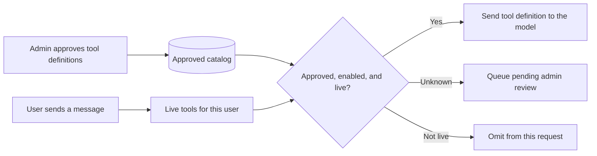
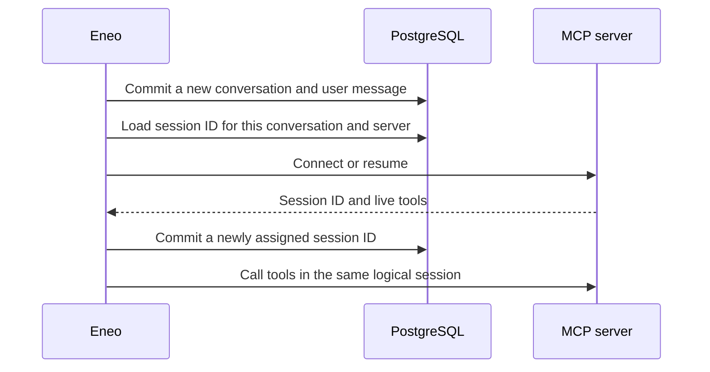

# MCP Servers

Model Context Protocol (MCP) servers give assistants access to external tools and live data. This guide covers setup, tool approval, user-specific catalogs, session state, and day-to-day operation.

import { Callout } from 'nextra/components'

## Overview

MCP is an open protocol that lets AI assistants call external tools — such as searching a database, creating tickets, or fetching live data. Eneo connects to MCP servers over **Streamable HTTP** transport and acts as a proxy between assistants and the remote server.

**Key concepts:**

| Concept | Description |
|---------|-------------|
| **MCP Server** | A remote service that exposes tools via the MCP protocol |
| **Tool** | A single function the server provides (e.g. `search_tickets`, `create_issue`) |
| **Tool Sync** | Discovering tools from the remote server and detecting changes |
| **Approved catalog** | The tool names, descriptions, and schemas an admin has accepted in Eneo |
| **Live catalog** | The tools the remote server returns for the signed-in user during this request |
| **Approval** | Admin review before a new or changed definition becomes active |
| **Space** | Where you enable MCP servers so assistants can use their tools |

For a server that receives user identity, Eneo exposes only the intersection of
the two catalogs:

```text
approved and enabled in Eneo ∩ visible to this user now = tools sent to the model
```

The remote server decides what the user can see. Eneo decides what the model is
allowed to call. A tool must pass both checks.

---

## Adding an MCP Server

MCP servers are managed in **Admin → MCP Servers**. Only admins can add, edit, or remove servers.

### Steps

1. Click **Add MCP Server**
2. Fill in the required fields:
   - **Name** — A display name for the server
   - **Server URL** — The Streamable HTTP endpoint (e.g. `https://example.com/mcp`)
3. Configure optional settings:
   - **Description** — What the server does
   - **Authentication** — Choose between `Public` (no auth) or `Bearer Token`
   - **Forward user identity** — Send the acting user's Eneo identity to this server
   - **Tool catalog limits** — Set the largest catalog and tool definition Eneo will accept
   - **Documentation URL** — Link to the server's documentation
   - **Security Classification** — Restrict which spaces can use this server
4. Click **Add MCP Server**

Eneo will **test the connection** before saving. If the URL is unreachable or returns an error, the server is not created and you get an error message.

<Callout type="info">
  On successful creation, Eneo connects to the server and stores the tools visible to the creating admin. These initial tools are enabled by default because the admin is explicitly adding the server. When identity forwarding is enabled, other users may have a different catalog; their additional tools enter the approval flow described below.
</Callout>

### Authentication

If the MCP server requires authentication, select **Bearer Token** and enter the token. The token is encrypted at rest using Fernet encryption (AES-128-CBC + HMAC-SHA256) and is never shown in the UI after saving.

When editing a server, leave the token field empty to keep the existing token.

### Forwarding user identity

Identity forwarding is off by default. Enable it only when the MCP server is
trusted to receive personal data and uses that identity to authorize each
request.

Eneo sends the available values in these headers:

- `X-Eneo-User-Id`, `X-Eneo-User-Email`, and `X-Eneo-User-Name`
- `X-Eneo-Tenant-Id` and `X-Eneo-Tenant-Name`
- `X-Eneo-Role`

Empty values are omitted. Text values are stripped of control characters and
percent-encoded as UTF-8; the receiving server must decode them before display
or matching. Headers are sent during connection checks, tool discovery, tool
calls, and protocol-session termination.

<Callout type="warning">
  Forwarded headers are identity claims from Eneo, not a replacement for a
  protected network path. The MCP server must accept them only from the trusted
  Eneo backend and must authorize every request.
</Callout>

### Tool catalog limits

Open **Tool catalog limits** in the server form to set two safeguards for that
server:

| Setting | Default | Allowed range |
|---|---:|---:|
| Maximum tools | 256 | 1–4,096 |
| Maximum catalog size | 16 MiB | 1–64 MiB |
| Maximum size per tool | 64 KiB | 1–1,024 KiB |

The sizes include tool names, descriptions, and input schemas as serialized
JSON. The total-size limit prevents a large collection of individually valid
tools from becoming one oversized database write. Choose values that cover the
server's expected catalog without accepting unbounded data. These limits
protect chat latency and database growth; they do not decide how many approved
tools an assistant should receive.

Eneo validates the complete live catalog before saving or exposing anything.
If either limit is exceeded, that server contributes no tools to the current
request and Eneo writes no partial catalog. Increase a limit only after checking
that the larger catalog is intentional.

---

## Tools and Tool Discovery

Each MCP server exposes a set of tools. When you first add a server, its tools are discovered automatically. After that, you can re-discover tools by clicking **Sync Tools**.

### Viewing Tools

In the MCP servers table, click the **expand arrow** on a server row to see its tools. Each tool shows:

- **Name** — The tool's function name (e.g. `search_documents`)
- **Description** — What the tool does
- **Enabled/Disabled toggle** — Whether the tool is available to assistants

### Enabling and Disabling Tools

Use the toggle switch on each tool to enable or disable it. You can also use the **All on / All off** buttons for bulk changes.

The header shows the count of enabled tools, e.g. `2 / 5 enabled`.

<Callout type="warning">
  Disabling a tool in admin removes it globally for all spaces. To control tools per-space, manage them in the space settings instead.
</Callout>

---

## Syncing Tools

Over time, an MCP server may add new tools, change existing tool descriptions, or remove tools. To detect these changes, click **Sync Tools** in the tools panel.

### What Happens During Sync

Eneo connects to the remote server, fetches the current tool list, and compares it against what is stored locally:

| Scenario | What happens |
|----------|-------------|
| **New tool** | Created with `pending` status — requires approval before it becomes active |
| **Changed tool** (description or schema updated) | Change is stored as pending — the tool continues using its **previous version** until the change is approved |
| **Removed tool** (global catalog) | Marked as `removed from server` — requires approval to delete |
| **Unchanged tool** | No action needed |

For an identity-forwarding server, an admin sync is only the acting admin's
view. Eneo therefore does not mark a tool as removed merely because that admin
cannot see it.

Before every tool-capable model turn, Eneo also lists tools as the signed-in
user. A user-only tool that is not in the approved catalog is stored as a
pending definition and omitted from that model request. After an admin approves
it, a later request may expose it to users for whom the remote server still
returns it.

<Callout type="info">
  **Why approval?** The approval step is a security measure. It prevents a compromised or misbehaving MCP server from silently injecting or modifying tool definitions. An admin must review and explicitly approve every change before it takes effect.
</Callout>

### Pending Changes Banner

When there are pending changes, a banner appears:

> **1 pending update — Tool uses previous version until update is approved**

This means the tool is still active and usable — it simply runs on the previous approved version. Nothing is blocked; the update just waits for your review.

### Reviewing Changes

For each pending tool, you can see:

- **Description changes** — Side-by-side comparison of the current and proposed description
- **Removed from server** — The tool no longer exists on the remote server

Use the **approve** (checkmark) or **reject** (X) buttons on individual tools, or use **Approve all** / **Reject all** for bulk actions.

#### What Approve and Reject Do

| Action | New tool | Changed tool | Removed tool |
|--------|----------|-------------|-------------|
| **Approve** | Tool becomes active with the proposed description and schema | Pending values replace current values | Tool is deleted from the database |
| **Reject** | Tool is deleted (never activated) | Pending values are discarded, current values remain | Removed flag is cleared, tool stays active |

---

## Adding MCP Servers to Spaces

After configuring MCP servers in the admin panel, you make them available to assistants by enabling them in individual spaces.

### Steps

1. Go to **Space → Settings**
2. In the **MCP Servers** section, toggle the servers you want to enable
3. Optionally expand a server to enable/disable individual tools for that space

When a server is added to a space, all its tools are enabled by default. You can then disable specific tools you don't need.

### Security Classification

If your organisation uses security classifications, an MCP server must meet the space's classification level to be selectable. Servers that don't meet the requirement are greyed out with a tooltip explaining why.

For example, if a space is classified as "Confidential" (level 3), only MCP servers with a security classification at level 3 or higher can be enabled in that space.

---

## How Eneo builds a tool-enabled request

The approved catalog remains the control point even when each user sees a
different remote catalog.



1. Eneo loads the approved and enabled definitions from PostgreSQL.
2. For identity-forwarding servers, it lists tools as the signed-in user. Independent server probes run concurrently under one bounded preparation deadline.
3. Unknown definitions are queued for admin review and remain hidden. Discovery failure or timeout hides that server's tools for this request.
4. The model receives only the approved/live intersection. Descriptions and schemas always come from the approved catalog, not the live response.
5. If the model selects a tool, Eneo calls the same remote server and returns the result to the model.

### Stateful MCP sessions

An Eneo conversation and an MCP protocol session are related but not identical.
Before the first MCP connection, Eneo commits the new conversation and the
user's message. When a server assigns an `Mcp-Session-Id`, Eneo stores it per
conversation and server, then resumes it on later turns even though each turn
opens a fresh HTTP transport. The catalog probe and the later tool call use that
same logical session, so tools activated by earlier calls remain available.

The session ID is committed in a short database transaction before Eneo treats
the remote session as durable. If that commit fails, Eneo attempts to terminate
the new remote session rather than leaving an unreachable session behind.



Deleting a conversation attempts to terminate its remote sessions. Local
deletion still completes if a remote server is unavailable, so stateful MCP
servers should also enforce a reasonable idle timeout.

### Security and failure boundaries

| Event | Eneo behavior |
|---|---|
| Live tool is not approved | Store as pending; do not expose it |
| Live schema differs from approved schema | Continue using the approved schema until review |
| User cannot see an approved tool | Omit it from this request |
| Identity-scoped discovery fails or times out | Omit that server's tools from this request |
| Catalog exceeds an admin limit | Reject the entire catalog for this request; save nothing |
| New protocol session cannot be persisted | Terminate it and omit that discovery result |
| Admin cannot see a user-only tool during sync | Keep the existing tool; absence is not deletion evidence |

### Checklist for MCP server operators

- Support Streamable HTTP and return a user-scoped `tools/list` when identity forwarding is enabled.
- Authorize every list and call request; do not rely on the model or Eneo's catalog as your only access check.
- Keep tool names stable and treat description/schema changes as reviewed contract changes.
- If state continuity matters, support `Mcp-Session-Id`, session termination, and idle expiration.
- Ensure Eneo can reach the endpoint within the configured connect and list-tools timeouts.

---

## Troubleshooting

### Connection Failed on Create

**Symptoms:** Error message when adding a server

**Solutions:**
- Verify the URL is correct and the server is running
- Check that the URL is reachable from the Eneo backend (firewall, DNS)
- If using authentication, verify the token is correct
- The server must support **Streamable HTTP** transport

### Sync Shows No Tools

**Symptoms:** After syncing, no tools appear

**Solutions:**
- Verify the MCP server actually exposes tools (check its documentation)
- Check backend logs for connection errors
- Try removing and re-adding the server

### Tools Not Available in Space

**Symptoms:** Assistants can't use tools even though the server is enabled

**Solutions:**
- Verify the server is enabled in the space settings (not just in admin)
- Check that individual tools are toggled on in the space
- If using security classifications, verify the server meets the space's classification level
- Check that pending tool changes have been approved — new tools are inactive until approved

### Different Users See Different Tools

This is expected when identity forwarding is enabled and the MCP server returns
an identity-scoped catalog. Confirm that the remote authorization rules are
correct. Eneo will not expose an approved tool to a user when it is absent from
that user's live catalog.

### A User-Specific Tool Is Missing

Ask the user to retry once, then check the server's pending tool changes in
admin. The first observation stores an unknown tool for review but deliberately
does not expose it. Approve the definition and retry as a user who is authorized
by the remote server.

### Identity Headers Are Missing or Encoded

- Confirm **Forward user identity** is enabled on this server.
- One-shot operations without an acting user cannot supply user identity.
- Decode percent-encoded UTF-8 header values on the server before using names or roles.

### Stateful Tools Lose Their State

- Check whether the server returned and accepts `Mcp-Session-Id`.
- Verify the server did not restart or evict the logical session.
- Configure an idle timeout long enough for normal conversation gaps.
- Check backend logs for session resume or termination failures.

### Pending Changes Won't Clear

**Symptoms:** Tools stuck in pending state

**Solutions:**
- Approve or reject all pending changes
- If the issue persists, try syncing again to refresh the state
