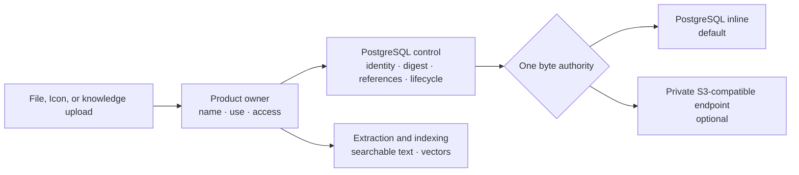
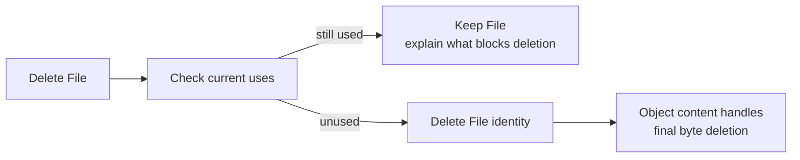

# Choose Content Storage

import { Callout, Steps, Tabs } from "nextra/components";

## TL;DR

- PostgreSQL inline is the complete ready-to-use default. Compatible object
  storage is optional.
- Operators configure storage infrastructure and safety bounds. Administrators connect a destination and choose one
  deployment-wide target for eligible new File, Icon, and knowledge original
  writes in **Admin > File storage** without restarting backend or worker.
- A policy change affects new writes only. Existing content never moves
  implicitly.
- The one-time [File and Icon storage
  upgrade](/guides/file-icon-storage-upgrade) runs online after schema expansion
  and is required for PostgreSQL-only installations too.
- You can change to another S3-compatible service later: copy the bucket with
  your own tooling, then switch destination in **Admin > File storage**. The previous
  destination stays available so you can switch back.
- Each payload has one byte authority. Eneo does not fall back, dual-write, or
  maintain vendor-specific product modes.

## Start here

| I want to…                                        | Go to                                                        |
| ------------------------------------------------- | ------------------------------------------------------------ |
| Run the simplest supported deployment             | [PostgreSQL only](#set-up-your-choice)                       |
| Use the bundled private reference store           | [Bundled SeaweedFS](#set-up-your-choice)                     |
| Connect MinIO or another compatible service       | [External endpoint](#set-up-your-choice)                     |
| Understand ownership and RAG                      | [How content flows](#how-content-flows)                      |
| Download processed content or recover an original | [Download or recover](#download-or-recover-content)          |
| Upgrade and clean up legacy File/Icon storage     | [One-time upgrade guide](/guides/file-icon-storage-upgrade)  |
| Move to another S3-compatible service             | [Change destination](#move-to-another-s3-compatible-service) |
| Plan backup, recovery, and failure handling       | [Operate it safely](#operate-it-safely)                      |
| Review lifecycle and integrity implementation     | [Architecture](/docs/object-content-architecture)            |

## How content flows

File and Icon own the product meaning: filename, authorization, and where the
content is used. The shared object-content module owns durable bytes, SHA-256,
exact size and media type, placement, lifecycle, and physical deletion.



Each content item uses **one** byte authority. Eneo never dual-writes or silently
falls back between PostgreSQL, object storage, or a filesystem.

Object storage and RAG solve different problems:

- durable content preserves the exact upload and named variants such as
  extracted text, transcription, model input, or preview;
- knowledge ingestion turns a chosen variant into searchable facts and vectors
  in PostgreSQL/pgvector;
- vectors do not replace the source file, and the source file does not replace
  the vector index.

### What is adopted now?

| Product content                        | Current behavior                                                                                |
| -------------------------------------- | ----------------------------------------------------------------------------------------------- |
| Eligible new File and Icon bytes       | Use the deployment-wide target selected in **Admin > File storage**                                  |
| Existing File and Icon bytes           | Stay readable from frozen legacy columns while a bounded worker adopts and verifies them online |
| New knowledge file and audio originals | Keep the exact upload in the selected target after successful processing                        |
| Existing knowledge versions            | Stay usable, but have no recoverable original because earlier releases did not retain it        |
| Searchable knowledge text and vectors  | Remain in PostgreSQL/pgvector; only a complete replacement becomes active                       |
| Flow artifacts                         | Remain separate follow-up work                                                                  |
| Changing the selected target           | Affects eligible new writes without a restart; existing content stays where it is               |
| Moving existing content                | Requires a separate explicit, verified migration                                                |

Replacing searchable knowledge keeps the previous complete version as
recovery history. Retained versions continue to count toward the configured
knowledge-storage quota until the document family is deleted; that count
includes each retained version's exact original.

Enabling an endpoint makes the optional byte plane available; it does not move
existing content or change producer placement by itself. An administrator must
select it after Eneo reports it compatible and ready.

## Download or recover content

Eneo keeps processing views and original recovery explicit:

| Use               | What Eneo returns                                                                                      |
| ----------------- | ------------------------------------------------------------------------------------------------------ |
| Normal download   | The representation Eneo uses for the File, such as extracted text or an image prepared for model input |
| Original download | The exact persisted upload, with its original filename, media type, and byte length                    |

Both use signed access. Original-recovery links are deliberately short-lived:
callers can request between one second and one hour. Original recovery is
strict: Eneo never substitutes a processed representation when the original is
absent. Instead it returns `404 file_original_not_found` (Eneo error `9045`).

For a File download button, keep the File ID and mint the URL when the user
clicks:

```js
const { url, expires_at } = await eneo.files.generateOriginalSignedUrl({
  fileId,
  contentDisposition: "attachment",
});

window.location.assign(url);
```

New uploaded knowledge can also retain its exact original. Use the
`original_available` field on the InfoBlob response to decide whether to show
the action. When the reader clicks, call
`POST /api/v1/info-blobs/{id}/original/signed-url/` directly or use the SDK:

```js
if (infoBlob.original_available) {
  const { url } = await eneo.infoBlobs.generateOriginalSignedUrl({
    infoBlobId: infoBlob.id,
    contentDisposition: "attachment",
  });

  window.location.assign(url);
}
```

Open the returned URL with browser navigation or the platform's native `fetch`
when handling bytes yourself. The Eneo SDK call above mints the temporary URL;
its JSON client does not parse the binary download response.

Legacy, manually entered, and crawled knowledge has no retained upload, so
`original_available` is `false`. Do not show a disabled download action or fall
back to extracted text. If the original becomes unavailable before link
creation, Eneo returns `404 info_blob_original_unavailable` (Eneo error `9057`).
Creating the link requires the same read access as opening that knowledge.

Do not persist the returned URL or send it to analytics. It is a temporary
bearer credential; use `expires_at` to decide when the application must request
a new one. Eneo records who created an original-recovery link, its expiry, and
whether it was intended for download or inline display; the bearer token itself
is never written to the audit log.

The original response includes `Repr-Digest` for the SHA-256 of the complete
original. That value stays the same on an audio `206` range response because it
describes the full representation, not only the returned range. Range requests
remain audio-only for File downloads. Knowledge originals use a complete
streamed download.

This contract is independent of placement. It behaves the same whether the
bytes are stored inline in PostgreSQL or in an optional configured
S3-compatible endpoint. Callers do not receive bucket, object-key, or provider
details, and Eneo does not require S3-compatible storage.

When a view genuinely needs several attachment payloads, Eneo validates their
database records as a bounded batch and then verifies each byte stream. Remote
objects still require one content read each, but they do not add one database
transaction per attachment.

Views that only show names, icons, publication state, and permissions do not
retrieve attachment bodies. For example, the Space applications list reads
metadata without opening PostgreSQL-inline or object-store bytes. This reduces
storage work without changing the response or requiring object storage.

## What happens when a File is deleted?

Eneo first checks the File and its generated derivatives against concrete
product relations. A File cannot be deleted while it is attached to a chat,
Assistant, App, or App run. The preview returns a short count for each blocking
use; it never exposes storage keys or endpoint details.



Preview is advisory. Eneo repeats the same check while holding database locks
before deletion, so a concurrent attachment cannot be silently removed.
Removing a File from a chat or Assistant only removes that use; the reusable
File remains until its owner deletes it. Organization or user offboarding keeps
its existing database-cascade behavior.

## Choose the right deployment

| Choice                           | Start here when…                                            | Additional responsibility                                       |
| -------------------------------- | ----------------------------------------------------------- | --------------------------------------------------------------- |
| **PostgreSQL inline** (default)  | You want the fewest moving parts                            | Monitor database growth, WAL, and backup time                   |
| **Bundled SeaweedFS**            | A single-node private reference store is enough             | Operate its volume and pair its backup with PostgreSQL          |
| **External compatible endpoint** | You already operate storage or need multi-node availability | Own endpoint security, TLS, capacity, credentials, and recovery |

Start inline unless measured volume, backup duration, database growth, or
availability requirements say otherwise. “Enterprise” does not automatically
mean “more services.”

### Admin and operator responsibilities

| Owner         | Responsibility                                                                                                                                        |
| ------------- | ----------------------------------------------------------------------------------------------------------------------------------------------------- |
| Administrator | Connect a destination, change or roll back it, rotate its access keys, and set the new-write target and business upload limits in **Admin > File storage** |
| Operator      | Run PostgreSQL and any optional compatible endpoint; own TLS, certificates, capacity, backups, network reachability, and process safety tuning        |

Administrators with the Storage permission can review policy, effective
limits, and capability status. Deployment-wide content inventory spans tenants
and is part of that same administrative view. **Admin > File storage** shows the
current target, connection health, file-content distribution, and migration
state first. Target changes, upload limits, and existing-content moves remain
separate actions, while detailed limits and PostgreSQL allocation are available
under technical details.

`OBJECT_CONTENT_INLINE_MAXIMUM_BYTES` remains an operator-owned ceiling for
safe PostgreSQL rows, WAL, backups, and process memory. It is not a business
upload limit. For PostgreSQL-inline session uploads and knowledge originals,
Eneo uses the smaller of the admin policy and this ceiling. **Admin > File storage**
shows the configured limit, effective limit, and constraining source for
knowledge files and transcription audio as well as File and Icon. Object-store
uploads use the same rule with the portable multipart envelope derived from
deployment transport settings.

FastAPI/Starlette multipart parsing happens before route admission and may use
temporary disk. Eneo then stages an accepted knowledge file or audio upload
until its worker finishes. The worker streams it into bounded capture and
removes the staging file on the terminal path; the staging reconciler removes
old files left by a process crash. Operators must use ingress/request-body
limits and configure and monitor temporary-disk capacity for both multipart
parsing and this bounded staging lifecycle.

The API stores the selected target and effective limit with each accepted
knowledge job. A later admin change therefore affects new jobs only. The worker
still applies its own live safety ceiling and fails the job clearly when its
configuration is lower than the API replica that accepted the upload. Keep
backend and worker safety settings aligned during normal operation.

Knowledge quota is checked when a complete version is ready to replace the
active version, not when the request is accepted. This lets an exact
re-upload or a missing-original repair succeed without reserving more quota. A
genuinely new version that would exceed the current quota ends as a failed job;
the previous active version remains available and no original is retained.

Business limits apply to the user's original upload. Generated text, model
input, and page variants can be larger; Eneo bounds those internal variants by
the selected backend's operator ceiling instead of rejecting an otherwise valid
upload against a second business limit.

Persisted business limits accept whole-byte values from 1 through
9,007,199,254,740,991 so PostgreSQL and browser clients can round-trip the same
integer exactly. This representation bound is not a business default or a
capacity recommendation; the applicable operator ceiling can still make the
effective limit lower.

## Set up your choice

<Tabs items={["PostgreSQL only", "Bundled SeaweedFS", "External / MinIO"]}>
  <Tabs.Tab>

Leave remote-only `OBJECT_CONTENT_*` settings absent and run Eneo normally:

```bash
docker compose up -d
curl -fsS https://eneo.example.eu/api/readyz \
  | jq -e '.detail.object_content.code == "object_store_not_configured"'
```

`object_store_not_configured` is healthy in this mode. PostgreSQL contains both
the control records and bounded payload bytes, so the normal PostgreSQL backup
is the complete content backup.

Set `OBJECT_CONTENT_INLINE_MAXIMUM_BYTES` in `env_backend.env` to a measured
deployment ceiling. Admin policy may exceed this value, but inline session
writes use the lower effective limit and report the ceiling as the constraining
source.

In **Admin > File storage**, keep the new-write target set to **PostgreSQL inline**
and set the four business limits. The update applies to backend and worker
operations without restarting either process. It also controls the original
bytes of newly accepted knowledge file and audio jobs; searchable text and
vectors remain in PostgreSQL.

  </Tabs.Tab>
  <Tabs.Tab>

The optional Compose profile runs Eneo's private, single-node SeaweedFS
reference service. It is not exposed through Traefik.

<Steps>

### Pin the release image

Download `IMAGE-DIGESTS.txt` from the matching Eneo release and set the manifest
digest:

```dotenv
ENEO_SEAWEEDFS_IMAGE=ghcr.io/eneo-ai/eneo-seaweedfs@sha256:<manifest-digest>
```

Verify Eneo's build provenance with the same constraints the release workflow
applies (the signing workflow, the `develop` branch that publishes the image,
GitHub-hosted runners, and the attestation bundle stored in the registry):

```bash
gh attestation verify \
  "oci://ghcr.io/eneo-ai/eneo-seaweedfs@sha256:<manifest-digest>" \
  --repo eneo-ai/eneo \
  --signer-workflow github.com/eneo-ai/eneo/.github/workflows/seaweedfs_image.yml \
  --source-ref refs/heads/develop \
  --deny-self-hosted-runners \
  --bundle-from-oci \
  --predicate-type https://slsa.dev/provenance/v1
```

### Configure the private endpoint

Generate strong credentials and one stable UUID (`uuidgen`), then protect the
deployment `.env` with mode `0600`:

```dotenv
OBJECT_CONTENT_ENDPOINT_URL=http://object-content:8333
OBJECT_CONTENT_REGION=local
OBJECT_CONTENT_BUCKET=eneo-object-content
OBJECT_CONTENT_ACCESS_KEY_ID=<generated access key>
OBJECT_CONTENT_SECRET_ACCESS_KEY=<generated secret key>
OBJECT_CONTENT_DEPLOYMENT_ID=<stable UUID>
OBJECT_CONTENT_ALLOW_INSECURE_HTTP=true
```

The HTTP exception is only for the private internal Compose network.

### Start and verify

```bash
docker compose \
  -f docker-compose.yml \
  -f docker-compose.object-content.yml \
  --profile object-content up -d

curl -fsS https://eneo.example.eu/api/readyz \
  | jq -e '.detail.object_content.code == "ready"'
```

After readiness reports `ready`, an administrator can select **Object store**
in **Admin > File storage**. Selection fails clearly if the endpoint is unavailable
or incompatible. No backend or worker restart is required for the policy
change.

</Steps>

Use an external service instead when your availability target requires storage
redundancy. See [Release SBOMs](/docs/release-sboms) for image and SBOM
verification.

  </Tabs.Tab>
  <Tabs.Tab>

Eneo connects only to the endpoint you configure. It does not require or select
an Amazon service. MinIO uses the same provider-neutral application path as
other compatible endpoints.

For MinIO, create one private bucket:

```bash
mc mb eneo-minio/eneo-object-content
```

Create a non-admin application identity with bucket-scoped permissions for:

- bucket and multipart listing;
- `GetObject`, `PutObject`, and `DeleteObject`;
- multipart upload, ordered part listing, completion, and abort.

MinIO policy files use `arn:aws:s3` syntax locally; those strings do not connect
Eneo or MinIO to AWS.

Set the root encryption key in the deployment environment so Eneo can store
credentials encrypted:

```dotenv
ENCRYPTION_KEY=<44-character Fernet key>
```

Then open **Admin > File storage**, add the endpoint, signing region, bucket, and
application access keys, and let Eneo test and save the encrypted connection.
Adding the connection does not select it for new writes or move existing
content. Keep path-based bucket addressing unless the endpoint has wildcard DNS
and TLS for bucket subdomains.

Mount a private CA read-only into both backend and worker and set
`OBJECT_CONTENT_CA_BUNDLE` when required. Existing operator-managed
`OBJECT_CONTENT_ENDPOINT_URL`, bucket, deployment ID, and credential settings
remain supported for upgrades. Eneo adopts them when encrypted persistence is
available; otherwise they remain read-only in the admin interface. Do not
configure the same destination through both paths.

Do **not** enable the bundled profile. Start the normal stack and verify:

```bash
docker compose up -d
curl -fsS https://eneo.example.eu/api/readyz \
  | jq -e '.detail.object_content.code == "ready"'
```

After the connection reports **Ready**, an administrator can select **Object
storage** in **Admin > File storage**. Connection tests and policy changes fail
clearly if the endpoint is unavailable or incompatible. Neither action needs a
backend or worker restart.

Before production, test the exact service version and configuration: single and
multipart write, `HEAD`, full and single-range read, deletion, pagination, TLS,
and paired restore. Use one dedicated private active-content bucket with
versioning and Object Lock disabled. Eneo currently deletes one opaque key and
does not claim to purge retained historical object versions; snapshots and
paired backups own recovery.

Range reads reuse the verification chunks calculated during the original
upload. Eneo stores each object's chunk size, so changing multipart tuning later
does not invalidate older files. Full reads verify the canonical digest for the
entire object; a range verifies only the chunks that cover that response.

  </Tabs.Tab>
</Tabs>

## Upgrade legacy File and Icon storage

Older installations run a one-time, online adoption after schema expansion.
PostgreSQL-only installations need it too; S3-compatible storage is optional.

Use [Upgrade Legacy File and Icon
Storage](/guides/file-icon-storage-upgrade) for the short operator workflow,
disk and duration estimates, low-disk response, rollback, verification, and
physical cleanup. The detailed engineering contract remains in the
[deployment runbook](https://github.com/eneo-ai/eneo/blob/develop/docs/deployment/OBJECT_CONTENT.md#upgrade-and-rollback).

## Operate it safely

### Move existing content

PostgreSQL inline remains the complete default; compatible object storage is
optional. When the endpoint reports **Ready**, an administrator can
open **Admin > File storage** and move existing content in either direction:

1. Choose the destination and a page of 1–100 items.
2. Select **Queue moves**. Run another command when you want to queue the next
   bounded page.
3. Follow item and byte counts by destination, state, and failure reason.
4. Select **Pause moves** to stop new work claims. One item already being
   verified may finish before the pause takes effect.

Eneo verifies every item at the destination before it starts using that copy.
It never moves the full installation automatically, falls back during an
outage, or treats both placements as writable. Interrupted work resumes from
its stored intent.

Moves toward PostgreSQL stay available while the object store is degraded, so
you can bring content back inline during an outage; queueing toward the
degraded store remains blocked. Individual items still need the store
reachable to copy their bytes, and retry with a typed failure reason until it
is.

Before decommissioning an endpoint, move eligible content inline and leave the
worker and endpoint running through the configured orphan grace and two
complete inventory observations. This lets the existing cleanup lifecycle
delete former remote keys. Eneo still requires the connection while remote
content, staged moves, orphan candidates, or multipart cleanup depend on it.

Knowledge originals retained by this release appear in the same inventory and
use the same bounded, verified move operation. Existing knowledge versions
cannot be backfilled: earlier Eneo releases kept extracted or transcribed text,
but removed the staged upload after processing. There are no original bytes to
copy from PostgreSQL or reconstruct safely.

### Move to another S3-compatible service

Use this when you change hosting provider, move between a self-hosted store and
an external service, or switch bucket. It works with any S3-compatible service:
SeaweedFS, MinIO, or a hosted provider.

Eneo does not copy the bucket: your own tooling transfers the objects, and Eneo
performs the switch around that copy. Object keys contain no endpoint or bucket
name, so a faithful copy is readable the moment you switch.

<Callout type="info">
  Plan a short maintenance window. New files go to PostgreSQL while you work, so
  uploads larger than the operator's inline ceiling fail until you select object
  storage again.
</Callout>

The examples use `rclone` with two configured remotes, `old-store` and
`new-store`. Any tool that copies S3 objects faithfully works the same way.

<Steps>

### Prepare the new bucket

Create one empty private bucket and an application identity limited to it, as
for a first connection, and back up the current bucket.

### Stop new writes to object storage

In **Admin > File storage**, select PostgreSQL as the target for new writes, wait
until no moves are queued, then select **Pause moves**. Nothing can then appear
on the old destination while you copy — the switch requires both and is refused
otherwise.

### Copy and verify the objects

Object keys live under `v1/<deployment-id-without-dashes>/`. Read that id
from the current bucket itself — it is the filename of Eneo's pairing marker:

```bash
rclone lsf old-store:eneo-object-content/v1/.eneo-bindings/
```

The single filename it prints, for example
`94e1a7e321a740b8959bd0ecdc8827e2`, is your prefix. (On a deployment
configured through environment variables, this equals
`OBJECT_CONTENT_DEPLOYMENT_ID` without its dashes; a connection created in
**Admin > File storage** generates the id internally, so the bucket listing is the
authoritative source.)

Confirm that prefix lists your objects, then copy and compare both sides:

```bash
rclone ls old-store:eneo-object-content/v1/<prefix>/ | head

rclone copy \
  old-store:eneo-object-content/v1/<prefix>/ \
  new-store:eneo-object-content/v1/<prefix>/ \
  --checksum --transfers 16 --progress

rclone check \
  old-store:eneo-object-content/v1/<prefix>/ \
  new-store:eneo-object-content/v1/<prefix>/ \
  --download
```

Use `--download` for the comparison: it reads both sides and compares the
actual bytes. `--checksum` silently falls back to size-only comparison when a
hash is unavailable — which is exactly the case for multipart-uploaded S3
objects — so it is not proof of a faithful copy.

Copy only that prefix and preserve object metadata — Eneo verifies the media
type of every object it reads. Never copy `v1/.eneo-bindings/`: it pairs a
bucket with one database, and Eneo manages it per destination.

Compare the object count with what **Admin > File storage** reports for object
storage. A clean difference count is not proof on its own: two empty prefixes
also report no differences.

<Callout type="error">
  If the listing is empty, the prefix is wrong — stop. Copying an empty prefix
  succeeds, verifies clean, and leaves the new destination without your files.
</Callout>

<Callout type="warning">
  Use `copy`, never `sync`. `sync` deletes files at the destination that are
  missing from the source, so a mistaken direction destroys production content.
</Callout>

### Switch destination

Select **Change destination**, enter the new endpoint, bucket, signing region,
addressing style, and access keys, then confirm. Eneo tests the destination,
refuses a bucket belonging to another Eneo installation, **compares the new
bucket against every file it is responsible for**, and switches in one step
without a restart.

That comparison checks each file's presence, size, and media type — the
metadata every read verifies first. A copy that ran against the wrong prefix,
stopped early, or lost object metadata is refused with the number of affected
files rather than activated. Byte equality is what your `rclone check
--download` step proves; Eneo additionally verifies the SHA-256 of every file
it reads, so even a corrupt copy can never serve wrong bytes. The switch is
also refused while any write could still reach a destination — if new files
still target object storage or moves are not paused, change that first; if an
upload is in flight, wait a moment and retry.

The comparison contacts the new destination once per stored file, sixteen at
a time, so on a large deployment the switch request runs for a while — plan
for it inside the maintenance window, and raise any reverse-proxy request
timeout in front of the backend if your file count is large. If your browser
or proxy gives up before the switch answers, refresh **Admin > File storage**
first: the switch may still have completed, and you retry only if the old
destination is still active.

If a previous destination is still archived from an earlier change, remove it
first. Keeping it is the way back from _this_ change, and a new change would
overwrite it.

### Confirm and finish

Select object storage for new writes again and resume moves. Open a few
existing files, let one reconciliation inventory cycle complete, and check that
storage health reports no missing objects. Eneo verifies the SHA-256 of every
file it reads, so a bad copy cannot pass unnoticed.

</Steps>

The previous destination stays listed so you can **Switch back**; nothing is
deleted on either bucket. Switch back only works while the buckets are still
identical — once new files have been stored in object storage after the
switch, Eneo refuses it, and the way back is a fresh copy in the other
direction followed by **Change destination**. When you are satisfied, select
**Forget** and decommission the old bucket at your provider.

If anything looks wrong, switch back, correct the copy, and switch again.

### Back up and restore

- **Only inline rows:** PostgreSQL backup contains control and bytes.
- **Any object-store rows:** PostgreSQL and the endpoint are one recovery unit.

For the second case, stop writers and reconciliation, give both backups one
recovery ID, preserve `OBJECT_CONTENT_DEPLOYMENT_ID` and the bucket marker,
restore both halves in isolation, verify checksums and sample reads, then reopen
traffic. Never combine a newer database with an older bucket or the reverse.

The File/Icon schema expansion needs this pre-upgrade recovery point, but its
online worker does not require a new full backup for every batch. Keep the
pre-upgrade backup until adoption is complete and the release has passed its
verification period. See [Adopt legacy File and Icon
content](/guides/file-icon-storage-upgrade#pause-low-disk-or-rollback) for pause
and recovery behavior.

The later range-verification revision uses the same maintenance window. It
backfills at most 10,000 unexpected pre-production object descriptors in one
transaction and stops before changing schema or data when that bound is
exceeded. Earlier released versions have no supported File/Icon producer for
these rows; contact Eneo before upgrading a deployment that trips this guard.

### Failure rule

| Situation                                             | Eneo behavior                                                            |
| ----------------------------------------------------- | ------------------------------------------------------------------------ |
| No endpoint configured and no remote rows             | Healthy inline operation                                                 |
| Object-store selection is unavailable or incompatible | Admin update fails clearly; the previous committed policy remains active |
| Admin save loses its response                         | Outcome is unknown; keep the draft and reload the persisted policy       |
| Endpoint fails after object store was selected        | New remote-target writes fail; Eneo does not fall back or dual-write     |
| Existing remote content during an outage              | Remote operations return a typed temporary failure                       |
| Remote rows exist but configuration is missing        | Fails closed with `configuration_required`                               |
| Bucket does not match this PostgreSQL database        | Fails closed; Eneo does not adopt or mutate it                           |

Monitor PostgreSQL growth, endpoint capacity and latency, failed/pending
content, delete backlog, reconciliation lag, temporary spool space, and stale
multipart uploads. Keep endpoint APIs and consoles private.

### Upgrade, restore, and rollback

The release that first retains knowledge originals and expands File/Icon legacy
adoption requires one coordinated maintenance window. Its durable job envelope
is not executable by an older worker, and old workers still write the legacy
payload columns:

1. Stop all `backend` API replicas so no new writes or knowledge jobs can be
   accepted. In the reference Compose deployment, `docker compose stop backend`
   leaves `worker`, `db`, `redis`, and optional `object-content` running.
2. Keep the old worker running and read its live ARQ health value plus TTL from
   Redis:

   ```bash
   docker compose exec -T redis redis-cli --raw GET arq:queue:health-check
   docker compose exec -T redis redis-cli --raw TTL arq:queue:health-check
   ```

   The health value must contain `queued=0`, and the TTL must be greater than
   zero. In the single-worker reference deployment, also require
   `j_ongoing=0`. If the old release has multiple worker replicas, keep all of
   them running until the shared Redis value first reports `queued=0` with a
   positive TTL. Then use the deployment orchestrator to verify that every
   replica has zero active jobs, scale down to one idle old worker, and repeat
   both Redis commands. Proceed only when the repeated value contains both
   `queued=0` and `j_ongoing=0` and its TTL is positive. Then inspect the
   matching database jobs:

   ```bash
   docker compose exec -T db sh -lc \
     'psql -U "$POSTGRES_USER" -d "$POSTGRES_DB" -v ON_ERROR_STOP=1 \
     -c "SELECT task, status,
                to_jsonb(jobs) ->> '\''dispatch_envelope'\'' IS NULL AS pre_durable,
                count(*)
         FROM jobs
         WHERE task IN ('\''upload_info_blob'\'', '\''transcription'\'')
           AND status IN ('\''queued'\'', '\''in progress'\'')
         GROUP BY task, status, pre_durable;"'
   ```

   No rows is the normal result. Once the live Redis health value reports an
   empty queue and its TTL is positive, a deployment may still contain
   historical `queued` rows with
   `pre_durable = true` that have no executable queue entry. `db-init` records
   only those rows as failed and continues; no manual SQL repair is needed. An
   `in progress` row or any row with `pre_durable = false` still blocks the
   migration.
   An old worker marks an in-progress knowledge job failed after five minutes
   without a heartbeat. If a worker process stopped mid-job, keep one old worker
   running until that automatic recovery has completed; do not edit the job row
   by hand.

3. Stop every old worker. Run the database query again and proceed only when it
   shows no `in progress` row and no row with `pre_durable = false`. Historical
   `queued` rows with `pre_durable = true` are the only permitted exception.
4. Take one recovery point containing PostgreSQL and, when configured, the
   object store. Preserve Redis and the shared staging volume until the release
   has been verified.
5. Deploy the new image and run `docker compose run --rm db-init`. The migration
   refuses to continue if an executable knowledge job remains.
6. Start the new backend and worker from the same release. Verify readiness,
   then process one knowledge file and one audio upload. Confirm exact-original
   inventory and a deliberate storage-failure message before reopening Eneo.

Do not start `db-init` through a normal `docker compose up` while the old worker
is still draining: `backend` depends on `db-init`, but the existing `worker`
depends on `backend`, so an ordinary rolling start does not express this
maintenance sequence. Keep the API stopped and issue each step explicitly.

To rehearse or recover, restore the paired PostgreSQL/object-store recovery
point in isolation, preserve the same deployment ID and bucket marker, start
Redis plus the restored storage services, run the old release, and confirm its
worker can drain with its API stopped. Repeat the migration and verification
before using the procedure in production. If verification fails after the
migration, keep traffic closed and either recover forward or restore the whole
pre-upgrade recovery point. Never combine a post-upgrade database with an old
object-store backup or run old workers against the new schema.

The policy migration creates revision 1 with **PostgreSQL inline** selected. It
reads the four former upload-limit environment values once as migration seeds.
A present integer from 1 through 9,007,199,254,740,991 is preserved exactly; an
absent value uses the fresh-install default (10 MiB for session File, session
image, and knowledge File; 200 MiB for transcription audio). Blank,
non-integer, zero, negative, or larger values stop the migration with a named
remediation error. After the migration, environment changes and restarts never
overwrite the stored policy. During an upgrade, keep the old release's values
available until `db-init` succeeds, then remove them from active backend and
worker configuration. Fresh installations do not need them.

If you restore a database from before this migration, stop writers and run
`docker compose run --rm db-init` before starting backend and worker. `db-init`
runs Alembic `upgrade head`. The runtime does not create or repair the missing
policy table.

Policy rollback does not move bytes. To stop placing new content remotely,
select **PostgreSQL inline** in **Admin > File storage**. The change affects eligible
new writes only. Existing remote content still needs the configured endpoint,
credentials, certificates, and paired backup. Eneo does not migrate it back
implicitly.

Before rolling back to a release that predates the stored policy, export the
four current business limits and restore them as that old release's four legacy
environment settings; old code cannot read the singleton policy. Full
application/schema rollback also requires the previous image and matching
database/object backup pair.

## FAQ

### Do we need S3-compatible storage to run Eneo?

No. PostgreSQL inline is the default and needs no endpoint, bucket, credentials,
or extra container.

### Does the one-time File/Icon upgrade require or copy to S3?

No. The upgrade changes Eneo's content model, not only byte placement.
PostgreSQL inline is a complete destination and the current adoption worker
never contacts S3.

Without adoption, the new code would have to keep a second legacy File/Icon
read and lifecycle path indefinitely. See [Upgrade Legacy File and Icon
Storage](/guides/file-icon-storage-upgrade) for the reason, disk and time
planning, rollback, and cleanup.

### Does the one-time upgrade load all legacy files into worker memory?

No. For the PostgreSQL-inline destination, PostgreSQL hashes and copies one
frozen payload inside the database transaction. The Python worker coordinates
bounded items and never receives the payload bytes. Memory is bounded by one
item rather than the complete migration, but PostgreSQL still needs headroom for
the largest allowed inline item.

### What happens to new uploads while legacy adoption runs?

New File and Icon uploads use object content immediately. The deployment policy
stores their bytes in PostgreSQL inline by default or in the configured object
store when that destination is selected and ready. New code does not write
payloads back to the legacy File and Icon columns; the database fence rejects
such writes.

Only content that existed before the upgrade uses the temporary legacy read
fallback. Users can continue uploading while the online worker handles that
older content. If an object-store target is selected but unavailable, remote
writes fail explicitly instead of silently falling back to inline or legacy
storage.

### Why does Eneo stage an upload before sending it to S3?

Today the browser uploads to Eneo. Eneo authenticates the owner, applies file
type and size policy, and streams the request through a bounded temporary
spool. Small content can stay in memory; larger content spills to temporary
disk so large or simultaneous uploads do not have to fit in RAM. Eneo prepares
the required variants and calculates the canonical SHA-256 while capturing the
bytes.

Eneo then uploads the captured bytes to the selected S3-compatible endpoint,
reads them back to verify size, media type, and SHA-256, and only then publishes
the File or Icon reference. Closing the capture removes its temporary spool;
the spool is not a second durable storage location.

A browser-direct upload is technically possible, but needs a different
protocol. For example, if a 500 MB upload loses its connection after 400 MB,
Eneo must know that the object is incomplete, keep it unavailable, and later
resume or remove it. That requires signed multipart sessions, ownership
binding, an explicit finalization call, server-side verification, expiry and
abort handling, orphan cleanup, and reconciliation when the browser misses the
final response. Direct upload could reduce backend traffic, but it would not
remove those checks or every temporary-disk need. It is not the current
architecture.

### Are files stored in both PostgreSQL and object storage?

No. PostgreSQL always holds identity and lifecycle facts. The bytes for each
content item live either inline or in the configured endpoint.

### Will enabling the endpoint move existing files?

No. An administrator must queue bounded, verified moves from **Admin >
Storage**. Changing the target for new writes never starts a fleet migration.

### Why can I not delete an uploaded File?

`DELETE /api/v1/files/{file_id}/` returns `409` with `code: "file_in_use"`
while a chat, Assistant, App, or App run still references the File or one of
its generated files. This is a usage conflict; granting more permissions or
retrying the same request does not resolve it.

The response's `details.blockers` lists the remaining uses and their counts.
For example, `{"kind": "chat_attachment", "count": 1}` means one chat-message
attachment reference remains. The read-only
`GET /api/v1/files/{file_id}/deletion-preview/` endpoint returns the same usage
information before deletion. It reports counts, not the conversation IDs.

There is currently no API endpoint to detach an individual file from an
existing chat message while preserving the conversation. Leaving the file out
of a later chat request does not remove its earlier reference.

For a disposable automation conversation:

1. Retain the conversation ID and uploaded file IDs when creating them.
2. Finish processing and save the result the integration needs.
3. Delete the conversation with `DELETE /api/v1/conversations/{session_id}/`.
   This removes the whole conversation and its attachment references.
4. Delete each uploaded file with `DELETE /api/v1/files/{file_id}/`. A successful
   deletion returns `204`. If another reference remains, it still returns `409`.

Use credentials for the owning user/principal, with the required scope and
permissions. Conversation deletion checks `assistants` and `conversations`
admin permission; file deletion requires a user-owned key with `files` admin
permission. Adapt the `/api/v1` prefix to your gateway's environment and version.

If the conversation must be retained, retain its attached files too. Do not
delete conversation history merely to make file cleanup succeed. For other
blocker kinds, remove the reference through the owning resource's supported
workflow before retrying. The final DELETE always rechecks usage, even if a
previous preview allowed deletion.

### What happens when an endpoint is down?

Content already owned by that endpoint is temporarily unavailable. Eneo does
not create a second copy elsewhere as a fallback.

### Can we use a European or self-hosted service?

Yes. Data resides wherever you operate the configured endpoint and its backups.
The `region` value is a signing scope, not a hosting decision.

### Does this replace pgvector or document processing?

No. Object content preserves bytes; document processing produces searchable
text and vectors. Both remain necessary for RAG.

### What do the storage-usage figures mean?

**Admin > File storage** shows related measurements that must not be added together:

- **File content total** is the combined content size recorded by Eneo, excluding
  content whose deletion has completed (`tombstoned`). The PostgreSQL and
  object-storage figures are parts of this total.
- **File content in PostgreSQL** counts the content bytes stored inline in the
  database. **File content in object storage** counts the content bytes recorded
  for the connected endpoint. Neither figure includes searchable RAG data.
- **PostgreSQL on disk** is the size of the entire database. It includes inline
  file content, searchable knowledge text, pgvector embeddings, tables, indexes,
  and PostgreSQL's internal storage.

These figures describe Eneo's data, not remaining capacity. Eneo does not report
host free disk space, an object-storage provider's bucket quota, object versions,
or billing size. Monitor those values through the host and storage provider.

### Can we stop using object storage later?

Yes. Select PostgreSQL for new writes, move every remote item back, and keep the
endpoint available until orphan and multipart cleanup has finished. Eneo does
not currently delete the active saved connection from **Admin > File storage**;
stopping the endpoint afterwards degrades only the optional object-store
capability while inline content remains available.

### Can we change to another S3-compatible service later?

Yes. You copy the bucket with your own tooling and Eneo performs the switch:
see [Move to another S3-compatible
service](#move-to-another-s3-compatible-service). Your endpoint, bucket, and
provider are not a permanent decision.

### Why does Eneo not copy the bucket for us?

Because `rclone` and provider replication already do it faster and more
reliably than a background worker inside Eneo, and copying is the part that
carries no risk to your data as long as it is a copy and not a delete. Eneo
owns the parts that are genuinely unsafe to do by hand: refusing a bucket that
belongs to another installation, blocking the switch while a write is in
flight, changing the destination atomically, and letting you switch back.

### What happens if the copy was incomplete?

Eneo refuses the switch and reports that the copy is incomplete or has
mismatched object metadata, so it never becomes the active destination.
Complete the copy and try again.

Should a file go missing later for another reason, storage health reports it
after the next complete inventory, and reading it fails clearly instead of
returning wrong bytes. Switch back to the previous destination, complete the
copy, and switch again. If files have already been stored in object storage
since the switch, Eneo refuses the one-click switch back; copy the current
bucket back first and use **Change destination**.

### Can we move between PostgreSQL and object storage instead?

Yes, in both directions, from **Admin > File storage** — see [Move existing
content](#move-existing-content). This is a per-file verified move, not a
destination change. Note that moving a file into PostgreSQL is refused when it
is larger than the operator's inline ceiling, so a deployment with large files
cannot use PostgreSQL as a staging area between two S3-compatible services.
Copy the bucket and switch destination instead.

### Where are the deep technical and security details?

- [Object content architecture](/docs/object-content-architecture)
- [Release SBOMs and attestations](/docs/release-sboms)
- [Complete Eneo deployment](/guides/deployment)
