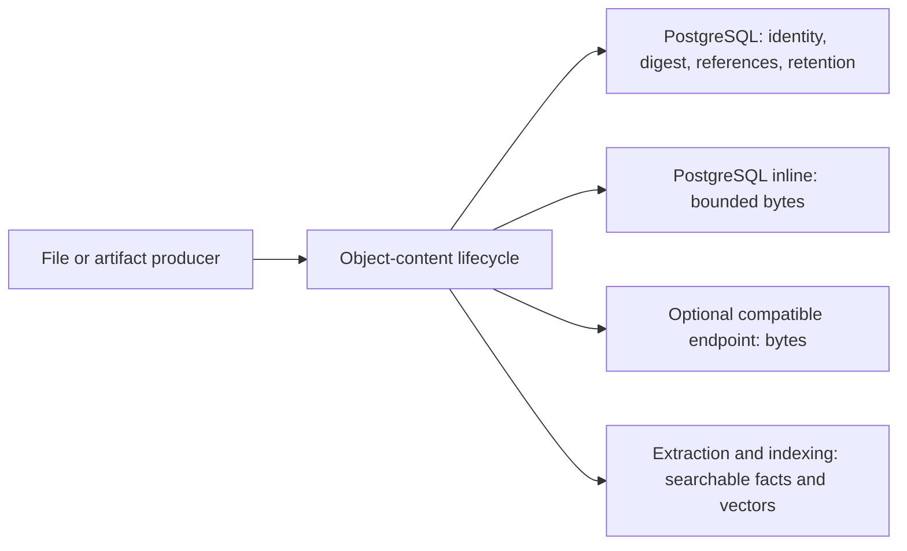

# Choose Content Storage

Eneo works without a separate object store. The default deployment keeps
bounded durable bytes in PostgreSQL. Choose the bundled SeaweedFS service or an
external S3-compatible endpoint only when you need a separate byte plane.

import { Callout, Steps } from "nextra/components";

<Callout type="warning">
  If object-store content exists, PostgreSQL and that endpoint form one recovery
  unit. Back up and restore them together. Inline-only content is included in
  the PostgreSQL backup.
</Callout>

## Quick answer

- **Start with PostgreSQL inline** if you want the fewest moving parts.
- **Choose bundled SeaweedFS** for a private, single-node reference store
  managed with the Eneo Compose stack.
- **Choose an external endpoint** when your organization already operates
  MinIO or another compatible service, or needs multi-node availability.

Enabling object storage does not upload data to Amazon, and this foundation does
not move existing File, InfoBlob, Icon, or Flow bytes. Producer cutovers happen
separately with copy-and-verify migrations.

## What Eneo stores where

PostgreSQL always stores content identity, permissions, lifecycle state,
retention, size, media type, and the canonical SHA-256 digest. Each record then
uses exactly one byte backend: a bounded PostgreSQL payload row or one private
S3-compatible endpoint. Eneo does not switch backends as a failure fallback.



Original bytes and vectors have different jobs. The byte backend preserves the
source or generated artifact. Extraction creates bounded searchable facts and
vectors for retrieval; it does not replace the original bytes.

## Choose a storage path

| Model                           | Best fit                                                                                                | You operate                                                      |
| ------------------------------- | ------------------------------------------------------------------------------------------------------- | ---------------------------------------------------------------- |
| PostgreSQL inline (default)     | Natural rollout, bounded content, and installations that do not need separate object-storage operations | PostgreSQL capacity, backups, and the documented inline ceiling  |
| Bundled SeaweedFS profile       | Single-node deployments that want a separate private byte plane                                         | The `object-content` service and its durable volume              |
| External S3-compatible endpoint | Existing storage platforms, multi-node availability, or organization-managed object backups             | Endpoint, bucket, identity, TLS, capacity, and recovery controls |

Object-store choices use one S3-compatible contract. Eneo does not select an
Amazon service implicitly, and MinIO does not require a provider-specific
integration.

Choose based on measured operations, not organization size alone:

- PostgreSQL inline increases database size, WAL, and backup duration, but keeps
  recovery simple.
- Object storage separates byte capacity, but adds endpoint health, credentials,
  monitoring, and paired backup/restore.
- The bundled SeaweedFS service is single-node. Use an external service when
  your availability target requires storage redundancy.

## Use the default PostgreSQL-inline backend

Leave every remote-only `OBJECT_CONTENT_*` variable absent and run the normal
deployment:

```bash
docker compose up -d
curl --fail https://eneo.example.eu/api/readyz
```

The health projection reports `object_store_not_configured`; this is healthy.
Core lifecycle, reference audit, retention, and deletion work still runs. Set
`OBJECT_CONTENT_INLINE_MAXIMUM_BYTES` in `env_backend.env` to a measured
deployment ceiling. It limits new inline writes, not reads of existing rows or
the administrator's product upload policy.

## Use the bundled SeaweedFS service

The reference stack keeps SeaweedFS on the private `object_content_net`. Only
the backend and worker can reach it; Traefik and the frontend cannot.

<Steps>

### Copy the deployment configuration

Follow the [deployment guide](/guides/deployment) to copy the Compose and
environment templates. Uncomment the complete object-store block in `.env`;
leave it commented for the default inline deployment.

### Pin the release image

Download `IMAGE-DIGESTS.txt` from the Eneo GitHub Release you plan to run. Copy
the digest reference from the single `seaweedfs manifest` row:

```dotenv
ENEO_SEAWEEDFS_IMAGE=ghcr.io/eneo-ai/eneo-seaweedfs@sha256:<manifest-digest>
```

Use the manifest digest, not the `linux/amd64` or `linux/arm64` platform row.
The manifest selects the correct image for the host architecture.

Verify Eneo's build provenance before deployment:

```bash
gh attestation verify \
  "oci://ghcr.io/eneo-ai/eneo-seaweedfs@sha256:<manifest-digest>" \
  --repo eneo-ai/eneo \
  --predicate-type https://slsa.dev/provenance/v1
```

See [Release SBOMs](/docs/release-sboms) for platform SBOM verification and the
full release asset inventory.

### Generate credentials and the deployment ID

Generate separate high-entropy credentials and one UUID:

```bash
openssl rand -hex 32
openssl rand -hex 48
uuidgen
```

Store the results in the protected deployment `.env`:

```dotenv
OBJECT_CONTENT_ACCESS_KEY_ID=<generated access key>
OBJECT_CONTENT_SECRET_ACCESS_KEY=<generated secret key>
OBJECT_CONTENT_DEPLOYMENT_ID=<generated UUID>
OBJECT_CONTENT_ENDPOINT_URL=http://object-content:8333
OBJECT_CONTENT_REGION=local
OBJECT_CONTENT_BUCKET=eneo-object-content
OBJECT_CONTENT_ALLOW_INSECURE_HTTP=true
```

Keep the UUID unchanged through upgrades and restores. It scopes opaque object
keys and binds this PostgreSQL database to its byte store. Changing it does not
migrate existing content.

### Start and verify the stack

```bash
docker compose \
  -f docker-compose.yml \
  -f docker-compose.object-content.yml \
  --profile object-content config --quiet
docker compose \
  -f docker-compose.yml \
  -f docker-compose.object-content.yml \
  --profile object-content up -d
docker compose ps
curl -fsS https://eneo.example.eu/api/readyz \
  | jq -e '.detail.object_content.code == "ready"'
```

The explicit code check matters because HTTP 200 can also represent degraded
remote storage while inline content remains available. If readiness reports
`configuration_required`, stop writers and check the endpoint, bucket,
deployment ID, and restored backup pair before retrying. Do not create a new
bucket marker by hand.

</Steps>

`OBJECT_CONTENT_ALLOW_INSECURE_HTTP=true` is appropriate only for this private
Compose network. Do not publish port 8333 through the reverse proxy.

## Use MinIO or another compatible endpoint

Operate the external service according to its current security, licensing,
availability, and backup guidance. Eneo needs one private bucket and one
non-admin application identity. The endpoint must support SigV4 plus the S3
operations Eneo uses: paginated object and multipart listing, single and
multipart writes, `HEAD`, streaming reads, one byte range, abort, and deletion.

### MinIO example

Create a dedicated bucket:

```bash
mc mb eneo-minio/eneo-object-content
```

Save this least-privilege policy as `eneo-object-content-policy.json`:

```json
{
  "Version": "2012-10-17",
  "Statement": [
    {
      "Effect": "Allow",
      "Action": ["s3:ListBucket", "s3:ListBucketMultipartUploads"],
      "Resource": ["arn:aws:s3:::eneo-object-content"]
    },
    {
      "Effect": "Allow",
      "Action": [
        "s3:GetObject",
        "s3:PutObject",
        "s3:DeleteObject",
        "s3:AbortMultipartUpload",
        "s3:ListMultipartUploadParts"
      ],
      "Resource": ["arn:aws:s3:::eneo-object-content/*"]
    }
  ]
}
```

MinIO uses `arn:aws:s3` strings as local IAM-compatible policy syntax. These
identifiers do not connect MinIO or Eneo to AWS. If you change the bucket name,
change both policy resources.

Create a service identity through your MinIO console, identity provider, or
secret-safe automation. Then attach the policy without putting the secret key
on the command line:

```bash
mc admin policy create eneo-minio eneo-object-content \
  ./eneo-object-content-policy.json
mc admin policy attach eneo-minio eneo-object-content \
  --user '<service-identity>'
```

Configure Eneo with the S3 API endpoint and application credentials:

```dotenv
OBJECT_CONTENT_ENDPOINT_URL=https://minio.storage.example.eu:9000
OBJECT_CONTENT_REGION=<MinIO signing scope>
OBJECT_CONTENT_BUCKET=eneo-object-content
OBJECT_CONTENT_ACCESS_KEY_ID=<application access key>
OBJECT_CONTENT_SECRET_ACCESS_KEY=<application secret key>
OBJECT_CONTENT_DEPLOYMENT_ID=<stable deployment UUID>
OBJECT_CONTENT_ALLOW_INSECURE_HTTP=false
```

Keep `OBJECT_CONTENT_ADDRESSING_STYLE=path` in `env_backend.env` unless the
endpoint has wildcard DNS and TLS for virtual-host bucket names. For a private
CA, mount the certificate read-only into both backend and worker and set
`OBJECT_CONTENT_CA_BUNDLE` to its in-container path.

Do not enable the `object-content` profile. Start the normal stack and verify
readiness:

```bash
docker compose up -d
curl -fsS https://eneo.example.eu/api/readyz \
  | jq -e '.detail.object_content.code == "ready"'
```

Before production traffic, test the exact endpoint version and configuration in
staging. Cover single and multipart upload, ordered part listing, full and range
read, deletion visibility, and a paired restore.

## Back up and restore

For an inline-only deployment, the normal PostgreSQL backup contains both
control data and payload bytes. Restore and verify PostgreSQL before reopening
traffic.

If any `object_store` rows exist, PostgreSQL and the endpoint form one recovery
unit:

1. stop writers and remote reconciliation;
2. record one recovery ID;
3. back up PostgreSQL and the bucket under that ID;
4. preserve `OBJECT_CONTENT_DEPLOYMENT_ID` and the internal bucket marker;
5. restore both halves in isolation;
6. verify checksums, binding, readiness, and a sample of full and range reads;
7. reopen traffic only after reconciliation reports a consistent pair.

Never combine a newer database with an older bucket, or the reverse. If the two
halves are skewed, keep writers stopped and restore a matching pair.

## Production checklist

- Keep the endpoint private. Expose neither its S3 API nor administrative UI
  through Eneo's public reverse proxy.
- Give Eneo one bucket-scoped application identity, not administrator
  credentials.
- Alert on bucket bytes, object count, free capacity, request errors and
  latency, failed or pending content, delete backlog, reconciliation lag, and
  old multipart uploads.
- Size temporary storage for concurrent uploads and reads. Eneo verifies a full
  object before returning a full or range response; larger objects spill from
  bounded memory to temporary disk.
- For inline-only deployments, verify normal PostgreSQL backup and restore.
- When object-store rows exist, back up PostgreSQL and the endpoint under one
  recovery ID while writers and remote reconciliation are stopped. Preserve
  `OBJECT_CONTENT_DEPLOYMENT_ID` and the internal bucket marker.
- Test restores in isolation before reopening traffic.

## Configuration behavior

| Configuration                                                 | Result                                                                                             |
| ------------------------------------------------------------- | -------------------------------------------------------------------------------------------------- |
| Remote-only settings absent; no active object-store rows      | Healthy inline mode; health reports `object_store_not_configured`                                  |
| Remote-only settings absent; active object-store rows exist   | `configuration_required`; existing remote bytes are not silently stranded                          |
| Any remote-only value blank, partial, or invalid              | Startup fails with a configuration error                                                           |
| Complete configuration and matching database/bucket pair      | Inline and object-store backends are available                                                     |
| Complete configuration but a temporarily unavailable endpoint | Overall readiness stays degraded/200; remote operations return typed 503 and inline work continues |
| Reachable bucket that does not match PostgreSQL               | `configuration_required`; Eneo does not adopt or mutate it                                         |

Each record keeps its original byte authority. Once Eneo stores an active
object-store record, that endpoint remains required for the record; Eneo does
not fall back to inline PostgreSQL or a filesystem.

## FAQ

### Do I need S3-compatible storage to run Eneo?

No. PostgreSQL-inline storage is the default and requires no endpoint, bucket,
credentials, or additional container.

### Which option should a municipality choose first?

Start inline unless measured file volume, backup duration, database growth, or
availability requirements justify a separate service. Moving to object storage
adds useful capacity separation, but it also adds an operational dependency.

### Will enabling object storage move our existing files?

No. This foundation does not migrate existing File, InfoBlob, Icon, or Flow
bytes. Later producer-specific work will copy, verify, switch authority, and
only then remove the old byte copy.

### Are bytes stored twice?

No. Each adopted content record has one byte authority. PostgreSQL always keeps
identity, digest, size, references, retention, and lifecycle facts; the payload
lives either inline or in the configured endpoint.

### What happens if the endpoint is unavailable?

Inline content and core readiness continue. Object-store reads and writes return
a typed temporary failure, and readiness reports a degraded capability. Eneo
does not copy the operation into PostgreSQL or a filesystem as a fallback.

### Can I turn object storage off after using it?

Not by deleting the configuration. Active object-store rows make missing
configuration fail closed. A future migration-back operation must copy and
verify those bytes before the endpoint can be removed.

### Does the `region` setting choose where data is stored?

No. It is the SigV4 signing scope required by the endpoint. Data residency is
determined by where you run the endpoint, its replicas, and its backups. The
bundled private service uses `local`; use the value required by your external
operator.

### Does object storage replace pgvector or RAG indexing?

No. Object storage preserves original and derived byte streams. Extraction and
indexing turn those bytes into searchable facts and vectors in the knowledge
data plane. Deleting vectors does not delete the source bytes, and losing source
bytes cannot be repaired from vectors.

### Is content encrypted?

Use HTTPS for external endpoints and storage- or volume-level encryption at
rest according to your organization's controls. The private bundled endpoint
uses an internal network; Eneo does not expose its S3 port publicly. Do not
assume the signing region or S3 protocol provides encryption by itself.

### Can we use a European or self-hosted service?

Yes. Eneo connects only to the endpoint you configure. Use a European managed
service or a self-hosted compatible endpoint that passes the required operation,
integrity, TLS, and recovery tests.

### Why does Eneo bundle SeaweedFS?

It gives installations that choose the optional Compose profile a small private
S3-compatible service with a reproducible Eneo build for `linux/amd64` and
`linux/arm64`. It is a single-node reference store, not a requirement or the
default answer for multi-node availability.

### Is MinIO supported?

Yes, as an external S3-compatible endpoint. Eneo does not bundle or administer
MinIO. Validate your exact MinIO build and configuration against the operations
listed above.

### Does Eneo require AWS S3?

No. Eneo always uses the endpoint you configure. SigV4 and IAM-style policy
names describe protocol syntax; they do not select an AWS service.

### Why does readiness say `configuration_required`?

The configured bucket and PostgreSQL database do not present the same durable
binding, or active object-store rows exist while remote configuration is absent.
Restore the matching pair and original deployment ID. Do not replace the marker.

### Can I rotate credentials?

Yes. Update backend and worker together, and update the bundled store or
external service identity in the same maintenance window. Verify readiness
before resuming writes. Credential rotation must not change the deployment ID,
bucket, or existing object keys.

### Can I back up only PostgreSQL?

Yes for a deployment containing only inline rows: PostgreSQL contains both
control and payload. No after object-store rows exist: restore PostgreSQL and
the endpoint from the same recovery point. See [Back up and
restore](#back-up-and-restore).

## Learn how it works

- [Object content architecture](/docs/object-content-architecture) explains
  lifecycle, integrity, reconciliation, binding, and failure behavior.
- [Release SBOMs](/docs/release-sboms) explains image digests, SBOM assets, and
  attestation verification.
- [Deployment](/guides/deployment) covers the complete Eneo service stack.
