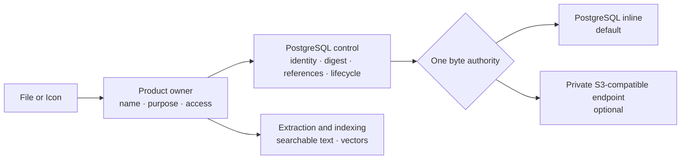

# Choose Content Storage

import { Callout, Steps, Tabs } from "nextra/components";

<Callout type="info">
  **Short answer:** Eneo works without S3-compatible storage. New File and Icon
  content uses bounded PostgreSQL storage by default. Add a private compatible
  endpoint only when your capacity or availability needs justify operating it.
</Callout>

## Start here

| I want to…                                      | Go to                                              |
| ----------------------------------------------- | -------------------------------------------------- |
| Run the simplest supported deployment           | [PostgreSQL only](#set-up-your-choice)             |
| Use the bundled private reference store         | [Bundled SeaweedFS](#set-up-your-choice)           |
| Connect MinIO or another compatible service     | [External endpoint](#set-up-your-choice)           |
| Understand ownership and RAG                    | [How content flows](#how-content-flows)            |
| Plan backup, recovery, and failure handling      | [Operate it safely](#operate-it-safely)            |
| Review lifecycle and integrity implementation   | [Architecture](/docs/object-content-architecture)  |

## How content flows

File and Icon own the product meaning: filename, purpose, authorization, and
which variant is needed. The shared object-content module owns durable bytes,
SHA-256, exact size and media type, placement, lifecycle, and deletion.



Each content item uses **one** byte authority. Eneo never dual-writes or silently
falls back between PostgreSQL, object storage, or a filesystem.

Object storage and RAG solve different problems:

- durable content preserves the exact upload and named variants such as
  extracted text, transcription, model input, or preview;
- knowledge ingestion turns a chosen variant into searchable facts and vectors
  in PostgreSQL/pgvector;
- vectors do not replace the source file, and the source file does not replace
  the vector index.

### What is adopted now?

| Product content | Current behavior |
| --------------- | ---------------- |
| New File and Icon bytes | Use the shared lifecycle and PostgreSQL-inline byte backend |
| Existing File and Icon bytes | Copied, SHA-256 verified, switched to typed references, then removed from legacy columns during upgrade |
| InfoBlob knowledge generations and Flow artifacts | Remain separate follow-up work |
| Admin-selected placement and inline ↔ object-store migration | Remain a separate, verified migration workflow |

Enabling an endpoint makes the optional byte plane available; it does not move
existing content or change producer placement by itself.

## Choose the right deployment

| Choice | Start here when… | Additional responsibility |
| ------ | ---------------- | ------------------------- |
| **PostgreSQL inline** (default) | You want the fewest moving parts | Monitor database growth, WAL, and backup time |
| **Bundled SeaweedFS** | A single-node private reference store is enough | Operate its volume and pair its backup with PostgreSQL |
| **External compatible endpoint** | You already operate storage or need multi-node availability | Own endpoint security, TLS, capacity, credentials, and recovery |

Start inline unless measured volume, backup duration, database growth, or
availability requirements say otherwise. “Enterprise” does not automatically
mean “more services.”

## Set up your choice

<Tabs items={["PostgreSQL only", "Bundled SeaweedFS", "External / MinIO"]}>
  <Tabs.Tab>

Leave remote-only `OBJECT_CONTENT_*` settings absent and run Eneo normally:

```bash
docker compose up -d
curl -fsS https://eneo.example.eu/api/readyz \
  | jq -e '.detail.object_content.code == "object_store_not_configured"'
```

`object_store_not_configured` is healthy in this mode. PostgreSQL contains both
the control records and bounded payload bytes, so the normal PostgreSQL backup
is the complete content backup.

Set `OBJECT_CONTENT_INLINE_MAXIMUM_BYTES` in `env_backend.env` to a measured
deployment ceiling. It is an operational safety bound, not a hidden product
upload policy. It must be at least the largest configured File, image, or audio
upload limit. Eneo rejects a conflicting configuration at startup instead of
accepting an upload that PostgreSQL-inline storage cannot persist.

  </Tabs.Tab>
  <Tabs.Tab>

The optional Compose profile runs Eneo's private, single-node SeaweedFS
reference service. It is not exposed through Traefik.

<Steps>

### Pin the release image

Download `IMAGE-DIGESTS.txt` from the matching Eneo release and set the manifest
digest:

```dotenv
ENEO_SEAWEEDFS_IMAGE=ghcr.io/eneo-ai/eneo-seaweedfs@sha256:<manifest-digest>
```

Verify Eneo's build provenance:

```bash
gh attestation verify \
  "oci://ghcr.io/eneo-ai/eneo-seaweedfs@sha256:<manifest-digest>" \
  --repo eneo-ai/eneo \
  --predicate-type https://slsa.dev/provenance/v1
```

### Configure the private endpoint

Generate strong credentials and one stable UUID (`uuidgen`), then protect the
deployment `.env` with mode `0600`:

```dotenv
OBJECT_CONTENT_ENDPOINT_URL=http://object-content:8333
OBJECT_CONTENT_REGION=local
OBJECT_CONTENT_BUCKET=eneo-object-content
OBJECT_CONTENT_ACCESS_KEY_ID=<generated access key>
OBJECT_CONTENT_SECRET_ACCESS_KEY=<generated secret key>
OBJECT_CONTENT_DEPLOYMENT_ID=<stable UUID>
OBJECT_CONTENT_ALLOW_INSECURE_HTTP=true
```

The HTTP exception is only for the private internal Compose network.

### Start and verify

```bash
docker compose \
  -f docker-compose.yml \
  -f docker-compose.object-content.yml \
  --profile object-content up -d

curl -fsS https://eneo.example.eu/api/readyz \
  | jq -e '.detail.object_content.code == "ready"'
```

</Steps>

Use an external service instead when your availability target requires storage
redundancy. See [Release SBOMs](/docs/release-sboms) for image and SBOM
verification.

  </Tabs.Tab>
  <Tabs.Tab>

Eneo connects only to the endpoint you configure. It does not require or select
an Amazon service. MinIO uses the same provider-neutral application path as
other compatible endpoints.

For MinIO, create one private bucket:

```bash
mc mb eneo-minio/eneo-object-content
```

Create a non-admin application identity with bucket-scoped permissions for:

- bucket and multipart listing;
- `GetObject`, `PutObject`, and `DeleteObject`;
- multipart upload, ordered part listing, completion, and abort.

MinIO policy files use `arn:aws:s3` syntax locally; those strings do not connect
Eneo or MinIO to AWS.

Configure backend and worker with the same secret-safe values:

```dotenv
OBJECT_CONTENT_ENDPOINT_URL=https://minio.storage.example.eu:9000
OBJECT_CONTENT_REGION=<signing scope required by the endpoint>
OBJECT_CONTENT_BUCKET=eneo-object-content
OBJECT_CONTENT_ACCESS_KEY_ID=<application access key>
OBJECT_CONTENT_SECRET_ACCESS_KEY=<application secret key>
OBJECT_CONTENT_DEPLOYMENT_ID=<stable UUID>
OBJECT_CONTENT_ALLOW_INSECURE_HTTP=false
```

Keep `OBJECT_CONTENT_ADDRESSING_STYLE=path` unless the endpoint has wildcard
DNS and TLS for virtual-host bucket names. Mount a private CA read-only into
both backend and worker and set `OBJECT_CONTENT_CA_BUNDLE` when required.

Do **not** enable the bundled profile. Start the normal stack and verify:

```bash
docker compose up -d
curl -fsS https://eneo.example.eu/api/readyz \
  | jq -e '.detail.object_content.code == "ready"'
```

Before production, test the exact service version and configuration: single and
multipart write, `HEAD`, full and single-range read, deletion, pagination, TLS,
and paired restore. Use one dedicated private active-content bucket with
versioning and Object Lock disabled. Eneo currently deletes one opaque key and
does not claim to purge retained historical object versions; snapshots and
paired backups own recovery.

  </Tabs.Tab>
</Tabs>

## Operate it safely

### Backup rule

- **Only inline rows:** PostgreSQL backup contains control and bytes.
- **Any object-store rows:** PostgreSQL and the endpoint are one recovery unit.

For the second case, stop writers and reconciliation, give both backups one
recovery ID, preserve `OBJECT_CONTENT_DEPLOYMENT_ID` and the bucket marker,
restore both halves in isolation, verify checksums and sample reads, then reopen
traffic. Never combine a newer database with an older bucket or the reverse.

During the File/Icon normalization upgrade, keep backend and worker producers
stopped until Alembic succeeds. Retry a stopped migration before accepting new
uploads; intervening writes deliberately block an unsafe retry.

The copy phase is row- and byte-bounded and hashes copied content before the
final write fence. The fenced pass compares copied payloads with the legacy
File/Icon columns once before dropping them. Measure this on a restored
production-size database and plan a maintenance window proportional to total
File/Icon bytes.

### Failure rule

| Situation | Eneo behavior |
| --------- | ------------- |
| No endpoint configured and no remote rows | Healthy inline operation |
| Endpoint temporarily unavailable | Inline work continues; remote operations return a typed temporary failure |
| Remote rows exist but configuration is missing | Fails closed with `configuration_required` |
| Bucket does not match this PostgreSQL database | Fails closed; Eneo does not adopt or mutate it |

Monitor PostgreSQL growth, endpoint capacity and latency, failed/pending
content, delete backlog, reconciliation lag, temporary spool space, and stale
multipart uploads. Keep endpoint APIs and consoles private.

## FAQ

### Do we need S3-compatible storage to run Eneo?

No. PostgreSQL inline is the default and needs no endpoint, bucket, credentials,
or extra container.

### Are files stored in both PostgreSQL and object storage?

No. PostgreSQL always holds identity and lifecycle facts. The bytes for each
content item live either inline or in the configured endpoint.

### Will enabling the endpoint move existing files?

No. Placement changes require an explicit copy, full verification, authority
switch, and cleanup workflow.

### What happens when an endpoint is down?

Content already owned by that endpoint is temporarily unavailable. Eneo does
not create a second copy elsewhere as a fallback.

### Can we use a European or self-hosted service?

Yes. Data resides wherever you operate the configured endpoint and its backups.
The `region` value is a signing scope, not a hosting decision.

### Does this replace pgvector or document processing?

No. Object content preserves bytes; document processing produces searchable
text and vectors. Both remain necessary for RAG.

### Can we turn object storage off later?

Only after every remote item has been copied back, verified, and switched by a
supported migration. Removing configuration while remote rows exist fails
closed.

### Where are the deep technical and security details?

- [Object content architecture](/docs/object-content-architecture)
- [Release SBOMs and attestations](/docs/release-sboms)
- [Complete Eneo deployment](/guides/deployment)
