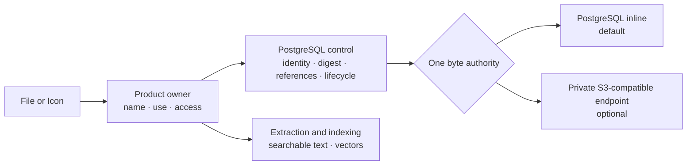
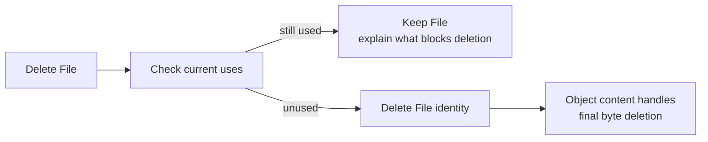

# Choose Content Storage

import { Callout, Steps, Tabs } from "nextra/components";

## TL;DR

- PostgreSQL inline is the complete ready-to-use default. Compatible object
  storage is optional.
- Operators configure storage infrastructure and safety bounds. Platform admins
  choose one deployment-wide target for eligible new File and Icon writes in
  **Admin > Storage** without restarting backend or worker.
- A policy change affects new writes only. Existing content never moves
  implicitly.
- Each payload has one byte authority. Eneo does not fall back, dual-write, or
  maintain vendor-specific product modes.

## Start here

| I want to…                                        | Go to                                              |
| ------------------------------------------------- | -------------------------------------------------- |
| Run the simplest supported deployment             | [PostgreSQL only](#set-up-your-choice)             |
| Use the bundled private reference store           | [Bundled SeaweedFS](#set-up-your-choice)           |
| Connect MinIO or another compatible service       | [External endpoint](#set-up-your-choice)           |
| Understand ownership and RAG                      | [How content flows](#how-content-flows)            |
| Download a processed file or recover its original | [Download or recover](#download-or-recover-a-file) |
| Plan backup, recovery, and failure handling       | [Operate it safely](#operate-it-safely)            |
| Review lifecycle and integrity implementation     | [Architecture](/docs/object-content-architecture)  |

## How content flows

File and Icon own the product meaning: filename, authorization, and where the
content is used. The shared object-content module owns durable bytes, SHA-256,
exact size and media type, placement, lifecycle, and physical deletion.



Each content item uses **one** byte authority. Eneo never dual-writes or silently
falls back between PostgreSQL, object storage, or a filesystem.

Object storage and RAG solve different problems:

- durable content preserves the exact upload and named variants such as
  extracted text, transcription, model input, or preview;
- knowledge ingestion turns a chosen variant into searchable facts and vectors
  in PostgreSQL/pgvector;
- vectors do not replace the source file, and the source file does not replace
  the vector index.

### What is adopted now?

| Product content                                   | Current behavior                                                                                        |
| ------------------------------------------------- | ------------------------------------------------------------------------------------------------------- |
| Eligible new File and Icon bytes                  | Use the deployment-wide target selected in **Admin > Storage**                                          |
| Existing File and Icon bytes                      | Copied, SHA-256 verified, switched to typed references, then removed from legacy columns during upgrade |
| InfoBlob knowledge generations and Flow artifacts | Remain separate follow-up work                                                                          |
| Changing the selected target                      | Affects eligible new writes without a restart; existing content stays where it is                       |
| Moving existing content                           | Requires a separate explicit, verified migration                                                        |

Enabling an endpoint makes the optional byte plane available; it does not move
existing content or change producer placement by itself. A platform admin must
select it after Eneo reports it compatible and ready.

## Download or recover a File

Eneo keeps processing views and original recovery explicit:

| Use               | What Eneo returns                                                                                      |
| ----------------- | ------------------------------------------------------------------------------------------------------ |
| Normal download   | The representation Eneo uses for the File, such as extracted text or an image prepared for model input |
| Original download | The exact persisted upload, with its original filename, media type, and byte length                    |

Both use signed access. Original-recovery links are deliberately short-lived:
callers can request between one second and one hour. Original recovery is
strict: Eneo never substitutes a processed representation when the original is
absent. Instead it returns `404 file_original_not_found` (Eneo error `9045`).

For a download button, keep the File ID and mint the URL when the user clicks:

```js
const { url, expires_at } = await eneo.files.generateOriginalSignedUrl({
  fileId,
  contentDisposition: "attachment",
});

window.location.assign(url);
```

Do not persist the returned URL or send it to analytics. It is a temporary
bearer credential; use `expires_at` to decide when the application must request
a new one. Eneo records who created an original-recovery link, its expiry, and
whether it was intended for download or inline display; the bearer token itself
is never written to the audit log.

The original response includes `Repr-Digest` for the SHA-256 of the complete
original. That value stays the same on an audio `206` range response because it
describes the full representation, not only the returned range. Range requests
remain audio-only; other file types use a complete download.

This contract is independent of placement. It behaves the same whether the
bytes are stored inline in PostgreSQL or in an optional configured
S3-compatible endpoint. Callers do not receive bucket, object-key, or provider
details, and Eneo does not require S3-compatible storage.

When a view genuinely needs several attachment payloads, Eneo validates their
database records as a bounded batch and then verifies each byte stream. Remote
objects still require one content read each, but they do not add one database
transaction per attachment.

Views that only show names, icons, publication state, and permissions do not
retrieve attachment bodies. For example, the Space applications list reads
metadata without opening PostgreSQL-inline or object-store bytes. This reduces
storage work without changing the response or requiring object storage.

## What happens when a File is deleted?

Eneo first checks the File and its generated derivatives against concrete
product relations. A File cannot be deleted while it is attached to a chat,
Assistant, App, or App run. The preview returns a short count for each blocking
use; it never exposes storage keys or endpoint details.



Preview is advisory. Eneo repeats the same check while holding database locks
before deletion, so a concurrent attachment cannot be silently removed.
Removing a File from a chat or Assistant only removes that use; the reusable
File remains until its owner deletes it. Organization or user offboarding keeps
its existing database-cascade behavior.

## Choose the right deployment

| Choice                           | Start here when…                                            | Additional responsibility                                       |
| -------------------------------- | ----------------------------------------------------------- | --------------------------------------------------------------- |
| **PostgreSQL inline** (default)  | You want the fewest moving parts                            | Monitor database growth, WAL, and backup time                   |
| **Bundled SeaweedFS**            | A single-node private reference store is enough             | Operate its volume and pair its backup with PostgreSQL          |
| **External compatible endpoint** | You already operate storage or need multi-node availability | Own endpoint security, TLS, capacity, credentials, and recovery |

Start inline unless measured volume, backup duration, database growth, or
availability requirements say otherwise. “Enterprise” does not automatically
mean “more services.”

### Admin and operator responsibilities

| Owner          | Responsibility                                                                                                                        |
| -------------- | ------------------------------------------------------------------------------------------------------------------------------------- |
| Platform admin | Set the one deployment-wide new-write target and business upload limits in **Admin > Storage**                                        |
| Operator       | Run PostgreSQL and any optional compatible endpoint; own credentials, TLS, certificates, capacity, backups, and process safety tuning |

`OBJECT_CONTENT_INLINE_MAXIMUM_BYTES` remains an operator-owned ceiling for
safe PostgreSQL rows, WAL, backups, and process memory. It is not a business
upload limit. For PostgreSQL-inline session uploads, Eneo uses the smaller of
the admin policy and this ceiling. **Admin > Storage** shows the configured
limit, effective limit, and constraining source.

Persisted business limits accept whole-byte values from 1 through
9,007,199,254,740,991 so PostgreSQL and browser clients can round-trip the same
integer exactly. This representation bound is not a business default or a
capacity recommendation; the applicable operator ceiling can still make the
effective limit lower.

## Set up your choice

<Tabs items={["PostgreSQL only", "Bundled SeaweedFS", "External / MinIO"]}>
  <Tabs.Tab>

Leave remote-only `OBJECT_CONTENT_*` settings absent and run Eneo normally:

```bash
docker compose up -d
curl -fsS https://eneo.example.eu/api/readyz \
  | jq -e '.detail.object_content.code == "object_store_not_configured"'
```

`object_store_not_configured` is healthy in this mode. PostgreSQL contains both
the control records and bounded payload bytes, so the normal PostgreSQL backup
is the complete content backup.

Set `OBJECT_CONTENT_INLINE_MAXIMUM_BYTES` in `env_backend.env` to a measured
deployment ceiling. Admin policy may exceed this value, but inline session
writes use the lower effective limit and report the ceiling as the constraining
source.

In **Admin > Storage**, keep the new-write target set to **PostgreSQL inline**
and set the four business limits. The update applies to backend and worker
operations without restarting either process.

  </Tabs.Tab>
  <Tabs.Tab>

The optional Compose profile runs Eneo's private, single-node SeaweedFS
reference service. It is not exposed through Traefik.

<Steps>

### Pin the release image

Download `IMAGE-DIGESTS.txt` from the matching Eneo release and set the manifest
digest:

```dotenv
ENEO_SEAWEEDFS_IMAGE=ghcr.io/eneo-ai/eneo-seaweedfs@sha256:<manifest-digest>
```

Verify Eneo's build provenance:

```bash
gh attestation verify \
  "oci://ghcr.io/eneo-ai/eneo-seaweedfs@sha256:<manifest-digest>" \
  --repo eneo-ai/eneo \
  --predicate-type https://slsa.dev/provenance/v1
```

### Configure the private endpoint

Generate strong credentials and one stable UUID (`uuidgen`), then protect the
deployment `.env` with mode `0600`:

```dotenv
OBJECT_CONTENT_ENDPOINT_URL=http://object-content:8333
OBJECT_CONTENT_REGION=local
OBJECT_CONTENT_BUCKET=eneo-object-content
OBJECT_CONTENT_ACCESS_KEY_ID=<generated access key>
OBJECT_CONTENT_SECRET_ACCESS_KEY=<generated secret key>
OBJECT_CONTENT_DEPLOYMENT_ID=<stable UUID>
OBJECT_CONTENT_ALLOW_INSECURE_HTTP=true
```

The HTTP exception is only for the private internal Compose network.

### Start and verify

```bash
docker compose \
  -f docker-compose.yml \
  -f docker-compose.object-content.yml \
  --profile object-content up -d

curl -fsS https://eneo.example.eu/api/readyz \
  | jq -e '.detail.object_content.code == "ready"'
```

After readiness reports `ready`, a platform admin can select **Object store**
in **Admin > Storage**. Selection fails clearly if the endpoint is unavailable
or incompatible. No backend or worker restart is required for the policy
change.

</Steps>

Use an external service instead when your availability target requires storage
redundancy. See [Release SBOMs](/docs/release-sboms) for image and SBOM
verification.

  </Tabs.Tab>
  <Tabs.Tab>

Eneo connects only to the endpoint you configure. It does not require or select
an Amazon service. MinIO uses the same provider-neutral application path as
other compatible endpoints.

For MinIO, create one private bucket:

```bash
mc mb eneo-minio/eneo-object-content
```

Create a non-admin application identity with bucket-scoped permissions for:

- bucket and multipart listing;
- `GetObject`, `PutObject`, and `DeleteObject`;
- multipart upload, ordered part listing, completion, and abort.

MinIO policy files use `arn:aws:s3` syntax locally; those strings do not connect
Eneo or MinIO to AWS.

Configure backend and worker with the same secret-safe values:

```dotenv
OBJECT_CONTENT_ENDPOINT_URL=https://minio.storage.example.eu:9000
OBJECT_CONTENT_REGION=<signing scope required by the endpoint>
OBJECT_CONTENT_BUCKET=eneo-object-content
OBJECT_CONTENT_ACCESS_KEY_ID=<application access key>
OBJECT_CONTENT_SECRET_ACCESS_KEY=<application secret key>
OBJECT_CONTENT_DEPLOYMENT_ID=<stable UUID>
OBJECT_CONTENT_ALLOW_INSECURE_HTTP=false
```

Keep `OBJECT_CONTENT_ADDRESSING_STYLE=path` unless the endpoint has wildcard
DNS and TLS for virtual-host bucket names. Mount a private CA read-only into
both backend and worker and set `OBJECT_CONTENT_CA_BUNDLE` when required.

Do **not** enable the bundled profile. Start the normal stack and verify:

```bash
docker compose up -d
curl -fsS https://eneo.example.eu/api/readyz \
  | jq -e '.detail.object_content.code == "ready"'
```

After readiness reports `ready`, a platform admin can select **Object store**
in **Admin > Storage**. Selection fails clearly if the endpoint is unavailable
or incompatible. No backend or worker restart is required for the policy
change.

Before production, test the exact service version and configuration: single and
multipart write, `HEAD`, full and single-range read, deletion, pagination, TLS,
and paired restore. Use one dedicated private active-content bucket with
versioning and Object Lock disabled. Eneo currently deletes one opaque key and
does not claim to purge retained historical object versions; snapshots and
paired backups own recovery.

  </Tabs.Tab>
</Tabs>

## Operate it safely

### Backup rule

- **Only inline rows:** PostgreSQL backup contains control and bytes.
- **Any object-store rows:** PostgreSQL and the endpoint are one recovery unit.

For the second case, stop writers and reconciliation, give both backups one
recovery ID, preserve `OBJECT_CONTENT_DEPLOYMENT_ID` and the bucket marker,
restore both halves in isolation, verify checksums and sample reads, then reopen
traffic. Never combine a newer database with an older bucket or the reverse.

During the File/Icon normalization upgrade, keep backend and worker producers
stopped until Alembic succeeds. Retry a stopped migration before accepting new
uploads; intervening writes deliberately block an unsafe retry.

The copy phase is row- and byte-bounded and hashes copied content before the
final write fence. The fenced pass compares copied payloads with the legacy
File/Icon columns once before dropping them. Measure this on a restored
production-size database and plan a maintenance window proportional to total
File/Icon bytes.

### Failure rule

| Situation                                             | Eneo behavior                                                            |
| ----------------------------------------------------- | ------------------------------------------------------------------------ |
| No endpoint configured and no remote rows             | Healthy inline operation                                                 |
| Object-store selection is unavailable or incompatible | Admin update fails clearly; the previous committed policy remains active |
| Admin save loses its response                         | Outcome is unknown; keep the draft and reload the persisted policy       |
| Endpoint fails after object store was selected        | New remote-target writes fail; Eneo does not fall back or dual-write     |
| Existing remote content during an outage              | Remote operations return a typed temporary failure                       |
| Remote rows exist but configuration is missing        | Fails closed with `configuration_required`                               |
| Bucket does not match this PostgreSQL database        | Fails closed; Eneo does not adopt or mutate it                           |

Monitor PostgreSQL growth, endpoint capacity and latency, failed/pending
content, delete backlog, reconciliation lag, temporary spool space, and stale
multipart uploads. Keep endpoint APIs and consoles private.

### Upgrade, restore, and rollback

The policy migration creates revision 1 with **PostgreSQL inline** selected. It
reads the four former upload-limit environment values once as migration seeds.
A present integer from 1 through 9,007,199,254,740,991 is preserved exactly; an
absent value uses the fresh-install default (10 MiB for session File, session
image, and knowledge File; 200 MiB for transcription audio). Blank,
non-integer, zero, negative, or larger values stop the migration with a named
remediation error. After the migration, environment changes and restarts never
overwrite the stored policy. During an upgrade, keep the old release's values
available until `db-init` succeeds, then remove them from active backend and
worker configuration. Fresh installations do not need them.

If you restore a database from before this migration, stop writers and run
`docker compose run --rm db-init` before starting backend and worker. `db-init`
runs Alembic `upgrade head`. The runtime does not create or repair the missing
policy table.

Policy rollback does not move bytes. To stop placing new content remotely,
select **PostgreSQL inline** in **Admin > Storage**. The change affects eligible
new writes only. Existing remote content still needs the configured endpoint,
credentials, certificates, and paired backup. Eneo does not migrate it back
implicitly.

Before rolling back to a release that predates the stored policy, export the
four current business limits and restore them as that old release's four legacy
environment settings; old code cannot read the singleton policy. Full
application/schema rollback also requires the previous image and matching
database/object backup pair.

## FAQ

### Do we need S3-compatible storage to run Eneo?

No. PostgreSQL inline is the default and needs no endpoint, bucket, credentials,
or extra container.

### Are files stored in both PostgreSQL and object storage?

No. PostgreSQL always holds identity and lifecycle facts. The bytes for each
content item live either inline or in the configured endpoint.

### Will enabling the endpoint move existing files?

No. Placement changes require an explicit copy, full verification, authority
switch, and cleanup workflow.

### Why can I not delete an uploaded File?

The File is still used by a chat, Assistant, App, or App run. Check its deletion
preview, remove those uses deliberately, and try again. Eneo blocks the delete
instead of silently breaking those resources.

### What happens when an endpoint is down?

Content already owned by that endpoint is temporarily unavailable. Eneo does
not create a second copy elsewhere as a fallback.

### Can we use a European or self-hosted service?

Yes. Data resides wherever you operate the configured endpoint and its backups.
The `region` value is a signing scope, not a hosting decision.

### Does this replace pgvector or document processing?

No. Object content preserves bytes; document processing produces searchable
text and vectors. Both remain necessary for RAG.

### Can we turn object storage off later?

Only after every remote item has been copied back, verified, and switched by a
supported migration. Removing configuration while remote rows exist fails
closed.

### Where are the deep technical and security details?

- [Object content architecture](/docs/object-content-architecture)
- [Release SBOMs and attestations](/docs/release-sboms)
- [Complete Eneo deployment](/guides/deployment)
