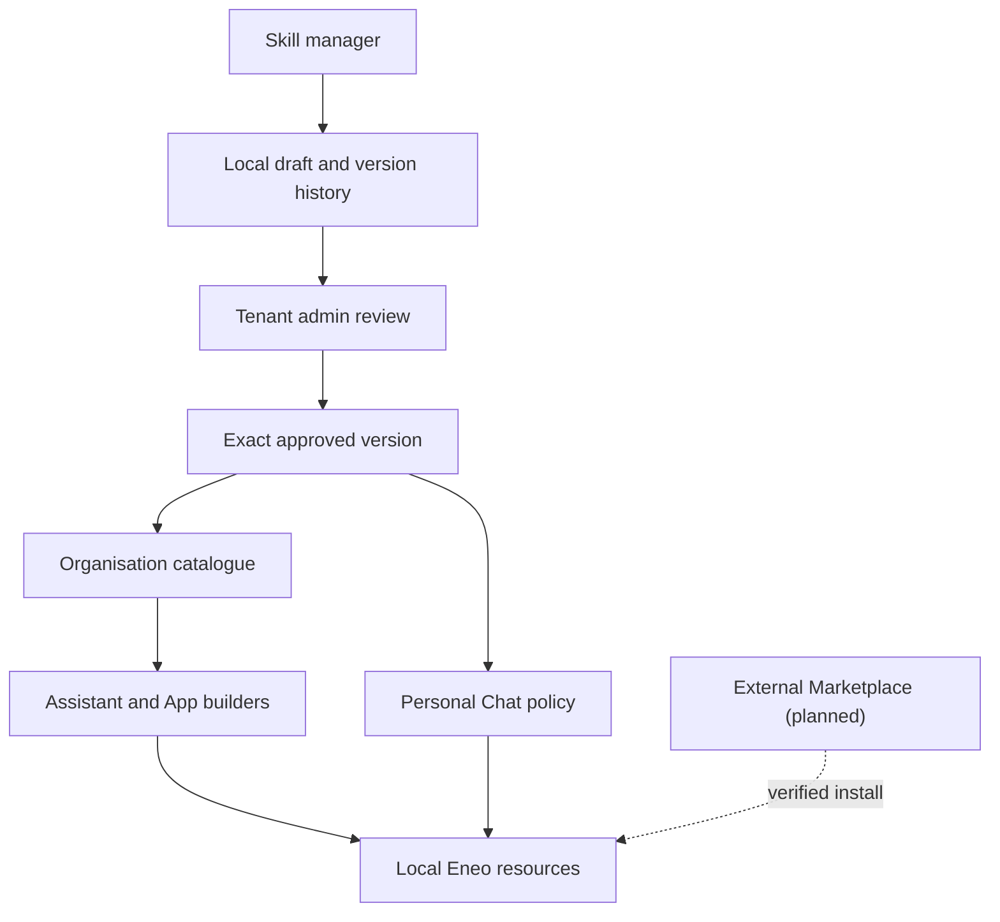

# Skills

import { Callout } from "nextra/components";

Skills let you split specialised instructions into named, versioned building
blocks instead of maintaining one increasingly tangled prompt. A Skill can be
reused by Assistants and Apps, or selected by an administrator for Personal
Chat.

<Callout type="info">
  **TL;DR:** Put the Assistant's identity and general rules in its main
  instructions. Put a focused capability—such as HR guidance, writing a decision
  document, or handling IT support questions—in a Skill. Eneo keeps every saved
  version, pins each attachment to an exact version, and lets administrators
  publish reviewed Skills for the organisation.
</Callout>

## Start here

- **New to Skills?** Read [What a Skill is](#what-a-skill-is),
  [Examples](#examples), and [When to use a Skill](#when-to-use-a-skill).
- **Building an Assistant or App?** Continue with
  [Create a useful Skill](#create-a-useful-skill) and
  [Versions and history](#versions-and-history).
- **Administering Eneo?** See the
  [Organisation catalogue](#organisation-catalogue),
  [Personal Chat](#personal-chat), and [Audit trail](#audit-trail).
- **Planning integrations?** Read
  [Local catalogue and external Marketplace](#local-catalogue-and-external-marketplace)
  and [Current boundaries](#current-boundaries).

## What a Skill is

In the current release, an Eneo Skill contains:

- a short name;
- a description that explains **what the Skill does and when to use it**;
- a stable identifier; and
- focused instructions written in Markdown.

The Skill contributes instructions to an Assistant or App. It does not create
a second Assistant, change the model, grant permissions, or provide a tool by
itself.

Eneo follows the core ideas of the
[Agent Skills specification](https://agentskills.io/specification): Skills have
clear identity and discovery metadata, keep detailed instructions separate from
the parent prompt, and are designed for progressive reuse. Eneo's first
implementation is intentionally instruction-only. Scripts, bundled assets, and
Skill-owned knowledge are not executed or imported yet.

## Examples

| Skill                       | Use it when                                                   | What belongs in its instructions                                                        |
| --------------------------- | ------------------------------------------------------------- | --------------------------------------------------------------------------------------- |
| Employee leave guidance     | A user asks about annual leave, sick leave, or parental leave | Approved terminology, decision boundaries, escalation paths, and what not to infer      |
| Municipal decision document | An App prepares a formal decision document                    | Required structure, tone, headings, citations, and a final quality checklist            |
| IT support triage           | A user reports an account, device, or access problem          | Diagnostic order, safe questions, hand-off criteria, and security warnings              |
| Intranet navigation         | An Assistant helps staff find internal information            | How to interpret the user's intent, rank internal sources, and handle uncertain results |

One Assistant can use several Skills. For example, an employee-support
Assistant can keep its tone and general safety rules in the main instructions,
then attach separate Skills for leave, payroll, IT support, and manager support.

## When to use a Skill

Use a Skill when the instructions form one coherent capability that should be
reviewed separately or reused.

| Need                                                                                         | Best fit                         |
| -------------------------------------------------------------------------------------------- | -------------------------------- |
| Identity, tone, general safety rules, or behavior that always defines one Assistant          | Main Assistant instructions      |
| Focused instructions that may be reused or versioned independently                           | Skill                            |
| An external action such as searching a system or creating a ticket                           | Tool or MCP server               |
| Independent expertise with its own model, knowledge, permissions, or conversational identity | Separate Assistant or Group Chat |

A Skill can explain **how** to use an available tool, but it cannot grant access
to that tool. Tool permissions and Skill instructions remain separate controls.

## Create a useful Skill

1. Open a Space and select **Skills**, or open **Organisation → Skills** for a
   reusable organisation Skill.
2. Choose a concise name that describes one capability.
3. Write a description that tells builders what the Skill does and when it is
   relevant.
4. Write focused instructions with clear procedures, boundaries, examples, and
   a way to check the result.
5. Save the Skill, test it on representative questions, and attach it only where
   it adds value.

### Example

**Name:** Employee leave guidance

**Description:** Use when an employee or manager asks about annual leave, sick
leave, parental leave, or leave-related procedures.

**Instructions:**

```md
Use the organisation's approved leave terminology.

1. Identify the type of leave and whether the user is asking about policy,
   eligibility, or a practical procedure.
2. Answer from available approved sources. If the necessary policy is missing,
   say what is unknown and direct the user to HR.
3. Never infer individual eligibility, medical facts, or a manager's decision.
4. End procedural answers with the next concrete step.

Before responding, check that the answer:

- distinguishes general policy from an individual decision;
- names any missing information; and
- contains no sensitive assumptions.
```

### Authoring checklist

The [Agent Skills creation guidance](https://agentskills.io/skill-creation/best-practices)
recommends coherent units of expertise, explicit procedures, sensible defaults,
known pitfalls, templates, and validation steps. For Eneo, a practical checklist
is:

- Keep one Skill focused on one recognisable capability.
- Put “when to use it” in the description, not only in the instructions.
- Prefer ordered steps and decision boundaries over vague advice.
- State what the Assistant must not assume or do.
- Include a short validation checklist when output quality matters.
- Test typical, ambiguous, and out-of-scope questions before publication.
- Do not copy broad organisational rules into every Skill; keep one clear owner.

## Versions and history

Saving changed content creates the next immutable Skill version. Saving
unchanged content does not create a duplicate version.

Assistants, Apps, and Personal Chat keep an exact version reference. Publishing
or editing a Skill therefore does not silently rewrite existing attachments.
An editor chooses when a parent should adopt a newer version.

Restoring an older version copies its content into a new latest version. History
is preserved; Eneo never rewrites an old version in place.

## Organisation catalogue

The organisation catalogue is the local, reviewed Skill library inside one Eneo
installation.

| Status                      | Meaning                                                                                                           |
| --------------------------- | ----------------------------------------------------------------------------------------------------------------- |
| Draft                       | No version has been published. Only Skill managers and tenant admins can see it.                                  |
| Published                   | One exact version is approved and visible to people with **Use Skills**.                                          |
| Update waiting for approval | A newer draft exists, but users still receive the previously approved version.                                    |
| Unpublished                 | The Skill is no longer offered for new organisation-wide use. Existing revision-pinned attachments remain stable. |

The authoring and approval roles are deliberately separate:

| Permission                | What it allows                                                                                   |
| ------------------------- | ------------------------------------------------------------------------------------------------ |
| Use Skills                | Browse approved organisation Skills and attach available Skills to resources the person may edit |
| Manage + Use Skills       | Create, revise, compare, and restore organisation Skills; manage Skills in accessible Spaces     |
| Tenant admin              | Publish, unpublish, republish, and delete eligible organisation Skills                           |
| Tenant admin + Use Skills | Choose approved organisation Skills for Personal Chat                                            |

Runtime use does not depend on the author's current role. Removing an authoring
permission does not break an Assistant or App that already has an exact,
permitted Skill attachment.

## Personal Chat

Tenant admins who also have **Use Skills** manage organisation-wide Personal
Chat behavior in the existing Personal Chat administration page. They can
select ordered, published organisation Skill versions that supplement the base
or enforced Personal Chat instructions.

This keeps one owner for Personal Chat policy. The Skill catalogue owns Skill
content and publication; the Personal Chat settings own which approved Skills
apply to everyone.

## Audit trail

When audit logging is enabled, Eneo records Skill lifecycle events such as:

- Skill creation and deletion;
- new versions and restored versions;
- publication and unpublication; and
- changes to Skill attachments on Assistants, Apps, and Personal Chat policy.

Audit metadata contains identity, version, digest, position, status, and actor
information. Full Skill instruction bodies are not copied into audit metadata.
This provides traceability without multiplying potentially sensitive prompt
content.

See the [Audit Logging Guide](/guides/audit-logging) for access, retention, and
export behavior.

## Local catalogue and external Marketplace

These are related, but they solve different trust boundaries:

| Capability         | Organisation catalogue             | External Marketplace                                                               |
| ------------------ | ---------------------------------- | ---------------------------------------------------------------------------------- |
| Scope              | One Eneo tenant                    | Multiple Eneo installations and municipalities                                     |
| Trust owner        | Local tenant admin                 | Separately operated Marketplace service                                            |
| Purpose            | Review and reuse local Skills      | Distribute versioned Skills, Assistants, Apps, Flows, and approved package content |
| Runtime dependency | None outside the Eneo installation | None after a package has been installed locally                                    |
| Status             | Part of the Skills delivery        | Planned Marketplace work                                                           |

The planned Marketplace will be a separately hosted service connected to Eneo
through a URL and installation credential configured by the local tenant admin.
Marketplace human identities remain separate from Eneo's OIDC users. A verified
Marketplace release will be inspected and installed as a local Eneo resource;
the remote service will not administer the receiving tenant or become a runtime
dependency.



## Current boundaries

- Every attached Skill currently contributes its instructions to every request,
  in the order shown. Automatic per-question Skill selection is a separate
  future capability.
- Eneo Skills currently contain instructions and metadata. They do not execute
  scripts, bundle files, grant tools, or own knowledge sources.
- Organisation Skills can be reviewed and published locally. Copying an
  organisation Skill into another Space with update tracking is planned as a
  separate installation workflow.
- The external Marketplace and portable Assistant/App/Skill packages are planned
  separately from local Skill authoring.

Keeping these boundaries explicit prevents a Markdown instruction from silently
becoming executable code, a permission grant, or a cross-tenant dependency.

## FAQ

### Does editing a Skill immediately change every Assistant that uses it?

No. Attachments point to an exact version. The editor must explicitly adopt a
newer version where it should be used.

### Can two Assistants reuse the same Skill?

Yes, when they can access that Skill under the applicable Space or organisation
rules. Reuse is preferable when the capability has one real owner. Separate
Skills are better when policies or ownership genuinely differ.

### Should we merge Skills just because their text looks similar?

No. Similar text does not prove shared ownership or lifecycle. Reuse one Skill
when the same team should maintain and release it. Otherwise keep the identities
separate.

### Can a Skill call a tool or access a knowledge collection?

A Skill can instruct the model how to work with tools and knowledge already
available to the parent resource. It cannot grant access. Tool, model, and
knowledge permissions are still configured on the Assistant, App, Space, or
organisation policy.

### Is a Skill the same as a separate expert Assistant?

No. A Skill adds focused instructions to its parent. A separate Assistant has
its own identity and may have different models, knowledge, tools, permissions,
and lifecycle.

### Who can publish an organisation Skill?

Only a tenant admin. Skill managers can prepare and version the content, while
the admin owns the organisation-wide publication decision.

### What happens if a published update is worse?

Open the version history, compare the earlier version, and restore it. Eneo
creates a new latest version from that content. A tenant admin can then review
and publish it without deleting any history.

### Will a Marketplace outage stop our Assistants?

No. The planned Marketplace is a distribution channel, not a runtime service.
Installed resources continue running inside the local Eneo installation.
