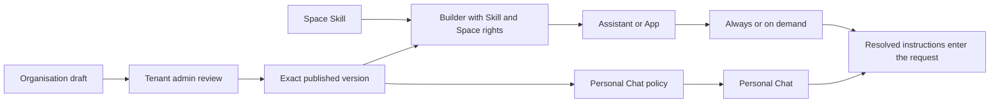

# Skills

import { Callout } from "nextra/components";

Skills are named, versioned instructions that add one focused capability to an
Assistant, App, or Personal Chat.

<Callout type="info">
  **TL;DR:** Keep identity, tone, and general rules in the parent instructions.
  Put reusable specialist guidance in a Skill. Eneo keeps immutable versions,
  pins every attachment to an exact version, and separates local authoring from
  organisation-wide approval. An admin can block a previously published
  organisation Skill everywhere without deleting bindings or history.
</Callout>

## Choose your path

- **New to Skills:** read [The mental model](#the-mental-model) and
  [When to use a Skill](#when-to-use-a-skill).
- **Building an Assistant or App:** follow
  [Create and attach a Skill](#create-and-attach-a-skill), then read
  [Versions and adoption](#versions-and-adoption). If the Skill describes an
  external capability, also read [Use a Skill with MCP](#use-a-skill-with-mcp).
- **Administering Eneo:** start with
  [Scopes and permissions](#scopes-and-permissions) and
  [Governance and audit](#governance-and-audit).
- **Handling an incident:** go to
  [Emergency execution block](#emergency-execution-block).

## The mental model

A Skill contains a name, a description, a stable identifier, and Markdown
instructions. The description tells builders what the Skill does and when it is
relevant. The instructions tell the model how to perform that capability.

A Skill is not a separate Assistant. It does not choose a model, grant access,
add a tool, or own a knowledge source. It can explain how to use capabilities
that the parent already has.

## When to use a Skill

| Need                                                                         | Use                              |
| ---------------------------------------------------------------------------- | -------------------------------- |
| Identity, tone, safety rules, or behavior that always defines one Assistant  | Main Assistant instructions      |
| Focused guidance that should be reused, reviewed, or versioned independently | Skill                            |
| Search, ticket creation, or another external action                          | Tool or MCP server               |
| Separate identity, model, knowledge, permissions, or conversation            | Separate Assistant or Group Chat |

Good examples include employee leave guidance, IT support triage, formal
decision-document structure, and safe intranet navigation.

Reuse one Skill when the capability has one real owner and release cycle. Do not
merge Skills only because parts of their text look similar.

## Use a Skill with MCP

Think of the two parts separately:

- **Skill = guidance:** explains the domain, when a capability is appropriate,
  which already-visible tool to use, its expected input and result, and safe
  failure behavior.
- **MCP tool = capability:** performs the external action under the target
  resource's existing configuration, permissions, approval, identity, and
  availability checks.

For example, a municipal BI Skill can explain the data warehouse vocabulary,
when to use the approved BI tool, how to form a query, and how to present the
result. The Skill does not connect the BI server or grant access to it.

Before attaching that Skill:

1. Enable and approve the MCP server and tool through the existing organisation
   and Space controls.
2. Expose the tool to the target Assistant and keep any narrower user or policy
   controls in place.
3. Select a model that supports tool calling.
4. Test an allowed request, a denied request, an approval-required call, an
   unavailable server, and a request outside the Skill's scope.

An Assistant cannot currently use knowledge and MCP at the same time. Eneo
includes every stored, enabled and approved MCP tool schema available to the
Assistant—not a user-specific subset—when it validates whether a saved on-demand
Skill can fit. The check reserves the same question headroom used for attachments
instead of letting saved Skill context fill the model window. Live discovery,
user permissions, approvals, and tool availability can still change later, so
runtime remains the source of truth and fails closed.

Eneo repeats that validation when a save changes Skill bindings, the selected
model, prompt, attachments, or the stored MCP catalogue. If an existing
on-demand Skill would no longer be activatable, the complete save is rejected
and the previous configuration is kept.

## Create and attach a Skill

1. Open **Skills** in the relevant Space. Tenant admins use
   **Organisation → Skills** for organisation-wide content.
2. Name one recognisable capability.
3. Describe what it does and when a builder should choose it.
4. Write a short procedure, decision boundaries, known failure cases, and a
   final quality check.
5. Test typical, ambiguous, and out-of-scope requests.
6. Attach the reviewed version only to the Assistants or Apps that need it.

Keep broad organisation policy in one clear owner instead of copying it into
every Skill. The
[Agent Skills specification](https://agentskills.io/specification) and
[creation guidance](https://agentskills.io/skill-creation/best-practices)
provide useful authoring conventions.

## Versions and adoption

Saving changed content creates the next immutable version. Unchanged content
does not create a duplicate. Restoring an older version copies its content into
a new latest version; history is never rewritten.

Every Assistant, App, and Personal Chat attachment points to an exact version.
Editing or publishing a Skill therefore does not silently update existing
resources. A builder or administrator chooses when to adopt a newer version.

On an organisation Skill's detail page, the adoption view shows:

- how many Assistants and Apps are configured with the Skill;
- the number of distinct Spaces represented;
- whether Personal Chat pins a version;
- how bindings are distributed across versions; and
- whether each binding is **current**, **behind**, or **unpublished** relative
  to the published version.

Configured resources load 25 at a time. The count shows how many are visible,
and **Show more resources** loads the next page.

### Moving Personal Chat to the published version

When Personal Chat pins an older version of a Skill, a tenant admin can move
that single binding to the currently published version without editing the rest
of the Personal Chat policy. The move:

- changes only which version the existing binding pins — its order, activation
  mode, and every other bound Skill stay untouched;
- never overwrites a concurrent edit: the binding moves only if it still
  matches what the administrator reviewed, and concurrent policy edits are
  serialized with the move;
- re-runs the same validation that guards every Personal Chat policy save, so
  it can never admit a configuration a normal save would reject;
- is refused while the Skill is unpublished or blocked;
- is recorded in the audit log when it changes anything, and repeating it is a
  clean no-op.

### Moving Assistant bindings to the published version

When Assistants across the organisation pin older versions of a Skill, a
tenant admin can move them all to the currently published version in one run.
The run works through the fleet in chunks:

- every binding pinned to any older version is included, whichever version it
  currently pins;
- each Assistant is validated against the published version before its pin
  moves — an Assistant whose configuration no longer fits (for example, the
  new version no longer fits the model's context window) is excluded and
  reported, and the rest continue;
- an Assistant edited while the run is in progress is skipped rather than
  overwritten; a later run picks it up again from its current state;
- stopping between chunks is always safe: pins already moved stay moved, and
  starting again continues where the run effectively left off, because
  already-moved bindings are no longer behind;
- unpublishing, publishing a different version, or blocking the Skill during
  the run ends it with a clear failure, and a fresh run is required;
- each chunk that changes anything writes one audit event with the run
  identity and the counts of moved, skipped, and excluded Assistants.

These are structural configuration facts:

| Evidence   | Meaning                                                           |
| ---------- | ----------------------------------------------------------------- |
| Configured | An exact Skill version is attached to a resource or policy        |
| In context | Eneo included the attached instructions in a model request        |
| Used       | The model relied on those instructions in its reasoning or output |

The adoption view proves **configured**, not model use or outcome attribution.
The Assistant API accepts **always** or **on demand** for each binding:

- **Always** includes the exact pinned instructions in every request.
- **On demand** advertises a compact descriptor and loads the exact pinned
  instructions only when a tool-capable model requests them.

The Assistant builder and Personal Chat administration expose this choice for
each attached Skill. Apps remain eager: their attached Skills enter every run in
the configured order. Runtime evidence, rather than the adoption view, shows
which Skills were eligible, requested, blocked, or included.

Tenant admins manage the stored runtime limits in Admin settings. The API owns
the editable ranges; the selected model window and fixed platform safety bounds
still apply. On-demand loading falls back to **Always only** when organisation
policy disables it, the model lacks tool calling, the catalogue exceeds its
context allowance, or exact token measurement is unavailable. The builder then
prevents new **On demand** selections but still lets an existing selection be
changed back to **Always**.

## Scopes and permissions

### How a Skill reaches users

| Surface       | Selection owner                                              | Runtime effect                                      |
| ------------- | ------------------------------------------------------------ | --------------------------------------------------- |
| Personal Chat | Tenant admin in Personal Chat settings                       | Ordered versions apply to every user's new requests |
| Assistant     | Builder with **Use Skills** and edit access to the Assistant | Exact versions run always or load on demand         |
| App           | Builder with **Use Skills** and edit access to the App       | Exact versions apply when that App runs             |

A Space controls where local Skills can be authored and attached. It does not
silently add them to every resource or user in that Space. Organisation
publication makes an approved version available; it does not attach the Skill
by itself.

### Space Skills

Space Skills are authored and reused inside one Space. Local authoring requires:

- **Use Skills**;
- **Manage Skills**; and
- the matching create, edit, or delete action on that Space.

Removing an author's permission does not break an existing, permitted
exact-version attachment.

### Organisation Skills

Organisation Skills form the reviewed catalogue inside one Eneo installation.
Only tenant admins author, revise, publish, unpublish, restore, and delete
eligible organisation Skills.

| Status            | What users receive                                                     |
| ----------------- | ---------------------------------------------------------------------- |
| Draft             | Admin-only; no approved version is available                           |
| Published         | The exact approved version is available to authorised builders         |
| Awaiting approval | The approved version remains available while a newer draft is reviewed |
| Unpublished       | No new organisation attachment; existing exact pins remain stable      |

A builder needs **Use Skills** and edit access to the target Assistant or App to
preview and attach a published organisation Skill. **Manage Skills** does not
grant access to organisation authoring.

### Personal Chat

Tenant admins select and order published organisation Skill versions in the
existing Personal Chat administration page. The organisation catalogue owns
content and publication. Personal Chat settings own which approved versions
apply to Personal Chat and whether each is **Always** or **On demand**.

**On demand** is available only when the policy selects a finite list of models
that all support tool calling. Selecting an entire provider or leaving model
access unrestricted keeps **Always** available but disables **On demand**,
because Eneo cannot safely validate current and future models as one bounded
set. Saving rechecks the selected models, prompt, MCP configuration, and every
existing Personal Chat baseline. If any candidate cannot fit, the save is
rejected and the previous policy remains active.

### Default roles

The predefined **Owner** role receives **Use Skills** and **Manage Skills** by
default. The predefined User and AI Configurator roles do not. Owners can
delegate either permission through custom roles. Administrators should review
custom roles after an upgrade because earlier releases did not record why each
grant was assigned.

## Governance and audit

The governance model has four separate controls:

1. **Authoring:** who may create and change content.
2. **Approval:** which exact organisation version is published.
3. **Attachment:** who may connect that version to a resource they can edit.
4. **Runtime:** what the parent resource is already allowed to use.

When audit logging is enabled, Eneo records lifecycle events including creation,
new versions, restoration, publication changes, deletion, and attachment
changes. Audit metadata includes identity, version, digest, position, status,
and actor information. Full Skill instruction bodies are not duplicated into
audit metadata.

Each new chat question records which Skill revisions were eligible, blocked,
and included. The record also contains the selected model, measured
Skill-context tokens, configured allowance, and counter source. It follows the
Question's existing Assistant, Space, or tenant retention and deletion rules.
It excludes prompts, Skill instructions, incident reasons, tool results, and
hidden reasoning, and the standard chat response does not expose it.

See the [Audit Logging Guide](/guides/audit-logging) for access, retention, and
export behavior.

### Emergency execution block

A tenant admin can block execution of any organisation Skill that has been
published before. Use this for a confirmed safety, security, compliance, or
operational incident. Reading or changing the incident state requires a signed-in
tenant admin or their user-owned tenant admin API key; service credentials cannot
operate this human-audited control.

- The block covers every saved version in Personal Chat, Assistants, and Apps.
- New Personal Chat and Assistant requests omit the blocked Skill while the
  parent continues to run.
- Apps configured with the Skill fail before provider work, including queued
  runs whose saved snapshot predates the block. Runners see a generic stop
  message; only tenant admins can read the incident reason.
- A request whose Skill plan was already resolved may finish. The next request
  sees the block.
- New attachments and revision changes are rejected while the block is active.
  Unchanged exact-version pins remain visible and survive unrelated saves or
  reordering.
- Bindings, publication state, versions, and adoption evidence remain intact.
- Blocking and unblocking both require a reason. The lifecycle record remains
  durable even when optional audit logging is disabled.

Unblocking restores the Skill to Personal Chat and Assistants and lets affected
Apps run again. This applies immediately to resources pinned to older versions.
Review the adoption view and update or remove unsafe versions before unblocking.

<Callout type="warning">
  **Unpublish is not an emergency stop.** Unpublishing prevents new organisation
  attachments, while existing exact-version pins remain usable. Use **Block
  execution** to stop those existing pins at runtime.
</Callout>

## When a change is blocked

Eneo refuses a Skill change rather than silently overwriting someone else's work
or breaking a resource that is in use. The message names the exact blocker and
the next safe action.

| Blocker                             | What happened                                                                                                                                                                 | What to do                                                                     |
| ----------------------------------- | ----------------------------------------------------------------------------------------------------------------------------------------------------------------------------- | ------------------------------------------------------------------------------ |
| Identifier already taken            | Another Skill in the same Space, or in the organisation catalogue, already uses that identifier                                                                               | Choose a different identifier                                                  |
| Skill changed while you reviewed it | Someone saved a new version, or published a different one, between the moment the page loaded and the moment you saved; this covers restoring an older version and publishing | Reload the Skill, compare the latest version, then repeat the action           |
| Published Skill cannot be deleted   | A Skill that has ever been published is kept for audit history and can never be deleted                                                                                       | Unpublish it to stop new attachments; existing ones keep working until removed |
| Skill is still attached             | The Skill is attached to an Assistant, an App, or the organisation Personal Chat policy                                                                                       | Remove every attachment, then delete                                           |
| App run in progress                 | A queued or running App run needs the Skill                                                                                                                                   | Wait for the run to finish, then delete                                        |
| Execution block changed             | The block you reviewed was released or replaced before your unblock was applied                                                                                               | The page reloads the live block state; review it and try again                 |

The Skill editor keeps unsaved edits when a save is refused, so nothing has to
be retyped. A separate refusal applies at save time when the selected models or
the organisation runtime policy cannot support **On demand**; that is a
configuration limit rather than a conflict, described in
[Versions and adoption](#versions-and-adoption).

## Current boundaries

- Skills contain instructions and metadata. They do not execute scripts or
  import bundled files.
- Skills do not grant models, tools, knowledge, or permissions.
- Assistant bindings can be **always** or **on demand**. Apps and Personal Chat
  remain eager.
- Organisation approval and exact pins do not update existing resources
  automatically.
- This release has no external Skill marketplace or package installation flow.

## Inspect Skill activation

Deployments can expose an opt-in **Debug** panel in Assistant and Personal Chat
with `SHOW_CHAT_DEBUG_PANEL=true` in both backend and frontend configuration.
Only owners and users with the Assistant debug permission see it. Select a
persisted turn to inspect which exact Skill revisions were available, entered
the model context, were blocked, or were rejected, along with token
measurement, activation rounds, and selection time.

The panel is for development and support diagnostics. It does not expose Skill
instructions, model reasoning, credentials, or an administrator's incident
reason. Group chats and API keys cannot use it. Opening or closing the panel
does not change what the Assistant records or affect separately configured
Assistant logging.

## Planned next steps

Apps remain eager until their execution contracts can preserve the same
frozen-plan and audit guarantees.

Editable Space copies with explicit source updates come later. External
Marketplace distribution remains a separate final phase.

## FAQ

### Does editing a Skill immediately change every Assistant that uses it?

No. Attachments point to an exact version. Each parent must explicitly adopt a
newer version.

### Can an organisation Skill reach every user?

Not by publication alone. Publication makes one exact version available.
Builders still need **Use Skills** and edit access to attach it to an Assistant
or App. Tenant admins separately decide whether it applies to Personal Chat.

### Can a Skill grant access to a tool or knowledge source?

No. It can guide use of capabilities the parent already has, but the parent,
Space, and organisation policies remain the access owners.

### What does “behind” mean?

The resource pins an older exact version than the currently published one. It
is configuration drift, not evidence that the Skill ran or affected an answer.

### What happens if a published update is worse?

Compare the history and restore the earlier content. Eneo creates a new latest
version, which an admin can review and publish without deleting history.

### Why keep Personal Chat configuration separate?

It preserves one policy owner. The catalogue governs approved Skill content;
Personal Chat settings govern which approved instructions apply to all Personal
Chat requests.

### Does an emergency block remove the Skill from configured resources?

No. It stops runtime composition while preserving exact pins and adoption
evidence. This lets administrators see the full impact, remediate resources,
and later unblock with an auditable reason. Removing the bindings would erase
that operational context and make recovery a manual reconfiguration task.

### When can I delete a Skill?

First detach it from every Assistant, App, and Personal Chat policy. A queued or
running App run whose history still exists also blocks deletion until it
completes or fails. Completed and failed runs keep only the Skill and revision
IDs, revision number, digest, and position—not the instruction body. Previously
published organisation Skills remain as audit history and cannot be
hard-deleted.
