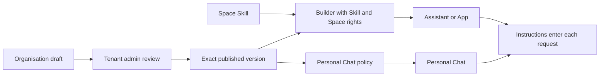

# Skills

import { Callout } from "nextra/components";

Skills are named, versioned instructions that add one focused capability to an
Assistant, App, or Personal Chat.

<Callout type="info">
  **TL;DR:** Keep identity, tone, and general rules in the parent instructions.
  Put reusable specialist guidance in a Skill. Eneo keeps immutable versions,
  pins every attachment to an exact version, and separates local authoring from
  organisation-wide approval. An admin can block a previously published
  organisation Skill everywhere without deleting bindings or history.
</Callout>

## Choose your path

- **New to Skills:** read [The mental model](#the-mental-model) and
  [When to use a Skill](#when-to-use-a-skill).
- **Building an Assistant or App:** follow
  [Create and attach a Skill](#create-and-attach-a-skill), then read
  [Versions and adoption](#versions-and-adoption).
- **Administering Eneo:** start with
  [Scopes and permissions](#scopes-and-permissions) and
  [Governance and audit](#governance-and-audit).
- **Handling an incident:** go to
  [Emergency execution block](#emergency-execution-block).

## The mental model

A Skill contains a name, a description, a stable identifier, and Markdown
instructions. The description tells builders what the Skill does and when it is
relevant. The instructions tell the model how to perform that capability.

A Skill is not a separate Assistant. It does not choose a model, grant access,
add a tool, or own a knowledge source. It can explain how to use capabilities
that the parent already has.

## When to use a Skill

| Need                                                                         | Use                              |
| ---------------------------------------------------------------------------- | -------------------------------- |
| Identity, tone, safety rules, or behavior that always defines one Assistant  | Main Assistant instructions      |
| Focused guidance that should be reused, reviewed, or versioned independently | Skill                            |
| Search, ticket creation, or another external action                          | Tool or MCP server               |
| Separate identity, model, knowledge, permissions, or conversation            | Separate Assistant or Group Chat |

Good examples include employee leave guidance, IT support triage, formal
decision-document structure, and safe intranet navigation.

Reuse one Skill when the capability has one real owner and release cycle. Do not
merge Skills only because parts of their text look similar.

## Create and attach a Skill

1. Open **Skills** in the relevant Space. Tenant admins use
   **Organisation → Skills** for organisation-wide content.
2. Name one recognisable capability.
3. Describe what it does and when a builder should choose it.
4. Write a short procedure, decision boundaries, known failure cases, and a
   final quality check.
5. Test typical, ambiguous, and out-of-scope requests.
6. Attach the reviewed version only to the Assistants or Apps that need it.

Keep broad organisation policy in one clear owner instead of copying it into
every Skill. The
[Agent Skills specification](https://agentskills.io/specification) and
[creation guidance](https://agentskills.io/skill-creation/best-practices)
provide useful authoring conventions.

## Versions and adoption

Saving changed content creates the next immutable version. Unchanged content
does not create a duplicate. Restoring an older version copies its content into
a new latest version; history is never rewritten.

Every Assistant, App, and Personal Chat attachment points to an exact version.
Editing or publishing a Skill therefore does not silently update existing
resources. A builder or administrator chooses when to adopt a newer version.

On an organisation Skill's detail page, the adoption view shows:

- how many Assistants and Apps are configured with the Skill;
- the number of distinct Spaces represented;
- whether Personal Chat pins a version;
- how bindings are distributed across versions; and
- whether each binding is **current**, **behind**, or **unpublished** relative
  to the published version.

These are structural configuration facts:

| Evidence   | Meaning                                                           |
| ---------- | ----------------------------------------------------------------- |
| Configured | An exact Skill version is attached to a resource or policy        |
| In context | Eneo included the attached instructions in a model request        |
| Used       | The model relied on those instructions in its reasoning or output |

The adoption view proves **configured**, not model use or outcome attribution.
In the current release, all attached Skills enter each request in their listed
order. Selective per-question activation is not implemented.

## Scopes and permissions

### How a Skill reaches users

| Surface       | Selection owner                                              | Runtime effect                                      |
| ------------- | ------------------------------------------------------------ | --------------------------------------------------- |
| Personal Chat | Tenant admin in Personal Chat settings                       | Ordered versions apply to every user's new requests |
| Assistant     | Builder with **Use Skills** and edit access to the Assistant | Exact versions apply when that Assistant runs       |
| App           | Builder with **Use Skills** and edit access to the App       | Exact versions apply when that App runs             |

A Space controls where local Skills can be authored and attached. It does not
silently add them to every resource or user in that Space. Organisation
publication makes an approved version available; it does not attach the Skill
by itself.

### Space Skills

Space Skills are authored and reused inside one Space. Local authoring requires:

- **Use Skills**;
- **Manage Skills**; and
- the matching create, edit, or delete action on that Space.

Removing an author's permission does not break an existing, permitted
exact-version attachment.

### Organisation Skills

Organisation Skills form the reviewed catalogue inside one Eneo installation.
Only tenant admins author, revise, publish, unpublish, restore, and delete
eligible organisation Skills.

| Status            | What users receive                                                     |
| ----------------- | ---------------------------------------------------------------------- |
| Draft             | Admin-only; no approved version is available                           |
| Published         | The exact approved version is available to authorised builders         |
| Awaiting approval | The approved version remains available while a newer draft is reviewed |
| Unpublished       | No new organisation attachment; existing exact pins remain stable      |

A builder needs **Use Skills** and edit access to the target Assistant or App to
preview and attach a published organisation Skill. **Manage Skills** does not
grant access to organisation authoring.

### Personal Chat

Tenant admins select and order published organisation Skill versions in the
existing Personal Chat administration page. The organisation catalogue owns
content and publication. Personal Chat settings own which approved versions
apply to Personal Chat.

### Default roles

The predefined **Owner** role receives **Use Skills** and **Manage Skills** by
default. The predefined User and AI Configurator roles do not. Owners can
delegate either permission through custom roles. Administrators should review
custom roles after an upgrade because earlier releases did not record why each
grant was assigned.

## Governance and audit

The governance model has four separate controls:

1. **Authoring:** who may create and change content.
2. **Approval:** which exact organisation version is published.
3. **Attachment:** who may connect that version to a resource they can edit.
4. **Runtime:** what the parent resource is already allowed to use.

When audit logging is enabled, Eneo records lifecycle events including creation,
new versions, restoration, publication changes, deletion, and attachment
changes. Audit metadata includes identity, version, digest, position, status,
and actor information. Full Skill instruction bodies are not duplicated into
audit metadata.

See the [Audit Logging Guide](/guides/audit-logging) for access, retention, and
export behavior.

### Emergency execution block

A tenant admin can block execution of any organisation Skill that has been
published before. Use this for a confirmed safety, security, compliance, or
operational incident. Reading or changing the incident state requires a signed-in
tenant admin or their user-owned tenant admin API key; service credentials cannot
operate this human-audited control.

- The block covers every saved version in Personal Chat, Assistants, and Apps.
- New Personal Chat and Assistant requests omit the blocked Skill while the
  parent continues to run.
- Apps configured with the Skill fail before provider work, including queued
  runs whose saved snapshot predates the block.
- A request whose Skill plan was already resolved may finish. The next request
  sees the block.
- Bindings, publication state, versions, and adoption evidence remain intact.
- Blocking and unblocking both require a reason. The lifecycle record remains
  durable even when optional audit logging is disabled.

Unblocking restores the Skill to Personal Chat and Assistants and lets affected
Apps run again. This applies immediately to resources pinned to older versions.
Review the adoption view and update or remove unsafe versions before unblocking.

<Callout type="warning">
  **Unpublish is not an emergency stop.** Unpublishing prevents new organisation
  attachments, while existing exact-version pins remain usable. Use **Block
  execution** to stop those existing pins at runtime.
</Callout>

## Current boundaries

- Skills contain instructions and metadata. They do not execute scripts or
  import bundled files.
- Skills do not grant models, tools, knowledge, or permissions.
- Every attached Skill currently enters every request in its listed order.
- Organisation approval and exact pins do not update existing resources
  automatically.
- This release has no external Skill marketplace or package installation flow.

## FAQ

### Does editing a Skill immediately change every Assistant that uses it?

No. Attachments point to an exact version. Each parent must explicitly adopt a
newer version.

### Can an organisation Skill reach every user?

Not by publication alone. Publication makes one exact version available.
Builders still need **Use Skills** and edit access to attach it to an Assistant
or App. Tenant admins separately decide whether it applies to Personal Chat.

### Can a Skill grant access to a tool or knowledge source?

No. It can guide use of capabilities the parent already has, but the parent,
Space, and organisation policies remain the access owners.

### What does “behind” mean?

The resource pins an older exact version than the currently published one. It
is configuration drift, not evidence that the Skill ran or affected an answer.

### What happens if a published update is worse?

Compare the history and restore the earlier content. Eneo creates a new latest
version, which an admin can review and publish without deleting history.

### Why keep Personal Chat configuration separate?

It preserves one policy owner. The catalogue governs approved Skill content;
Personal Chat settings govern which approved instructions apply to all Personal
Chat requests.

### Does an emergency block remove the Skill from configured resources?

No. It stops runtime composition while preserving exact pins and adoption
evidence. This lets administrators see the full impact, remediate resources,
and later unblock with an auditable reason.
